Claude Code doesn't think in terms of concrete model IDs — it thinks in terms of three **capability tiers**: *opus* for the primary heavyweight model, *sonnet* for balanced work, and *haiku* for fast, cheap background tasks. When you route Claude Code through a non-Anthropic provider, those tier names must be translated into the provider's actual model IDs, or every request fails. This page explains the tier alias system that performs that translation: the `ModelTierMap` contract, the per-provider default maps, how aliases are written into and cleared from `~/.claude/settings.json`, and how the rest of the codebase reads them back.

## Why Tier Aliases Exist

Claude Code's internal architecture uses the opus/sonnet/haiku tier vocabulary across its agent loop — for example, subagents and background tasks are dispatched to cheaper tiers. The switcher's job is to keep that vocabulary valid when the backing endpoint serves Qwen, GLM, Gemini, or local Ollama models. It does so by writing three environment variables into the `env` block of Claude Code's settings file: `ANTHROPIC_DEFAULT_OPUS_MODEL`, `ANTHROPIC_DEFAULT_SONNET_MODEL`, and `ANTHROPIC_DEFAULT_HAIKU_MODEL`. These three variables form the entire integration surface between the switcher's model catalog and Claude Code's runtime model selection, and they are the documented mechanism the repository itself leans on.

Sources: [ARCHITECTURE.md](ARCHITECTURE.md#L88-L96), [README.md](README.md#L8-L8)

The constants that bind each tier name to its environment variable live in the Claude Code client handler as a single frozen lookup object. Centralizing the names here means no other module hard-codes the strings; everything else passes around the structured `ModelTierMap` and lets `applyTierMap` perform the string-keyed write.

Sources: [claude-code.ts](src/clients/claude-code.ts#L35-L39)

## The ModelTierMap Contract

At the type level, a tier map is deliberately minimal — three required strings, nothing more. This is the lingua franca passed from the provider layer through the CLI switch functions down into the client handler:

```typescript
export interface ModelTierMap {
  opus: string;
  sonnet: string;
  haiku: string;
}
```

Sources: [models.ts](src/models.ts#L16-L20)

The data flows through a small, fixed pipeline. A provider's default map (or the dynamic Alibaba map) is merged with user CLI overrides by `buildTierMap`, passed to a `configure*` function in the client handler, and materialized into `settings.json` by `applyTierMap`. From there, three distinct consumers read the values back: Claude Code itself (which honors the env vars for model selection), the `status`/`list` commands via `getCurrentProvider()`, and the installed hooks:

```mermaid
flowchart LR
    subgraph Defaults["Provider defaults (src/models.ts)"]
        GLM["GLM_DEFAULT_TIER_MAP"]
        OR["OPENROUTER_DEFAULT_TIER_MAP"]
        OLL["OLLAMA_DEFAULT_TIER_MAP"]
        GEM["GEMINI_DEFAULT_TIER_MAP"]
        MUSE["MUSE_DEFAULT_TIER_MAP"]
        ALI["getAlibabaTierMap(model)"]
    end

    CLI["--opus/--sonnet/--haiku flags"] --> MERGE["buildTierMap(default, opts)"]
    Defaults --> MERGE
    MERGE --> CFG["configure*() in claude-code.ts"]
    CFG --> APPLY["applyTierMap(settings, tierMap)"]
    APPLY --> SJ["~/.claude/settings.json\nenv block"]
    SJ --> CC["Claude Code runtime"]
    SJ --> STATUS["status / list display"]
    SJ --> HOOKS["token-tracker &\nvisual-enhancements hooks"]
    CFG -.->|configureAnthropic| CLEAR["clearTierMap(settings)"]
    CLEAR -.-> SJ
```



Sources: [index.ts](src/index.ts#L127-L150), [claude-code.ts](src/clients/claude-code.ts#L41-L57)

## Default Tier Maps by Provider

Each non-Anthropic provider ships a curated default map that fills the three tiers with models matched by capability gradient — strongest reasoning model at opus, balanced at sonnet, fastest/cheapest at haiku. The values live in `src/models.ts` alongside comments explaining the rationale (for GLM, the map follows Z.AI's own documentation):

| Provider | `opus` | `sonnet` | `haiku` | Selection logic |
|---|---|---|---|---|
| GLM/Z.AI | `glm-5.3[1m]` | `glm-5-turbo` | `glm-5v-turbo` | Flagship 1M-context model at top; turbo models below |
| OpenRouter | `qwen/qwen3.6-plus:free` | `openrouter/free` | `openrouter/free` | Best free model at opus; free tier fills both lower tiers |
| Ollama | `deepseek-r1:latest` | `qwen2.5-coder:latest` | `llama3.1:latest` | Reasoning model → coder model → general model |
| Gemini | `gemini-2.5-pro` | `gemini-2.5-flash` | `gemini-2.5-flash-lite` | Pro → Flash → Flash-Lite, a natural tier ladder |
| Muse | `muse-spark-1.2-contributor` | `muse-spark-1.2-contributor` | `muse-spark-1.2-contributor` | Single-model service; discounted contributor variant everywhere |
| Alibaba | *dynamic* | *dynamic* | *dynamic* | Computed per selected model (see next section) |
| Anthropic | *(cleared)* | *(cleared)* | *(cleared)* | Native Claude tiers require no aliases |

Sources: [models.ts](src/models.ts#L22-L77)

Two patterns are worth noting in that table. **Muse collapses all three tiers onto one model** because `api.meta.ai` exposes a single Anthropic-compatible endpoint model — the tier system degenerates gracefully rather than erroring. And note that OpenRouter's sonnet and haiku share the generic `openrouter/free` ID, showing the map tolerates duplicates by design.

Sources: [models.ts](src/models.ts#L52-L56), [models.ts](src/models.ts#L31-L35)

One code-archaeology observation: the summary table in `ARCHITECTURE.md` briefly listed the GLM opus alias as `glm-5.2[1m]` after `src/models.ts` moved to `glm-5.3[1m]` — the markdown table had drifted one version behind the code, and was resynced in the same change that introduced GLM-5.3. Both now agree; when in doubt, trust `src/models.ts`, the executable source of truth.

Sources: [ARCHITECTURE.md](ARCHITECTURE.md#L98-L108), [models.ts](src/models.ts#L22-L28)

## The Alibaba Dynamic Ladder

Alibaba is the only provider whose tier map is a *function* rather than a constant. `getAlibabaTierMap(model)` implements a two-branch policy: if the user selected the default model (`qwen3.7-plus`), tiers map to the curated triple; if the user selected any *other* specific model, that model is promoted to the opus slot and the entire ladder **shifts down one rung** — the old opus (`qwen3.7-plus`) becomes sonnet, and the old sonnet (`qwen3.6-plus`) becomes haiku:

```typescript
if (model === "qwen3.7-plus") {
  return { opus: "qwen3.7-plus", sonnet: "qwen3.6-plus", haiku: "kimi-k2.5" };
} else {
  return { opus: model, sonnet: "qwen3.7-plus", haiku: "qwen3.6-plus" };
}
```

Sources: [models.ts](src/models.ts#L58-L77)

This "promote and shift" design means an explicit model choice never degrades the surrounding tiers — you get your chosen model at full agent priority, while background tasks still route to reasonable Qwen models instead of an invalid ID. The selection is driven by the `-m` model flag, which validates against the Alibaba model catalog before the map is computed.

Sources: [index.ts](src/index.ts#L165-L190)

## Writing Aliases: applyTierMap and clearTierMap

The write path is a pair of symmetric helpers in the Claude Code client handler. `applyTierMap` ensures the `settings.env` object exists, then assigns each tier to its `TIER_ENV_KEYS` name. `clearTierMap` performs the inverse — deleting all three keys, and if that leaves `env` empty, deleting the `env` object itself so no orphaned empty block lingers in the JSON:

| Helper | Operation | Key names used | Cleanup behavior |
|---|---|---|---|
| `applyTierMap(settings, tierMap)` | Write | `TIER_ENV_KEYS.opus/sonnet/haiku` | Creates `settings.env` if absent |
| `clearTierMap(settings)` | Delete | Same three keys | Removes `settings.env` entirely if empty |

Sources: [claude-code.ts](src/clients/claude-code.ts#L41-L57)

Every `configure*` function for a remote provider calls `applyTierMap` as its final settings mutation before the backup-protected write — Alibaba, GLM, OpenRouter, Ollama, Gemini, and Muse all follow the identical three-line pattern. The practical effect on disk is a compact, readable `env` block:

| Before (`switch anthropic`) | After (`switch alibaba`) |
|---|---|
| `// no env block, or env without tier keys` | `"env": { "ANTHROPIC_AUTH_TOKEN": "sk-...", "ANTHROPIC_BASE_URL": "https://coding-intl.dashscope.aliyuncs.com/apps/anthropic", "ANTHROPIC_MODEL": "qwen3.7-plus", "ANTHROPIC_DEFAULT_OPUS_MODEL": "qwen3.7-plus", "ANTHROPIC_DEFAULT_SONNET_MODEL": "qwen3.6-plus", "ANTHROPIC_DEFAULT_HAIKU_MODEL": "kimi-k2.5" }` |

Sources: [claude-code.ts](src/clients/claude-code.ts#L141-L282), [README.md](README.md#L518-L520)

## The Null State: Clearing Aliases for Native Anthropic

Switching back to Anthropic is where `clearTierMap` earns its keep. `configureAnthropic()` removes MCP overrides and provider env vars (`ANTHROPIC_AUTH_TOKEN`, `ANTHROPIC_BASE_URL`, `ANTHROPIC_MODEL`, plus Muse's extras), then calls `clearTierMap`. The rationale is explicit in the code comment: native Claude models map onto the tier names natively, so leaving stale aliases like `qwen3.7-plus` in place would silently keep Claude Code routed to a provider whose auth token was just deleted. Clearing the three keys restores Claude Code's built-in tier defaults.

Sources: [claude-code.ts](src/clients/claude-code.ts#L157-L182)

## The Read Path: Status Display, Detection, and Hooks

Tier aliases are not write-only. `getCurrentProvider()` reconstructs the tier map from `settings.json` by reading the three keys back into the structured shape, and returns it alongside the detected provider so `status` and `list` can render the active aliases:

```
=== Claude AI Switcher Status ===
  Claude Code:
    Provider: alibaba
    Model: qwen3.7-plus
    Aliases:
      opus   → qwen3.7-plus
      sonnet → qwen3.6-plus
      haiku  → kimi-k2.5
```

Sources: [claude-code.ts](src/clients/claude-code.ts#L287-L303), [index.ts](src/index.ts#L909-L930)

More subtly, the tier aliases double as a **provider detection signal**. GLM is the one provider that may leave `ANTHROPIC_BASE_URL` unset (its endpoint is applied by the external coding-helper tool). In that situation, `getCurrentProvider()` falls back to a heuristic: no base URL but a set opus alias ⇒ provider is GLM. The alias system thus carries detection semantics beyond its primary routing job — a full breakdown of these heuristics lives in [Provider Detection Heuristics in getCurrentProvider()](10-provider-detection-heuristics-in-getcurrentprovider).

Sources: [claude-code.ts](src/clients/claude-code.ts#L373-L379)

Finally, the installed hooks read the aliases as a fallback model oracle. Both `token-tracker.js` and `visual-enhancements.js` resolve the current model by checking `ANTHROPIC_MODEL` first and `ANTHROPIC_DEFAULT_OPUS_MODEL` second, defaulting to `claude-opus-4-6-20250205` if neither exists. The opus alias is treated as the *primary* model identity whenever the explicit `ANTHROPIC_MODEL` var is absent — exactly the GLM case. The hooks detail pages cover their display behavior in depth.

Sources: [token-tracker.js](src/hooks/token-tracker.js#L60-L84), [visual-enhancements.js](src/hooks/visual-enhancements.js#L124-L158)

## Design Patterns Worth Reusing

Stepping back, the tier alias system demonstrates three transferable patterns. **Contract-first typing**: the three-string `ModelTierMap` interface lets providers, CLI flags, and file I/O share one shape while only one module knows the env var names. **Idempotent symmetric writes**: apply/clear pairs that fully clean up their own keys (including empty-object removal) make provider switching reversible without residue. **Graceful degradation**: Muse's three-way duplicate map and Alibaba's shifting ladder show the fixed three-tier contract absorbing wildly different provider realities without any special cases in the write path.

Sources: [models.ts](src/models.ts#L16-L56), [claude-code.ts](src/clients/claude-code.ts#L41-L57)

## Related Pages

- **[Custom Tier Overrides with --opus, --sonnet, and --haiku Flags](13-custom-tier-overrides-with-opus-sonnet-and-haiku-flags)** — how `buildTierMap` merges CLI flags over these defaults.
- **[The Provider Switch Flow: Key Validation, Tier Maps, Proxy Startup, and Settings Writes](9-the-provider-switch-flow-key-validation-tier-maps-proxy-startup-and-settings-writes)** — the full end-to-end switch sequence in which tier maps are one stage.
- **[Model Catalog and Metadata: IDs, Context Windows, and Capabilities](11-model-catalog-and-metadata-ids-context-windows-and-capabilities)** — where the model IDs referenced by tier maps are defined.
- **[Claude Code Client: Managing ~/.claude/settings.json with Backups and Onboarding](14-claude-code-client-managing-claude-settings-json-with-backups-and-onboarding)** — the file-layer machinery beneath `applyTierMap`.