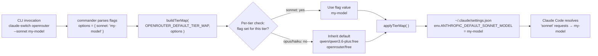

When Claude Code asks its AI provider for a model, it asks in terms of three **tiers** — *opus* (heavy reasoning), *sonnet* (balanced), and *haiku* (fast/lightweight). When you switch to a non-Anthropic provider, Claude AI Switcher translates those tier requests into that provider's model IDs using a **tier map**. This page explains the `--opus`, `--sonnet`, and `--haiku` CLI flags, which let you override *any single tier* at switch time — for example, pinning your favorite strong model to the opus slot while leaving sonnet and haiku at their defaults. If you haven't yet read about the underlying alias system, start with [The Model Tier Alias System: Opus, Sonnet, and Haiku Environment Variables](12-the-model-tier-alias-system-opus-sonnet-and-haiku-environment-variables) first; this page builds directly on it.

Sources: [index.ts](src/index.ts#L127-L150), [README.md](README.md#L9)

## What the Flags Do

Each flag takes a model ID as its value (`--opus <model>`) and replaces just that one tier in the final tier map. The three flags are optional and independent — you can pass one, two, or all three. Any tier you *don't* override silently inherits the provider's default. The definitions live in a small helper called `addTierOptions()`, which attaches the three options to a commander command object.

| Flag | Example | Effect |
|------|---------|--------|
| `--opus <model>` | `--opus qwen3-max-2026-01-23` | Replaces the opus-tier model ID |
| `--sonnet <model>` | `--sonnet qwen3.6-plus` | Replaces the sonnet-tier model ID |
| `--haiku <model>` | `--haiku kimi-k2.5` | Replaces the haiku-tier model ID |

Sources: [index.ts](src/index.ts#L145-L150)

## Where the Flags Are Available (and Where They Aren't)

The flags exist on exactly **six provider commands**, registered in two places: once at the top level (`claude-switch alibaba ...`) and once under the explicit `claude` subcommand (`claude-switch claude alibaba ...`). Both spellings trigger the exact same switch functions, so the flags behave identically either way.

| Command | Accepts tier flags? | Why |
|---------|--------------------:|-----|
| `alibaba [model]` | ✅ | Non-native provider with a default tier map |
| `glm` | ✅ | Non-native provider with a default tier map |
| `openrouter [model]` | ✅ | Non-native provider with a default tier map |
| `ollama [model]` | ✅ | Non-native provider with a default tier map |
| `gemini [model]` | ✅ | Non-native provider with a default tier map |
| `muse [model]` | ✅ | Non-native provider with a default tier map |
| `anthropic` | ❌ | Native Anthropic uses real Claude models; switching to it *removes* the tier env vars entirely |
| `opencode ...` | ❌ | The OpenCode client has no tier map concept — it configures `opencode.json` instead of `~/.claude/settings.json` |

The OpenCode exclusion is worth internalizing: tier overrides are a **Claude Code-only** mechanism, because only Claude Code consumes the `ANTHROPIC_DEFAULT_*_MODEL` environment variables that the overrides ultimately become. The `opencode.ts` client module contains no tier-map code at all.

Sources: [index.ts](src/index.ts#L431-L519), [index.ts](src/index.ts#L525-L617), [claude-code.ts](src/clients/claude-code.ts#L161-L182)

## How an Override Travels Through the Code

The journey from a CLI flag to a live model alias involves four small steps. Commander parses the flags into an `options` object; the provider's switch function merges them with defaults; the Claude Code client writes them into `~/.claude/settings.json` as environment variables; and Claude Code itself reads those variables at runtime to resolve each tier request. The diagram below traces this path for `claude-switch openrouter --sonnet my-model`:

The merge itself is the heart of the feature. `buildTierMap()` walks all three tiers and applies a simple per-tier rule: **flag value if present, provider default otherwise**, expressed in TypeScript as `opts.opus || defaultMap.opus`. Because each tier is checked independently, partial overrides compose cleanly — passing only `--haiku` still produces a complete, valid three-tier map.

Sources: [index.ts](src/index.ts#L127-L136), [index.ts](src/index.ts#L255-L257)

## The Defaults You Are Overriding

Every override is relative to a starting point. Five providers ship a static `*_DEFAULT_TIER_MAP` constant, while Alibaba computes its map dynamically from the selected model — if you choose the default `qwen3.7-plus`, you get one baseline; any other positional model becomes the opus tier itself, with the others shuffling down. Knowing these baselines tells you exactly what you're changing with each flag:

| Provider | Opus default | Sonnet default | Haiku default |
|----------|--------------|----------------|---------------|
| Alibaba (default model) | `qwen3.7-plus` | `qwen3.6-plus` | `kimi-k2.5` |
| Alibaba (custom model `X`) | `X` (your selection) | `qwen3.7-plus` | `qwen3.6-plus` |
| GLM | `glm-5.3[1m]` | `glm-5-turbo` | `glm-5v-turbo` |
| OpenRouter | `qwen/qwen3.6-plus:free` | `openrouter/free` | `openrouter/free` |
| Ollama | `deepseek-r1:latest` | `qwen2.5-coder:latest` | `llama3.1:latest` |
| Gemini | `gemini-2.5-pro` | `gemini-2.5-flash` | `gemini-2.5-flash-lite` |
| Muse | `muse-spark-1.2-contributor` | `muse-spark-1.2-contributor` | `muse-spark-1.2-contributor` |

The Alibaba case deserves a second look because it interacts with overrides: `getAlibabaTierMap(model)` runs *before* `buildTierMap()`, so your flags take final precedence over both the static and the model-derived baselines. If you run `claude-switch alibaba qwen3.6-plus --opus qwen3.7-plus`, the positional model sets the baseline (opus would be `qwen3.6-plus`), and then `--opus` replaces it with `qwen3.7-plus`.

Sources: [models.ts](src/models.ts#L24-L56), [models.ts](src/models.ts#L58-L77), [index.ts](src/index.ts#L188-L190)

## Hands-On: Overriding a Tier, Step by Step

Let's pin a specific haiku model while keeping everything else stock. Suppose you're on GLM and want cheap background tasks to use `glm-4.7` instead of the default `glm-5v-turbo`:

1. **Run the switch with one flag** — `claude-switch glm --haiku glm-4.7`. Commander captures `{ haiku: "glm-4.7" }`; opus and sonnet are `undefined`.
2. **Watch the merge happen** — `buildTierMap` produces `{ opus: "glm-5.3[1m]", sonnet: "glm-5-turbo", haiku: "glm-4.7" }` — two defaults plus your override.
3. **Verify the console echo** — after the switch completes, `displayTierMap()` prints the *resolved* values (not your raw flags), so what you see is exactly what was written.
4. **Confirm persistence with `claude-switch status`** — the status command reads the tier map back out of `~/.claude/settings.json` and prints it under an `Aliases:` heading.

The before/after below shows the concrete effect on your settings file — here for `claude-switch gemini --haiku gemini-2.5-flash-lite` (and note that `--sonnet` was *not* passed, so it keeps the default):

| `env` key in `~/.claude/settings.json` | Before (defaults) | After (with `--haiku` override) |
|------------------------------------------|-------------------|----------------------------------|
| `ANTHROPIC_DEFAULT_OPUS_MODEL` | `gemini-2.5-pro` | `gemini-2.5-pro` *(unchanged)* |
| `ANTHROPIC_DEFAULT_SONNET_MODEL` | `gemini-2.5-flash` | `gemini-2.5-flash` *(unchanged)* |
| `ANTHROPIC_DEFAULT_HAIKU_MODEL` | `gemini-2.5-flash-lite` | `gemini-2.5-flash-lite` *(your override)* |

The writing itself happens in `applyTierMap()`, a three-line function that sets each env key on the settings object; the surrounding `configure*` functions then save the file through the standard backup-then-write path. The README's cheat sheet covers the same flags for every provider if you want copy-paste examples for Alibaba, OpenRouter, Ollama, Gemini, and Muse in one place.

Sources: [index.ts](src/index.ts#L138-L143), [index.ts](src/index.ts#L915-L936), [claude-code.ts](src/clients/claude-code.ts#L35-L46), [README.md](README.md#L215-L243)

## The Lifetime of an Override: Not Remembered Between Switches

A subtle but important behavior: **overrides apply only to the switch that carries them**. The CLI always rebuilds the tier map from the provider's *static default* plus the flags you pass *right now* — it never reads your previously stored tier map back as a starting point. Run `claude-switch openrouter --opus my-favorite` today, then run plain `claude-switch openrouter` tomorrow, and the opus tier reverts to `qwen/qwen3.6-plus:free`. The persisted tier map in `settings.json` is read only for *display* (status output) and *provider detection*, never as a merge base.

The other lifecycle edge is switching back to Anthropic. `configureAnthropic()` deletes all provider env vars and explicitly calls `clearTierMap()`, which removes all three `ANTHROPIC_DEFAULT_*_MODEL` keys — restoring native Claude models for every tier. This is deliberate: leftover alias env vars pointing at, say, an Ollama model would silently break a native Anthropic session.

Sources: [claude-code.ts](src/clients/claude-code.ts#L48-L57), [claude-code.ts](src/clients/claude-code.ts#L161-L182), [index.ts](src/index.ts#L214-L216)

## Beginner Caveats and Gotchas

**Override values are not validated.** The positional `[model]` argument *is* checked against the provider's model catalog — an invalid positional model exits with an error and a list of valid IDs. The tier flag values, however, pass through `buildTierMap()` as raw strings with zero validation. A typo like `--sonnet gemini-2.5-flsh` will be written verbatim into your settings, and you'll only discover it when Claude Code fails to resolve the model. Double-check your spelling against `claude-switch models <provider>` before overriding.

**Model IDs must match the provider's own naming scheme.** Since there's no validation, the flags accept any string — but the value only works if it's a real model ID *on the provider you're switching to*. An OpenRouter-style ID like `qwen/qwen3.6-plus:free` won't work in an Ollama tier, and vice versa. Review the catalog in [Model Catalog and Metadata: IDs, Context Windows, and Capabilities](11-model-catalog-and-metadata-ids-context-windows-and-capabilities) to see valid IDs per provider.

**Tier-only GLM configurations are detectable.** An interesting side effect: `getCurrentProvider()` treats *tier env vars present without a base URL* as evidence of a GLM configuration. This means your tier overrides participate in the provider-detection heuristics — covered in depth in [Provider Detection Heuristics in getCurrentProvider()](10-provider-detection-heuristics-in-getcurrentprovider).

Sources: [index.ts](src/index.ts#L180-L186), [index.ts](src/index.ts#L346-L352), [claude-code.ts](src/clients/claude-code.ts#L373-L379)

## Quick Reference: The Four Functions That Power This Feature

| Function | File | Responsibility |
|----------|------|----------------|
| `addTierOptions(cmd)` | `src/index.ts` | Declares `--opus`, `--sonnet`, `--haiku` on a command |
| `buildTierMap(default, opts)` | `src/index.ts` | Per-tier merge: flag value `\|\|` default |
| `applyTierMap(settings, map)` | `src/clients/claude-code.ts` | Writes the three `ANTHROPIC_DEFAULT_*_MODEL` env keys |
| `clearTierMap(settings)` | `src/clients/claude-code.ts` | Deletes the keys when returning to native Anthropic |

## Where to Go Next

With tier overrides understood, two natural directions follow. To see the *full* switch pipeline these flags ride along — key validation, proxy startup, and the settings write with backups — continue to [The Provider Switch Flow: Key Validation, Tier Maps, Proxy Startup, and Settings Writes](9-the-provider-switch-flow-key-validation-tier-maps-proxy-startup-and-settings-writes). To understand the file that receives all these writes — including the backup behavior that protects you from a bad override — read [Claude Code Client: Managing ~/.claude/settings.json with Backups and Onboarding](14-claude-code-client-managing-claude-settings-json-with-backups-and-onboarding).