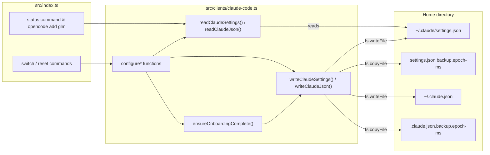
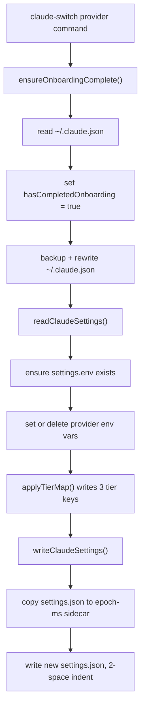

`src/clients/claude-code.ts` is the single module through which Claude AI Switcher touches Claude Code's configuration. Every provider switch, every reset to native Anthropic, and every status lookup that concerns Claude Code ultimately flows through this one file's exported functions. Its responsibilities are deliberately narrow: read and write two JSON files in your home directory, never lose data that was already in them, leave a timestamped backup behind on every write, and make sure Claude Code considers itself onboarded before any routing change takes effect. This page explains how those mechanics work, why the module is shaped the way it is, and where the per-provider configure functions diverge from one another.

## Why a Dedicated Client Module Exists

Claude Code stores its configuration in two separate JSON files with two separate purposes, and the switcher needs different things from each. The module formalizes this split at the top of the file with path constants and loose interfaces: `CLAUDE_DIR` points at `~/.claude`, `SETTINGS_FILE` at `~/.claude/settings.json`, and `CLAUDE_JSON` at `~/.claude.json`. The `ClaudeSettings` interface types the settings file (with a typed `mcpServers` record and an index signature for everything else), `ClaudeJson` types the root-level state file, and `MCPService` describes the shape of individual MCP server entries. Both interfaces intentionally carry `[key: string]: any` — the switcher does not own these files and must not assume it knows all of their keys.
Sources: [claude-code.ts](src/clients/claude-code.ts#L1-L33)

| File | Owned by | What the switcher does with it |
|---|---|---|
| `~/.claude/settings.json` | Claude Code (runtime settings) | Read-modify-write of the `env` and `mcpServers` sections for provider routing; all other keys preserved |
| `~/.claude.json` | Claude Code (app state) | Only the `hasCompletedOnboarding` flag is forced to `true`; everything else preserved |
| `*.backup.<epoch-ms>` | The switcher | Sidecar copies created before every write; never read back by the tool |

The relationship between the CLI layer, this module, and the files on disk looks like this — note that the switcher's own key storage (`~/.claude-ai-switcher/config.json`, handled by `src/config.ts`) is a completely separate file managed elsewhere:

## The Read-Modify-Write Contract

Every mutation in this module follows the same **read-modify-write** discipline: load the full parsed JSON, mutate only the specific keys the provider needs, then serialize the whole object back. Because `readClaudeSettings()` returns `{}` when the file is missing (rather than throwing), the same code path handles a pristine machine that has never run Claude Code and a heavily customized one. This is why your personal `permissions`, hooks, or theme settings in `settings.json` survive every switch — the switcher parses them, ignores them, and rewrites them byte-for-byte (JSON-serialized with 2-space indentation).
Sources: [claude-code.ts](src/clients/claude-code.ts#L76-L95)

The model-tier aliases are applied through two small helpers rather than being inlined into each configure function. `applyTierMap()` ensures `settings.env` exists and writes the three tier keys — `ANTHROPIC_DEFAULT_OPUS_MODEL`, `ANTHROPIC_DEFAULT_SONNET_MODEL`, and `ANTHROPIC_DEFAULT_HAIKU_MODEL` — from the provider's tier map. `clearTierMap()` is the symmetric inverse with one important refinement: if removing the tier keys leaves `settings.env` with zero keys, it deletes the `env` object entirely. Switching back to native Anthropic therefore restores `settings.json` to a minimal shape instead of leaving an empty `"env": {}` husk behind.
Sources: [claude-code.ts](src/clients/claude-code.ts#L35-L57)

## Timestamped Backups on Every Write

Both write functions are structurally identical and embody the module's safety model: **backup first, write second, unconditionally**. `writeClaudeSettings()` calls `fs.ensureDir(CLAUDE_DIR)` (so the very first write on a fresh machine creates `~/.claude`), then — only if the file already exists — copies it to `settings.json.backup.<Date.now()>` before overwriting it. `writeClaudeJson()` does the same against `~/.claude.json`, writing directly into the home directory, which always exists, so no `ensureDir` call is needed there. The suffix is JavaScript's millisecond-precision epoch timestamp, e.g. `settings.json.backup.1712345678901`, which makes backups naturally sortable and collision-free even for rapid successive switches.
Sources: [claude-code.ts](src/clients/claude-code.ts#L97-L126)

Two behavioral consequences are worth internalizing. First, backups **accumulate without bound** — every switch writes two new sidecars (one from the onboarding guard rewriting `~/.claude.json`, one from the settings write), and nothing in the codebase prunes old ones; they are recovery artifacts for you to manage manually. Second, the backups are never read back by the tool itself — there is no restore command in this module; restoring means manually copying a sidecar over the live file. The broader safety story is covered in [Safety Features: Timestamped Backups, Env Var Cleanup, and Local-Only Storage](22-safety-features-timestamped-backups-env-var-cleanup-and-local-only-storage).
Sources: [claude-code.ts](src/clients/claude-code.ts#L100-L126)

## The Onboarding Guard

`ensureOnboardingComplete()` is a three-line function with outsized importance: it reads `~/.claude.json`, forces `hasCompletedOnboarding = true`, and writes the file back (with its own timestamped backup). The code comment records the failure mode this prevents — Claude Code aborting with **"Unable to connect to Anthropic services"** when it believes onboarding never completed. The design decision is that *every* configure function calls `ensureOnboardingComplete()` as its very first step, before touching `settings.json`. This means switching providers on a machine that has never launched Claude Code still produces a machine Claude Code will start on without the interactive first-run flow.
Sources: [claude-code.ts](src/clients/claude-code.ts#L128-L155)

The side effect of this design is that `~/.claude.json` gets a fresh backup on **every single switch**, because the guard goes through `writeClaudeJson()` even when the flag was already true. There is no short-circuit check like `if (!config.hasCompletedOnboarding)` — the module pays one backup file per switch as the cost of a simpler, always-correct write path.
Sources: [claude-code.ts](src/clients/claude-code.ts#L128-L136)

## The Configure Function Family

Seven exported configure functions share one canonical sequence — onboarding guard → read settings → mutate `env` → apply tier map → backup-and-write — and differ only in what they write or delete. The sequence as executed by a typical switch:

The table below is the precise divergence map between the functions. Note that all of them call `ensureOnboardingComplete()` first, and all except `configureAnthropic()` finish with `applyTierMap()`:

| Function | AUTH_TOKEN | BASE_URL | MODEL | Distinct behavior |
|---|---|---|---|---|
| `configureAnthropic()` | deleted | deleted | deleted | **Pure cleanup**: removes `alibaba-coding-plan` and `glm-coding-plan` MCP servers, clears all provider env vars, calls `clearTierMap()` |
| `configureAlibaba()` | `apiKey` | `https://coding-intl.dashscope.aliyuncs.com/apps/anthropic` | `model` | Deletes `CLAUDE_CODE_SUBAGENT_MODEL` and `ENABLE_TOOL_SEARCH` |
| `configureOpenRouter()` | `apiKey` | `https://openrouter.ai/api/v1` | `model` | Deletes the same two stray vars |
| `configureOllama()` | `"ollama"` (literal) | `http://localhost:4000` | `model` | Auth token is a placeholder — the LiteLLM proxy does no real auth |
| `configureGemini()` | `apiKey` | `http://localhost:4001` | `model` | Same two-var cleanup |
| `configureMuse()` | `apiKey` | `https://api.meta.ai` | `model` | **Only function that sets extras**: `CLAUDE_CODE_SUBAGENT_MODEL = model` and `ENABLE_TOOL_SEARCH = "true"` |
| `configureGLM()` | deleted | **not written** | deleted | Clears other providers' env, applies tier map only — see below |

Sources: [claude-code.ts](src/clients/claude-code.ts#L138-L282)

For a concrete picture of what a switch does to disk, here is `settings.json` before and after `claude-switch openrouter` on a previously native setup (tier values illustrative; any unrelated keys you had would pass through untouched in both columns):

| Key | Before (native Anthropic) | After (`configureOpenRouter()`) |
|---|---|---|
| `env.ANTHROPIC_AUTH_TOKEN` | — | `sk-or-v1-…` (your stored key) |
| `env.ANTHROPIC_BASE_URL` | — | `https://openrouter.ai/api/v1` |
| `env.ANTHROPIC_MODEL` | — | `anthropic/claude-sonnet-4.5` |
| `env.ANTHROPIC_DEFAULT_OPUS_MODEL` | — | `anthropic/claude-opus-4.1` |
| `env.ANTHROPIC_DEFAULT_SONNET_MODEL` | — | `anthropic/claude-sonnet-4.5` |
| `env.ANTHROPIC_DEFAULT_HAIKU_MODEL` | — | `anthropic/claude-3-5-haiku-latest` |
| `mcpServers`, permissions, hooks, … | whatever you had | unchanged, serialized identically |

Sources: [claude-code.ts](src/clients/claude-code.ts#L210-L224)

## Special Cases: The Anthropic Reset, GLM Without a Base URL, and Muse Extras

**`configureAnthropic()` is the only subtractive function.** It exists for the `reset`/switch-to-native path: instead of writing provider credentials, it deletes `ANTHROPIC_AUTH_TOKEN`, `ANTHROPIC_BASE_URL`, `ANTHROPIC_MODEL`, `CLAUDE_CODE_SUBAGENT_MODEL`, and `ENABLE_TOOL_SEARCH` from `env`, removes the `alibaba-coding-plan` and `glm-coding-plan` entries from `mcpServers` if present (per its docstring: "Removes MCP overrides and tier map env vars to use native Claude"), and clears the tier map. Combined with `clearTierMap()`'s empty-`env` removal, a machine that was routed through three different providers ends up with a `settings.json` indistinguishable from a clean one except for your own personal keys.
Sources: [claude-code.ts](src/clients/claude-code.ts#L157-L182)

**`configureGLM()` writes the least and depends on an external actor.** It never sets `ANTHROPIC_BASE_URL` or an auth token — it only clears other providers' env vars and applies the GLM tier map. The actual endpoint (`*.z.ai`) is written into `settings.json` by the external `@z_ai/coding-helper` tool, as the detection comment in this same file records: "set by coding-helper auth reload." The CLI orchestrates this two-step dance in `src/index.ts`: it calls `configureClaudeGLM(tierMap)` first, then — only if `coding-helper` is installed — calls `reloadGLMConfig()` to make the helper inject its own credentials, and merely warns if that reload fails ("coding-helper reload failed, but local config updated"). This split ownership is why `getCurrentProvider()` needs three separate GLM detection heuristics (MCP server present, `.z.ai` base URL, or tier-map-set-but-no-base-URL), covered in depth in [Provider Detection Heuristics in getCurrentProvider()](10-provider-detection-heuristics-in-getcurrentprovider).
Sources: [claude-code.ts](src/clients/claude-code.ts#L184-L204), [index.ts](src/index.ts#L205-L230)

**`configureMuse()` is the only function that adds env vars beyond the common three.** It sets `CLAUDE_CODE_SUBAGENT_MODEL` to the same model string and `ENABLE_TOOL_SEARCH` to `"true"` — vars that every other configure function actively deletes as leftovers. This creates a visible asymmetry in the family: six functions treat those keys as foreign debris, one treats them as required configuration. The per-function `delete` calls in the other six are precisely what makes cross-provider switching safe — leaving Muse's subagent override in place while pointing at OpenRouter would silently break subagent routing.
Sources: [claude-code.ts](src/clients/claude-code.ts#L264-L282)

## How the Rest of the Codebase Consumes This Module

The CLI imports these functions under aliased names because `src/clients/opencode.ts` exports identically named functions for a different config file — `configureAnthropic as configureClaudeAnthropic`, `configureGLM as configureClaudeGLM`, and so on, with the OpenCode equivalents getting the `OpenCode` suffix. This naming convention is the only thing preventing collisions: the two clients are parallel modules with deliberately mirrored APIs, which keeps the command layer's provider-switch code symmetric. `claudeSettingsExists()` is additionally imported directly by the CLI to guard the status command's Claude Code section before it calls `getCurrentProvider()`.
Sources: [index.ts](src/index.ts#L28-L49), [index.ts](src/index.ts#L915-L925)

One less obvious consumer: the `opencode add glm` command uses `readClaudeSettings()` as its **credential source of truth**. It reads `env.ANTHROPIC_BASE_URL` and `env.ANTHROPIC_AUTH_TOKEN` from Claude's settings file, refuses to proceed unless the base URL contains `.z.ai` (proving `coding-helper auth` has run against Claude Code first), then passes those values into OpenCode's own configure function. In other words, Claude Code's `settings.json` is not just a destination in this architecture — for GLM it is the canonical store from which the second client bootstraps.
Sources: [index.ts](src/index.ts#L746-L758)

## Gotchas for Contributors

| Behavior | Location | Implication |
|---|---|---|
| Backups accumulate, never pruned | `writeClaudeSettings` / `writeClaudeJson` | Each switch adds two sidecars; disk usage grows monotonically with usage |
| Onboarding guard always rewrites `~/.claude.json` | `ensureOnboardingComplete()` | No short-circuit even when the flag is already `true` — hence the second backup per switch |
| `env` deletion is not exhaustive across providers | each `configure*` | Cleanup lists are hand-maintained per function; a new provider var must be added to *every* other function's delete list (the Muse case proves the pattern) |
| Backup filename embeds `Date.now()` | both writers | Millisecond precision prevents collisions but makes filenames machine-oriented, not human-oriented |
| `mcpServers` cleanup only in the Anthropic reset | `configureAnthropic()` | Switching Alibaba→GLM directly would leave a stale `alibaba-coding-plan` entry behind if one exists; only the native reset removes MCP entries |
| Detection reads the same file read-only | `getCurrentProvider()` | Round-trips through `readClaudeSettings()`; changes to env key names here must stay in sync with detection heuristics |

Sources: [claude-code.ts](src/clients/claude-code.ts#L100-L136)

The deeper principle this module encodes: **the switcher is a guest in Claude Code's config files**. Loose interfaces, full-object round-tripping, unconditional backups, and per-function cleanup lists are all downstream of that one constraint — the module must route traffic through files whose full schema it does not control and cannot predict.

## Next Steps

- See the mirrored implementation for the other client in [OpenCode Client: Adding and Removing Providers in opencode.json](15-opencode-client-adding-and-removing-providers-in-opencode-json)
- Understand what the tier map values mean in [The Model Tier Alias System: Opus, Sonnet, and Haiku Environment Variables](12-the-model-tier-alias-system-opus-sonnet-and-haiku-environment-variables) and [Custom Tier Overrides with --opus, --sonnet, and --haiku Flags](13-custom-tier-overrides-with-opus-sonnet-and-haiku-flags)
- Trace the full command-to-disk journey in [The Provider Switch Flow: Key Validation, Tier Maps, Proxy Startup, and Settings Writes](9-the-provider-switch-flow-key-validation-tier-maps-proxy-startup-and-settings-writes)
- Explore the GLM split-ownership model in [GLM/Z.AI Provider: Integration via the coding-helper MCP Server](19-glm-z-ai-provider-integration-via-the-coding-helper-mcp-server)