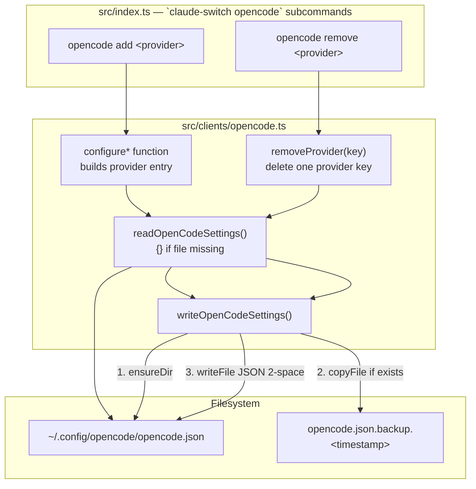

This page explains the second of the switcher's two client handlers: `src/clients/opencode.ts`, the module that manages `~/.config/opencode/opencode.json` on behalf of the [OpenCode](https://opencode.ai) editor. Where the Claude Code client operates an *exclusive* switch model — one active provider at a time, expressed as environment variables — the OpenCode client implements an *additive registry* model: providers are declared as entries inside a `provider` map, multiple providers coexist, and "removing" a provider means deleting exactly one key while leaving siblings intact. The page covers the file's shape, the read–backup–write cycle every mutation goes through, the six `configure*` functions, the granular `removeProvider` path, and the `getCurrentProvider()` detection heuristic — all from the perspective of the code, with the CLI glue in `src/index.ts` that drives it.

## The File It Owns: Path Resolution and Settings Shape

The client's entire world is a single JSON file resolved from the user's home directory: `getOpenCodeConfigPath()` returns `~/.config/opencode/opencode.json` via `path.join(os.homedir(), ".config", "opencode", "opencode.json")`. There is no fallback path and no environment override — the comment in the module header names this location explicitly as the managed target. A companion predicate, `opencodeSettingsExists()`, performs a synchronous `fs.existsSync` check on that path; the CLI uses it as a gate before attempting detection, printing "Not configured (using defaults)" in `status`/`current` when the file is absent.

Sources: [opencode.ts](src/clients/opencode.ts#L1-L33), [index.ts](src/index.ts#L1058-L1074)

The in-memory representation is the `OpenCodeSettings` interface, and its shape reveals the handler's central design constraint: **preserve everything you don't own**. The interface declares `$schema`, `provider`, `mcpServers`, and `agents` as known keys, but crucially also carries an index signature (`[key: string]: any`) so that any unrelated keys OpenCode or the user placed in the file survive a round-trip. Reading is forgiving by design — `readOpenCodeSettings()` returns an empty object when the file doesn't exist rather than throwing, which means every `configure*` function can treat "no file yet" and "file exists" as the same case. Parsing is plain `JSON.parse` on UTF-8 content; the read is async, the existence check is sync.

Sources: [opencode.ts](src/clients/opencode.ts#L11-L17), [opencode.ts](src/clients/opencode.ts#L35-L47)

## The Read–Backup–Write Cycle

Every mutation in this module funnels through one choke point: `writeOpenCodeSettings()`. Before any byte is written it (1) ensures `~/.config/opencode/` exists with `fs.ensureDir`, (2) copies the current file to a timestamped sibling — `opencode.json.backup.<Date.now()>` — if one exists, and only then (3) writes the serialized settings with `JSON.stringify(settings, null, 2)`. This gives the OpenCode client the same timestamped-backup safety net as its Claude Code counterpart (covered in [Claude Code Client: Managing ~/.claude/settings.json with Backups and Onboarding](14-claude-code-client-managing-claude-settings-json-with-backups-and-onboarding) and [Safety Features](22-safety-features-timestamped-backups-env-var-cleanup-and-local-only-storage)), but applied to a different artifact. Note the accumulating-backup characteristic: each write creates a *new* timestamped copy rather than rotating, so repeated add/remove operations leave a trail of historical snapshots.

Sources: [opencode.ts](src/clients/opencode.ts#L49-L67)

The diagram above shows the module interaction pattern: the CLI layer never touches the filesystem directly for OpenCode — it resolves credentials, then delegates to a `configure*` function (or `removeProvider`), which always follows read → mutate in memory → `writeOpenCodeSettings`. Because reads and writes pass through the full parsed object, unrelated top-level keys (`mcpServers`, `agents`, custom user keys) are structurally preserved.

Sources: [index.ts](src/index.ts#L619-L629), [opencode.ts](src/clients/opencode.ts#L49-L67)

## The Add Path: Six Provider Constructors

Six exported `configure*` functions each write one entry into `settings.provider`, keyed by a provider-specific string, and each first sets `settings.$schema = "https://opencode.ai/config.json"` so OpenCode can validate the document. The table below is the complete catalog, verified against the code — note that the JSON key does not always match the CLI command name (Alibaba is the outlier):

| CLI command | JSON `provider` key | `npm` adapter | `options.baseURL` | Credential source | Models written |
|---|---|---|---|---|---|
| `opencode add alibaba` | `bailian-coding-plan` | `@ai-sdk/anthropic` | `https://coding-intl.dashscope.aliyuncs.com/apps/anthropic/v1` | API key from switcher config (prompted if absent) | 9 (qwen3.7-plus, qwen3.6-plus, qwen3-max-2026-01-23, qwen3-coder-next, qwen3-coder-plus, MiniMax-M2.5, glm-5, glm-4.7, kimi-k2.5) |
| `opencode add openrouter` | `openrouter` | `@ai-sdk/openai` | `https://openrouter.ai/api/v1` | API key from switcher config | 2 (qwen/qwen3.6-plus:free, openrouter/free) |
| `opencode add ollama` | `ollama` | `@ai-sdk/openai` | `http://localhost:4000/v1` | Literal placeholder `"ollama"` (no real key) | 4 (deepseek-r1, qwen2.5-coder, llama3.1, codellama, all `:latest`) |
| `opencode add gemini` | `gemini` | `@ai-sdk/openai` | `http://localhost:4001/v1` | API key from switcher config | 3 (gemini-2.5-pro, flash, flash-lite) |
| `opencode add glm` | `glm` | `@ai-sdk/anthropic` | dynamic — read from Claude Code settings | Borrowed from `ANTHROPIC_BASE_URL`/`ANTHROPIC_AUTH_TOKEN` in `~/.claude/settings.json` | 5 (glm-5.3[1m], glm-5v-turbo, glm-5-turbo, glm-4.7, glm-4.7-flash) |
| `opencode add muse` | `muse` | `@ai-sdk/anthropic` | `https://api.meta.ai` | API key from switcher config | 2 (muse-spark-1.2, muse-spark-1.2-contributor) |

Sources: [opencode.ts](src/clients/opencode.ts#L69-L228), [opencode.ts](src/clients/opencode.ts#L275-L376), [opencode.ts](src/clients/opencode.ts#L378-L424), [opencode.ts](src/clients/opencode.ts#L426-L491), [opencode.ts](src/clients/opencode.ts#L493-L547), [opencode.ts](src/clients/opencode.ts#L549-L593), [index.ts](src/index.ts#L631-L797)

**Credential resolution happens in the CLI layer, not the client module.** For `alibaba`, `openrouter`, `gemini`, and `muse`, the action handler first calls `getApiKey(provider)` against the switcher's own key store (`~/.claude-ai-switcher/config.json`), and if that returns nothing it interactively prompts via `promptApiKey` with a provider-specific console URL, persists the answer with `setApiKey`, and only then invokes the `configure*` function. This means an API key entered during `claude-switch opencode add alibaba` is shared with — and reused by — the regular provider-switch flow for the Claude Code client, since both read the same store.

Sources: [index.ts](src/index.ts#L631-L656), [config.ts](src/config.ts#L53-L92)

Two providers deviate from the key-store pattern in instructive ways. **Ollama needs no credential at all**: `configureOllama()` takes zero arguments and writes the literal string `"ollama"` as `apiKey`, because authentication is irrelevant behind the local LiteLLM proxy on port 4000 (whose lifecycle is covered separately in [Ollama Provider: Local Models with Detached LiteLLM Proxy Lifecycle on Port 4000](17-ollama-provider-local-models-with-detached-litellm-proxy-lifecycle-on-port-4000)). **GLM borrows credentials rather than owning them**: the CLI action first checks whether `@z_ai/coding-helper` is installed (warning with install instructions if not), then reads `env.ANTHROPIC_BASE_URL` and `env.ANTHROPIC_AUTH_TOKEN` from the *Claude Code* settings file — values placed there by the coding-helper auth flow — and refuses to proceed unless the baseURL is non-empty and contains `.z.ai`, directing the user to run `claude-switch glm` first. The client function `configureGLM(baseURL, apiKey)` therefore receives fully-resolved parameters; the module comment states the contract plainly: "Auth is managed by coding-helper — reads baseURL and apiKey from Claude settings." (The MCP server itself is covered in [GLM/Z.AI Provider: Integration via the coding-helper MCP Server](19-glm-z-ai-provider-integration-via-the-coding-helper-mcp-server).)

Sources: [opencode.ts](src/clients/opencode.ts#L426-L441), [opencode.ts](src/clients/opencode.ts#L275-L292), [index.ts](src/index.ts#L732-L770)

## Anatomy of a Provider Entry

Every written entry follows the same OpenCode provider-schema shape. Taking the GLM entry as the canonical example: `npm` names the AI SDK adapter package OpenCode should load (`@ai-sdk/anthropic` for Anthropic-compatible endpoints, `@ai-sdk/openai` for OpenAI-compatible ones — including the LiteLLM proxies); `name` is the human-readable label shown in OpenCode's UI; `options.baseURL` and `options.apiKey` are passed to that adapter; and `models` is a map of model IDs to metadata. Each model declares `modalities.input`/`modalities.output` (e.g., `["text", "image"]` for multimodal inputs), an optional `options.thinking` block (`{ type: "enabled", budgetTokens: 8192 }` — applied uniformly with the same 8192 budget wherever present), and `limit.context`/`limit.output` ceilings that range from 100k to 1M context depending on the model. Notably, **these model lists are hardcoded in the client module** — `opencode.ts` imports only `fs-extra`, `path`, and `os`, and never consults the switcher's central model catalog in `src/models.ts`; the OpenCode registry is a self-contained duplicate maintained by hand.

Sources: [opencode.ts](src/clients/opencode.ts#L7-L9), [opencode.ts](src/clients/opencode.ts#L285-L372)

| Field | Purpose | Example (GLM entry) |
|---|---|---|
| `npm` | AI SDK adapter OpenCode loads for this provider | `@ai-sdk/anthropic` |
| `name` | Display label in OpenCode UI | `GLM/Z.AI` |
| `options.baseURL` | API endpoint handed to the adapter | caller-supplied (validated to contain `.z.ai`) |
| `options.apiKey` | Credential handed to the adapter | caller-supplied token |
| `models.<id>.name` | Per-model display name | `GLM-5.3 (1M Context)` |
| `models.<id>.modalities` | Input/output capability flags | input `["text"]`, output `["text"]` |
| `models.<id>.options.thinking` | Extended-thinking toggle + budget | `{ type: "enabled", budgetTokens: 8192 }` |
| `models.<id>.limit` | Context and output token ceilings | context `1000000`, output `131072` |

Sources: [opencode.ts](src/clients/opencode.ts#L285-L372)

One security-relevant property deserves explicit mention for intermediate readers: `options.apiKey` lands in `opencode.json` as **plaintext** (e.g., the Alibaba key at `settings.provider["bailian-coding-plan"].options.apiKey`). This differs from the switcher's own key store, where the same key also lives in plaintext but in a dedicated directory — the storage-tradeoffs discussion belongs to [API Key Storage in ~/.claude-ai-switcher/config.json](20-api-key-storage-in-claude-ai-switcher-config-json); here it suffices to note that adding a provider to OpenCode necessarily duplicates the credential into a second file, and each subsequent add re-writes it.

Sources: [opencode.ts](src/clients/opencode.ts#L81-L87), [opencode.ts](src/clients/opencode.ts#L559-L565)

## The Remove Path: Granular Deletion and the Unwired Bulk Function

Removal is deliberately narrow. `removeProvider(providerKey)` reads the settings, deletes at most one key from the `provider` map (`if (settings.provider?.[providerKey])` — a no-op when the provider was never added), performs a hygiene step the adds don't need — deleting the now-empty `provider` object entirely if it has zero remaining keys — and writes the result back through the same backup-guarded path. The six `opencode remove <provider>` CLI commands are thin wrappers that dynamically import this one function with the appropriate key (`bailian-coding-plan`, `openrouter`, `ollama`, `gemini`, `glm`, `muse`) and print "Other providers remain unchanged" on success, which is the semantic contract of the whole remove path: **removing a provider never touches its siblings, other top-level keys, or any file outside `opencode.json`**.

Sources: [opencode.ts](src/clients/opencode.ts#L595-L612), [index.ts](src/index.ts#L799-L818), [index.ts](src/index.ts#L820-L903)

Code archaeology note: the module also exports `configureAnthropic()`, a *bulk* remover that deletes all six switcher-managed provider keys in sequence and cleans up the empty map — documented as restoring native Anthropic usage. However, a search of the CLI shows `configureAnthropic` is imported only from the Claude Code client (`src/index.ts` line 29 aliases the claude-code.ts version); the OpenCode variant is **exported but never wired to any command**. Its role has been superseded by the granular `opencode remove` commands, which achieve the same end-state (no managed providers in the file) through composable single-key deletions. It remains available to programmatic consumers of the module.

Sources: [opencode.ts](src/clients/opencode.ts#L230-L273), [index.ts](src/index.ts#L29-L49)

## Detection: getCurrentProvider() Precedence

The final export answers "which provider is active in OpenCode right now?" — and because the registry model permits multiple simultaneous entries, the answer is a **fixed-priority first-match scan**, not a state lookup. `getCurrentProvider()` short-circuits to `{ provider: "anthropic" }` when the settings file doesn't exist (OpenCode's native default), then checks provider keys in a hardcoded order:

```mermaid
flowchart TD
    START["getCurrentProvider()"] --> EXISTS{"opencode.json<br/>exists?"}
    EXISTS -->|No| ANTHROPIC["return anthropic (default)"]
    EXISTS -->|Yes| C1{"provider[ba&#818;ilian-coding-plan]?"}
    C1 -->|Yes| ALIBABA["return alibaba<br/>endpoint = its baseURL"]
    C1 -->|No| C2{"provider[openrouter]?"}
    C2 -->|Yes| OR["return openrouter<br/>endpoint = openrouter.ai/api/v1"]
    C2 -->|No| C3{"provider[ollama]?"}
    C3 -->|Yes| OL["return ollama<br/>endpoint = localhost:4000/v1"]
    C3 -->|No| C4{"provider[gemini]?"}
    C4 -->|Yes| GE["return gemini<br/>endpoint = localhost:4001/v1"]
    C4 -->|No| C5{"provider[glm]?"}
    C5 -->|Yes| GLM["return glm<br/>endpoint = its baseURL"]
    C5 -->|No| C6{"provider[muse]?"}
    C6 -->|Yes| MUSE["return muse<br/>endpoint = its baseURL"]
    C6 -->|No| ANTHROPIC
```

Two details distinguish this heuristic from the Claude Code client's detection (covered in [Provider Detection Heuristics in getCurrentProvider()](10-provider-detection-heuristics-in-getcurrentprovider)). First, the returned endpoint is *derived* differently per provider: for `bailian-coding-plan`, `glm`, and `muse` it is read from the entry's own `options.baseURL`, while for `openrouter`, `ollama`, and `gemini` it is a hardcoded literal matching what the corresponding `configure*` function writes. Second, if no managed key matches but the file exists, the function still falls back to `{ provider: "anthropic" }` — absence of switcher-managed entries is interpreted as "OpenCode is using its native/built-in providers."

Sources: [opencode.ts](src/clients/opencode.ts#L614-L677)

The consumers are the `status` and `current` commands, both of which print an "OpenCode:" block that renders `provider`, optional `model`, and optional `endpoint` — all guarded by `opencodeSettingsExists()` so an uninstalled OpenCode shows "Not configured (using defaults)" / "Not installed" rather than a misleading `anthropic`. The `model` field is declared in the return type but never populated by any code path in this module; it is printed only `if (opencodeProvider.model)`, so in practice it never renders for OpenCode — model *selection* is delegated entirely to OpenCode's own UI once the catalog is registered.

Sources: [opencode.ts](src/clients/opencode.ts#L617-L624), [index.ts](src/index.ts#L940-L953), [index.ts](src/index.ts#L1060-L1072)

## Command Surface Summary

For quick reference, the complete OpenCode command surface exposed by the CLI, with the underlying client function each invokes:

| Command | Client function invoked | Side effects beyond `opencode.json` |
|---|---|---|
| `claude-switch opencode add alibaba` | `configureAlibaba(apiKey)` | May prompt for and persist key to switcher config |
| `claude-switch opencode add openrouter` | `configureOpenRouter(apiKey)` | May prompt for and persist key |
| `claude-switch opencode add ollama` | `configureOllama()` | None (warns LiteLLM proxy required on port 4000) |
| `claude-switch opencode add gemini` | `configureGemini(apiKey)` | May prompt for and persist key; warns proxy required on port 4001 |
| `claude-switch opencode add glm` | `configureGLM(baseURL, apiKey)` | Reads `~/.claude/settings.json`; checks coding-helper install |
| `claude-switch opencode add muse` | `configureMuse(apiKey)` | May prompt for and persist key |
| `claude-switch opencode remove <any of the six>` | `removeProvider(<json key>)` | None — other providers preserved |

Sources: [index.ts](src/index.ts#L623-L629), [index.ts](src/index.ts#L631-L797), [index.ts](src/index.ts#L799-L903)

Every `add` prints a confirmation block with the config path (`~/.config/opencode/opencode.json`), the JSON provider key, the model list, and — for proxy-dependent providers — a yellow note about the required LiteLLM port; every `remove` prints the success message plus "Other providers remain unchanged". Errors are caught per-action and terminate with `process.exit(1)` after a `displayError`.

Sources: [index.ts](src/index.ts#L645-L656), [index.ts](src/index.ts#L692-L697), [index.ts](src/index.ts#L808-L817)

## Where to Go Next

Having seen how the second client handler shapes its target file, natural continuations are: [Direct Anthropic-Compatible Providers: Anthropic, Alibaba, OpenRouter, and Muse](16-direct-anthropic-compatible-providers-anthropic-alibaba-openrouter-and-muse) for why three of these six providers share the `@ai-sdk/anthropic` adapter; [Gemini Provider: LiteLLM Proxy Translation on Port 4001](18-gemini-provider-litellm-proxy-translation-on-port-4001) and [Ollama Provider: Local Models with Detached LiteLLM Proxy Lifecycle on Port 4000](17-ollama-provider-local-models-with-detached-litellm-proxy-lifecycle-on-port-4000) for the proxies behind the `localhost` baseURLs; and [API Key Storage in ~/.claude-ai-switcher/config.json](20-api-key-storage-in-claude-ai-switcher-config-json) for the shared key store the add-commands consult. To add a seventh provider to this registry, follow [Step-by-Step Guide: Adding a New AI Provider to the Switcher](29-step-by-step-guide-adding-a-new-ai-provider-to-the-switcher).