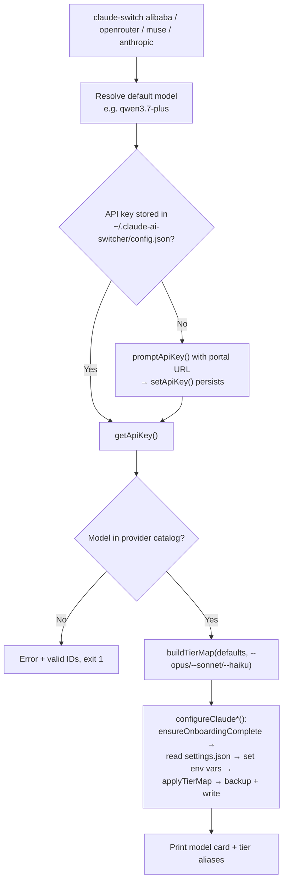

This page examines the four providers in Claude AI Switcher that connect Claude Code to an **Anthropic-compatible API endpoint using nothing but environment variables** — no LiteLLM proxy translation and no MCP server intermediary. Anthropic itself is the baseline; Alibaba (DashScope Coding Plan), OpenRouter, and Muse (Meta) are third-party endpoints that speak the Anthropic Messages wire protocol. For these providers, "switching" reduces to writing a small set of `ANTHROPIC_*` variables into `~/.claude/settings.json`, which makes them the simplest — and the reference — implementation of the switching engine. If you haven't yet read how this pattern contrasts with proxy-based and MCP-based connectivity, start with [Provider Connectivity Patterns: Direct API vs LiteLLM Proxy vs coding-helper MCP](8-provider-connectivity-patterns-direct-api-vs-litellm-proxy-vs-coding-helper-mcp).

## The Shared Anatomy: One Contract, Four Implementations

Each of the four providers follows an identical structural pattern across four layers. The provider modules in `src/providers/` are deliberately thin — each exports a provider reference pulled from the central `providers` registry in `models.ts`, a typed `Config` interface, an endpoint constant, a `getXConfig()` factory function, and catalog helpers (`getAvailableModels()`, `findModel()`). The registry itself defines every provider with an `id`, display `name`, optional `endpoint`, and a `models` array, where the **absence of an endpoint is itself meaningful** — `providers.anthropic` carries no `endpoint` field, signaling that Claude Code's built-in default (`https://api.anthropic.com`) applies.

Sources: [anthropic.ts](src/providers/anthropic.ts#L1-L24), [alibaba.ts](src/providers/alibaba.ts#L1-L44), [openrouter.ts](src/providers/openrouter.ts#L1-L43), [muse.ts](src/providers/muse.ts#L17-L46), [models.ts](src/models.ts#L334-L376)

An important archaeological finding: most of these module exports are **declarative reference surfaces rather than operative code**. The switch flow in `index.ts` never calls `getAnthropicConfig()`, `getAlibabaConfig()`, or `getOpenRouterConfig()`; it pulls model catalogs directly via `getModels("alibaba")` from `models.ts`. Even `getMuseConfig` is imported into `index.ts` but never invoked. The runtime path is: CLI command → `switch*()` function in `index.ts` → client handler in `src/clients/claude-code.ts` (or `opencode.ts`). When reading the code, treat `src/providers/*.ts` for these four providers as documentation of intent, not execution.

Sources: [index.ts](src/index.ts#L74-L77), [index.ts](src/index.ts#L180-L190)

## The Common Switch Sequence

All four switch functions in `index.ts` execute the same five-step contract, differing only in their constants. The sequence is: **(1)** resolve a default model if none was passed on the CLI; **(2)** fetch the stored API key via `getApiKey()`, and if absent, run the interactive `promptApiKey()` flow (printing a provider-specific key portal URL) before persisting it with `setApiKey()`; **(3)** validate the requested model against the provider's catalog and exit non-zero with the list of valid IDs on mismatch; **(4)** construct the tier map with `buildTierMap()`, merging CLI `--opus/--sonnet/--haiku` overrides over provider defaults; **(5)** delegate to the client's `configure*()` handler and print a summary card showing model, context window, endpoint, capabilities, and the final alias mapping.

Sources: [index.ts](src/index.ts#L107-L150), [index.ts](src/index.ts#L165-L202), [index.ts](src/index.ts#L232-L269), [index.ts](src/index.ts#L387-L425)

Note what is *absent* from this flow compared to other providers: no LiteLLM installation pre-flight, no proxy startup, no `which coding-helper` check. This absence is precisely what "direct" means in the connectivity taxonomy. The full mechanics of `ensureOnboardingComplete()` (which flips `hasCompletedOnboarding` in `~/.claude.json` to prevent a spurious connection error) and the timestamped backup-before-write discipline are covered in [The Provider Switch Flow](9-the-provider-switch-flow-key-validation-tier-maps-proxy-startup-and-settings-writes) and [Claude Code Client: Managing ~/.claude/settings.json](14-claude-code-client-managing-claude-settings-json-with-backups-and-onboarding).

## The Environment Variable Contract in settings.json

The heart of the pattern lives in `src/clients/claude-code.ts`. For the three third-party providers, the handler writes an identical trio — `ANTHROPIC_AUTH_TOKEN` (the provider key), `ANTHROPIC_BASE_URL` (the provider's Anthropic-compatible endpoint), and `ANTHROPIC_MODEL` (the selected model ID) — then applies the three tier-alias variables (`ANTHROPIC_DEFAULT_OPUS_MODEL`, `ANTHROPIC_DEFAULT_SONNET_MODEL`, `ANTHROPIC_DEFAULT_HAIKU_MODEL`) via the shared `applyTierMap()` helper. Muse alone adds two extra variables: `CLAUDE_CODE_SUBAGENT_MODEL` (pinned to the selected model) and `ENABLE_TOOL_SEARCH=true`. Alibaba and OpenRouter handlers explicitly `delete` those two Muse-era keys to guarantee a clean slate when switching away from Muse — a small but deliberate hygiene step, since Claude Code reads whatever remains in `settings.json`.

Sources: [claude-code.ts](src/clients/claude-code.ts#L35-L55), [claude-code.ts](src/clients/claude-code.ts#L141-L155), [claude-code.ts](src/clients/claude-code.ts#L210-L224), [claude-code.ts](src/clients/claude-code.ts#L268-L282)

Anthropic's handler inverts the pattern: it is a **subtraction operation**. `configureAnthropic()` deletes both legacy MCP server entries (`alibaba-coding-plan`, `glm-coding-plan`), removes all five provider env vars including the Muse extras, and calls `clearTierMap()` — which strips the three tier aliases and even deletes the `env` object entirely if it becomes empty. Switching "to Anthropic" therefore means returning `settings.json` to its native zero state, where Claude Code's built-in model routing and the ambient `ANTHROPIC_API_KEY` environment variable take over.

Sources: [claude-code.ts](src/clients/claude-code.ts#L161-L182), [claude-code.ts](src/clients/claude-code.ts#L48-L55)

| Env Var | Anthropic | Alibaba | OpenRouter | Muse |
|---|---|---|---|---|
| `ANTHROPIC_AUTH_TOKEN` | **deleted** | key | key | key |
| `ANTHROPIC_BASE_URL` | **deleted** | `...dashscope.../apps/anthropic` | `https://openrouter.ai/api/v1` | `https://api.meta.ai` |
| `ANTHROPIC_MODEL` | **deleted** | selected | selected | selected |
| `CLAUDE_CODE_SUBAGENT_MODEL` | **deleted** | deleted | deleted | **= selected model** |
| `ENABLE_TOOL_SEARCH` | **deleted** | deleted | deleted | **`"true"`** |
| Tier aliases (3×) | **cleared** | applied | applied | applied |

The tier-alias system these providers feed into — how Claude Code resolves "opus/sonnet/haiku" requests to concrete model IDs — is covered in depth in [The Model Tier Alias System](12-the-model-tier-alias-system-opus-sonnet-and-haiku-environment-variables) and [Custom Tier Overrides with --opus, --sonnet, and --haiku Flags](13-custom-tier-overrides-with-opus-sonnet-and-haiku-flags).

## Tier Map Strategies: Static, Dynamic, and Null

Three distinct strategies emerge across the four providers. OpenRouter and Muse use **static constants**: `OPENROUTER_DEFAULT_TIER_MAP` maps opus to the free Qwen3.6 model and both sonnet and haiku to `openrouter/free`, while `MUSE_DEFAULT_TIER_MAP` routes all three tiers to the single `muse-spark-1.2-contributor` model. Anthropic uses the **null strategy** — tier aliases are removed entirely so Claude Code's native tiering applies. Alibaba is the only provider with a **dynamic, model-aware tier map**: the `getAlibabaTierMap()` function branches on the selected model. When the default `qwen3.7-plus` is chosen, tiers map to a spread of `qwen3.7-plus` / `qwen3.6-plus` / `kimi-k2.5`; when any other model is selected, that model is promoted to the opus slot while the two Qwen models fill sonnet and haiku. This means Alibaba's tier semantics shift depending on your primary model choice — the only place in the codebase where tier mapping is computed rather than declared.

Sources: [models.ts](src/models.ts#L30-L56), [models.ts](src/models.ts#L58-L77), [index.ts](src/index.ts#L188), [index.ts](src/index.ts#L255), [index.ts](src/index.ts#L410)

## Provider Profiles and Model Catalogs

The catalogs reveal each provider's positioning. Alibaba's Coding Plan is a **multi-vendor aggregator**: its ten models span Qwen (five variants), Zhipu GLM (three), Moonshot Kimi, and MiniMax, with the flagship Qwen models offering 1M-token context windows and thinking-mode support. OpenRouter's curated set is deliberately minimal — two free-tier models at 131K context, reflecting a zero-cost entry point. Muse ships exactly two entries — the base `muse-spark-1.2` and its discounted `contributor` twin at identical 256K context — with the contributor variant marked as the "Preferred default." Anthropic's five-model catalog mirrors its current generation ladder (Opus 4.6 → Haiku 4.5, all at 200K context), and notably the default model ID `claude-opus-4-6-20250205` is resolved through `process.env.ANTHROPIC_MODEL` in the provider module before falling back to the hardcoded ID.

Sources: [models.ts](src/models.ts#L90-L161), [models.ts](src/models.ts#L202-L218), [models.ts](src/models.ts#L277-L293), [models.ts](src/models.ts#L295-L332), [anthropic.ts](src/providers/anthropic.ts#L18-L23)

| Provider | Endpoint | Default Model | Catalog Size | Max Context | Standout Capability |
|---|---|---|---|---|---|
| Anthropic | *(native, none set)* | `claude-opus-4-6-20250205` | 5 | 200K | Vision, complex reasoning |
| Alibaba | `coding-intl.dashscope.aliyuncs.com/apps/anthropic` | `qwen3.7-plus` | 10 | 1M | Multi-vendor (Qwen/GLM/Kimi/MiniMax), thinking modes |
| OpenRouter | `openrouter.ai/api/v1` | `qwen/qwen3.6-plus:free` | 2 | 131K | Free tier entry point |
| Muse | `api.meta.ai` | `muse-spark-1.2-contributor` | 2 | 256K | Discounted contributor tier, image input |

Full catalog metadata — how `Model` records carry `contextWindow`, `capabilities`, and `description` — is covered in [Model Catalog and Metadata](11-model-catalog-and-metadata-ids-context-windows-and-capabilities).

## Key Verification: Four Strategies, Five-Second Budget

Every provider's key is health-checked in `src/verify.ts` using a `fetch` wrapped in a 5-second `AbortController` timeout, with a uniform status vocabulary: `ok` for 2xx, `invalid` for 401/403, `error` for other HTTP failures or connection drops, and `missing` when no key is stored. The differentiation lies in the **authentication header strategy**, which mirrors each upstream API's native convention. Anthropic is verified with the canonical `x-api-key` header plus the required `anthropic-version: 2023-06-01` header against `api.anthropic.com/v1/models` — and it is the only key sourced from the ambient `ANTHROPIC_API_KEY` environment variable rather than the switcher's key store. Alibaba and OpenRouter both use simple `Bearer` authorization against their `/models` listing endpoints. Muse implements the most defensive strategy: it tries `Bearer` first, and on failure retries the same endpoint with the Anthropic-style `x-api-key` + `anthropic-version` headers before declaring the key invalid — a dual-probe pattern that acknowledges ambiguity in Meta's auth surface.

Sources: [verify.ts](src/verify.ts#L7-L30), [verify.ts](src/verify.ts#L35-L85), [verify.ts](src/verify.ts#L118-L145), [verify.ts](src/verify.ts#L236-L278)

One divergence worth flagging for maintainers: `alibaba.ts` exports an `ALIBABA_VERIFY_URL` constant pointing at `coding-intl.dashscope.aliyuncs.com/compatible-mode/v1/models`, but `verify.ts` hardcodes a *different* host — `dashscope.aliyuncs.com/compatible-mode/v1/models` — and the exported constant is never consumed anywhere in the codebase. The verification path therefore hits the domestic DashScope host while switching traffic goes to the international coding-plan host. This is a latent inconsistency, not a bug per se, but it should be reconciled if verification behavior ever drifts.

Sources: [alibaba.ts](src/providers/alibaba.ts#L19-L20), [verify.ts](src/verify.ts#L35-L45)

| Provider | Verify URL | Auth Headers | Fallback Probe | Key Source |
|---|---|---|---|---|
| Anthropic | `api.anthropic.com/v1/models` | `x-api-key` + `anthropic-version` | — | `ANTHROPIC_API_KEY` env |
| Alibaba | `dashscope.aliyuncs.com/compatible-mode/v1/models` | `Bearer` | — | stored `alibaba` key |
| OpenRouter | `openrouter.ai/api/v1/models` | `Bearer` | — | stored `openrouter` key |
| Muse | `api.meta.ai/v1/models` | `Bearer` | `x-api-key` + `anthropic-version` | stored `muse` key |

All four checks are dispatched concurrently by `verifyAllKeys()` via `Promise.all`, with missing keys short-circuited to resolved promises rather than network calls. Key masking (`sk-1a...9f3z` style) and the broader verification UX are detailed in [API Key Verification](21-api-key-verification-lightweight-health-checks-and-key-masking).

Sources: [verify.ts](src/verify.ts#L150-L204)

## The OpenCode Side: Same Providers, Different Wire Format

On the OpenCode client, these providers are materialized as provider blocks in `~/.config/opencode/opencode.json` rather than env vars, and here a meaningful asymmetry appears. Alibaba and Muse register through `npm: "@ai-sdk/anthropic"` — preserving the Anthropic-compatible framing — while OpenRouter registers through `npm: "@ai-sdk/openai"`, treating OpenRouter's `/api/v1` as an OpenAI-compatible surface instead. Alibaba's OpenCode `baseURL` also gains a `/v1` suffix absent from the Claude Code configuration, and its model entries carry OpenCode-specific extras like `thinking.budgetTokens: 8192` and per-model output limits. `configureAnthropic()` on the OpenCode side mirrors its Claude Code counterpart as a subtraction: it deletes all six provider blocks (`bailian-coding-plan`, `openrouter`, `ollama`, `gemini`, `glm`, `muse`) and removes the empty `provider` object entirely.

Sources: [opencode.ts](src/clients/opencode.ts#L73-L105), [opencode.ts](src/clients/opencode.ts#L234-L273), [opencode.ts](src/clients/opencode.ts#L382-L421), [opencode.ts](src/clients/opencode.ts#L553-L593)

| Aspect | Claude Code | OpenCode |
|---|---|---|
| Alibaba SDK | *(none — env vars)* | `@ai-sdk/anthropic` |
| OpenRouter SDK | *(none — env vars)* | `@ai-sdk/openai` |
| Muse SDK | *(none — env vars)* | `@ai-sdk/anthropic` |
| Alibaba base URL | `.../apps/anthropic` | `.../apps/anthropic/v1` |
| Anthropic switch | delete env vars + MCP entries | delete 6 provider blocks |
| Tier aliases | 3 env vars | not applicable |

The `opencode add alibaba|openrouter|muse` commands reuse the same `getApiKey → promptApiKey → setApiKey` resolution as their Claude Code siblings, so a key entered once serves both clients. The full add/remove lifecycle for OpenCode is documented in [OpenCode Client: Adding and Removing Providers in opencode.json](15-opencode-client-adding-and-removing-providers-in-opencode-json).

Sources: [index.ts](src/index.ts#L630-L683), [index.ts](src/index.ts#L772-L797)

## Where to Go Next

The direct-Anthropic pattern you've just studied is the template against which the two heavier connectivity patterns are built — both eventually write the *same* `ANTHROPIC_*` trio, they merely change what sits behind `ANTHROPIC_BASE_URL` (a local proxy). To see that contrast, continue with [Ollama Provider: Local Models with Detached LiteLLM Proxy Lifecycle on Port 4000](17-ollama-provider-local-models-with-detached-litellm-proxy-lifecycle-on-port-4000) and [Gemini Provider: LiteLLM Proxy Translation on Port 4001](18-gemini-provider-litellm-proxy-translation-on-port-4001), then [GLM/Z.AI Provider: Integration via the coding-helper MCP Server](19-glm-z-ai-provider-integration-via-the-coding-helper-mcp-server). If you're considering adding your own Anthropic-compatible endpoint, [Step-by-Step Guide: Adding a New AI Provider](29-step-by-step-guide-adding-a-new-ai-provider-to-the-switcher) walks the exact files this page analyzed.