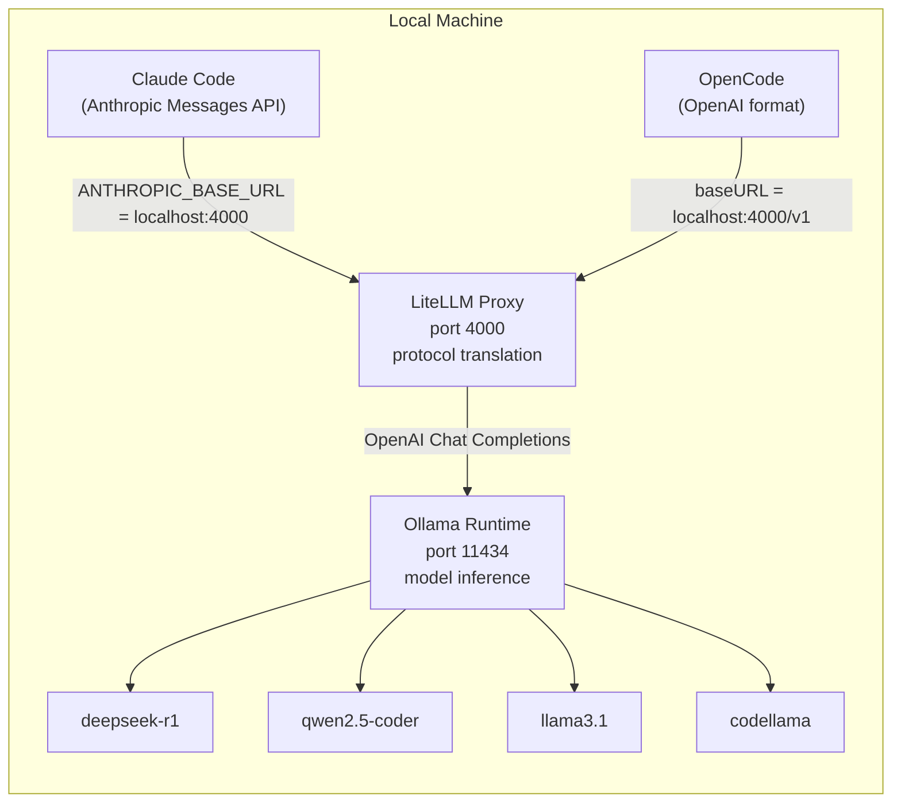
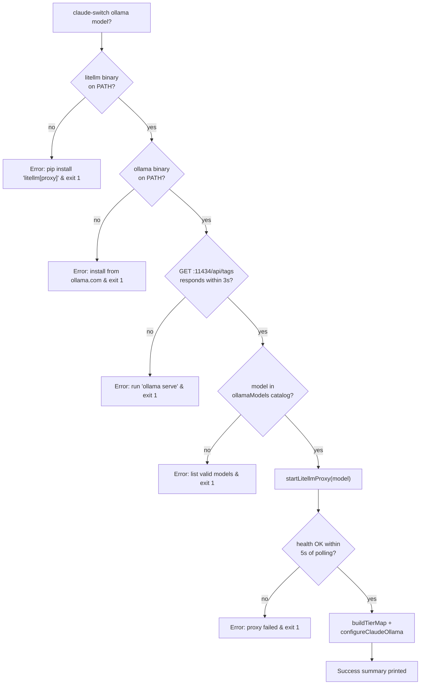

This page dissects the Ollama provider — the switcher's only fully local, credential-free backend. Unlike cloud providers that hand Claude Code a remote base URL, Ollama runs on your machine and speaks the **OpenAI Chat Completions format**, which Claude Code cannot consume directly. The provider therefore stands up a **LiteLLM proxy on port 4000** that translates Anthropic Messages API requests into OpenAI format, and it launches that proxy as a **detached, unreferenced background process** that outlives the CLI. We will trace this lifecycle end-to-end: from binary detection, through the spawn mechanics, to how both clients consume the proxy and how the `status` command verifies the whole chain.

## Why LiteLLM Sits Between Claude Code and Ollama

The fundamental constraint is stated in the module header itself: Ollama only exposes an OpenAI-compatible API, while Claude Code emits Anthropic Messages API traffic. LiteLLM bridges the two protocols. The architecture places **three processes** on the local machine: Claude Code (the client), the LiteLLM translation proxy on **port 4000**, and the Ollama model runtime on **port 11434**. Claude Code believes it is talking to a vanilla Anthropic endpoint; LiteLLM silently converts each request to OpenAI format and forwards it to Ollama; responses travel the reverse path. This indirection is also why OpenCode integration is simpler — OpenCode speaks OpenAI natively, so it can point directly at LiteLLM's `/v1` surface without any translation concerns.

The provider module pins all three address constants up front — `OLLAMA_ENDPOINT = "http://localhost:4000"`, `OLLAMA_LITELLM_PORT = 4000`, and `OLLAMA_PORT = 11434` — so both the proxy and the runtime have single sources of truth for their ports. The default model is `deepseek-r1:latest`, chosen in `getOllamaConfig()` when the user supplies none. The model catalog itself is imported from the shared models layer, keeping this module free of metadata duplication.
Sources: [ollama.ts](src/providers/ollama.ts#L1-L27) · [ollama.ts](src/providers/ollama.ts#L29-L43)

## The Detached Spawn: Anatomy of `startLitellmProxy()`

The heart of the "detached lifecycle" design is a twelve-line spawn sequence. The function first performs an **idempotency check** — if the health endpoint on port 4000 already responds, it returns success immediately without spawning a duplicate process. Otherwise it executes `litellm --model ollama/{model} --port {port}` with three deliberately chosen options:

| Spawn option | Value | Architectural consequence |
|---|---|---|
| `detached` | `true` | Child gets its own process group; it survives CLI exit |
| `stdio` | `"ignore"` | No pipes held open — the parent holds no I/O handle |
| `shell` | `false` | Direct exec of the `litellm` binary, no shell wrapper |

The critical line is `child.unref()` — after this call, the parent is free to exit even though the child is still running, because the event loop no longer keeps a reference to it. Combined with ignored stdio, this makes the proxy a **fully orphaned OS-level process**: `claude-switch ollama` can finish writing settings and terminate, while LiteLLM keeps serving traffic indefinitely. The function then **polls the `/health` endpoint ten times at 500 ms intervals** (5 seconds total) to confirm the proxy actually became ready before the switch flow proceeds — a pragmatic readiness gate, since a spawned-but-broken proxy would otherwise produce a configuration that fails only at first inference.

It is worth contrasting this with the sibling Gemini implementation, which uses the same detached pattern but differs in three instructive ways: Gemini passes `shell: true` (needed for its environment plumbing), injects `GEMINI_API_KEY` into the child's environment, and binds port 4001 to avoid colliding with an Ollama proxy. Ollama needs **no credentials whatsoever** — its spawn is the purest expression of the pattern, and the two providers coexisting on distinct ports (4000/4001) is exactly why the port constants matter.

Sources: [ollama.ts](src/providers/ollama.ts#L116-L146) · [gemini.ts](src/providers/gemini.ts#L101-L136)

## Lifecycle Ownership: There Is No Stop Command

An advanced reader should note what the detached design *implies*: the CLI's command catalog contains `ollama [model]` (switch), `opencode add ollama`, and `opencode remove ollama` — but **no proxy shutdown command**. The switcher treats the LiteLLM process as infrastructure owned by the user's session, not by the tool. Once spawned, it persists across reboots of the terminal, across switches to other providers (which simply repoint `ANTHROPIC_BASE_URL` elsewhere), and across `opencode remove ollama` (which deletes the OpenCode config entry but never touches the running proxy). The only in-band interaction after spawn is the passive `isLitellmProxyRunning()` health probe. Terminating the proxy is an out-of-band operation left to the user (`pkill litellm` or equivalent), and because the process was detached into its own group, it will not die as collateral when any parent shell closes.

Sources: [index.ts](src/index.ts#L484-L488) · [index.ts](src/index.ts#L686-L699) · [index.ts](src/index.ts#L838-L849) · [ollama.ts](src/providers/ollama.ts#L99-L111)

## Pre-Flight Gates: Three Checks Before Anything Spawns

The `switchOllama()` orchestration function enforces a strict fail-fast sequence, with each gate printing a targeted remediation hint and calling `process.exit(1)` on failure:

Binary presence is detected via `which litellm` / `which ollama` (falling back to `where` on Windows), while runtime liveness uses two distinct HTTP probes: the Ollama probe hits `/api/tags` on port 11434 and the LiteLLM probe hits `/health` on port 4000, both wrapped in a 3-second `AbortController` timeout so a hung service cannot freeze the CLI. This separation of *installed* versus *running* produces precise error messages — the user learns whether they need to install software or merely start a daemon. Only after all gates pass does model validation occur against the catalog, followed by the proxy spawn and the settings write. Note the ordering insight: Ollama running is a precondition for switching, but the proxy itself is *started by the CLI*, not merely detected — the switcher acts as a one-shot supervisor.
Sources: [index.ts](src/index.ts#L271-L314) · [ollama.ts](src/providers/ollama.ts#L48-L77) · [ollama.ts](src/providers/ollama.ts#L82-L111)

## The Local Model Catalog and Default Tier Map

Four models ship in the Ollama catalog, all following the `{name}:{tag}` Ollama ID convention:

| Model ID | Context Window | Capabilities | Role in default tier map |
|---|---|---|---|
| `deepseek-r1:latest` | 128,000 | Text Generation, Deep Thinking, Reasoning | **opus** |
| `qwen2.5-coder:latest` | 128,000 | Text Generation, Coding, Tool Calling | **sonnet** |
| `llama3.1:latest` | 128,000 | Text Generation, Code, Vision | **haiku** |
| `codellama:latest` | 100,000 | Text Generation, Coding | — (selectable via argument) |

The default tier map encodes a sensible local hierarchy: the reasoning-heavy DeepSeek R1 serves as the opus workhorse, the coding-specialized Qwen 2.5 Coder takes the sonnet slot where most Claude Code agentic traffic flows, and the general-purpose Llama 3.1 handles lightweight haiku-tier requests. Because these are environment-variable aliases resolved by Claude Code at request time (via `applyTierMap`), the user can override any tier with `--opus`, `--sonnet`, or `--haiku` flags at switch time. The provider registry entry declares the endpoint as `http://localhost:4000` — the LiteLLM proxy, not Ollama directly — reinforcing that the catalog's consumer-facing surface is always the translated protocol.
Sources: [models.ts](src/models.ts#L220-L250) · [models.ts](src/models.ts#L37-L42) · [models.ts](src/models.ts#L358-L363)

## Writing Claude Code Settings: The Sentinel Token

`configureOllama()` in the Claude Code client writes a distinctive environment block into `~/.claude/settings.json`:

| Environment variable | Value written | Purpose |
|---|---|---|
| `ANTHROPIC_AUTH_TOKEN` | `"ollama"` | Sentinel — satisfies the client's auth plumbing; no real credential |
| `ANTHROPIC_BASE_URL` | `"http://localhost:4000"` | Redirects all Anthropic API traffic to LiteLLM |
| `ANTHROPIC_MODEL` | selected model ID | Primary model, e.g. `deepseek-r1:latest` |
| `CLAUDE_CODE_SUBAGENT_MODEL` | *(deleted)* | Prevents stale subagent config from a previous provider |
| `ENABLE_TOOL_SEARCH` | *(deleted)* | Not supported by local models; avoids client-side breakage |

Two details merit attention. First, `ANTHROPIC_AUTH_TOKEN` is the string `"ollama"` — a **placeholder, not a key** — because local inference requires no authentication; LiteLLM accepts it without validation. Second, the function proactively *deletes* two environment variables inherited from prior provider configurations, a hygiene step reflecting that local models lack the tool-search and subagent capabilities the cloud providers assume. After the env block, the tier map is applied and settings are written atomically. Provider detection later inverts this exact signature: `getCurrentProvider()` classifies the configuration as `ollama` whenever `ANTHROPIC_BASE_URL` contains `localhost:4000` — the port number itself is the discriminating heuristic, which is why 4000 vs 4001 disambiguation between Ollama and Gemini works.
Sources: [claude-code.ts](src/clients/claude-code.ts#L229-L243) · [claude-code.ts](src/clients/claude-code.ts#L325-L333)

## OpenCode Integration: Direct OpenAI Consumption

For OpenCode, the same proxy is consumed through a different surface. Because OpenCode speaks OpenAI format natively, its provider entry (`opencode add ollama`) skips the Anthropic translation semantics entirely: it registers an `@ai-sdk/openai` provider with `baseURL: "http://localhost:4000/v1"` — LiteLLM's OpenAI-compatible endpoint — and the same `"ollama"` apiKey placeholder. The entry embeds a static models map for all four catalog models, each declaring input/output modalities and limits (notably, `llama3.1:latest` is the only one with an `image` input modality, mirroring its Vision capability) with a uniform 32,768-token output cap. Removal via `opencode remove ollama` simply deletes the `provider["ollama"]` key from `opencode.json`, and OpenCode-side detection checks for that key's presence. Notably, the OpenCode path **never spawns the proxy** — it assumes the user has already run the Claude-side switch or started LiteLLM manually; only `switchOllama()` owns the spawn responsibility.
Sources: [opencode.ts](src/clients/opencode.ts#L429-L491) · [opencode.ts](src/clients/opencode.ts#L247-L249) · [index.ts](src/index.ts#L686-L699)

## Health Verification: A Two-Stage Probe Chain

The `status` command verifies Ollama differently from every API-key provider: since there is no key to test, it passes a boolean `checkOllama: true` flag instead, and `verifyOllama()` walks the full request chain in order. Stage one probes `http://localhost:4000/health` — if this fails, the error message pinpoints the LiteLLM layer ("LiteLLM proxy not running on port 4000"). Stage two probes `http://localhost:11434/api/tags` — failure here means the runtime itself is down while the translator is up, yielding "Ollama not running on port 11434". Only when both respond OK does the verifier report "Ollama + LiteLLM proxy running". This ordering mirrors the actual request path, so a failed check tells the user *which hop* is broken rather than merely that something is. When the flag is absent, the provider resolves to a `skipped` status rather than `missing` — semantically correct, since a local provider without a running proxy isn't a "missing key", it's simply not in use.
Sources: [verify.ts](src/verify.ts#L209-L234) · [verify.ts](src/verify.ts#L185-L189) · [index.ts](src/index.ts#L970-L978)

## Troubleshooting the Detached Proxy

| Symptom | Diagnostic path | Resolution |
|---|---|---|
| "LiteLLM is required for Ollama support" | `which litellm` returns nothing | `pip install 'litellm[proxy]'` |
| "Ollama is not running" | `/api/tags` on 11434 times out | `ollama serve` in a separate terminal |
| "Failed to start LiteLLM proxy: did not start within 5 seconds" | Spawn succeeded but `/health` never came up | Model may not be pulled yet — run `ollama pull <model>`; also check port 4000 conflicts |
| Proxy running with stale model after switching | Health check passes, so idempotency short-circuits the spawn | Manually stop the old `litellm` process, then re-run the switch — the proxy's `--model` argument is fixed at spawn time |
| Claude Code errors despite successful switch | Settings were written while proxy was mid-startup | Re-run `claude-switch status` to confirm both probe stages pass |

The fourth row exposes the one genuine trade-off of the detached design: the idempotency check keys only on *port liveness*, not on *which model the proxy serves*. If you switch from `deepseek-r1` to `qwen2.5-coder` while an old proxy still holds port 4000, `startLitellmProxy()` sees a healthy endpoint and returns success — but the running proxy still routes to the old model until manually restarted. This is a known consequence of treating the proxy as user-owned infrastructure rather than CLI-managed state.
Sources: [ollama.ts](src/providers/ollama.ts#L116-L139) · [index.ts](src/index.ts#L299-L314)

## Where to Go Next

The Ollama provider establishes the detached-proxy pattern that the Gemini provider then extends with credential injection — reading [Gemini Provider: LiteLLM Proxy Translation on Port 4001](18-gemini-provider-litellm-proxy-translation-on-port-4001) immediately after this page will make the shared spawn skeleton and its variations obvious. For how `startLitellmProxy()` fits into the broader switch sequence shared by all providers, see [The Provider Switch Flow: Key Validation, Tier Maps, Proxy Startup, and Settings Writes](9-the-provider-switch-flow-key-validation-tier-maps-proxy-startup-and-settings-writes). The tier alias mechanism that `applyTierMap` drives is covered in [The Model Tier Alias System: Opus, Sonnet, and Haiku Environment Variables](12-the-model-tier-alias-system-opus-sonnet-and-haiku-environment-variables), and the port-based classification trick used to detect this provider is explained in [Provider Detection Heuristics in getCurrentProvider()](10-provider-detection-heuristics-in-getcurrentprovider).