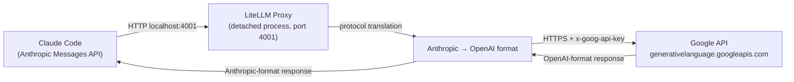
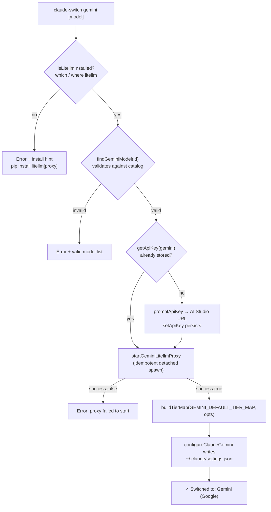
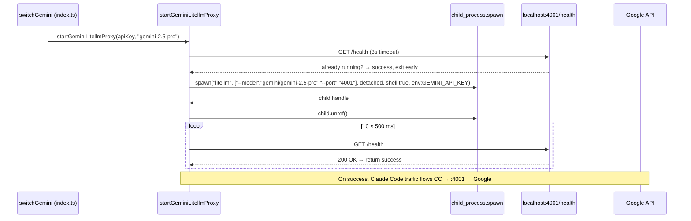

This page explains how the switcher integrates Google Gemini into Claude Code and OpenCode. Because Gemini exposes only an OpenAI Chat Completions–style API while Claude Code speaks the **Anthropic Messages API**, the provider module solves the protocol mismatch the same way the Ollama provider does: by launching a **LiteLLM proxy as a detached background process** that performs live protocol translation. The distinguishing characteristic of this provider is its dedicated **port 4001** — deliberately separated from Ollama's port 4000 so both proxies can run concurrently — and its injection of the `GEMINI_API_KEY` environment variable into the proxy process. The module lives in `src/providers/gemini.ts`, with switch-flow orchestration in `src/index.ts` and settings writers in both clients.

## The Protocol Gap: Why Translation Is Required

The header comment of the provider module states the design constraint precisely: *Gemini only speaks OpenAI format, so LiteLLM translates Anthropic Messages API requests into OpenAI Chat Completions format*. Claude Code always targets whatever endpoint `ANTHROPIC_BASE_URL` points to and formats its traffic as Anthropic Messages — it cannot natively talk to Google's `generativelanguage.googleapis.com`. Rather than reimplementing translation logic in TypeScript, the switcher delegates it to LiteLLM, a Python-based gateway. The proxy listens on localhost, accepts Anthropic-format requests from Claude Code, converts them to Gemini-compatible calls upstream, and translates responses back. The prerequisites recorded in the module are therefore external to this codebase: a LiteLLM installation (`pip install 'litellm[proxy]'`) and a Google API key from AI Studio. This is the same architectural decision documented at the repo level, where the ARCHITECTURE.md notes that Ollama and Gemini require a LiteLLM proxy for exactly this reason.

The proxy is spawned with the `gemini/` model prefix (`litellm --model gemini/gemini-2.5-pro --port 4001`), which tells LiteLLM to route upstream to Google's API; compare this with the Ollama sibling provider, which spawns with an `ollama/` prefix targeting the local daemon on port 11434.

Sources: [gemini.ts](src/providers/gemini.ts#L1-L12), [ARCHITECTURE.md](ARCHITECTURE.md#L134-L146)

## Provider Constants and the Model Catalog

The provider module hardcodes two constants that anchor every other component: `GEMINI_ENDPOINT = "http://localhost:4001"` and `GEMINI_LITELLM_PORT = 4001`. The registry in `src/models.ts` mirrors this endpoint under the provider metadata entry (`id: "gemini"`, `name: "Gemini (Google)"`), so the catalog, the proxy spawner, and the client writers all agree on the same port without sharing a single constant — port 4001 acts as the implicit contract across the codebase. The `getGeminiConfig()` factory returns a `GeminiConfig` object combining the API key, a model (defaulting to `gemini-2.5-pro`), and the endpoint.

The catalog ships exactly three models, all with a 1,000,000-token context window:

| Model ID | Display Name | Context Window | Capabilities | Tier Role |
|---|---|---|---|---|
| `gemini-2.5-pro` | Gemini 2.5 Pro | 1,000,000 | Text Generation, Deep Thinking, Code, Vision | opus |
| `gemini-2.5-flash` | Gemini 2.5 Flash | 1,000,000 | Text Generation, Fast Responses, Code | sonnet |
| `gemini-2.5-flash-lite` | Gemini 2.5 Flash Lite | 1,000,000 | Text Generation, Cost-optimized | haiku |

The tier-role column comes from `GEMINI_DEFAULT_TIER_MAP`, which maps Claude Code's three-tier naming onto the Gemini lineup: opus → Pro, sonnet → Flash, haiku → Flash Lite. When the switch completes, these mappings become the `ANTHROPIC_DEFAULT_OPUS_MODEL`, `ANTHROPIC_DEFAULT_SONNET_MODEL`, and `ANTHROPIC_DEFAULT_HAIKU_MODEL` environment variables in `~/.claude/settings.json` (the mechanics of the tier system are covered in [The Model Tier Alias System](12-the-model-tier-alias-system-opus-sonnet-and-haiku-environment-variables) and [Custom Tier Overrides](13-custom-tier-overrides-with-opus-sonnet-and-haiku-flags)). The `findModel()` helper enforces that any user-supplied model ID exists in this catalog before a switch proceeds.

Sources: [gemini.ts](src/providers/gemini.ts#L14-L43), [models.ts](src/models.ts#L252-L275), [models.ts](src/models.ts#L364-L368), [models.ts](src/models.ts#L44-L49)

## The Switch Flow: From Pre-flight to Settings Write

Executing `claude-switch gemini [model]` (or the explicit `claude-switch claude gemini` form, which registers the identical handler) dispatches to the `switchGemini` function, which runs a strictly ordered five-phase sequence. Each failure path calls `process.exit(1)` immediately, so a switch either fully completes or leaves configuration untouched at the point of failure.

The pre-flight check deserves attention because it gates everything else: `isLitellmInstalled()` runs `which litellm` (or `where litellm` on Windows) via a promisified `exec` and treats a non-zero exit as "not installed" — the error message helpfully includes the pip install command. Model validation follows the same fail-fast pattern, printing the full list of valid Gemini model IDs when the user typos one. The key-retrieval phase shows the provider's persistence integration: it first checks `~/.claude-ai-switcher/config.json` via `getApiKey("gemini")`, and only if empty does it interactively prompt with the AI Studio key URL before saving with `setApiKey` (key storage is detailed in [API Key Storage](20-api-key-storage-in-claude-ai-switcher-config-json)). The final console output confirms the endpoint as `http://localhost:4001 (LiteLLM proxy)` alongside model name, context window, and capabilities.

Sources: [index.ts](src/index.ts#L332-L381), [gemini.ts](src/providers/gemini.ts#L48-L61), [index.ts](src/index.ts#L497-L501)

## Proxy Lifecycle: Detached Spawn and Health Polling

`startGeminiLitellmProxy(apiKey, model, port)` implements the process-management core. It is **idempotent**: the first action is a health probe against `http://localhost:4001/health` (with a 3-second abort timeout), and if the proxy is already alive the function returns success without spawning anything. Otherwise it spawns `litellm --model gemini/<model> --port 4001` as a detached child with three critical options: `detached: true` (the child gets its own process group), `stdio: "ignore"` (no pipes held open), and `child.unref()` (the parent may exit while the child lives). The net effect is a proxy that survives the CLI process — you close the terminal, the proxy keeps serving Claude Code sessions. After spawning, the function polls `/health` ten times at 500 ms intervals; if none succeed within roughly 5 seconds, it returns a structured `{ success: false, error: "LiteLLM proxy did not start within 5 seconds" }` result rather than throwing.

Two implementation details distinguish this from the Ollama equivalent, and both stem from the fact that Gemini requires authenticated upstream access while a local Ollama daemon does not. First, the spawn passes `env: { ...process.env, GEMINI_API_KEY: apiKey }` so LiteLLM can authenticate to Google — LiteLLM's `gemini/` provider reads credentials from that conventional variable name. Second, the Gemini spawn uses `shell: true` where Ollama uses `shell: false`; on Windows this lets the command resolve through the shell, a pragmatic choice for cross-platform spawning of the `litellm` executable. The comparison table summarizes the divergence:

| Dimension | Gemini proxy | Ollama proxy |
|---|---|---|
| Port / endpoint | 4001 / `http://localhost:4001` | 4000 / `http://localhost:4000` |
| LiteLLM model prefix | `gemini/<model>` | `ollama/<model>` |
| Upstream target | Google API (remote, authenticated) | Ollama daemon on 11434 (local) |
| Env injection | `GEMINI_API_KEY` required | none required |
| `shell` option | `true` | `false` |
| Spawn/process handling | `detached: true`, `stdio: "ignore"`, `unref()` | identical |
| Readiness check | `/health`, 10 × 500 ms | `/health`, 10 × 500 ms |

Sources: [gemini.ts](src/providers/gemini.ts#L84-L136), [ollama.ts](src/providers/ollama.ts#L116-L146), [gemini.ts](src/providers/gemini.ts#L14-L26)

## What Gets Written: Claude Code and OpenCode Configurations

On the Claude Code side, `configureGemini(apiKey, model, tierMap)` in `src/clients/claude-code.ts` performs the final wire-up. It first calls `ensureOnboardingComplete()` (so Claude Code won't show its first-run flow), then writes three environment variables into `~/.claude/settings.json` and deletes two others. The deletions matter: `CLAUDE_CODE_SUBAGENT_MODEL` and `ENABLE_TOOL_SEARCH` are Muse-specific settings (see [Direct Anthropic-Compatible Providers](16-direct-anthropic-compatible-providers-anthropic-alibaba-openrouter-and-muse)), and removing them prevents stale Muse state from leaking into a Gemini session — an instance of the general env-hygiene pattern described in [Safety Features](22-safety-features-timestamped-backups-env-var-cleanup-and-local-only-storage).

| Variable | Value written | Purpose |
|---|---|---|
| `ANTHROPIC_BASE_URL` | `http://localhost:4001` | Route all Claude Code traffic to the proxy |
| `ANTHROPIC_AUTH_TOKEN` | the Gemini API key | LiteLLM treats the incoming token as an auth credential |
| `ANTHROPIC_MODEL` | e.g. `gemini-2.5-pro` | Default model for the session |
| `CLAUDE_CODE_SUBAGENT_MODEL` | *(deleted)* | Clear Muse leftovers |
| `ENABLE_TOOL_SEARCH` | *(deleted)* | Clear Muse leftovers |
| `ANTHROPIC_DEFAULT_{OPUS,SONNET,HAIKU}_MODEL` | tier map values | Opus/Sonnet/Haiku aliases (via `applyTierMap`) |

The OpenCode path is different in shape because OpenCode natively speaks OpenAI-format providers: no runtime translation concept is needed in its config, so `configureGemini(apiKey)` in `src/clients/opencode.ts` registers the proxy as a provider entry using the `@ai-sdk/openai` npm package with `baseURL: "http://localhost:4001/v1"`. It enumerates all three models with explicit `modalities` (Pro and Flash accept text+image input; Flash Lite is text-only) and `limit` blocks pinning context to 1,000,000 and output to 65,536 tokens. This block is added via `claude-switch opencode add gemini` and removed via `claude-switch opencode remove gemini`, which deletes the `settings.provider["gemini"]` key.

Sources: [claude-code.ts](src/clients/claude-code.ts#L248-L262), [opencode.ts](src/clients/opencode.ts#L496-L547), [opencode.ts](src/clients/opencode.ts#L252-L254), [index.ts](src/index.ts#L705-L727)

## Key Verification: Validating Against Google, Not the Proxy

Verification implements a deliberate decoupling: **key validity is checked directly against Google**, while proxy status is reported as informational only. The lightweight health check used during switching, `isGeminiKeyValid()`, issues a `GET https://generativelanguage.googleapis.com/v1beta/models` with the key in the `x-goog-api-key` header under a 5-second abort timeout and returns whether `resp.ok` — choosing the cheap models-list endpoint rather than a paid completion call (this pattern is shared across providers, see [API Key Verification](21-api-key-verification-lightweight-health-checks-and-key-masking)). The richer `verifyGemini()` in `src/verify.ts`, dispatched whenever the `verify` command finds a stored `gemini` key, goes further: after confirming the key, it separately probes `http://localhost:4001/health` and appends `, proxy running` or `, proxy not running` to the result message. HTTP status 400/401/403 map to an `invalid` "Authentication failed" result, other statuses to `error`, and network failures to "Connection failed". The design consequence is useful in practice: `claude-switch verify` can tell you your key is fine while simultaneously reminding you the proxy is down — the two failure modes are never conflated.

Sources: [gemini.ts](src/providers/gemini.ts#L66-L79), [verify.ts](src/verify.ts#L283-L309), [verify.ts](src/verify.ts#L191-L194)

## Provider Detection: Port 4001 as Identity

Because the endpoint is unique to Gemini, it doubles as the detection signal. `getCurrentProvider()` in the Claude Code client checks `settings.env.ANTHROPIC_BASE_URL` for the substring `"localhost:4001"` and, on a match, reports `provider: "gemini"` along with the configured model and endpoint. This port-substring heuristic sits alongside the parallel check for `localhost:4000` → Ollama and `api.meta.ai` → Muse, and it only works because the codebase reserves one port per proxy provider — a collision between Gemini and Ollama endpoints would make them indistinguishable (the full detection cascade is covered in [Provider Detection Heuristics](10-provider-detection-heuristics-in-getcurrentprovider)). On the OpenCode side, detection is simpler still: the presence of the `provider["gemini"]` key in `opencode.json` identifies the provider.

Sources: [claude-code.ts](src/clients/claude-code.ts#L335-L343), [opencode.ts](src/clients/opencode.ts#L652-L655)

## Command Reference

| Command | Effect |
|---|---|
| `claude-switch gemini` | Switch Claude Code to Gemini 2.5 Pro; starts proxy if not running |
| `claude-switch gemini gemini-2.5-flash` | Switch with a specific catalog model |
| `claude-switch claude gemini [model]` | Explicit `claude` subcommand form, same handler |
| `claude-switch opencode add gemini` | Register the Gemini provider block in `opencode.json` |
| `claude-switch opencode remove gemini` | Remove the Gemini block from `opencode.json` |

Note the OpenCode `add` command has a slightly different key path: it checks `getApiKey("gemini")`, prompts with the same AI Studio URL if missing, and persists the key before calling `configureGemini(apiKey)` — but unlike the Claude Code switch, it does **not** start the proxy, since OpenCode only needs the static configuration entry.

Sources: [index.ts](src/index.ts#L595-L599), [index.ts](src/index.ts#L705-L727), [index.ts](src/index.ts#L855-L866)

## Related Reading

The Gemini provider is one of two proxy-based providers; the sibling implementation with its own lifecycle nuances (including Ollama daemon pre-checks that Gemini does not need) is covered in [Ollama Provider: Local Models with Detached LiteLLM Proxy Lifecycle on Port 4000](17-ollama-provider-local-models-with-detached-litellm-proxy-lifecycle-on-port-4000). For the general trade-off between direct Anthropic-compatible endpoints and proxy translation, see [Provider Connectivity Patterns](8-provider-connectivity-patterns-direct-api-vs-litellm-proxy-vs-coding-helper-mcp). The end-to-end switch sequence that this page zooms into is documented holistically in [The Provider Switch Flow](9-the-provider-switch-flow-key-validation-tier-maps-proxy-startup-and-settings-writes).