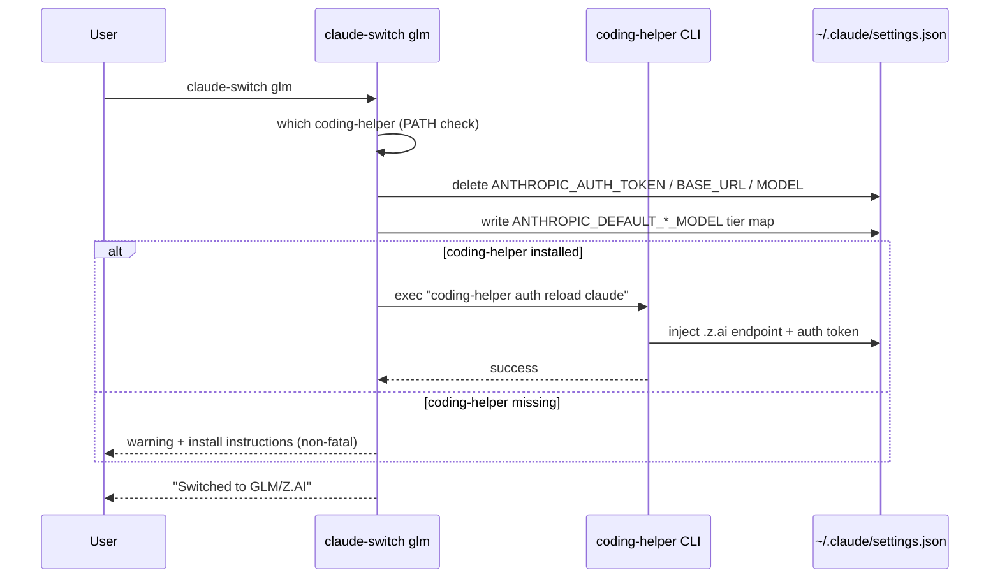
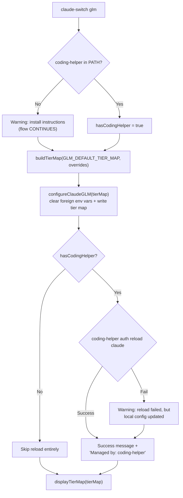

GLM is the architectural outlier among the switcher's seven providers. Every other provider either talks to a remote API with a key the switcher itself stores (Anthropic, Alibaba, OpenRouter, Muse) or runs a local translation proxy (Ollama on port 4000, Gemini on port 4001). GLM does neither: the switcher **delicates authentication and endpoint management entirely to an external tool** — Z.AI's official `@z_ai/coding-helper` CLI — and limits its own responsibility to writing model tier aliases into Claude Code's settings. This page explains that division of labor, the degraded-mode switch flow that tolerates a missing `coding-helper`, the three distinct detection signatures in `getCurrentProvider()`, and the credential-reuse trick that powers the OpenCode integration.

## The Delegation Model: Who Owns What

The core design decision is a **clean split of responsibilities along the trust boundary**. The switcher never sees or stores a Z.AI API key — there is no `getApiKey("glm")` call anywhere in the switch flow, and GLM has no entry in the interactive setup wizard's key prompts. Instead, `coding-helper` (installed globally via `npm install -g @z_ai/coding-helper` and authenticated once with `coding-helper auth`) is trusted to inject the correct credentials into `~/.claude/settings.json` when invoked with `coding-helper auth reload claude`.

What each side controls:

| Responsibility | Owner | Mechanism |
|---|---|---|
| Model tier routing (opus/sonnet/haiku aliases) | claude-ai-switcher | `ANTHROPIC_DEFAULT_*_MODEL` env vars in settings |
| Clearing prior provider's env vars | claude-ai-switcher | Deletes `ANTHROPIC_AUTH_TOKEN`, `ANTHROPIC_BASE_URL`, etc. |
| Z.AI endpoint + auth token | coding-helper | `coding-helper auth reload claude` writes `.z.ai` base URL |
| MCP server registration (`glm-coding-plan`) | coding-helper | Writes `mcpServers["glm-coding-plan"]` entry |
| Onboarding flag (`hasCompletedOnboarding`) | claude-ai-switcher | `ensureOnboardingComplete()` in `~/.claude.json` |

Sources: [glm.ts](src/providers/glm.ts#L1-L6), [index.ts](src/index.ts#L204-L230), [claude-code.ts](src/clients/claude-code.ts#L188-L204)

The interaction between the two tools during a switch looks like this:

Note the ordering: the switcher writes its tier map **first**, then hands control to `coding-helper` for credentials. If `coding-helper` fails, the switch is reported as partial but not rolled back — a deliberate availability-over-atomicity tradeoff examined in the next section.

Sources: [index.ts](src/index.ts#L204-L230), [ARCHITECTURE.md](ARCHITECTURE.md#L51)

## Module Anatomy: src/providers/glm.ts

At 61 lines, `glm.ts` is the thinnest provider module in the repository — a direct consequence of delegation. It contains no HTTP calls, no key validation, and no proxy lifecycle management. Compare: `ollama.ts` must manage LiteLLM proxy startup on port 4000, `gemini.ts` validates Google API keys, but `glm.ts` only shells out to another CLI.

| Export | Purpose | Failure Mode |
|---|---|---|
| `isCodingHelperInstalled()` | Runs `which coding-helper` (or `where` on win32) to detect PATH presence | Returns `false` — never throws |
| `reloadGLMConfig()` | Executes `coding-helper auth reload claude` to push Z.AI credentials into Claude settings | Returns `{ success: false, error }` |
| `getGLMConfig()` | Reads `ZHIPUAI_MODEL`/`ZAI_MODEL` env vars, defaults to `glm-5.3[1m]` | — |

Two implementation details deserve attention. First, both exec-based functions use **dynamic imports** (`await import("child_process")`) rather than top-level imports — keeping module load cheap when GLM isn't in play. Second, `getGLMConfig()` and the `GLM_PROVIDER` re-export are currently **unconsumed by any other module in `src/`** — the live switch path derives models from `GLM_DEFAULT_TIER_MAP` in `models.ts` instead, making these vestigial surface area retained presumably for external/programmatic consumers.

Sources: [glm.ts](src/providers/glm.ts#L8-L24), [glm.ts](src/providers/glm.ts#L29-L41), [glm.ts](src/providers/glm.ts#L46-L60)

## The Switch Flow: Degraded-Mode Operation

The orchestration lives in `switchGLM()`, invoked identically by two command registrations: the top-level alias `claude-switch glm` and the namespaced `claude-switch claude glm`. Both go through `addTierOptions()`, so the `--opus`, `--sonnet`, and `--haiku` override flags are available (covered in depth on [Custom Tier Overrides with --opus, --sonnet, and --haiku Flags](13-custom-tier-overrides-with-opus-sonnet-and-haiku-flags)).

The defining characteristic is that **no failure path exits non-zero before the local settings write completes**. A missing `coding-helper` produces a warning with install instructions (`npm install -g @z_ai/coding-helper`, then `coding-helper auth`) and then proceeds anyway; a failed reload produces the message "coding-helper reload failed, but local config updated". The rationale: tier aliases are useful independent of credentials — they route requests once credentials arrive from any source, and a partially-switched state is recoverable by re-running the command after installing coding-helper. This contrasts with, say, the OpenRouter flow where a missing API key is a hard stop with an interactive prompt.

Sources: [index.ts](src/index.ts#L204-L230), [index.ts](src/index.ts#L456-L465), [index.ts](src/index.ts#L554-L563), [glm.ts](src/providers/glm.ts#L46-L60)

## What configureGLM Writes — and Deliberately Deletes

The Claude Code client handler for GLM is unusual in that its **primary action is deletion**. Because `coding-helper` owns the credential env vars, `configureGLM()` cannot set `ANTHROPIC_AUTH_TOKEN` or `ANTHROPIC_BASE_URL` — but it *must* clear them, since they may hold a previous provider's credentials (an Alibaba token pointing at `coding-intl.dashscope.aliyuncs.com`, or a Muse token pointing at `api.meta.ai`). Leaving stale credentials behind would let coding-helper's reload and the old token race for precedence.

The before/after state of `settings.env`:

| Env Var | Before (e.g. after Alibaba switch) | After `configureGLM()` | After `coding-helper auth reload` |
|---|---|---|---|
| `ANTHROPIC_AUTH_TOKEN` | Alibaba API key | *(deleted)* | Z.AI credential (written by coding-helper) |
| `ANTHROPIC_BASE_URL` | `https://coding-intl.dashscope...` | *(deleted)* | `.z.ai` endpoint (written by coding-helper) |
| `ANTHROPIC_MODEL` | `qwen3.7-plus` | *(deleted)* | *(set by coding-helper, if at all)* |
| `CLAUDE_CODE_SUBAGENT_MODEL` | *(possibly set by Muse)* | *(deleted)* | — |
| `ENABLE_TOOL_SEARCH` | `true` (Muse) | *(deleted)* | — |
| `ANTHROPIC_DEFAULT_OPUS_MODEL` | *(cleared or other provider)* | `glm-5.3[1m]` | `glm-5.3[1m]` |
| `ANTHROPIC_DEFAULT_SONNET_MODEL` | — | `glm-5-turbo` | `glm-5-turbo` |
| `ANTHROPIC_DEFAULT_HAIKU_MODEL` | — | `glm-5v-turbo` | `glm-5v-turbo` |

The tier aliases are written by the shared `applyTierMap()` helper, which simply maps the three `ModelTierMap` fields onto the three `ANTHROPIC_DEFAULT_*_MODEL` keys — the same mechanism every provider uses, detailed on [The Model Tier Alias System: Opus, Sonnet, and Haiku Environment Variables](12-the-model-tier-alias-system-opus-sonnet-and-haiku-environment-variables). Like all client handlers, GLM's begins with `ensureOnboardingComplete()`, forcing `hasCompletedOnboarding = true` in `~/.claude.json` to suppress Anthropic's first-run login screen.

Sources: [claude-code.ts](src/clients/claude-code.ts#L184-L204), [claude-code.ts](src/clients/claude-code.ts#L41-L47), [claude-code.ts](src/clients/claude-code.ts#L130-L136)

## The Default Tier Map and Model Catalog

The default tier assignments encode Z.AI's own guidance, with a source comment pointing at `https://docs.z.ai/devpack/latest-model`: the 1M-context flagship `glm-5.3[1m]` leads the opus tier, while the two fast turbo models fill sonnet and haiku. Notably, the **haiku slot holds a multimodal model** (`glm-5v-turbo`) — the only default tier-map entry in the entire switcher that assigns a vision-capable model, meaning cheap-tier subagent calls can process images under GLM.

| Tier | Default Model | Rationale (from code comments) |
|---|---|---|
| opus | `glm-5.3[1m]` | Flagship, "recommended by Z.AI for the opus tier", 1M context |
| sonnet | `glm-5-turbo` | Fast turbo with "strong reasoning with low latency" |
| haiku | `glm-5v-turbo` | "First multimodal coding foundation model" — image/video input |

The backing catalog in `models.ts` registers five GLM models under the provider registry entry `{ id: "glm", name: "GLM/Z.AI" }`, powering `claude-switch models glm` output:

| Model ID | Context Window | Capabilities |
|---|---|---|
| `glm-5.3[1m]` | 1,000,000 | Text Generation, Deep Thinking |
| `glm-5v-turbo` | 200,000 | Text Generation, Deep Thinking, Visual Understanding, Visual Programming |
| `glm-5-turbo` | 200,000 | Text Generation, Deep Thinking, Fast Responses |
| `glm-4.7` | 256,000 | Text Generation, Deep Thinking |
| `glm-4.7-flash` | 256,000 | Text Generation, Fast Inference |

Sources: [models.ts](src/models.ts#L22-L27), [models.ts](src/models.ts#L163-L200), [models.ts](src/models.ts#L347-L351)

## Provider Detection: Three GLM Signatures in getCurrentProvider()

Because credentials arrive from an external tool that may write different shapes of configuration depending on its version, GLM has the **richest detection logic** of any provider — three ordered signatures, checked only after Alibaba, OpenRouter, Ollama, Gemini, and Muse endpoint checks have fallen through:

| Order | Signature | Condition | Inference |
|---|---|---|---|
| 1 | MCP registration | `settings.mcpServers["glm-coding-plan"]` exists | coding-helper registered itself as an MCP server; model read from the MCP entry |
| 2 | Endpoint match | `ANTHROPIC_BASE_URL` contains `.z.ai` | coding-helper's `auth reload claude` wrote the endpoint; model from `ANTHROPIC_MODEL` |
| 3 | Tier-map fallback | No `ANTHROPIC_BASE_URL` **and** `tierMap.opus` set | Only the switcher's tier aliases exist — the degraded-mode state |

Signature 3 is the subtle one: a settings file with tier aliases but no base URL would be ambiguous for most providers, but the ordering guarantees that all direct-API providers were already excluded by their endpoint checks — and native Anthropic never sets a tier map (in fact `configureAnthropic()` explicitly calls `clearTierMap()`). This makes "tier map present, no endpoint" a valid GLM fingerprint, and it's precisely how `claude-switch status` reports GLM after a degraded-mode switch without coding-helper installed.

Sources: [claude-code.ts](src/clients/claude-code.ts#L355-L379), [claude-code.ts](src/clients/claude-code.ts#L296-L382), [claude-code.ts](src/clients/claude-code.ts#L166-L182)

## OpenCode Integration: Credential Reuse from Claude Settings

The OpenCode path for GLM (`claude-switch opencode add glm`) demonstrates an elegant consequence of the delegation model: since coding-helper has already materialized credentials into Claude Code's settings, the switcher can **propagate them into OpenCode without ever handling the raw key**. The command reads `ANTHROPIC_BASE_URL` and `ANTHROPIC_AUTH_TOKEN` directly from `~/.claude/settings.json` — but only after a guard check that the base URL actually contains `.z.ai`; otherwise it aborts with "Run 'claude-switch glm' first to set up coding-helper auth", enforcing the required sequencing.

The written `opencode.json` provider block uses `npm: "@ai-sdk/anthropic"` — Z.AI's endpoint is Anthropic-protocol-compatible, so OpenCode's existing Anthropic SDK adapter works unchanged. The five models are registered with full metadata that goes beyond the switcher's catalog: explicit `modalities` (only `glm-5v-turbo` accepts image input), `limit.context`/`limit.output` values, and `thinking` options with `budgetTokens: 8192` enabled on four of the five models (all except `glm-4.7-flash`).

| OpenCode Model Key | Context / Output Limits | Input Modalities | Thinking Enabled |
|---|---|---|---|
| `glm-5.3[1m]` | 1,000,000 / 131,072 | text | ✅ 8192 budget |
| `glm-5v-turbo` | 200,000 / 16,384 | text, **image** | ✅ 8192 budget |
| `glm-5-turbo` | 200,000 / 16,384 | text | ✅ 8192 budget |
| `glm-4.7` | 256,000 / 16,384 | text | ✅ 8192 budget |
| `glm-4.7-flash` | 256,000 / 16,384 | text | ❌ |

Removal is symmetrical: `claude-switch opencode remove glm` deletes the `provider.glm` key (and prunes an empty `provider` object), while on the Claude side, switching back to Anthropic via `configureAnthropic()` deletes the `mcpServers["glm-coding-plan"]` entry along with all credential env vars.

Sources: [index.ts](src/index.ts#L732-L770), [opencode.ts](src/clients/opencode.ts#L276-L376), [opencode.ts](src/clients/opencode.ts#L257-L265), [claude-code.ts](src/clients/claude-code.ts#L166-L169), [index.ts](src/index.ts#L871-L877)

## GLM in the Connectivity-Pattern Landscape

Placing GLM against its siblings clarifies why its implementation is so small. The full three-pattern taxonomy is developed on [Provider Connectivity Patterns: Direct API vs LiteLLM Proxy vs coding-helper MCP](8-provider-connectivity-patterns-direct-api-vs-litellm-proxy-vs-coding-helper-mcp); the essentials as they bear on GLM:

| Dimension | Direct API (Alibaba, OpenRouter, Muse) | LiteLLM Proxy (Ollama:4000, Gemini:4001) | coding-helper (GLM) |
|---|---|---|---|
| Credential owner | Switcher (`~/.claude-ai-switcher/config.json`) | Switcher or stub (`"ollama"`) | **External tool** |
| Key validation | Health-check HTTP call | Ollama daemon check / Gemini key check | None — PATH presence only |
| Local process managed | None | Detached proxy process | None (external CLI) |
| Settings written by switcher | Token + URL + model | Token + `localhost:port` + model | **Tier map only** |
| Hard failure on missing dependency | N/A | Yes (proxy required) | **No — degraded mode** |

The pattern's tradeoff: GLM gains zero key-management surface (nothing to store in the switcher's own config store, per [API Key Storage in ~/.claude-ai-switcher/config.json](20-api-key-storage-in-claude-ai-switcher-config-json)) at the cost of an external dependency whose behavior the switcher can only probe, not control. The three-signature detection is the direct mitigation of that uncertainty.

Sources: [glm.ts](src/providers/glm.ts#L1-L41), [ARCHITECTURE.md](ARCHITECTURE.md#L37-L51), [index.ts](src/index.ts#L204-L230)

## Where to Go Next

If the delegated-authentication pattern interests you, continue with [Provider Detection Heuristics in getCurrentProvider()](10-provider-detection-heuristics-in-getcurrentprovider) for the full ordering across all seven providers, and [The Provider Switch Flow: Key Validation, Tier Maps, Proxy Startup, and Settings Writes](9-the-provider-switch-flow-key-validation-tier-maps-proxy-startup-and-settings-writes) to see how GLM's no-validation path contrasts with the others. For the sibling implementations, [Direct Anthropic-Compatible Providers: Anthropic, Alibaba, OpenRouter, and Muse](16-direct-anthropic-compatible-providers-anthropic-alibaba-openrouter-and-muse) and [Ollama Provider: Local Models with Detached LiteLLM Proxy Lifecycle on Port 4000](17-ollama-provider-local-models-with-detached-litellm-proxy-lifecycle-on-port-4000) cover the two alternative patterns. If you're building your own provider integration, [Step-by-Step Guide: Adding a New AI Provider to the Switcher](29-step-by-step-guide-adding-a-new-ai-provider-to-the-switcher) generalizes the structure you've just seen.