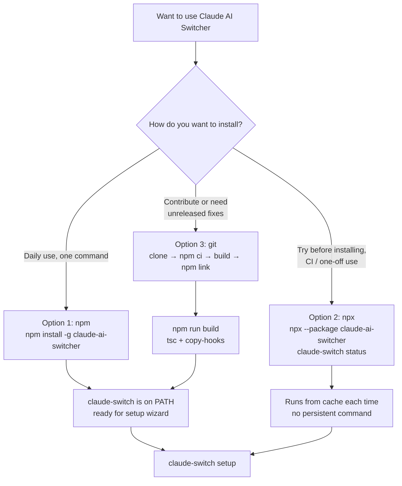
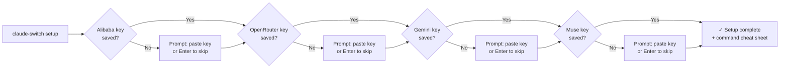

This page gets you from zero to a working provider switch in under five minutes. You will install the `claude-ai-switcher` package, run the interactive setup wizard (or skip it), switch Claude Code to your first alternative provider, and verify the result with `status`. Everything a first-time user touches is covered here; deeper topics (hooks, tier overrides, OpenCode management, provider internals) live on later pages linked at the end.

## Prerequisites

Before installing, confirm you meet the baseline requirements. The tool is a Node.js CLI, so Node is the only hard dependency; Claude Code itself is the target being configured, and OpenCode support is entirely optional.

| Requirement | Why it's needed | How to check |
|---|---|---|
| **Node.js ≥ 18.0.0** | Declared in the package `engines` field; the CLI uses modern Node APIs | `node --version` |
| **Claude Code installed** | The switcher edits `~/.claude/settings.json` used by Claude Code | `claude --version` |
| **One provider API key** | At least one key (Alibaba, OpenRouter, Gemini, Muse, or Anthropic env var) to switch to | Provider dashboard |
| **OpenCode (optional)** | Only for `opencode add/remove` helper commands | `opencode --version` |

Sources: [package.json](package.json#L55-L57)

## Choose an Installation Path

The package ships on npm under the name `claude-ai-switcher`, but the command it installs is `claude-switch` — this name split matters for the npx path below. The `bin` mapping in `package.json` wires the `claude-switch` command to the compiled `dist/index.js` entry, and the CLI reads its version string from `package.json` at runtime so `claude-switch --version` never drifts from the released version.
Sources: [package.json](package.json#L5-L8) · [src/index.ts](src/index.ts#L92-L101)

The following flowchart shows the decision logic for the three supported installation paths:



### Option 1 — npm global install (recommended)

The easiest path for everyday use: one command puts `claude-switch` on your PATH permanently.

```bash
npm install -g claude-ai-switcher
claude-switch --version   # verify installation
```

Updating and removing follow standard global-package syntax — `npm update -g claude-ai-switcher` and `npm uninstall -g claude-ai-switcher`.
Sources: [README.md](README.md#L25-L41)

### Option 2 — npx (zero install)

`npx` runs the CLI without installing anything, which is ideal for trying the tool or using it in CI. Because the **package name (`claude-ai-switcher`) differs from the binary name (`claude-switch`)**, you must use the `--package` form; a plain `npx claude-ai-switcher` will not find the binary.

```bash
npx --package claude-ai-switcher claude-switch --help
npx --package claude-ai-switcher claude-switch status
# pin a specific version:
npx --package claude-ai-switcher@1.3.0 claude-switch status
```

The trade-off: no downloads-to-install step, but the package is fetched (and cached) on each run, and there is no persistent `claude-switch` command in your shell.
Sources: [README.md](README.md#L43-L56)

### Option 3 — git clone (development / bleeding edge)

For contributors, or to run fixes that haven't shipped to npm yet, clone the repository and build locally. The build script runs the TypeScript compiler followed by `copy-hooks`, which stages the JavaScript hook assets alongside the compiled output; `npm link` then symlinks the `claude-switch` binary globally.

```bash
git clone https://github.com/tupacalypse187/claude-ai-switcher.git
cd claude-ai-switcher
npm ci          # reproducible install from package-lock.json (does NOT modify it)
npm run build   # tsc + copy-hooks
npm link        # installs `claude-switch` globally via symlink
claude-switch --version
```

To stay current with `main`, repeat `git pull`, `npm ci`, and `npm run build` — no re-link is needed unless the `bin` definition changes. Note the deliberate use of `npm ci` rather than `npm install`: `npm ci` installs exactly what the lockfile pins and never rewrites `package-lock.json`, which is covered in depth on the developer workflow page.
Sources: [README.md](README.md#L58-L79) · [package.json](package.json#L19-L25)

### Install method comparison

| | **npm global** | **npx** | **git + link** |
|---|---|---|---|
| Setup commands | 1 | 0 | 4 (`clone`, `ci`, `build`, `link`) |
| Persistent `claude-switch` command | ✅ Yes | ❌ No (per-run) | ✅ Yes (symlink) |
| Version control | Pinned to npm release | Latest, or pinned with `@version` | Tracks your local `main` |
| Best for | Daily use | Trying it out, CI one-offs | Contributing, unreleased fixes |
| Download cost | Once | Each run (cached) | Once + on every `git pull` rebuild |

## Step 1: Run the Setup Wizard

On first use, `claude-switch setup` launches an interactive wizard. It walks you through the four key-based providers — **Alibaba, OpenRouter, Gemini, and Muse** — showing the exact dashboard URL where each key is obtained, then prompting you to paste the key. Every prompt is skippable with Enter, so you can save just one key now and add others later; keys you already saved are detected via `hasApiKey` and skipped entirely. When the wizard finishes it prints the full command cheat sheet so you immediately know what to run next.

```bash
claude-switch setup
```

The wizard's expected flow, step by step:



Each key you enter is persisted immediately to the local config store — a JSON file at `~/.claude-ai-switcher/config.json` managed by the config layer. Keys never leave your machine: the config module reads and writes this single file, mapping provider names like `alibaba` and `openrouter` to their corresponding JSON fields.
Sources: [src/index.ts](src/index.ts#L1144-L1219) · [src/config.ts](src/config.ts#L11-L12) · [src/config.ts](src/config.ts#L53-L92)

**Skipping the wizard is fine.** If you run a provider switch command without a saved key, the CLI detects the missing key interactively at that moment: it prints a warning with the provider's key dashboard URL, prompts you to paste the key, saves it, and continues the switch in the same command. An empty answer aborts with "API Key is required."
Sources: [src/index.ts](src/index.ts#L107-L125)

## Step 2: Switch Your First Provider

With a key saved, switching is a single top-level command — one per provider. This worked example uses Alibaba Coding Plan; the same pattern applies to `openrouter`, `gemini`, `muse`, `ollama`, `glm`, and `anthropic`.

```bash
claude-switch alibaba                  # switch with the default model
claude-switch alibaba qwen3.6-plus     # switch with a specific model
```

Internally, the switch runs a fixed sequence: resolve the model (defaulting to `qwen3.7-plus` for Alibaba if none given), check for a saved API key and prompt if missing, validate the model ID against the built-in catalog — an invalid ID exits with the full list of valid models so you can correct it immediately — and finally write the Claude Code configuration. On success the CLI prints a summary card showing the model name, context window, endpoint, capabilities, and the three tier aliases (`opus`/`sonnet`/`haiku`) that Claude Code will resolve to for this provider.
Sources: [src/index.ts](src/index.ts#L165-L201) · [README.md](README.md#L100-L108)

### What actually changes on your disk

A switch never edits Claude Code settings in place. The client module first ensures `hasCompletedOnboarding: true` is set in `~/.claude.json` (preventing post-switch connection errors), then writes the provider's environment variables into `~/.claude/settings.json` — for Alibaba: `ANTHROPIC_AUTH_TOKEN`, `ANTHROPIC_BASE_URL` (pointing at the DashScope Anthropic-compatible endpoint), `ANTHROPIC_MODEL`, plus the three tier alias variables. Before overwriting, a timestamped copy `settings.json.backup.<timestamp>` is created, so the previous state is always recoverable.

| File | Before | After `claude-switch alibaba` |
|---|---|---|
| `~/.claude-ai-switcher/config.json` | Missing or no `alibabaApiKey` | Key stored locally (during setup or first switch) |
| `~/.claude/settings.json` | No provider env vars (or previous provider's) | `ANTHROPIC_AUTH_TOKEN`, `ANTHROPIC_BASE_URL`, `ANTHROPIC_MODEL`, tier aliases set |
| `~/.claude/settings.json.backup.*` | — | New timestamped backup of prior settings created |
| `~/.claude.json` | — | `hasCompletedOnboarding: true` ensured |

Sources: [src/clients/claude-code.ts](src/clients/claude-code.ts#L98-L134) · [src/clients/claude-code.ts](src/clients/claude-code.ts#L141-L155)

## Step 3: Verify with status

Run `claude-switch status` after switching. It prints two sections: the **current configuration** for Claude Code (provider, model, endpoint, and the active tier alias map) and the same for OpenCode if installed, followed by an **API key verification** block. Verification runs with a spinner while the CLI performs lightweight health checks against each provider, then reports per-provider status — ✓ valid, ✗ invalid, ○ no key configured, ⚠ network/service error — with keys displayed in masked form (only a prefix/suffix shown, never the full key). If you want the configuration view without the network verification, `claude-switch current` is the read-only variant.
Sources: [src/index.ts](src/index.ts#L910-L929) · [src/index.ts](src/index.ts#L955-L1024) · [src/index.ts](src/index.ts#L1032-L1079)

## Handy Commands for Your First Session

| Command | What it does | Notes |
|---|---|---|
| `claude-switch setup` | Interactive key-entry wizard | Skippable prompts; covered in Step 1 |
| `claude-switch <provider> [model]` | Switch Claude Code to a provider | `anthropic` switches back to default |
| `claude-switch status` | Config + API key verification | Network health checks included |
| `claude-switch current` | Config only, no network calls | Quick read of both clients |
| `claude-switch list` | All providers and their models | Endpoint and model counts |
| `claude-switch models <provider>` | Models for one provider | e.g. `models alibaba` |
| `claude-switch key <provider> [key]` | Show whether a key is set, or save one | Without an argument: check only |

Sources: [src/index.ts](src/index.ts#L1082-L1117) · [src/index.ts](src/index.ts#L1119-L1141)

## Troubleshooting

| Symptom | Cause | Fix |
|---|---|---|
| `command not found: claude-switch` after npm install | Global npm `bin` directory not on PATH | Check `npm bin -g` output is in PATH, or reopen the terminal |
| `npx claude-ai-switcher` finds no binary | Package name ≠ binary name | Use `npx --package claude-ai-switcher claude-switch ...` |
| `API Key is required` error | Empty answer at the key prompt | Re-run the switch; keys can also be pre-set with `claude-switch key <provider> <key>` |
| `Invalid model: <id>` with a valid-models list | Model ID not in the catalog | Copy one of the listed IDs, or browse with `claude-switch models <provider>` |
| `coding-helper not found` when switching to GLM | GLM requires a separate tool | `npm install -g @z_ai/coding-helper`, then `coding-helper auth` |
| Switch succeeded but Claude Code misbehaves | Stale session env | Restart Claude Code so it re-reads `~/.claude/settings.json` |
| Want to undo a switch | Any switch | Timestamped `settings.json.backup.*` files sit next to the settings file; or run `claude-switch anthropic` to restore defaults |

Sources: [README.md](README.md#L43-L56) · [src/index.ts](src/index.ts#L119-L122) · [src/index.ts](src/index.ts#L182-L186) · [src/index.ts](src/index.ts#L204-L212)

## Where to Go Next

You now have a working install and your first provider switch. The natural progression through the wiki:

1. **[Developer Environment Setup: npm ci, Build, and npm link Workflow](3-developer-environment-setup-npm-ci-build-and-npm-link-workflow)** — if you chose the git path and want the full local-development loop.
2. **[Everyday CLI Commands: Switching Providers, Status, List, and Models](4-everyday-cli-commands-switching-providers-status-list-and-models)** — the complete command reference for daily use.
3. **[Interactive Setup Wizard and API Key Entry](5-interactive-setup-wizard-and-api-key-entry)** — a deeper look at the wizard you just ran.
4. **[Installing Token Tracking and Visual Enhancement Hooks](6-installing-token-tracking-and-visual-enhancement-hooks)** — optional in-terminal usage bars and model cards (`claude-switch hooks install`).
5. **[The Provider Switch Flow: Key Validation, Tier Maps, Proxy Startup, and Settings Writes](9-the-provider-switch-flow-key-validation-tier-maps-proxy-startup-and-settings-writes)** — what happens inside the switch command you just used.

To return to the big picture at any point, see **[Overview: What Claude AI Switcher Does and Why It Matters](1-overview-what-claude-ai-switcher-does-and-why-it-matters)**.