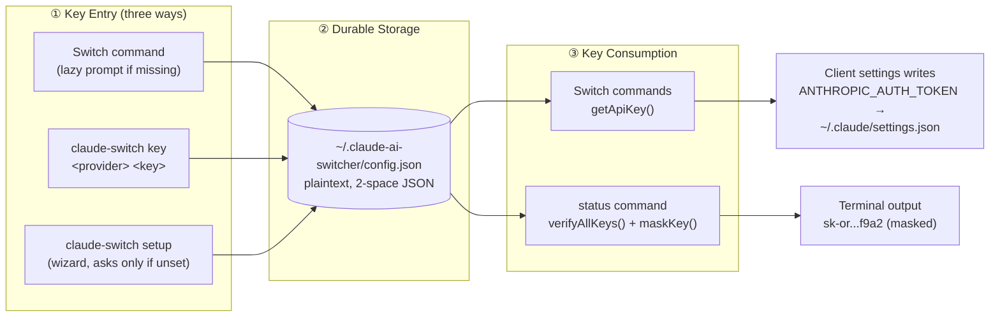
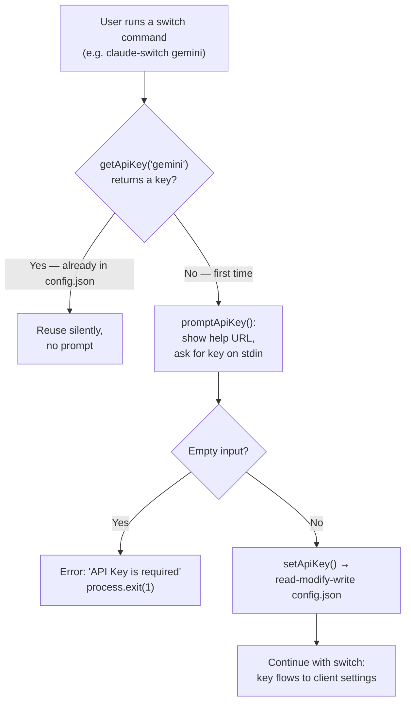

This page explains exactly where Claude AI Switcher keeps your API keys, how they get written to that file, who reads them back, and what the "secure local storage" claim in the README actually means in practice. For beginner developers, the key mental model is simple: **all API keys you enter live in one plain JSON file inside your home directory, managed by a single 108-line module**. By the end of this page you will know which providers store keys there, which ones deliberately do not, and how to inspect or edit the file yourself.

## The Storage Model: One JSON File in Your Home Directory

Claude AI Switcher never asks you to re-enter a key you've already provided. Instead, it persists keys in a dedicated config file whose location is computed at module load time: the directory is `~/.claude-ai-switcher/` (built with `os.homedir()`, so it resolves correctly on macOS, Linux, and Windows), and the file inside it is `config.json`. These two constants — `CONFIG_DIR` and `CONFIG_FILE` — are the single source of truth for the path; the `getConfigPath()` function exposes the full path to any caller that wants to display it. Because everything hangs off `os.homedir()`, the file always lives in *your* user space and is never created inside a project repository, which means your keys can never be accidentally committed by `git` in the projects you work on.

The file itself is human-readable. Every write goes through `writeConfig()`, which first ensures the directory exists (`fs.ensureDir`) and then serializes the whole config object with `JSON.stringify(config, null, 2)` — two-space indentation, no obfuscation. Reading is equally tolerant: `readConfig()` checks whether the file exists and, if it doesn't, simply returns an empty object `{}` rather than throwing. This "missing file means empty config" rule is why a fresh installation works immediately without any pre-seeded file, and why the first key you save transparently creates the directory and file on demand.

Sources: [config.ts](src/config.ts#L11-L12), [config.ts](src/config.ts#L26-L48)

## What Lives in the File: The `UserConfig` Shape

The file's schema is defined by the `UserConfig` TypeScript interface — one optional string field per provider key, plus two reserved fields. A real-world `~/.claude-ai-switcher/config.json` looks like this:

```json
{
  "alibabaApiKey": "sk-xxxxxxxxxxxxxxxxxxxxxxxx",
  "openrouterApiKey": "sk-or-v1-xxxxxxxxxxxxxxxx",
  "geminiApiKey": "AIzaSyxxxxxxxxxxxxxxxxx",
  "museApiKey": "xxxxxxxxxxxxxxxxxxxxxxxx"
}
```

| Field | Type | Purpose | Written by the tool today? |
|---|---|---|---|
| `alibabaApiKey` | `string?` | Alibaba Coding Plan key | Yes — prompts and `key` command |
| `openrouterApiKey` | `string?` | OpenRouter key | Yes — prompts and `key` command |
| `geminiApiKey` | `string?` | Google AI Studio key | Yes — prompts and `key` command |
| `museApiKey` | `string?` | Meta Muse `MODEL_API_KEY` | Yes — prompts and `key` command |
| `defaultProvider` | `string?` | Reserved for future use | No — declared but never written |
| `defaultModel` | `string?` | Reserved for future use | No — declared but never written |

The two `default*` fields are worth a note for anyone reading the code: they exist in the interface, but a search across the entire `src/` tree shows no code path ever assigns them. They are schema placeholders — a deliberate extension point in the config layer rather than active functionality. All fields being optional (`?`) combined with `readConfig()`'s empty-object fallback means a config file containing any subset of keys (even `{}`) is always valid.

Sources: [config.ts](src/config.ts#L14-L21), [config.ts](src/config.ts#L33-L40)

## The Provider Coverage Matrix: Who Stores Keys Where

This is the most important architectural fact on this page: **only 4 of the 7 supported providers store their keys in config.json**. The other three deliberately use different mechanisms. Beginners often assume one universal key vault exists — the table below corrects that assumption.

| Provider | Key stored in config.json? | Where its credential actually lives | Why |
|---|---|---|---|
| **Alibaba** | ✅ `alibabaApiKey` | config.json | Key entered once, reused across switches |
| **OpenRouter** | ✅ `openrouterApiKey` | config.json | Same pattern |
| **Gemini** | ✅ `geminiApiKey` | config.json | Key is also passed to the LiteLLM proxy on port 4001 |
| **Muse (Meta)** | ✅ `museApiKey` | config.json | Doubles as `ANTHROPIC_AUTH_TOKEN` when switching |
| **Anthropic** | ❌ | `process.env.ANTHROPIC_API_KEY` environment variable | Native provider — Claude Code already reads its own key from the environment; `getAnthropicConfig()` takes no `apiKey` argument at all |
| **GLM / Z.AI** | ❌ | `ANTHROPIC_AUTH_TOKEN` inside `~/.claude/settings.json`, set up by the coding-helper MCP | The switcher *reads* the token from Claude settings; it never writes GLM credentials to config.json |
| **Ollama** | ❌ | No key needed (local models) | A placeholder string `"ollama"` is written as `ANTHROPIC_AUTH_TOKEN` instead of a real credential |

The Anthropic and GLM exceptions are visible in the `status` command's code: it pulls the four config.json keys via `getApiKey(...)`, but for Anthropic it reads `process.env.ANTHROPIC_API_KEY` directly, and the GLM/OpenCode flow reads `claudeSettings.env?.["ANTHROPIC_AUTH_TOKEN"]` from the Claude settings file. The README documents this asymmetry explicitly in its API Key Management section ("Ollama does not require an API key... Anthropic uses the `ANTHROPIC_API_KEY` environment variable").

Sources: [index.ts](src/index.ts#L960-L964), [index.ts](src/index.ts#L748-L758), [anthropic.ts](src/providers/anthropic.ts#L13-L27), [claude-code.ts](src/clients/claude-code.ts#L230-L235), [README.md](README.md#L281-L283)

## The `config.ts` Module: A Minimal Key-Value Store

Everything that touches the file funnels through six small functions in `src/config.ts`. No other module in the codebase imports `readConfig` or `writeConfig` directly — the CLI (`src/index.ts`) imports only `getApiKey`, `setApiKey`, and `hasApiKey`, which makes this module a clean single point of control (and a single place to audit if you ever want to change storage behavior).

| Function | Signature | Behavior |
|---|---|---|
| `readConfig()` | `→ Promise<UserConfig>` | Returns `{}` if the file is missing; otherwise parses JSON |
| `writeConfig(config)` | `→ Promise<void>` | Ensures `~/.claude-ai-switcher/` exists, writes pretty-printed JSON |
| `getApiKey(provider)` | `→ Promise<string \| undefined>` | `switch` on provider name → returns the matching field |
| `setApiKey(provider, apiKey)` | `→ Promise<void>` | Read-modify-write: loads full config, sets one field, saves all |
| `hasApiKey(provider)` | `→ Promise<boolean>` | `getApiKey` + truthiness check |
| `getConfigPath()` | `→ string` | Returns the absolute file path for display purposes |

The `setApiKey` implementation embodies a classic **read-modify-write** pattern: it first reads the entire existing config, then mutates only the one field for the target provider inside its `switch` statement, and finally writes the complete object back. For a beginner, the practical consequence matters: setting a Gemini key never clobbers your previously saved Alibaba, OpenRouter, or Muse keys — they are all preserved in the same round-trip. One subtlety to be aware of: if `setApiKey` is called with an unrecognized provider name, the `switch` matches no case, nothing is set, and the config is written back unchanged — a silent no-op rather than an error.

Sources: [config.ts](src/config.ts#L33-L48), [config.ts](src/config.ts#L51-L100), [index.ts](src/index.ts#L50)

## The Key Lifecycle: From Prompt to File to Client Settings

The diagram below shows how a key travels through the system. There are exactly two stops: your entry point writes it into config.json, and every later switch reads it back to inject into the active client's settings (`ANTHROPIC_AUTH_TOKEN` inside `~/.claude/settings.json` for Claude Code). The config file is the durable source; the client settings are just the current destination.



Two details make this flow beginner-friendly. First, the lazy-prompt loop: when you run a switch command like `claude-switch openrouter`, the CLI calls `getApiKey()`; only if that returns nothing does it call `promptApiKey()` (which prints a help URL showing where to obtain the key, reads one line from stdin, and hard-fails on an empty answer), then immediately persists the answer with `setApiKey()` before proceeding. Second, once stored, the key is reused silently on every subsequent switch — you type it exactly once per machine.

Sources: [index.ts](src/index.ts#L107-L125), [index.ts](src/index.ts#L238-L244), [claude-code.ts](src/clients/claude-code.ts#L210-L216)

## Three Ways Keys Enter the File

**Entry point 1 — the lazy prompt during switching.** Every `claude-switch <provider>` command follows the identical `getApiKey → promptApiKey → setApiKey` sequence for alibaba, openrouter, gemini, and muse (and the OpenCode `add` variants repeat the same sequence). The prompt is a plain `readline` question; there is no hidden-input mode, so the key is echoed to your terminal as you type it — a design trade-off favoring simplicity over shoulder-surfing protection.

**Entry point 2 — the dedicated `key` command.** `claude-switch key <provider> <apikey>` writes the key directly via `setApiKey()`. Notably, the read-only form (`claude-switch key alibaba` with no key argument) never prints the stored key — it only reports "API key is set" or "No API key set" via `hasApiKey()`, plus a hint showing how to set it. This is a deliberate safety choice: there is no command that dumps a raw key to your terminal.

**Entry point 3 — the interactive `setup` wizard.** `claude-switch setup` walks through alibaba, openrouter, gemini, and muse in order, but only prompts for a provider when `hasApiKey()` returns false — already-saved keys are skipped entirely, and every question accepts Enter to skip without writing anything.



Sources: [index.ts](src/index.ts#L171-L177), [index.ts](src/index.ts#L355-L361), [index.ts](src/index.ts#L401-L407), [index.ts](src/index.ts#L1119-L1141), [index.ts](src/index.ts#L1143-L1215), [README.md](README.md#L269-L280)

## How Stored Keys Are Consumed

Beyond switching, the other major consumer is the `status` command. It gathers all four config.json keys plus the Anthropic environment variable, passes the whole set to `verifyAllKeys()`, and renders each result with a **masked** key preview. The `maskKey()` helper in `src/verify.ts` is four lines: if the key is 8 characters or shorter it becomes `****`; otherwise it keeps the first 4 and last 4 characters and hides the middle with `...` (e.g., `sk-or-v1-abcdef123456` → `sk-o...3456`). So while the file at rest holds full plaintext, the CLI's own output surface only ever shows masked fragments.

The downstream destination is worth understanding as the *end* of the lifecycle: when a switch happens, the key read from config.json is injected into the client's settings — for Claude Code, functions like `configureOpenRouter()` or `configureMuse()` write it as `settings.env["ANTHROPIC_AUTH_TOKEN"]` inside `~/.claude/settings.json`. In other words, a key exists in **two** places after a switch: the durable switcher config, and the active client's settings file (which the switcher also cleans up when you switch away — covered on the Safety Features page). The Muse provider's header comment documents this dual role explicitly: the key is stored as `museApiKey` in config.json and later materialized as `ANTHROPIC_AUTH_TOKEN` for `https://api.meta.ai`.

Sources: [index.ts](src/index.ts#L966-L978), [index.ts](src/index.ts#L1006-L1017), [verify.ts](src/verify.ts#L15-L20), [claude-code.ts](src/clients/claude-code.ts#L141-L147), [claude-code.ts](src/clients/claude-code.ts#L268-L274), [muse.ts](src/providers/muse.ts#L1-L9)

## Security Properties: What "Secure Local Storage" Actually Means

The README advertises "**Secure Storage**: API keys stored locally in `~/.claude-ai-switcher/config.json`", and the configuration table in the docs maps this file to "Secure local API key storage". For a beginner, it is important to unpack that claim precisely — the security here is about *locality and containment*, not *encryption*.

| Property | Status in code | Evidence |
|---|---|---|
| Local-only storage (no network upload of the config) | ✅ Yes | Only `fs.readFile`/`fs.writeFile` touch the file |
| Outside any git repository | ✅ Yes | Path anchored to `os.homedir()` |
| Keys never printed in full by the CLI | ✅ Yes | `key <provider>` reports set/unset only; `status` shows `maskKey()` output |
| Human-inspectable, pretty-printed | ✅ Yes | `JSON.stringify(config, null, 2)` |
| Encryption at rest | ❌ No | Plaintext JSON |
| OS keychain integration (macOS Keychain, etc.) | ❌ No | Plain file I/O via `fs-extra` |
| Explicit file permission hardening (e.g., `chmod 600`) | ❌ No | No `fs.chmod` call anywhere in `config.ts` |
| Hidden input during key entry | ❌ No | Plain `readline.question` |

The honest summary: this is the same trust model as many developer tools (git credentials in `~/.gitconfig`, SSH keys in `~/.ssh`) — anyone who can read your home directory can read your keys, so the file's safety equals your user account's safety. The mitigations that *do* exist are all about never expanding the exposure: no command echoes a full key, no code uploads the file, and status output is masked. If you need stronger guarantees, rotating keys through the provider consoles or restricting the file's permissions manually are the standard next steps.

Sources: [README.md](README.md#L18), [README.md](README.md#L483), [config.ts](src/config.ts#L33-L48), [index.ts](src/index.ts#L1124-L1133), [verify.ts](src/verify.ts#L15-L20)

## Inspecting and Editing the File Yourself

Because the file is plain, pretty-printed JSON, manual inspection is a first-class workflow. `cat ~/.claude-ai-switcher/config.json` shows every stored key; editing the file with any text editor is safe as long as the result is valid JSON (remember all fields are optional strings). There is no cache to invalidate — every `getApiKey()` call performs a fresh `readConfig()`, so the very next command picks up your edit immediately. Deleting a single field removes that provider's key; deleting the whole file resets all four to "not set", after which the next switch command or `setup` run will simply re-prompt. If you are unsure where the file resolved to on your machine (relevant on Windows, where `~` is not a native path), the `getConfigPath()` function defines the authoritative answer: `path.join(os.homedir(), ".claude-ai-switcher", "config.json")`.

Sources: [config.ts](src/config.ts#L11-L12), [config.ts](src/config.ts#L33-L40), [config.ts](src/config.ts#L103-L107)

## Where to Go Next

Keys in storage are only half the story — the natural continuation is what happens when the tool *uses* them. Read [API Key Verification: Lightweight Health Checks and Key Masking](21-api-key-verification-lightweight-health-checks-and-key-masking) to see how `verifyAllKeys()` probes each provider with a 5-second timeout, then [Safety Features: Timestamped Backups, Env Var Cleanup, and Local-Only Storage](22-safety-features-timestamped-backups-env-var-cleanup-and-local-only-storage) for how stale keys are scrubbed from `~/.claude/settings.json` when you switch away. To trace the full write path into client settings, continue with [Claude Code Client: Managing ~/.claude/settings.json with Backups and Onboarding](14-claude-code-client-managing-claude-settings-json-with-backups-and-onboarding); if you want to re-experience the key-entry UX end-to-end, revisit [Interactive Setup Wizard and API Key Entry](5-interactive-setup-wizard-and-api-key-entry).