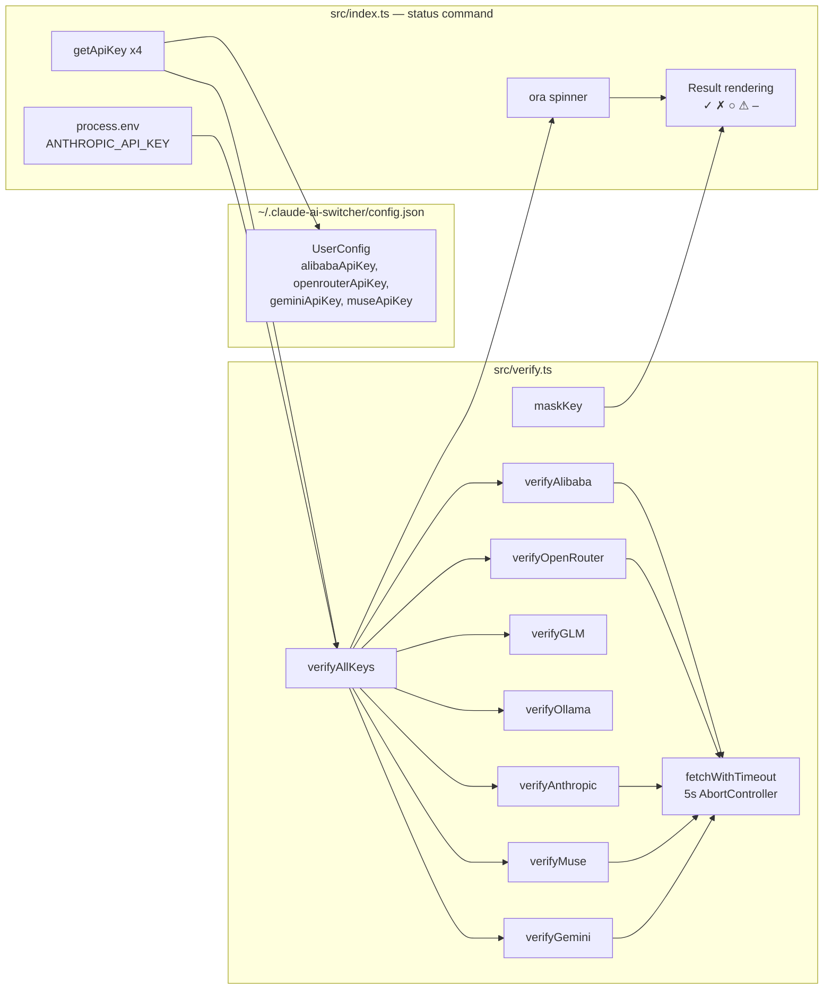

An API key stored in a config file is a claim, not a fact — it might be expired, revoked, or typo'd during setup. Claude AI Switcher addresses this uncertainty with `src/verify.ts`, a self-contained module that performs **lightweight network health checks** against every configured provider and renders the results alongside **masked key fragments** so you can confirm which key is in play without ever printing the secret. This page explains the verification contract, the three distinct verification strategies the module employs (remote API, local binary, local infrastructure), the timeout guard, and how the `status` command consumes all of it.

## Design Philosophy: Probe With Model Lists, Not Completions

The module's header comment states its intent plainly: "Makes lightweight requests to each provider's API to verify keys are valid." The critical design decision is *what kind* of request. Instead of sending a chat completion — which would consume tokens, incur cost, and take seconds to generate — every remote verifier issues a plain `GET` against the provider's **model listing endpoint** (e.g., `/v1/models`). These endpoints require authentication but return static metadata, so they validate the key with zero token consumption and minimal latency. This is the same pattern used by `verifyAlibaba` (`dashscope.../compatible-mode/v1/models`), `verifyOpenRouter` (`openrouter.ai/api/v1/models`), `verifyAnthropic` (`api.anthropic.com/v1/models`), `verifyMuse` (`api.meta.ai/v1/models`), and `verifyGemini` (`generativelanguage.googleapis.com/v1beta/models`).

Sources: [verify.ts](src/verify.ts#L1-L5), [verify.ts](src/verify.ts#L35-L57), [verify.ts](src/verify.ts#L62-L85), [verify.ts](src/verify.ts#L121-L145), [verify.ts](src/verify.ts#L239-L278), [verify.ts](src/verify.ts#L283-L309)

## The VerifyResult Contract: A Five-State Taxonomy

Every verification path in the module funnels into a single return type, `VerifyResult`, carrying a provider identifier, a status, and an optional human-readable message. The five statuses form a deliberate taxonomy that separates *what went wrong* from *whether it can be fixed by re-entering a key*:

| Status | Meaning | Typical Cause | Icon in `status` output |
|---|---|---|---|
| `ok` | Key (or service) verified successfully | HTTP 200 from probe | `✓` (green) |
| `invalid` | Authentication rejected by provider | HTTP 401/403 from probe | `✗` (red) |
| `missing` | No key configured locally | Key absent from config | `○` (dim) |
| `error` | Probe failed for non-auth reasons | Network failure, other HTTP codes, service down | `⚠` (yellow) |
| `skipped` | Check not requested by caller | `checkGLM`/`checkOllama` flags unset | `–` (dim) |

The distinction between `invalid` and `error` is the taxonomy's most valuable property: a 401/403 response maps to `invalid` ("Authentication failed"), telling you to replace the key, while any other HTTP status or a thrown network exception maps to `error` (e.g., "Connection failed", `HTTP 500`), telling you the key may be fine but the network or service is not. Conflating the two would send users chasing new keys when the real problem is a flaky connection.

Sources: [verify.ts](src/verify.ts#L9-L13), [verify.ts](src/verify.ts#L47-L56), [index.ts](src/index.ts#L987-L1004)

## Module Interaction: How Verification Flows Through the System

The verification subsystem touches three files. Keys originate in `~/.claude-ai-switcher/config.json` (read via `getApiKey`), flow into `verifyAllKeys` in `src/verify.ts`, and the resulting `VerifyResult[]` array is rendered by the `status` command in `src/index.ts`. One architectural nuance visible in the diagram: the Anthropic key is **not** read from the config file — it is pulled from `process.env.ANTHROPIC_API_KEY`, reflecting that Claude Code itself consumes this key as an environment variable.

`verifyAllKeys` accepts a flat object where each provider's key is optional, plus two boolean flags (`checkGLM`, `checkOllama`). For each entry it either pushes a real async check or — for absent keys and unset flags — pushes an immediately-resolved promise carrying the `missing` or `skipped` status. All checks then run through `Promise.all`, meaning remote probes execute **in parallel**, so total wall-clock time approaches the slowest single provider rather than the sum of all of them.

Sources: [verify.ts](src/verify.ts#L150-L204), [index.ts](src/index.ts#L960-L980), [config.ts](src/config.ts#L53-L68)

## Three Verification Strategies by Provider Topology

Providers in this switcher connect through fundamentally different mechanisms (direct API, local MCP binary, local LiteLLM proxy), and the verification module mirrors that diversity rather than forcing one pattern. Each strategy answers the same question — "can this provider actually serve requests right now?" — through the cheapest probe its topology allows:

| Strategy | Providers | Probe Mechanism | Key Required |
|---|---|---|---|
| Remote API health check | Alibaba, OpenRouter, Anthropic, Muse, Gemini | `GET /v1/models` (or equivalent) with auth header | Yes |
| Local binary presence check | GLM/Z.AI | `which`/`where coding-helper` + env var inspection | No |
| Local infrastructure check | Ollama | Two-stage probe: LiteLLM `:4000/health`, then Ollama `:11434/api/tags` | No |

### Remote Checks: Per-Provider Header Conventions

Each remote verifier adapts to its provider's authentication dialect. Alibaba, OpenRouter, and Muse send `Authorization: Bearer <key>`; Anthropic uses its native `x-api-key` header plus the mandatory `anthropic-version: 2023-06-01` header; Gemini uses Google's `x-goog-api-key` header against `generativelanguage.googleapis.com`. **Muse implements a fallback ladder**: if the Bearer attempt fails, it retries the same endpoint with the Anthropic-style `x-api-key` header before declaring the key invalid — a pragmatic hedge given Muse's Anthropic-compatible surface.

### The GLM Check: Presence, Not Authentication

GLM/Z.AI integrates through the `coding-helper` MCP server rather than a raw API key, so `verifyGLM` never touches the network. It dynamically imports `child_process`, runs `which coding-helper` (or `where` on Windows via an `os.platform()` check), and returns an error if the binary is absent. If the binary exists, it inspects `ZHIPUAI_MODEL`/`ZAI_MODEL` environment variables purely to enrich the success message ("coding-helper installed, env vars set" vs. "coding-helper installed"). Note the asymmetry: this check can return `error` but never `invalid` — there is no credential to invalidate.

### The Ollama Check: Sequential Two-Stage Infrastructure Probe

Ollama verification validates the local stack, not a key. Stage one probes the LiteLLM proxy at `http://localhost:4000/health`; if that fails (either non-OK status or a connection error), the check short-circuits with an error naming the exact gap ("LiteLLM proxy not running on port 4000"). Only if the proxy is healthy does stage two probe the Ollama service itself at `http://localhost:11434/api/tags`. The ordering is diagnostic by design: it tells you *which layer* of the proxy chain is down.

### The Gemini Check: Key Validity Decoupled From Proxy Status

`verifyGemini` deliberately verifies the key against Google's API **independently** of the local LiteLLM proxy (port 4001). Only after the key proves valid does it opportunistically probe `http://localhost:4001/health` — and the outcome is purely informational, appended to the message as ", proxy running" or ", proxy not running" without affecting the `ok` status. This prevents a stopped proxy from masking a perfectly valid key.

Sources: [verify.ts](src/verify.ts#L35-L57), [verify.ts](src/verify.ts#L121-L145), [verify.ts](src/verify.ts#L91-L116), [verify.ts](src/verify.ts#L209-L234), [verify.ts](src/verify.ts#L283-L309)

## The Five-Second Timeout Guard

Every remote probe routes through `fetchWithTimeout`, a thin wrapper around the Fetch API that instantiates an `AbortController`, arms a 5,000 ms timer (`TIMEOUT_MS = 5000`), and injects the controller's signal into the request. When the timer fires, the controller aborts the in-flight fetch, which surfaces as an exception in the caller and is mapped to `status: "error"` with message "Connection failed". The `clearTimeout` call in the `finally` block ensures no dangling timer regardless of outcome. This guard bounds worst-case `status` runtime: even if every provider's endpoint hangs, parallel execution means the command completes in roughly five seconds rather than blocking indefinitely on a dead connection.

Sources: [verify.ts](src/verify.ts#L7), [verify.ts](src/verify.ts#L22-L30)

## Key Masking: First Four, Ellipsis, Last Four

The `maskKey` function implements a minimal, side-effect-free redaction: keys of eight characters or fewer collapse entirely to `****`, while longer keys render as `first4...last4` — so a key like `sk-ant-api03-AbCdEf...XyZ9` displays as `sk-a...ZyZ9`. The export is explicit (`export { maskKey }`), making it the module's only public surface alongside `verifyAllKeys`. The threshold logic has a security rationale worth noting: for short keys, revealing even four characters on each end would expose a substantial fraction of the secret, so the function degrades to full redaction below nine characters.

Sources: [verify.ts](src/verify.ts#L15-L20)

## The status Command: Rendering the Verification Report

The `status` command (registered with the description "Show current config and verify API keys") is the sole consumer of `verifyAllKeys` and `maskKey` in the entire codebase. After printing the Claude Code and OpenCode configuration summaries, it loads the four config-file keys via `getApiKey` plus the Anthropic key from the environment, starts an `ora` spinner ("Verifying API keys..."), invokes `verifyAllKeys` with `checkGLM: true` and `checkOllama: true`, and stops the spinner before rendering. Each result row combines three elements: the status icon (per the taxonomy table above), the provider name padded to 12 columns, the detail message (with `missing` overridden to "No key configured" and `skipped` to "Skipped"), and — only for the five key-based providers with a key present — the masked fragment appended in parentheses. The output reads, for example: `✓ openrouter    Key valid (sk-or...9f2a)`.

Sources: [index.ts](src/index.ts#L78), [index.ts](src/index.ts#L909-L929), [index.ts](src/index.ts#L955-L1024)

## Boundary: status Verification vs. Switch-Flow Presence Checks

A common misconception worth dispelling: the `switch` command does **not** perform network verification before writing settings. Switch handlers read keys via `getApiKey` and prompt interactively when one is absent, but they never call `verifyAllKeys` — a deliberate trade-off that keeps switching fast and fully offline-capable. Network verification is exclusively an on-demand diagnostic, invoked only when the user runs `status` to audit their key health. The consequences are worth remembering: a switch to a provider with a *present but expired* key will succeed silently, and the failure will only surface later when Claude Code itself attempts a request — at which point `claude-switch status` becomes the first diagnostic tool to reach for.

Sources: [index.ts](src/index.ts#L171), [index.ts](src/index.ts#L960-L978)

## Where to Go Next

Understanding verification pairs naturally with the surrounding security story. To see where the keys under verification are stored and how `getApiKey` resolves them, read [API Key Storage in ~/.claude-ai-switcher/config.json](20-api-key-storage-in-claude-ai-switcher-config-json). For the broader safety posture — timestamped backups, environment variable cleanup, and the local-only storage guarantee — continue to [Safety Features: Timestamped Backups, Env Var Cleanup, and Local-Only Storage](22-safety-features-timestamped-backups-env-var-cleanup-and-local-only-storage). If you're curious why the switch flow deliberately skips network validation, [The Provider Switch Flow: Key Validation, Tier Maps, Proxy Startup, and Settings Writes](9-the-provider-switch-flow-key-validation-tier-maps-proxy-startup-and-settings-writes) traces that path end to end.