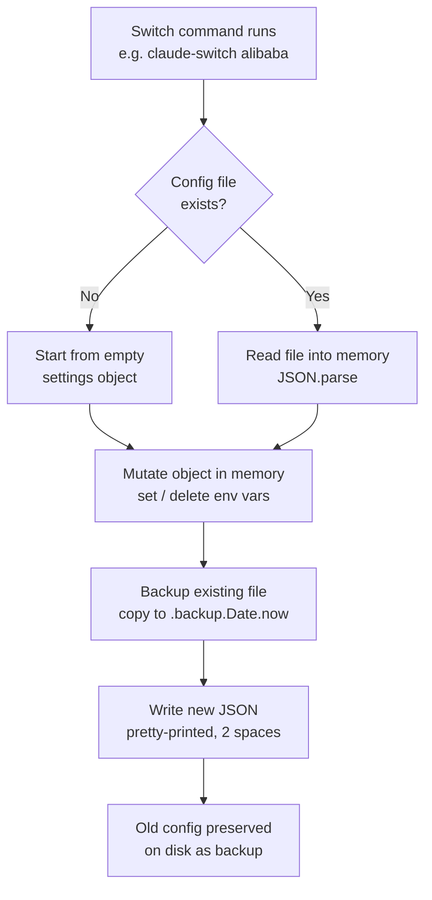
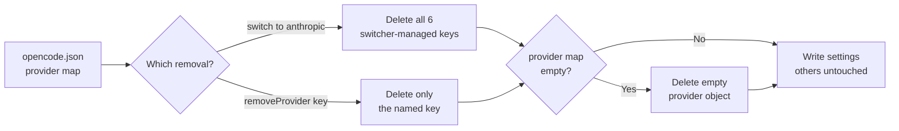

Claude AI Switcher has a risky job: it rewrites the live configuration files that Claude Code and OpenCode depend on — files that may contain your hand-tuned MCP servers, custom settings, and API credentials. One careless write could break your editor setup or leak a key. This page explains the three safety mechanisms the tool layers onto every operation so that even a beginner can switch providers with confidence: **timestamped backups** taken before every write, **environment variable cleanup** that prevents stale configuration from one provider leaking into another, and **local-only storage** that keeps your API keys on your machine and out of the cloud. The project's own README summarizes the philosophy in one line: "Backs up existing settings before any modifications" — the sections below show exactly how that promise is kept in code.

Sources: [README.md](README.md#L18-L19)

## The Defense-in-Depth Model at a Glance

The tool never performs a "blind" write. Every settings modification passes through a small set of guardrails, each targeting a different failure mode. The table below maps each feature to the problem it solves and where it lives in the codebase.

| Safety Feature | Problem It Prevents | Where It Happens | How |
|---|---|---|---|
| Timestamped backup | Losing your existing config if a write goes wrong | `writeClaudeSettings`, `writeClaudeJson`, `writeOpenCodeSettings` | Copies the old file to `<name>.backup.<Date.now()>` before writing |
| Existence check | Creating a backup of a file that never existed (or writing to a missing directory) | `claudeSettingsExists()` etc. | `fs.existsSync()` guards before any read/write |
| Env var cleanup | Stale `ANTHROPIC_BASE_URL` / tier aliases from a previous provider silently redirecting requests | `clearTierMap()`, `configureAnthropic()`, each `configure*()` function | Explicit `delete` of known env keys before applying new state |
| MCP server removal | Leftover `glm-coding-plan` / `alibaba-coding-plan` MCP entries conflicting with the new provider | `configureAnthropic()` | Deletes known MCP server keys |
| Surgical provider removal | Wiping unrelated OpenCode providers you configured yourself | `removeProvider(providerKey)` | Deletes only the named provider, preserves all others |
| Local-only key storage | API keys being synced, committed, or transmitted anywhere | `src/config.ts` | Keys live only in `~/.claude-ai-switcher/config.json` |
| `.gitignore` guards | Accidentally committing keys or backups into a git repository | `.gitignore` | Explicit ignore rules for key files, `.env*`, and `*.backup` |

Notice the pattern: each mechanism is deliberately simple — a file copy, a `delete` statement, a hardcoded path. There is no locking, no daemon, and no database. This simplicity is intentional: fewer moving parts means fewer ways for the safety mechanism itself to fail.

Sources: [claude-code.ts](src/clients/claude-code.ts#L48-L57), [opencode.ts](src/clients/opencode.ts#L599-L612), [config.ts](src/config.ts#L11-L12), [.gitignore](.gitignore#L27-L43)

## The Safe Write Sequence

Before diving into individual features, it helps to see how they compose. Every provider switch that ends in a settings change follows the same sequence: read the current file into memory, mutate the in-memory JavaScript object, create a timestamped backup of the on-disk file, and only then write the new content. The project's ARCHITECTURE.md condenses this into a single flow node: "Write settings (backup first)."

The critical detail for a beginner to internalize: the mutation happens entirely on an **in-memory object** first. The original file on disk remains untouched until the backup copy is successfully made. If the process were interrupted between the backup and the write, you would still have both the backup *and* the original intact.

Sources: [ARCHITECTURE.md](ARCHITECTURE.md#L82-L85), [claude-code.ts](src/clients/claude-code.ts#L100-L112)

## Timestamped Backups: How Every Write Preserves the Past

The backup mechanism lives in three nearly identical writer functions — one for `~/.claude/settings.json`, one for `~/.claude.json`, and one for `~/.config/opencode/opencode.json`. Each follows the same recipe: ensure the target directory exists, copy the existing file to a backup path suffixed with `Date.now()`, then write the new content. The `Date.now()` call returns the current time as a large integer (milliseconds since January 1, 1970), which serves two purposes at once: two backups taken even a millisecond apart never collide, and sorting backup filenames alphabetically sorts them chronologically.

Sources: [claude-code.ts](src/clients/claude-code.ts#L100-L126), [opencode.ts](src/clients/opencode.ts#L52-L67)

### Anatomy of a Backup Filename

After a few provider switches, your `~/.claude` directory will accumulate files like this:

| Original File | Backup File After a Switch | What the Number Means |
|---|---|---|
| `~/.claude/settings.json` | `settings.json.backup.1735689600000` | Milliseconds since Unix epoch — unique per write |
| `~/.claude.json` | `.claude.json.backup.1735689600000` | Same scheme, separate file |
| `~/.config/opencode/opencode.json` | `opencode.json.backup.1735689600000` | Same scheme in the OpenCode config dir |

### What Each Writer Backs Up

| Writer Function | File Protected | Backup Trigger |
|---|---|---|
| `writeClaudeSettings()` | `~/.claude/settings.json` (provider env vars, MCP servers) | Only if the file already exists |
| `writeClaudeJson()` | `~/.claude.json` (onboarding state) | Only if the file already exists |
| `writeOpenCodeSettings()` | `~/.config/opencode/opencode.json` (provider definitions) | Only if the file already exists |

Two details are worth noting. First, the `if (claudeSettingsExists())` guard means you never get useless `.backup.0`-style files for configurations that never existed — the existence check itself is listed as a safety feature in the README. Second, the project's `.gitignore` explicitly excludes `*.bak` and `*.backup` patterns, so even if you run the tool inside a git-managed home directory, backup copies of your settings (which may contain tokens) cannot be committed by accident. Note that backups accumulate over time and are never auto-deleted — restoring your disk usage means cleaning old ones manually.

Sources: [claude-code.ts](src/clients/claude-code.ts#L100-L126), [opencode.ts](src/clients/opencode.ts#L52-L67), [README.md](README.md#L906-L913), [.gitignore](.gitignore#L41-L43)

## Env Var Cleanup: Preventing Stale Provider State

Here is the failure mode the cleanup logic exists to prevent. Suppose you switch from **Alibaba** to **GLM**. The Alibaba configuration wrote `ANTHROPIC_BASE_URL` pointing at `dashscope.aliyuncs.com` into your settings. If GLM's configuration simply *added* its own values without removing the old ones, Claude Code might still read the stale Alibaba URL, or a leftover tier alias could send your "opus" requests to the wrong model entirely. Every `configure*()` function in the codebase therefore runs an explicit cleanup pass before applying its own state — the GLM function's comment states it plainly: "Clears provider-specific env vars (e.g. Alibaba) before applying GLM tier map."

Sources: [claude-code.ts](src/clients/claude-code.ts#L184-L204)

### Tier Alias Cleanup with `clearTierMap()`

The three tier aliases (`ANTHROPIC_DEFAULT_OPUS_MODEL`, `ANTHROPIC_DEFAULT_SONNET_MODEL`, `ANTHROPIC_DEFAULT_HAIKU_MODEL`) are managed by a dedicated pair of functions. `applyTierMap()` writes all three; `clearTierMap()` deletes all three — and, in a nice touch of hygiene, if the `env` object becomes completely empty after deletion, it removes the now-pointless empty `env` object from the settings JSON entirely. This keeps your settings file clean rather than littered with `"env": {}` husks.

| Function | Direction | Keys Touched | Empty-Object Cleanup |
|---|---|---|---|
| `applyTierMap()` | Writes | All three `TIER_ENV_KEYS` values | Creates `env` if missing |
| `clearTierMap()` | Deletes | All three `TIER_ENV_KEYS` values | Removes `env` if it becomes empty |

Sources: [claude-code.ts](src/clients/claude-code.ts#L35-L57)

### The Full Reset: Switching Back to Anthropic

The most thorough cleanup happens when you switch back to the default Anthropic provider, because in that case *nothing* the switcher manages should remain. `configureAnthropic()` performs a complete teardown, summarized below.

| Cleanup Target | Keys Removed | Why It Must Go |
|---|---|---|
| Auth/routing env vars | `ANTHROPIC_AUTH_TOKEN`, `ANTHROPIC_BASE_URL`, `ANTHROPIC_MODEL` | Would redirect native Claude traffic to a third-party endpoint |
| Muse-specific extras | `CLAUDE_CODE_SUBAGENT_MODEL`, `ENABLE_TOOL_SEARCH` | Muse sets these; other providers delete them on entry too |
| Tier aliases | All three `ANTHROPIC_DEFAULT_*_MODEL` keys (via `clearTierMap`) | Would alias opus/sonnet/haiku to non-Anthropic models |
| MCP overrides | `alibaba-coding-plan`, `glm-coding-plan` server entries | Provider-specific MCP servers must not linger |

Sources: [claude-code.ts](src/clients/claude-code.ts#L157-L182)

### Muse Extras: The Counter-Example That Proves the Pattern

Most providers *delete* `CLAUDE_CODE_SUBAGENT_MODEL` and `ENABLE_TOOL_SEARCH` as part of their cleanup pass — you can see this identical pair of `delete` lines repeated in the Alibaba, OpenRouter, Ollama, Gemini, and GLM configure functions. Muse is the one provider that *writes* them, because Meta's endpoint requires a subagent model and tool-search enabled. This asymmetry is exactly why the deletes exist everywhere else: without them, a switch from Muse to Ollama would leave `ENABLE_TOOL_SEARCH="true"` and a stale subagent model pointing at a non-existent Muse model ID.

| Provider | Auth Token | Base URL | Model | Subagent Model | Tool Search |
|---|---|---|---|---|---|
| Alibaba / OpenRouter / Ollama / Gemini | set | set | set | **deleted** | **deleted** |
| Muse | set | set | set | **set** | **set** (`"true"`) |
| GLM | **deleted** | **deleted** | **deleted** | **deleted** | **deleted** |
| Anthropic (reset) | **deleted** | **deleted** | **deleted** | **deleted** | **deleted** |

Sources: [claude-code.ts](src/clients/claude-code.ts#L141-L155), [claude-code.ts](src/clients/claude-code.ts#L206-L282)

### Surgical Removal on the OpenCode Side

OpenCode's config uses a different structure — a `provider` map where each provider is a key — so cleanup there means deleting map entries, not env vars. Two behaviors matter. `configureAnthropic()` removes all six switcher-managed providers (`bailian-coding-plan`, `openrouter`, `ollama`, `gemini`, `glm`, `muse`) and then deletes the empty `provider` object if nothing remains. More importantly, `removeProvider(providerKey)` removes **only the named provider** and explicitly preserves everything else — the README calls this out as a guarantee: "Preserves other OpenCode providers when adding/removing bailian-coding-plan." If you hand-configured a provider the switcher knows nothing about, it survives every switch.

Sources: [opencode.ts](src/clients/opencode.ts#L230-L273), [opencode.ts](src/clients/opencode.ts#L595-L612), [README.md](README.md#L906-L913)

## Local-Only Storage: Your Keys Never Leave Your Machine

The switcher stores every API key it collects in exactly one place: a plain JSON file at `~/.claude-ai-switcher/config.json`, created on demand by `ensureConfigDir()` and written with simple two-space-indented `JSON.stringify`. There is no cloud sync, no telemetry upload, and no network call in `config.ts` at all — the module contains only file reads and writes. The README states the guarantee twice: keys are "stored locally in `~/.claude-ai-switcher/config.json`" and the safety list confirms "Local-only storage (no cloud sync)." The only place keys ever travel over the network is the lightweight verification health check, which sends the key directly to the provider it belongs to — covered separately on the [API Key Verification](21-api-key-verification-lightweight-health-checks-and-key-masking) page.

Sources: [config.ts](src/config.ts#L23-L48), [README.md](README.md#L18-L18), [README.md](README.md#L906-L913)

### Git Hygiene as a Safety Boundary

Because keys sit in predictable paths, the repository's `.gitignore` acts as a second line of defense for anyone who runs the tool inside a git-tracked directory. Each rule targets a specific secret surface:

| `.gitignore` Rule | Secret Surface It Blocks | Line |
|---|---|---|
| `.env` / `.env.*` | Environment files that may hold keys | L27–L29 |
| `.npmrc` | npm auth tokens (user-specific) | L31–L32 |
| `~/.claude-ai-switcher/` | The API key config directory itself | L34–L35 |
| `~/.claude/` / `~/.opencode.json` | Client settings that embed `ANTHROPIC_AUTH_TOKEN` | L37–L39 |
| `*.bak` / `*.backup` | Timestamped backups, which contain full copies of key-bearing settings | L41–L43 |

That last row is easy to overlook but important: your backups contain everything your live settings contain, including tokens. Ignoring `*.backup` ensures the very safety mechanism from the first half of this page can't become a leak vector.

Sources: [.gitignore](.gitignore#L27-L43)

## Supporting Guards: Existence Checks and Onboarding Auto-Set

Two smaller mechanisms round out the safety story. First, every reader and writer checks file existence before acting — `claudeSettingsExists()`, `claudeJsonExists()`, and `opencodeSettingsExists()` all wrap `fs.existsSync()`, so readers return an empty object instead of crashing on a missing file, and writers skip the backup step for files that were never there (the README's "Checks if config files exist before creating"). Second, `ensureOnboardingComplete()` sets `hasCompletedOnboarding: true` in `~/.claude.json` before every provider switch. This is a protective fix rather than a backup: without it, Claude Code would show the misleading "Unable to connect to Anthropic services" error when pointed at a third-party endpoint, making users think the switch broke something when it hadn't.

Sources: [claude-code.ts](src/clients/claude-code.ts#L59-L71), [claude-code.ts](src/clients/claude-code.ts#L128-L136), [README.md](README.md#L906-L913)

## Recovering from a Bad Switch: A Practical Walkthrough

Because backups are plain file copies with predictable names, recovery requires no special tooling. The procedure below restores your Claude Code settings from any backup point.

| Step | Command | What Happens |
|---|---|---|
| 1. List backups | `ls ~/.claude/settings.json.backup.*` | Timestamped copies, newest = largest number |
| 2. Inspect one | `cat ~/.claude/settings.json.backup.1735689600000` | Verify it holds the config you want |
| 3. Restore it | `cp ~/.claude/settings.json.backup.1735689600000 ~/.claude/settings.json` | Overwrites live settings (your current state still exists in other backups) |
| 4. Restart Claude Code | — | New session reads the restored file |

The same procedure applies to `~/.claude.json.backup.*` and `~/.config/opencode/opencode.json.backup.*`. Since every switch creates a *new* backup rather than rotating old ones away, you can always step back to any point in your configuration history — the trade-off being that you manage the accumulating files yourself.

Sources: [claude-code.ts](src/clients/claude-code.ts#L100-L126), [opencode.ts](src/clients/opencode.ts#L52-L67)

## Where to Go Next

The safety mechanisms on this page sit at the end of the provider switch pipeline. To see the full journey — key validation, tier map construction, proxy startup, and the settings write that triggers these backups — continue to [The Provider Switch Flow: Key Validation, Tier Maps, Proxy Startup, and Settings Writes](9-the-provider-switch-flow-key-validation-tier-maps-proxy-startup-and-settings-writes). For a deeper look at the file whose writes produce the backups, read [Claude Code Client: Managing ~/.claude/settings.json with Backups and Onboarding](14-claude-code-client-managing-claude-settings-json-with-backups-and-onboarding) and [OpenCode Client: Adding and Removing Providers in opencode.json](15-opencode-client-adding-and-removing-providers-in-opencode-json). If you want to understand exactly what lives inside the local-only key file and how the `key` command populates it, see [API Key Storage in ~/.claude-ai-switcher/config.json](20-api-key-storage-in-claude-ai-switcher-config-json), and for the one place keys do touch the network, see [API Key Verification: Lightweight Health Checks and Key Masking](21-api-key-verification-lightweight-health-checks-and-key-masking).