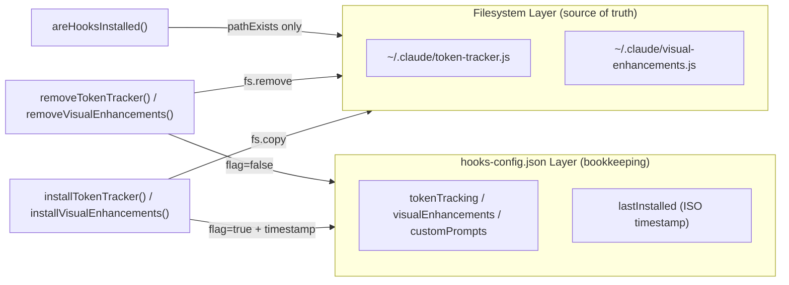
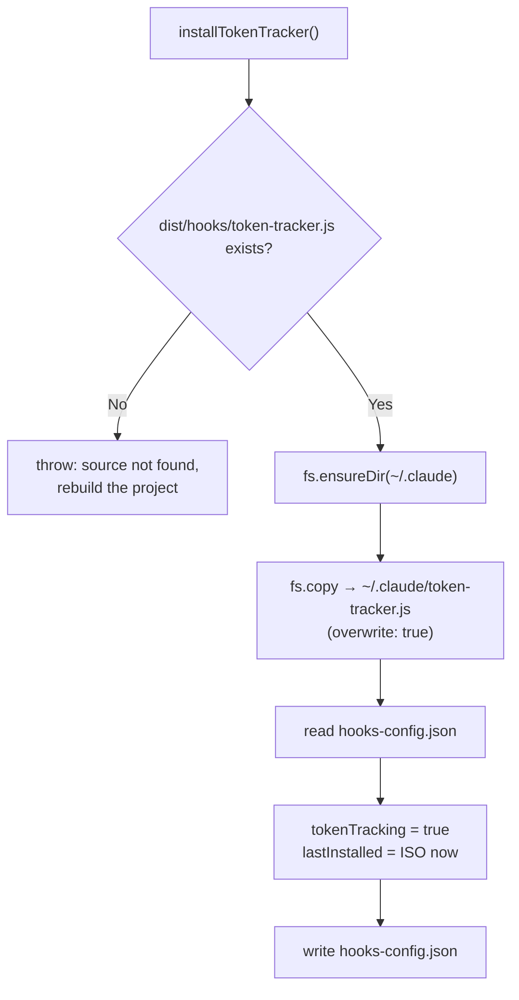

The Hook Manager is the lifecycle controller for the switcher's hook assets — the single module that decides which hook scripts live in `~/.claude/`, when they get there, when they leave, and how the CLI reasons about their state. It lives in one file, `src/hooks/index.ts` (209 lines), and exports ten functions that the CLI's `hooks` command group consumes. This page explains its architecture: the path layout it owns, its dual state-tracking model, the install/remove/status flows, and the failure modes it guards against. The internals of what the hook scripts *do* (counters, color bars, model cards) are covered on the [Token Tracker](24-token-tracker-session-usage-counters-and-the-color-coded-context-bar) and [Visual Enhancements](25-visual-enhancements-model-cards-provider-info-and-context-display) pages.

## Module Position and Path Layout

The Hook Manager sits between two worlds: the npm package's build output on one side, and Claude Code's user directory on the other. It defines five path constants that pin down this boundary completely. `CLAUDE_DIR` resolves to `~/.claude`; the two source paths resolve to `path.join(__dirname, "..", "hooks", ...)` — which, in the compiled `dist/index.js` runtime, means `dist/hooks/token-tracker.js` and `dist/hooks/visual-enhancements.js`; the two destination paths are `~/.claude/token-tracker.js` and `~/.claude/visual-enhancements.js`; and the state file is `~/.claude/hooks-config.json`. Alongside these constants, the module defines the `HooksConfig` interface with three boolean flags (`tokenTracking`, `visualEnhancements`, `customPrompts`) and an optional `lastInstalled` ISO timestamp that install operations stamp on every write.

Sources: [index.ts](src/hooks/index.ts#L12-L29)

One design decision worth internalizing before anything else: **installation here means file copy, not settings registration**. The install functions copy standalone JavaScript files into `~/.claude/` and update a private state file — they never write hook event registrations (e.g., `PreToolUse`, `SessionStart` blocks) into `~/.claude/settings.json`. The installed scripts are display utilities that the CLI itself executes on demand via `hooks status` and `hooks reset`, rather than event callbacks registered with the Claude Code runtime. This is why `src/clients/claude-code.ts` and the Hook Manager never touch each other.

## The Dual State-Tracking Model

The most architecturally interesting aspect of the module is that it tracks state in **two independent layers with different jobs**. The first layer is the filesystem itself: `areHooksInstalled()` returns a per-hook boolean map by checking `fs.pathExists()` against the two destination paths. This is the source of truth — the function does not read `hooks-config.json` at all, so the CLI's status display reflects only what physically exists on disk.

Sources: [index.ts](src/hooks/index.ts#L34-L42)

The second layer is `hooks-config.json`, maintained by the private `readHooksConfig()`/`writeHooksConfig()` pair. `readHooksConfig()` is defensively simple: if the file is missing **or fails to parse**, it returns a fresh all-false default config rather than throwing. `writeHooksConfig()` serializes with 2-space indentation. Install functions set their flag to `true` and stamp `lastInstalled` with `new Date().toISOString()`; remove functions set flags to `false` (notably, they leave `lastInstalled` untouched, so it records the last install event, not last removal).

Sources: [index.ts](src/hooks/index.ts#L123-L149)

The consequence of this split is a **deliberate divergence window**: if a user manually deletes `~/.claude/token-tracker.js`, the status command correctly reports "Not installed" (filesystem check), while `hooks-config.json` still claims `tokenTracking: true`. The inverse is impossible through the CLI itself — install always writes both layers — but the stale-flag scenario is accepted as harmless because nothing in the codebase reads the config flags to gate behavior; only `lastInstalled` and the flags serve as user-visible bookkeeping.

## The Install Flow

Installation follows a strict validate-then-copy-then-record sequence, identical in shape for both hooks. Taking `installTokenTracker()` as the reference: it first checks `fs.pathExists(TOKEN_TRACKER_SRC)` and throws `"Token tracker source not found. Please rebuild the project."` if the compiled asset is missing from `dist/hooks/`; then `fs.ensureDir(CLAUDE_DIR)` guarantees the target directory exists (important for first-run machines where `~/.claude/` may not yet exist); then `fs.copy(..., { overwrite: true })` performs an **idempotent** copy that safely re-runs over an existing installation; finally it reads the config, flips the flag, stamps `lastInstalled`, and writes it back. `installVisualEnhancements()` mirrors this exactly with its own paths and error message, and `installAllHooks()` is pure composition — it awaits both install functions in sequence with no additional logic.

Sources: [index.ts](src/hooks/index.ts#L47-L84)

The "rebuild" error message is not cosmetic — it directly encodes the build pipeline dependency. The `TOKEN_TRACKER_SRC` path only contains a file after `npm run build` executes, because TypeScript compilation (`tsc`) does not emit plain `.js` assets from `src/hooks/`; only `scripts/copy-hooks.js` stages them into `dist/hooks/`. A developer running `ts-node src/index.ts` (the `dev` script) or a consumer of a corrupted package will hit exactly this guard. Full details of that pipeline live on the [Hook Asset Build Pipeline](26-hook-asset-build-pipeline-why-copy-hooks-js-exists-alongside-tsc) page.

Sources: [copy-hooks.js](scripts/copy-hooks.js#L1-L16), [package.json](package.json#L19-L25)

## The Remove Flow

Removal is the symmetric inverse of installation, with one subtle difference: instead of throwing when the target is absent, remove functions are **silently idempotent** — `removeTokenTracker()` wraps its `fs.remove()` in a `pathExists()` guard so removing an already-removed hook is a no-op, then unconditionally writes `tokenTracking: false` to the config. `removeAllHooks()` composes both remove functions. This asymmetry is intentional design: a missing source during install is an error state (broken build), while a missing destination during remove is a valid already-clean state.

Sources: [index.ts](src/hooks/index.ts#L89-L118)

## Status Display and Subprocess Execution

The three runtime functions — `showTokenStatus()`, `showVisualStatus()`, and `resetTokenUsage()` — share a contract: check the destination path first, print the hint `"Token tracker not installed. Run: claude-switch hooks install"` (or the visual variant) and return early if absent, otherwise delegate to the private `runHookScript()` helper. That helper runs the installed script with `execFileSync("node", [scriptPath, ...args])` using `stdio: "inherit"` (so the child writes directly to the terminal, preserving any ANSI colors it emits) and a hard **10-second timeout** that prevents a hung hook from freezing the CLI. `resetTokenUsage()` passes `["--reset"]` as the argument vector and prints "Token usage reset complete." on success; all three wrap execution in try/catch and print a prefixed error rather than crashing.

Sources: [index.ts](src/hooks/index.ts#L154-L208)

The choice of a synchronous child process is the **isolation boundary** of the system: hook scripts execute in a fresh Node runtime with no shared state with the switcher process, so a syntax error or crash inside `token-tracker.js` surfaces as a caught child-process error, never as corruption of the CLI's own state.

## The CLI Command Surface

The `hooks` command group in `src/index.ts` wires every exported function to a subcommand, giving fine-grained per-hook control plus bulk operations. The import block pulls all ten exports (plus the three install variants are used individually by `install-token`/`install-visual`).

Sources: [index.ts](src/index.ts#L75-L90), [index.ts](src/index.ts#L1255-L1402)

| Command | Function Called | Scope | Notable Output Behavior |
|---|---|---|---|
| `hooks install` | `installAllHooks()` | Both hooks | Ora spinner during install; success block lists both destination paths and usage hints |
| `hooks install-token` | `installTokenTracker()` | Token tracker only | Prints location `~/.claude/token-tracker.js` |
| `hooks install-visual` | `installVisualEnhancements()` | Visual enhancements only | Prints location `~/.claude/visual-enhancements.js` |
| `hooks status` | `areHooksInstalled()` → `showTokenStatus()` / `showVisualStatus()` | Read-only | ✓/✗ per hook; runs installed scripts for live display; hint line if nothing installed |
| `hooks reset` | `resetTokenUsage()` | Token tracker | Passes `--reset` through to the child process |
| `hooks remove` | `removeAllHooks()` | Both hooks | Idempotent no-op if already removed |
| `hooks remove-token` | `removeTokenTracker()` | Token tracker only | Idempotent no-op if already removed |
| `hooks remove-visual` | `removeVisualEnhancements()` | Visual enhancements only | Idempotent no-op if already removed |

Every action handler follows the same error contract: catch, `displayError()` with a fallback message (e.g., `"Failed to install hooks"`), and `process.exit(1)` — so all hook command failures produce non-zero exit codes for scripting use. The `status` command demonstrates the dual-layer model in action: it prints filesystem-derived install state first, then executes whichever scripts exist, falling through to a yellow install hint only when both existence checks fail.

Sources: [index.ts](src/index.ts#L1262-L1348), [index.ts](src/index.ts#L1350-L1402)

## Failure Modes and Troubleshooting

| Symptom | Root Cause | Verified Behavior | Resolution |
|---|---|---|---|
| `"Token tracker source not found. Please rebuild the project."` | `dist/hooks/token-tracker.js` missing — dev mode via `ts-node`, or `tsc`-only build | Install throws before any filesystem write | Run `npm run build` (tsc + copy-hooks) |
| `hooks status` says "Not installed" but flags in `hooks-config.json` are `true` | Destination file deleted manually | `areHooksInstalled()` ignores the config file by design | Re-run `hooks install`; overwrite copy is safe |
| `hooks remove` prints success but nothing existed | Expected idempotency | `pathExists()` guard skips `fs.remove()` silently | No action needed |
| `"Failed to run token tracker: ..."` | Child process crashed or exceeded timeout | `execFileSync` error caught, message printed | Reinstall the hook; inspect script health |
| Corrupted/invalid `hooks-config.json` | Manual edit or truncated write | `readHooksConfig()` catch returns all-false defaults | Next install/rewrite repairs the file |

Sources: [index.ts](src/hooks/index.ts#L47-L49), [index.ts](src/hooks/index.ts#L89-L97), [index.ts](src/hooks/index.ts#L123-L141), [index.ts](src/index.ts#L170-L174)

## Next Steps

The Hook Manager is the *plumbing*; the scripts it manages are the *features*. To see what executes after install, continue to [Token Tracker: Session Usage Counters and the Color-Coded Context Bar](24-token-tracker-session-usage-counters-and-the-color-coded-context-bar) and [Visual Enhancements: Model Cards, Provider Info, and Context Display](25-visual-enhancements-model-cards-provider-info-and-context-display). For why `runHookScript`'s source paths depend on a hand-rolled copy script rather than the TypeScript compiler, read [Hook Asset Build Pipeline: Why copy-hooks.js Exists Alongside tsc](26-hook-asset-build-pipeline-why-copy-hooks-js-exists-alongside-tsc). If you arrived here during first-run setup instead, [Installing Token Tracking and Visual Enhancement Hooks](6-installing-token-tracking-and-visual-enhancement-hooks) covers the same commands from an end-user angle.