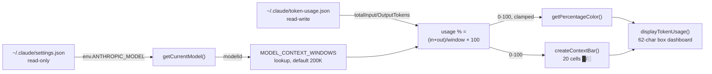

The **token tracker** is the switcher's quantitative observability layer: a dependency-free Node.js script that accumulates input/output token counts in a JSON state file, resolves the active model's context window, and renders a box-drawn terminal dashboard whose color escalates from green to magenta as context consumption approaches saturation. This page dissects its state model, model-resolution chain, threshold-based color logic, and its precise — and often misunderstood — execution lifecycle as a standalone script rather than a registered Claude Code hook event. The hook manager's install/remove machinery is covered separately in [Hook Manager: Installing, Removing, and Tracking Hook State](23-hook-manager-installing-removing-and-tracking-hook-state).

## Anatomy of a Standalone Hook Asset

The tracker lives at `src/hooks/token-tracker.js` — 279 lines of plain CommonJS JavaScript that deliberately avoids the repository's TypeScript compilation path. Its only dependencies are Node core modules (`fs`, `path`, `os`), which makes the installed artifact fully self-contained and executable with any Node runtime without transpilation. This design choice is what necessitates the `copy-hooks.js` build step: `tsc` ignores `.js` files, so a dedicated script copies `src/hooks/*.js` verbatim into `dist/hooks/` during `npm run build`, preserving byte-identical assets from source to installation target. The full rationale of that pipeline belongs to [Hook Asset Build Pipeline: Why copy-hooks.js Exists Alongside tsc](26-hook-asset-build-pipeline-why-copy-hooks-js-exists-alongside-tsc).

Sources: [token-tracker.js](src/hooks/token-tracker.js#L1-L15), [copy-hooks.js](scripts/copy-hooks.js#L6-L16), [package.json](package.json#L20-L21)

The script anchors itself to two filesystem locations: a state file at `~/.claude/token-usage.json` for persistent counters, and Claude Code's `~/.claude/settings.json` as a read-only source for detecting the currently active model. Both paths are resolved once at module load via `os.homedir()`, meaning the tracker is strictly single-user and single-machine — consistent with the project's local-only storage philosophy documented in [Safety Features: Timestamped Backups, Env Var Cleanup, and Local-Only Storage](22-safety-features-timestamped-backups-env-var-cleanup-and-local-only-storage).

Sources: [token-tracker.js](src/hooks/token-tracker.js#L14-L15)

## The Data Flow: From State File to Rendered Dashboard

The tracker follows a strict read-modify-render pipeline. Every invocation loads persisted counters, and in display mode additionally resolves the active model and its context window before computing a usage percentage that drives both the bar geometry and the ANSI color selection:



This flow executes synchronously from top to bottom — there is no event loop participation, no watching, and no concurrency control. The entire contract is "one process, one snapshot," which is what makes the script safe to invoke from arbitrary contexts (manual CLI, hook manager subprocess) without locking concerns.

Sources: [token-tracker.js](src/hooks/token-tracker.js#L196-L231)

## The State Model: `~/.claude/token-usage.json`

The state schema is deliberately minimal — four fields, two of which carry the actual counters:

| Field | Type | Purpose | Written by |
|---|---|---|---|
| `totalInputTokens` | number | Cumulative prompt tokens across invocations | `addTokens()`, `resetTokenUsage()` |
| `totalOutputTokens` | number | Cumulative completion tokens across invocations | `addTokens()`, `resetTokenUsage()` |
| `sessionStart` | ISO string | Timestamp of the last reset | `resetTokenUsage()` |
| `lastUpdated` | ISO string | Timestamp of the last mutation | `addTokens()`, `resetTokenUsage()` |

Two defensive properties define the persistence layer's reliability posture. First, `loadTokenUsage()` validates that both counter fields are `typeof number` before trusting the file — any parse failure or type violation discards the entire record and returns a fresh zeroed structure rather than propagating corruption into arithmetic. Second, `saveTokenUsage()` swallows all write errors silently, an explicit design decision commented as "don't break Claude Code": a telemetry dashboard must never become a failure point for the tool it instruments.

Sources: [token-tracker.js](src/hooks/token-tracker.js#L96-L134)

An important semantic consequence follows from this design: the state file is **global, not per-session**. The `sessionStart` field only advances when something calls `resetTokenUsage()` — either the exported `onSessionStart()` function or a manual `claude-switch hooks reset`. Counters therefore accumulate across Claude Code process lifetimes until an explicit reset occurs, a behavior examined further in the lifecycle section below.

Sources: [token-tracker.js](src/hooks/token-tracker.js#L139-L160)

## Model Resolution and the Context Window Map

Percentage accuracy depends on knowing the denominator — the active model's context window. The tracker duplicates the model catalog's context-window metadata as a hardcoded local map covering Alibaba, GLM, Kimi, MiniMax, OpenRouter, Ollama, Gemini, and Anthropic model families, with values spanning 100,000 (Codellama) to 1,000,000 tokens (Qwen3.7-Plus, Gemini 2.5, GLM-5.3[1m]). The source comment notes this map "matches src/models.ts" — a manual synchronization requirement, since the `.js` asset cannot import from the compiled TypeScript catalog. The canonical metadata source remains [Model Catalog and Metadata: IDs, Context Windows, and Capabilities](11-model-catalog-and-metadata-ids-context-windows-and-capabilities).

Sources: [token-tracker.js](src/hooks/token-tracker.js#L17-L57)

Model detection follows a three-step fallback chain against Claude Code's settings, each step guarded so the tracker degrades to a safe default rather than crashing:

| Priority | Source | Condition | Fallback behavior |
|---|---|---|---|
| 1 | `settings.env.ANTHROPIC_MODEL` | Direct model override present | Use as-is |
| 2 | `settings.env.ANTHROPIC_DEFAULT_OPUS_MODEL` | Tier alias configured (opus treated as primary) | Use as-is |
| 3 | Hardcoded default | Missing settings file, missing keys, or any parse error | `claude-opus-4-6-20250205` |

The choice to read `ANTHROPIC_DEFAULT_OPUS_MODEL` as the secondary signal aligns with how the switcher itself writes tier aliases during provider switching, as documented in [The Model Tier Alias System: Opus, Sonnet, and Haiku Environment Variables](12-the-model-tier-alias-system-opus-sonnet-and-haiku-environment-variables). If the resolved model ID is absent from `MODEL_CONTEXT_WINDOWS`, `getContextWindow()` returns 200,000 — matching Anthropic's baseline window and ensuring the bar always renders, even for models the map hasn't cataloged.

Sources: [token-tracker.js](src/hooks/token-tracker.js#L59-L91)

## The Color-Coded Context Bar: Thresholds and Geometry

The visual signature of the tracker is a 20-cell bar built from Unicode block characters — `█` for filled cells, `░` for empty — where `filled = Math.round(percentage / 100 × 20)`. Filled and empty counts always sum to exactly 20, giving the bar a fixed visual width of 20 characters regardless of usage level.

Sources: [token-tracker.js](src/hooks/token-tracker.js#L169-L181)

Color selection maps usage percentage onto four ANSI escape sequences with escalating severity:

| Percentage range | ANSI code | Color | Semantic |
|---|---|---|---|
| `< 50%` | `\x1b[32m` | Green | Healthy headroom |
| `50% – 74.9%` | `\x1b[33m` | Yellow | Approaching half — monitor |
| `75% – 89.9%` | `\x1b[31m` | Red | High pressure — consider compacting |
| `≥ 90%` | `\x1b[35m` | Magenta | Critical — context nearly exhausted |

The percentage itself is computed as `(totalInputTokens + totalOutputTokens) / contextWindow × 100`, clamped to a hard ceiling of 100 via `Math.min` — so a session that somehow exceeds its window renders a full magenta bar and `100.0%` rather than overflowing the box geometry. Every colored span is closed with the `\x1b[0m` reset sequence embedded in the render template, preventing color bleed into subsequent terminal output.

Sources: [token-tracker.js](src/hooks/token-tracker.js#L186-L206)

## The Rendered Dashboard

`displayTokenUsage()` assembles a 62-character-wide box-drawn panel with three sections, with the severity color applied to the border characters themselves so the entire frame telegraphs status at a glance:

```
╔══════════════════════════════════════════════════════════════╗
║  🤖 Active Model: <model name, title-cased, padded to 41ch>  ║
╠══════════════════════════════════════════════════════════════╣
║  📊 Token Usage:                                              ║
║    Input:  <comma-formatted count>  tokens                    ║
║    Output: <comma-formatted count>  tokens                    ║
║    Total:  <comma-formatted count>  tokens                    ║
╠══════════════════════════════════════════════════════════════╣
║  📈 Context Window:                                           ║
║    Used:   <total tokens>          tokens                     ║
║    Total:  <context window>        tokens                     ║
║    ████████░░░░░░░░░░░░░░  37.4%                              ║
╚══════════════════════════════════════════════════════════════╝
```

Layout arithmetic is handled through defensive padding: the model name is title-cased by splitting on hyphens, truncated to 38 characters plus an ellipsis if it exceeds 41, and padded so the right border always aligns; numeric fields use `toLocaleString()` comma formatting padded to 10 characters. Note that the "Token Usage" section reports **cumulative lifetime totals** while the "Context Window" section reuses that same total as its "Used" figure — the two sections are views over the same counter, differing only in framing against the denominator.

Sources: [token-tracker.js](src/hooks/token-tracker.js#L196-L231)

## Execution Lifecycle: Module API, CLI Entry, and the Integration Gap

The tracker exposes three lifecycle-named functions via `module.exports` — `onSessionStart()` (reset then display), `onApiResponse(inputTokens, outputTokens)` (accumulate counters), and `showStatus()` (display only) — alongside lower-level `addTokens`, `loadTokenUsage`, `resetTokenUsage`, `getCurrentModel`, and `getContextWindow` for programmatic composition. A `require.main === module` guard provides a standalone CLI surface: invoking the installed script directly with `--reset` zeroes the counters, while a bare invocation renders the dashboard. This dual-mode design lets the same artifact serve both as a display tool and as an embeddable state library.

Sources: [token-tracker.js](src/hooks/token-tracker.js#L233-L279)

A precise reading of the code reveals the critical lifecycle caveat: `onApiResponse()` exists but is **never wired into Claude Code's response pipeline**. The source comment states plainly that it "would need to be integrated with Claude Code's response handler," and a survey of the client layer confirms that no `hooks` key is ever written into `~/.claude/settings.json` — meaning Claude Code's native SessionStart/Stop/PreCompact hook events never trigger this script. Despite the install message advertising that "token usage is tracked automatically," the accumulation path (`addTokens`) has no live caller in the current toolchain; in practice, the installed artifact functions as an on-demand status reporter whose counters advance only through the exported API or manual state-file edits. This is the single most important operational fact for an advanced user evaluating what the dashboard's numbers actually represent.

Sources: [token-tracker.js](src/hooks/token-tracker.js#L241-L247), [index.ts](src/index.ts#L1274-L1282)

When the switcher does invoke the tracker, it does so through an isolation boundary in the hook manager: `runHookScript()` spawns `node ~/.claude/token-tracker.js` via `execFileSync` with `stdio: "inherit"` (output streams directly to the user's terminal, preserving ANSI colors) and a **10-second hard timeout** that converts a hung script into a subprocess error rather than a frozen CLI. This subprocess model is why the tracker must be dependency-free and fast-path — every `claude-switch hooks status` pays one Node process startup as the cost of isolation.

Sources: [index.ts](src/hooks/index.ts#L152-L175)

## The CLI Surface Driving the Tracker

Every user-facing interaction with the tracker routes through the `hooks` command group. The complete subcommand map:

| Command | Effect on token tracker |
|---|---|
| `claude-switch hooks install` | Copies both hook assets (tracker included) to `~\.claude\`, updates `hooks-config.json` |
| `claude-switch hooks install-token` | Copies only `token-tracker.js`, marks `tokenTracking: true` |
| `claude-switch hooks status` | Spawns the installed script, rendering the dashboard inline |
| `claude-switch hooks reset` | Spawns the script with `--reset`, zeroing all counters |
| `claude-switch hooks remove` | Deletes both installed assets, flags cleared |
| `claude-switch hooks remove-token` | Deletes `token-tracker.js`, marks `tokenTracking: false` |

Installation state itself persists in `~/.claude/hooks-config.json` (fields `tokenTracking`, `visualEnhancements`, `customPrompts`, `lastInstalled`), and every tracker-touching command synchronizes that file — the mechanism detailed in [Hook Manager: Installing, Removing, and Tracking Hook State](23-hook-manager-installing-removing-and-tracking-hook-state) and exercised during first-run setup per [Installing Token Tracking and Visual Enhancement Hooks](6-installing-token-tracking-and-visual-enhancement-hooks).

Sources: [index.ts](src/index.ts#L1258-L1301), [index.ts](src/index.ts#L1320-L1385)

## Boundary Check: Token Tracker vs. Visual Enhancements

The two installed hook assets share structural DNA — both are CommonJS, both embed a context-window map, both render box-drawn panels, both end in a `require.main` guard — but they partition cleanly along the quantitative/qualitative axis:

| Dimension | Token Tracker | Visual Enhancements |
|---|---|---|
| Core concern | Cumulative token counters + usage percentage | Model identity cards + provider detection |
| Mutable state | `token-usage.json` (read-write) | Settings only (read + custom prompt write) |
| Key functions | `addTokens`, `resetTokenUsage`, `createContextBar(pct)` | `detectProvider`, `createModelCard`, `generateSystemPrompt`, `writeCustomPrompt` |
| Color semantics | Severity thresholds vs. context window | Aesthetic presentation |
| Side effects | Counter persistence | Custom system-prompt file generation |

The visual enhancements asset's provider detection, model cards, and prompt-writing behavior are the subject of [Visual Enhancements: Model Cards, Provider Info, and Context Display](25-visual-enhancements-model-cards-provider-info-and-context-display). For the tracker, the dividing line is simple: if a function mutates or derives from the token counters, it belongs here; everything else is presentation-layer territory.

Sources: [visual-enhancements.js](src/hooks/visual-enhancements.js#L99-L360), [token-tracker.js](src/hooks/token-tracker.js#L1-L279)

## Where to Go Next

With the tracker's internals mapped, two directions deepen the picture: proceed to [Visual Enhancements: Model Cards, Provider Info, and Context Display](25-visual-enhancements-model-cards-provider-info-and-context-display) for the qualitative half of the hook pair, or step back to [Hook Manager: Installing, Removing, and Tracking Hook State](23-hook-manager-installing-removing-and-tracking-hook-state) for the lifecycle machinery that governs how this asset reaches `~/.claude/`. Readers interested in why the hardcoded context-window map cannot simply import from the TypeScript catalog should continue to [Hook Asset Build Pipeline: Why copy-hooks.js Exists Alongside tsc](26-hook-asset-build-pipeline-why-copy-hooks-js-exists-alongside-tsc), and the model IDs referenced throughout trace back to [Model Catalog and Metadata: IDs, Context Windows, and Capabilities](11-model-catalog-and-metadata-ids-context-windows-and-capabilities).