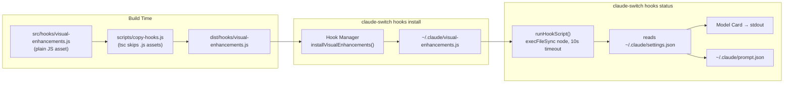

The visual enhancements hook is the second of two standalone JavaScript assets that Claude AI Switcher installs into `~/.claude/`, and it answers a question every multi-provider user eventually asks: *"which model am I actually talking to right now?"* Unlike the token tracker, which accumulates usage state across a session, this hook is **stateless** — on every invocation it reads `~/.claude/settings.json`, derives the active provider and model, renders an ANSI-decorated "model card" to stdout, and writes a provider-aware system prompt to `~/.claude/prompt.json`. This page explains its three visual surfaces (model card, provider metadata, context display), its self-contained detection logic, and how the CLI wires it into the `hooks` command group. The hook manager that installs it and the token tracker's live usage bar are covered on their own pages.

## Architecture: A Standalone, Dependency-Free Render Script

The first architectural fact to internalize is that `src/hooks/visual-enhancements.js` is deliberately **plain JavaScript with zero external dependencies** — only `fs`, `path`, and `os` from the Node standard library. This is a hard constraint of its deployment model: the file is copied verbatim to `~/.claude/visual-enhancements.js` and executed later by a bare `node` process, far away from the project's `node_modules`. Consequently, it cannot import the compiled TypeScript modules and must embed its own copies of provider endpoints, model capabilities, and context-window sizes as inline lookup tables. The file header documents its four advertised responsibilities: active model display with provider info, context usage bar, provider endpoint display, and custom system prompt injection.

Sources: [visual-enhancements.js](src/hooks/visual-enhancements.js#L1-L18)

The complete lifecycle, from source file to rendered output, flows through the hook manager and the build pipeline:

At runtime the script follows a strict read → derive → render sequence: `detectProvider()` resolves the provider key, `getCurrentModel()` picks the model ID, `getContextWindow()` sizes the context, and `createModelCard()` assembles the visual output. Two side effects conclude each run: the card is printed via `console.log`, and the generated system prompt is persisted. The `init()` entry point (and its alias `update()`, intended for post-switch refresh — both have identical bodies) chains these operations, and the trailing `require.main === module` guard makes the script self-executing whenever Node invokes the file directly rather than `require()`-ing it as a library.

Sources: [visual-enhancements.js](src/hooks/visual-enhancements.js#L283-L363)

## The Provider Metadata Table

Provider presentation is driven by a single static map, `PROVIDER_INFO`, keyed by the same provider identifiers the TypeScript core uses. Each entry carries three fields: a display `name`, an `endpoint` string (used in the injected system prompt, not the card), and an emoji `icon`. Note that two entries — Alibaba and Ollama — ship with **empty icon strings**, so their card headers render without an emoji; this is verifiable in the source rather than a rendering bug.

| Provider Key | Display Name | Endpoint Shown in Prompt | Icon |
|---|---|---|---|
| `anthropic` | Anthropic | `api.anthropic.com` | 🎭 |
| `alibaba` | Alibaba Model Studio | `coding-intl.dashscope.aliyuncs.com` | *(empty)* |
| `glm` | GLM/Z.AI | `z.ai` | 🤖 |
| `openrouter` | OpenRouter | `openrouter.ai` | 🌐 |
| `ollama` | Ollama (Local) | `localhost:4000` | *(empty)* |
| `gemini` | Gemini (Google) | `localhost:4001` | 💎 |

The endpoint column doubles as the *detection fingerprint* — these exact hostnames reappear in `detectProvider()` as substring match targets, creating a tight (if manually maintained) coupling between what the hook displays and what it detects. The `localhost:4000` and `localhost:4001` entries reflect the LiteLLM proxy ports used by the Ollama and Gemini providers respectively.

Sources: [visual-enhancements.js](src/hooks/visual-enhancements.js#L20-L52)

## Detection Logic: A Self-Contained Mirror of getCurrentProvider()

Because the hook cannot import the TypeScript core, it re-implements provider detection in miniature. `detectProvider()` reads `~/.claude/settings.json`, extracts `env.ANTHROPIC_BASE_URL`, and performs ordered substring checks against five endpoint fingerprints: dashscope → openrouter → localhost:4000 → localhost:4001 → z.ai. A sixth heuristic catches the GLM-via-MCP case: if `ANTHROPIC_DEFAULT_OPUS_MODEL` is set but the base URL is empty, the provider is GLM. Every failure path — missing file, malformed JSON, thrown error — degrades gracefully to `'anthropic'`, guaranteeing the card always renders.

Model resolution in `getCurrentModel()` follows the same env-var precedence the tier alias system uses: `ANTHROPIC_MODEL` wins outright; otherwise `ANTHROPIC_DEFAULT_OPUS_MODEL` (the GLM tier-map signal) is shown; the hardcoded fallback is `claude-opus-4-6-20250205`. This is a simplified re-derivation of the heuristics documented on the [Provider Detection Heuristics in getCurrentProvider()](10-provider-detection-heuristics-in-getcurrentprovider) page — the hook trades exactness (it ignores API-key fingerprints) for robustness (no code path can throw).

Sources: [visual-enhancements.js](src/hooks/visual-enhancements.js#L96-L158)

## The Model Card: Box Drawing, ANSI Palettes, and Capability Badges

`createModelCard()` is the visual centerpiece. It composes a fixed-width box (61 columns of box-drawing characters) with four zones: a header row pairing the provider icon and name in **bold cyan**, a separator, two info rows (Model, Context) with yellow labels and white values, and an optional capabilities block. The card's aesthetics are pure ANSI escape codes — no chalk, no external color library — drawn from a five-code palette defined inline.

| Element | ANSI Code | Visual Role |
|---|---|---|
| Header (`\x1b[36m` + `\x1b[1m`) | Cyan + Bold | Provider icon and name |
| Accent (`\x1b[33m`) | Yellow | Field labels: `Model:`, `Context:`, `Capabilities:` |
| Info (`\x1b[37m`) | White | Field values (model name, token count) |
| Dim (`\x1b[90m`) | Gray | Box borders and capability text |
| Reset (`\x1b[0m`) | — | Terminates every styled segment |

Two formatting details are worth noting for anyone extending the card. First, Claude model IDs get humanized: `claude-opus-4-6-20250205` becomes `Claude opus 4 6 20250205` via a prefix strip and hyphen replacement, while non-Claude IDs pass through untouched. Second, column alignment is manual — each row pads its content with `' '.repeat(Math.max(0, N - text.length))`, so adding a longer model name requires recalculating the padding constants. Capabilities are truncated to the first three entries joined with ` • `.

The capability badges themselves come from `MODEL_CAPABILITIES`, a ~35-entry static map spanning all seven providers, from Alibaba's `qwen3-coder-plus` (`1M Context`) to Anthropic's `claude-haiku-4-5-20251015` (`Fast Responses`). Unknown model IDs produce an empty array, which cleanly suppresses the capabilities block rather than rendering an empty row.

Sources: [visual-enhancements.js](src/hooks/visual-enhancements.js#L54-L94)

## The Context Display: Two Bars with Different Jobs

Context information appears in this file through two distinct mechanisms, and conflating them is the most common misreading of the codebase. The **static** mechanism is `getContextWindow(modelId)`, an inline lookup (defaulting to 200,000 tokens) that feeds the card's `Context:` row via `formatContext()` — a compactifier that renders 1,000,000 as `1.0M` and 262,144 as `262K`. This tells you the *ceiling* of your model.

The **dynamic** mechanism is `createContextBar(usedTokens, totalTokens)`, which renders a 30-character progress bar of `█` filled and `░` empty cells with a four-tier color escalation: green below 50% usage, yellow below 75%, red below 90%, and **magenta at ≥90%** — a deliberate "critical" signal distinct from red. However, a precise reading of `displayStatus()` reveals a subtlety: it invokes only `createModelCard()`. The context bar in *this* file is exported in the module interface but **not called in the default display path**. The live, session-accumulating usage bar you see in `hooks status` output comes from the sibling token tracker, whose own `createContextBar(percentage)` variant consumes real usage counters — that mechanism is documented on the [Token Tracker: Session Usage Counters and the Color-Coded Context Bar](24-token-tracker-session-usage-counters-and-the-color-coded-context-bar) page.

| Aspect | Card `Context:` Row | Token Tracker Bar |
|---|---|---|
| Data source | Static `CONTEXT_WINDOWS` table | Accumulated `token-usage.json` |
| Question answered | "How big *is* this model's window?" | "How much *have I used*?" |
| Rendered by | `createModelCard()` | `createContextBar(percentage)` in token-tracker.js |
| Update cadence | Per invocation, from settings | Per session, from usage counters |

Sources: [visual-enhancements.js](src/hooks/visual-enhancements.js#L160-L289)

## System Prompt Injection via prompt.json

The hook's non-visual output is the custom system prompt. `generateSystemPrompt()` assembles a `{ system: "..." }` object from the already-derived provider, model, and context values — five lines naming the provider, the endpoint, and the current configuration triple. `writeCustomPrompt()` then persists it as JSON to `~/.claude/prompt.json`, silently returning `false` on any write failure so that a read-only home directory degrades the hook to display-only mode rather than crashing the `hooks status` command. This artifact gives downstream tooling (or a curious user) a machine-readable snapshot of *what the switcher believed the configuration to be* at generation time, complementing the human-readable card.

Sources: [visual-enhancements.js](src/hooks/visual-enhancements.js#L291-L325)

## CLI Integration: How the Card Reaches Your Terminal

The hook manager treats `visual-enhancements.js` as a first-class managed asset: `areHooksInstalled()` reports it via a file-existence check on the destination, `installVisualEnhancements()` copies it with overwrite semantics from the packaged `hooks/` directory, and `removeVisualEnhancements()` deletes it and flips the `visualEnhancements` flag in `~/.claude/hooks-config.json`. Crucially, the card is never rendered in-process — `showVisualStatus()` delegates to `runHookScript()`, which spawns `node ~/.claude/visual-enhancements.js` via `execFileSync` with `stdio: "inherit"` and a **10-second timeout**, isolating the CLI from any failure inside the hook script.

The `hooks` command group in the CLI exposes four touchpoints for this asset:

| Command | Action | Manager Function |
|---|---|---|
| `claude-switch hooks install` | Installs both hooks (tracker + visual) | `installAllHooks()` |
| `claude-switch hooks install-visual` | Installs only visual enhancements | `installVisualEnhancements()` |
| `claude-switch hooks status` | Prints install flags, then runs both hooks' displays | `areHooksInstalled()` → `showVisualStatus()` |
| `claude-switch hooks remove-visual` | Deletes the asset and updates hook config | `removeVisualEnhancements()` |

The `hooks status` flow is the primary consumer: it prints a status matrix (`✓ Installed` / `Not installed` for each hook), then conditionally executes each installed hook's display. If neither is present, it nudges the user toward `hooks install`.

Sources: [hooks/index.ts](src/hooks/index.ts#L17-L42), [hooks/index.ts](src/hooks/index.ts#L64-L110), [hooks/index.ts](src/hooks/index.ts#L154-L191), [index.ts](src/index.ts#L1255-L1347), [index.ts](src/index.ts#L1390-L1402)

## Design Trade-offs Worth Knowing

Three consequences follow from this architecture, and they matter if you plan to modify the hook. First, **metadata duplication**: provider endpoints, model capabilities, and context windows exist in two places — the TypeScript model catalog (see [Model Catalog and Metadata: IDs, Context Windows, and Capabilities](11-model-catalog-and-metadata-ids-context-windows-and-capabilities)) and this file's inline tables — so adding a provider or model requires updating both, or the card will silently show stale data. Second, **manual layout arithmetic**: the card's fixed-width padding constants assume specific string lengths, making the format brittle against long model IDs. Third, **deployment coupling**: because the asset ships as raw `.js` that `tsc` does not process, the build pipeline needs `scripts/copy-hooks.js` to carry it into `dist/` — the rationale for which is covered on the [Hook Asset Build Pipeline: Why copy-hooks.js Exists Alongside tsc](26-hook-asset-build-pipeline-why-copy-hooks-js-exists-alongside-tsc) page. None of these are defects; they are the price of a hook that runs anywhere Node runs, with zero installation assumptions beyond the file copy itself.

## Related Reading

- **[Hook Manager: Installing, Removing, and Tracking Hook State](23-hook-manager-installing-removing-and-tracking-hook-state)** — the full lifecycle management behind the functions this page invokes
- **[Token Tracker: Session Usage Counters and the Color-Coded Context Bar](24-token-tracker-session-usage-counters-and-the-color-coded-context-bar)** — the sibling hook that owns the *live* usage bar
- **[Provider Detection Heuristics in getCurrentProvider()](10-provider-detection-heuristics-in-getcurrentprovider)** — the authoritative version of the detection logic this hook mirrors
- **[Installing Token Tracking and Visual Enhancement Hooks](6-installing-token-tracking-and-visual-enhancement-hooks)** — the first-run walkthrough that puts this asset on disk