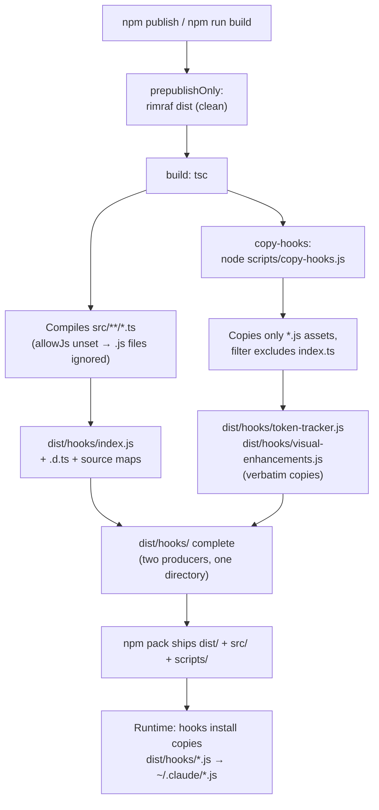

Most of this repository compiles from TypeScript to JavaScript with a single `tsc` invocation — yet `npm run build` runs **two** steps: `tsc && npm run copy-hooks`. This page explains why that second step exists. The short answer: `src/hooks/` contains two fundamentally different kinds of files — a TypeScript *module* that becomes part of the CLI, and plain-JavaScript *assets* that get deployed to users' `~/.claude/` directories — and the TypeScript compiler, by configuration and by design, only handles the first kind. Understanding this split explains the build script, the runtime path resolution in the hook manager, and a failure mode you may hit when working with hooks locally.

## Two Different Jobs in One Directory

`src/hooks/` looks like a single cohesive module, but its three files serve architecturally distinct roles. `index.ts` is the **Hook Manager** — a 208-line TypeScript module that the CLI imports and compiles like every other file under `src/`. The other two files, `token-tracker.js` and `visual-enhancements.js`, are **deployable payload assets**: standalone scripts that `claude-switch hooks install` copies verbatim into `~/.claude/`, where Claude Code itself executes them. They are never imported by the CLI's own code as modules; they are data that happens to be executable.

Sources: [index.ts](src/hooks/index.ts#L1-L22), [token-tracker.js](src/hooks/token-tracker.js#L1-L15), [package.json](package.json#L19-L26)

| File | Role | Consumers | Language | Lines |
|---|---|---|---|---|
| `index.ts` | Hook Manager module | Imported by `src/index.ts`, compiled into CLI | TypeScript | 208 |
| `token-tracker.js` | Deployment asset | Copied to `~/.claude/`, run by Claude Code and by `claude-switch hooks status` | Plain JS | 279 |
| `visual-enhancements.js` | Deployment asset | Copied to `~/.claude/`, run by Claude Code | Plain JS | 362 |

The asset scripts are deliberately self-contained. They require only Node.js built-ins (`fs`, `path`, `os`) — no `chalk`, no `commander`, no project modules — because once installed at `~/.claude/token-tracker.js`, they execute in complete isolation from the switcher's `node_modules`. This isolation has a visible cost: both scripts duplicate data that exists in typed form elsewhere in the codebase. `token-tracker.js` carries its own `MODEL_CONTEXT_WINDOWS` map with a comment noting it "matches src/models.ts", and `visual-enhancements.js` embeds its own `PROVIDER_INFO` table. The duplication is the price of being a standalone asset rather than a linked module.

Sources: [token-tracker.js](src/hooks/token-tracker.js#L10-L18), [visual-enhancements.js](src/hooks/visual-enhancements.js#L13-L21), [models.ts](src/models.ts#L4)

## The Gap tsc Leaves Behind

The TypeScript compiler configuration appears, at first glance, to cover everything: `include: ["src/**/*"]` matches every file under `src/`, including the hook assets. But TypeScript only *compiles* `.ts`/`.tsx`/`.d.ts` files unless the `allowJs` compiler option is enabled — and this project's `tsconfig.json` does not set it (it defaults to `false`). So the `.js` hook files are invisible to `tsc`: they are neither type-checked nor emitted into `outDir`. Running `tsc` alone produces `dist/hooks/index.js` plus its declaration and source-map siblings, and nothing else.

Sources: [tsconfig.json](tsconfig.json#L1-L19), [tsconfig.json](tsconfig.json#L17-L18)

This is a deliberate split of responsibility, visible in the resulting directory layout. A built `dist/hooks/` contains files from two different producers: `index.js`, `index.d.ts`, `index.js.map`, and `index.d.ts.map` are compiler artifacts (note tsc's `"use strict"` preamble in the emitted `index.js`), while `token-tracker.js` and `visual-enhancements.js` are byte-identical copies of the sources — verifiable by comparing checksums between `src/hooks/` and `dist/hooks/` after a build. The declaration and map files exist only for the compiled module; the assets travel as-is.

| File in `dist/hooks/` | Produced by | Evidence |
|---|---|---|
| `index.js` | `tsc` | `"use strict";` preamble, CommonJS emit from ES module source |
| `index.d.ts`, `index.d.ts.map`, `index.js.map` | `tsc` | `declaration`/`declarationMap`/`sourceMap` enabled in tsconfig |
| `token-tracker.js`, `visual-enhancements.js` | `copy-hooks.js` | Byte-identical to `src/hooks/` sources; no maps or declarations generated |

## The Runtime Contract That Demands the Assets in dist/

The hook manager enforces a strict runtime contract: the asset files **must** sit in `dist/hooks/` beside the compiled `index.js`. Look at how the source paths are constructed: `path.join(__dirname, "..", "hooks", "token-tracker.js")`. When the compiled manager runs, `__dirname` is `<pkg>/dist/hooks`; joining with `..` then `hooks` lands right back in `<pkg>/dist/hooks` — the directory mirrors itself. This construction is not accidental circularity: it works identically under `ts-node` (where `__dirname` is `src/hooks` and it resolves to the source assets) and in the compiled output (where it resolves to the copied assets), so the same code runs correctly in both development and production layouts.

Sources: [index.ts](src/hooks/index.ts#L17-L22)

If the assets are missing — for example, someone ran bare `tsc` without the copy step — the manager detects it and fails fast with an explicit diagnostic: `installTokenTracker()` checks `fs.pathExists(TOKEN_TRACKER_SRC)` and throws `"Token tracker source not found. Please rebuild the project."` rather than copying a nonexistent file. The error message itself tells you the build pipeline is the thing that went wrong, which is exactly right: the missing step is `npm run copy-hooks`.

Sources: [index.ts](src/hooks/index.ts#L47-L59)

Note also that even when the CLI *interacts* with an installed hook — for `hooks status` or `hooks reset` — it never imports the asset's code into its own process. `runHookScript()` spawns it via `execFileSync("node", [scriptPath])` with a 10-second timeout, keeping the asset at arm's length in an isolated subprocess. The asset pipeline (copy) and the execution model (subprocess) reinforce the same principle: hooks are payloads, not linked code.

Sources: [index.ts](src/hooks/index.ts#L151-L159)

## Inside copy-hooks.js

The bridge script is deliberately minimal — 15 lines. It computes source and destination directories relative to its own location (`src/hooks` → `dist/hooks` in the repo root), ensures the destination exists with `fs-extra`'s `ensureDirSync`, and performs a recursive copy with a filter callback that admits directories unconditionally but only copies files whose extension is `.js`. That filter is the script's one piece of real logic: it guarantees that `index.ts` — the manager — is *never* shipped as a raw TypeScript file into `dist/`, because compiling it is tsc's job, not the copier's. Only deployable JavaScript payload travels.

Sources: [copy-hooks.js](scripts/copy-hooks.js#L1-L16)

The script depends on `fs-extra`, which is worth noting because `fs-extra` is a **production** dependency, not a devDependency — the copy step works both in a fresh clone (`npm ci` installs it) and in any environment where the package's dependency tree is present. The dependency choice makes the build pipeline self-contained without needing a second, build-only copy of the same library.

Sources: [copy-hooks.js](scripts/copy-hooks.js#L1-L2), [package.json](package.json#L43-L48)

## The Complete Build Pipeline

To see how the pieces compose, trace a publish from the npm lifecycle down to the files an end user actually receives. The chain is: `prepublishOnly` wipes `dist/` with rimraf, then `build` runs `tsc` (which compiles every `.ts` under `src/`, honoring `rootDir: ./src` → `outDir: ./dist`), then `copy-hooks` runs the bridge script. Two packaging details complete the picture: `dist/` is excluded by `.gitignore`, so no stale build output is ever committed and every consumer builds from source; and the npm `files` allowlist ships `dist/`, `src/`, *and* `scripts/` — meaning the published package retains the copy script itself, keeping the build reproducible from an installed copy of the package.

The flowchart above reads top-to-bottom through the npm script lifecycle: the clean step guarantees reproducibility, the two parallel build steps fill `dist/hooks/` with their respective outputs, and the runtime consumption at the bottom is where the installed asset finally executes. The key insight the diagram encodes is that `dist/hooks/` has **two producers** — remove either step and the directory is incomplete in a different way each time.

Sources: [package.json](package.json#L19-L26), [package.json](package.json#L9-L18), [.gitignore](.gitignore#L10-L11), [copy-hooks.js](scripts/copy-hooks.js#L4-L15)

## Why a Dedicated Script: The Historical Answer

The repository's git history answers "why does this file exist as a script at all?" directly. Commit `7c7b58a` — the same commit that introduced the entire hooks feature — records a three-stage evolution in its review-feedback notes: the copy step was originally a **Windows-only `xcopy`** command, was then replaced with a cross-platform inline `node -e` snippet to fix portability, and was finally extracted into a dedicated `scripts/copy-hooks.js` "for maintainability." The same commit's notes also record the companion security change: `require()` of hook scripts was refactored to `child_process.execFileSync` "for security isolation," cementing the payload-not-module design.

Sources: [copy-hooks.js](scripts/copy-hooks.js#L1-L16), [index.ts](src/hooks/index.ts#L151-L159)

The chosen design sits within a small space of alternatives, each with real trade-offs. The comparison below evaluates the four plausible approaches; the first three are reconstructions of the design space (grounded in what TypeScript and npm actually do), while the historical path through options two and four is documented in the commit itself:

| Approach | How it works | Pros | Cons |
|---|---|---|---|
| Enable `allowJs: true` in tsconfig | tsc emits `.js` files from `src/` alongside compiled output | Zero extra scripts; single build step | Pulls payload assets into the compiler's program; assets become compilation artifacts rather than verbatim payloads; less explicit intent |
| Inline copy in package.json (`node -e "..."`) | Copy logic embedded in the npm script string | No extra file | Unreadable, hard to test or extend; this was the intermediate historical stage before extraction |
| Assets in a top-level `assets/` directory | Payload files live outside `src/`, copied at build time | Clean separation of module vs. asset | Duplicates the `__dirname`-mirroring trick's layout assumptions; hooks live far from their manager; requires same copy step anyway |
| **Dedicated `scripts/copy-hooks.js` (current)** | 15-line fs-extra script with `.js`-only filter, chained after tsc | Explicit, readable, cross-platform, filterable, dependency already present | One more file and one more build step to know about |

The `.js`-extension filter in the current script also future-proofs the pipeline: any TypeScript file later added to `src/hooks/` will be compiled by tsc but excluded from the copy, preventing duplicate or stale artifacts, while any new pure-JS asset dropped into the directory ships automatically.

Sources: [copy-hooks.js](scripts/copy-hooks.js#L8-L13), [tsconfig.json](tsconfig.json#L1-L19), [package.json](package.json#L20-L21)

## Failure Modes and Diagnostics

Because `dist/hooks/` has two independent producers, builds can fail in ways that produce *partial* output. The table below maps the symptoms you are most likely to encounter when working on the hooks system locally:

| Symptom | Root Cause | Fix |
|---|---|---|
| `hooks install` throws "Token tracker source not found. Please rebuild the project." | `dist/hooks/token-tracker.js` absent — `tsc` was run without `copy-hooks` | Run `npm run build` (not bare `tsc`) |
| `hooks install` throws the visual-enhancements equivalent | Same gap, for `visual-enhancements.js` | Same — `npm run build` |
| Installed hook in `~/.claude/` behaves like an older version | Stale `dist/` from a previous build skipped the clean step | `npm run clean && npm run build`, then reinstall |
| Edited `src/hooks/*.js` but behavior unchanged after `hooks install` | Assets were copied before your edit (copy is not incremental-aware in your workflow) | Rebuild to refresh `dist/hooks/`, reinstall |
| `npm run copy-hooks` fails with module-not-found for `fs-extra` | Dependencies not installed | `npm ci` — `fs-extra` is a production dependency |

The general diagnostic principle: check `ls dist/hooks` first. A healthy build shows five files — the four tsc artifacts for `index` plus the two copied assets. Anything less tells you exactly which pipeline stage was skipped.

Sources: [index.ts](src/hooks/index.ts#L47-L50), [index.ts](src/hooks/index.ts#L64-L67), [package.json](package.json#L20-L25), [copy-hooks.js](scripts/copy-hooks.js#L1-L16)

## Summary

`copy-hooks.js` exists because of a deliberate architectural boundary: the hook scripts are **self-contained deployment payloads** that must reach the user's `~/.claude/` directory as verbatim plain JavaScript, while the rest of the codebase is TypeScript compiled by `tsc`. With `allowJs` unset, `tsc` cannot see the `.js` assets, so a 15-line post-compile copy step bridges the gap and satisfies the runtime contract that the hook manager's `__dirname`-based path resolution imposes on `dist/hooks/`. The pipeline's history — from Windows-only `xcopy`, through an inline cross-platform snippet, to the dedicated filter-aware script — reflects a converging emphasis on portability, explicitness, and maintainability.

**Where to go next**: To see the manager that consumes these assets at runtime — install, removal, and the `~/.claude/hooks-config.json` state file — read [Hook Manager: Installing, Removing, and Tracking Hook State](23-hook-manager-installing-removing-and-tracking-hook-state). For what the copied `token-tracker.js` actually does once installed, see [Token Tracker: Session Usage Counters and the Color-Coded Context Bar](24-token-tracker-session-usage-counters-and-the-color-coded-context-bar), and for `visual-enhancements.js`, see [Visual Enhancements: Model Cards, Provider Info, and Context Display](25-visual-enhancements-model-cards-provider-info-and-context-display). The broader release lifecycle that this pipeline plugs into — `prepublishOnly`, lockfile discipline, and version resolution — is covered in [Build and Release Workflow: Version Resolution and Lockfile Discipline](27-build-and-release-workflow-version-resolution-and-lockfile-discipline), and the day-to-day `npm ci` → build → `npm link` loop is documented in [Developer Environment Setup: npm ci, Build, and npm link Workflow](3-developer-environment-setup-npm-ci-build-and-npm-link-workflow).