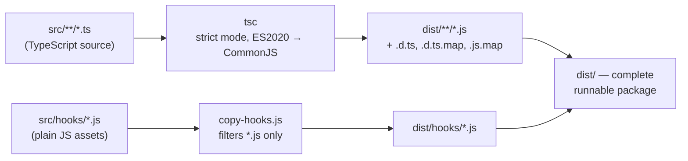
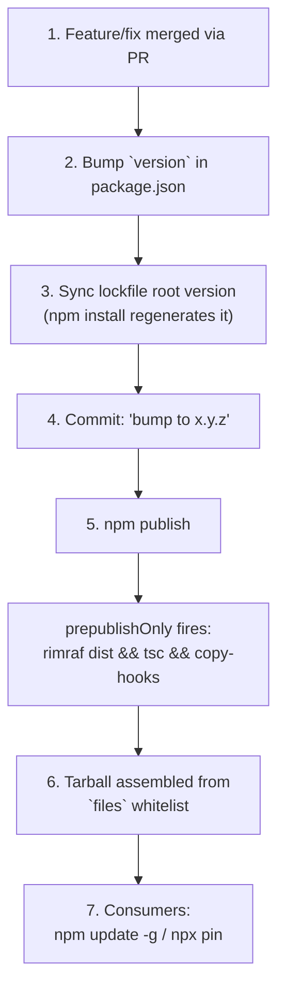
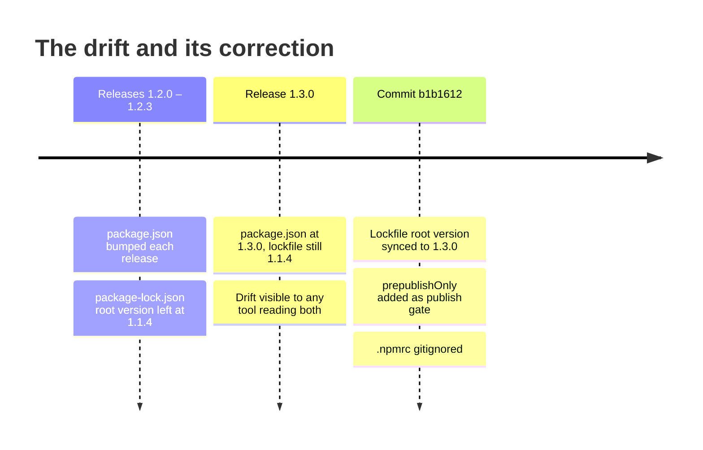

This page explains how `claude-ai-switcher` turns TypeScript source into a published npm package — and, more importantly, the disciplines that keep that process deterministic. Two design decisions anchor everything here: the CLI **reads its own version from `package.json` at runtime** so the reported version can never drift from the manifest, and the repository treats `package-lock.json` as a **pristine, intentionally-committed artifact** that `npm ci` reproduces exactly. We'll walk the build pipeline, the release path, the lockfile rules, a real lockfile-drift incident from this repository's history, and the second, non-npm lockfile (`skills-lock.json`) that pins vendored agent skills.

## The Two-Stage Build Pipeline

The entire build is defined by one script line: `tsc && npm run copy-hooks`. Stage one compiles TypeScript; stage two copies plain-JavaScript hook assets that `tsc` deliberately ignores. Neither stage is optional, and their ordering is enforced by `&&` — if compilation fails, nothing is copied.



The split exists because the hooks subsystem (`token-tracker.js`, `visual-enhancements.js`) is shipped to `~/.claude/` as **verbatim JavaScript** — they run inside Claude Code's own hook runtime, not inside this CLI's compiled bundle. The `tsconfig.json` settings confirm the contract: `rootDir: "./src"` and `outDir: "./dist"` mirror the source tree one-to-one, `strict: true` guarantees type-safe compilation, and `declaration`/`declarationMap`/`sourceMap` emit debuggable artifacts. Note that `exclude` lists `dist` so a previous build's output can never be fed back into a later compile.

Sources: [package.json](package.json#L19-L26), [tsconfig.json](tsconfig.json#L1-L19), [scripts/copy-hooks.js](scripts/copy-hooks.js#L1-L16)

The copy stage is intentionally narrow: it copies only files with a `.js` extension from `src/hooks/` to `dist/hooks/`, creating the destination directory if needed. This exactness matters because the hook manager later resolves hook paths with `path.join(__dirname, "..", "hooks", "token-tracker.js")` — after compilation that resolves to `dist/hooks/token-tracker.js`, which only exists because `copy-hooks` put it there. If you change one side of this contract (the copy filter or the path resolution), you must verify the other. The mechanics of why `copy-hooks.js` exists at all are covered in depth in [Hook Asset Build Pipeline: Why copy-hooks.js Exists Alongside tsc](26-hook-asset-build-pipeline-why-copy-hooks-js-exists-alongside-tsc).

Sources: [scripts/copy-hooks.js](scripts/copy-hooks.js#L4-L13), [src/hooks/index.ts](src/hooks/index.ts#L17-L22)

Beyond `build`, the manifest defines a small, complete script surface:

| Script | Command | Purpose |
|---|---|---|
| `build` | `tsc && npm run copy-hooks` | Full production build (compile + hook assets) |
| `copy-hooks` | `node scripts/copy-hooks.js` | Stage two: JS asset copy |
| `clean` | `rimraf dist` | Remove build output (cross-platform safe) |
| `dev` | `ts-node src/index.ts` | Run from source, no build |
| `start` | `node dist/index.js` | Run the built CLI |
| `prepublishOnly` | `npm run clean && npm run build` | **npm lifecycle gate**: clean rebuild before publish |

Two details deserve attention. First, `clean` uses `rimraf` (a dev dependency) rather than `rm -rf` — this is the cross-platform compatibility strategy detailed in [Cross-Platform Compatibility: Path Handling, Platform Detection, and rimraf](28-cross-platform-compatibility-path-handling-platform-detection-and-rimraf). Second, there is **no CI pipeline directory in this repository** — no `.github/workflows` exists — so `prepublishOnly` is the single automated quality gate a release passes through: it guarantees that whatever tarball npm assembles was built from a freshly cleaned `dist/`, never from stale artifacts of a previous compile.

Sources: [package.json](package.json#L19-L26)

## Version Resolution: One Source of Truth

A subtle but exemplary pattern lives at the top of `src/index.ts`. Instead of hardcoding a version constant that would need updating alongside `package.json` (a classic drift hazard), the CLI reads the manifest at runtime:

```typescript
// Read version from package.json at runtime so `claude-switch --version` never drifts.
// package.json lives outside src/rootDir, so resolve it relative to this compiled file.
const pkgVersion = (fs.readJsonSync(path.join(__dirname, "..", "package.json")) as { version: string }).version;

program
  .name("claude-switch")
  .description("Switch between AI providers for Claude Code. Also provides OpenCode helper commands.")
  .version(pkgVersion);
```

The `path.join(__dirname, "..", "package.json")` resolution is what makes this work in **every execution context** the project supports. Because `rootDir` is `src` and `outDir` is `dist`, the compiled file always sits exactly one directory below the package root — whether that root is a git checkout or an installed npm tarball:

| Execution context | `__dirname` of entry file | Resolves to | Works? |
|---|---|---|---|
| `npm install -g` / `npx` | `<prefix>/lib/node_modules/claude-ai-switcher/dist` | Tarball root's `package.json` (npm always ships it) | ✅ |
| git clone + `npm link` | repo's `dist/` | Repo root `package.json` | ✅ |
| `npm run dev` (ts-node) | repo's `src/` | Repo root `package.json` | ✅ |

The comment in the source makes the intent explicit: *"`claude-switch --version` never drifts."* The manifest's `version` field becomes the single point of truth, consumed by npm's registry metadata, by the lockfile's root entry, and by the CLI's `--version` flag simultaneously. For consumers, this is what makes version pinning trustworthy — the `npx --package claude-ai-switcher@1.2.3` flow documented in the README reports exactly the version npm resolved.

Sources: [src/index.ts](src/index.ts#L92-L101), [package.json](package.json#L2-L8)

## The Release Path: From Version Bump to npm Publish

The repository has no git tags and no release branches. A release is, in its entirety: a version bump in `package.json`, a matching lockfile sync, a commit, and `npm publish`. The commit history shows this as a consistent, disciplined rhythm — `bump to 1.2.1 (#18)`, `bump to 1.2.2 (#19)`, `bump to 1.2.3 (#20)` — each release riding along with the fix or feature that motivated it, merged via numbered pull requests.



Step 6 is governed by the `files` whitelist, which is worth reading closely because it ships more than the minimum: alongside the required `dist/`, it includes `src/`, `scripts/`, `tsconfig.json`, and four developer-documentation files (`AGENTS.md`, `ARCHITECTURE.md`, `CLAUDE.md`, `QWEN.md`). Shipping `scripts/copy-hooks.js` and the TypeScript sources means the published package is **self-rebuildable** by anyone who installs it — a deliberate choice for a developer-facing tool. npm additionally auto-includes `package.json` itself (which the runtime version read depends on), plus `README.md` and `LICENSE`. The `bin` mapping (`claude-switch` → `dist/index.js`) works because the source file carries the `#!/usr/bin/env node` shebang on line 1, which `tsc` preserves verbatim into the compiled output. The `engines` field (`node >=18.0.0`) declares the minimum runtime and is recorded in the lockfile's root entry too.

Sources: [package.json](package.json#L9-L18), [package.json](package.json#L25), [src/index.ts](src/index.ts#L1), [AGENTS.md](AGENTS.md#L42-L56)

Release security was hardened in the same commit that fixed the lockfile drift (see below): `.npmrc` was added to `.gitignore` because npm auth tokens stored there are **user-specific secrets** — a stray commit of that file during a publish session would leak registry credentials. The gitignore now explicitly annotates this entry with that rationale.

Sources: [.gitignore](.gitignore#L32), [package.json](package.json#L56-L58)

## Lockfile Discipline: The `npm ci` Doctrine

The repository's dependency doctrine is stated verbatim in the README and repeated across the developer docs:

> **Dependency flow:** use `npm ci` after every `git pull` — it never modifies `package-lock.json`. Use `npm install <pkg>` / `npm update` only when intentionally adding/upgrading a dep, then commit the updated lockfile.

This divides all dependency operations into two categories with opposite semantics:

| Command | Mutates lockfile? | Reproduces lockfile exactly? | When to use here |
|---|---|---|---|
| `npm ci` | ❌ Never | ✅ Yes — deletes `node_modules`, installs pinned set | After every `git pull`, in every fresh clone |
| `npm install <pkg>` | ✅ Yes | ❌ Resolves ranges anew | Only when intentionally adding a dependency |
| `npm update` | ✅ Yes | ❌ Bumps within semver ranges | Only for deliberate patch refreshes |

The rationale is visible in the lockfile's structure. `package-lock.json` is `lockfileVersion: 3` and pins **86 packages total — 23 production, 63 development** — each with an exact version, a `resolved` registry URL, and a `sha512` integrity hash. Meanwhile `package.json` declares only loose caret ranges (`^11.1.0`, `^5.3.0`, …) for its 4 runtime and 5 dev dependencies. The ranges communicate compatibility intent; the lockfile captures the actual tested resolution. A representative sample of what's pinned:

| Package | Declared range | Pinned in lockfile | Role |
|---|---|---|---|
| `commander` | `^11.1.0` | `11.1.0` | Runtime — CLI framework |
| `fs-extra` | `^11.2.0` | `11.3.5` | Runtime — file operations |
| `chalk` | `^5.3.0` | `5.6.2` | Runtime — terminal colors |
| `ora` | `^8.0.1` | `8.2.0` | Runtime — spinners (loaded via dynamic `await import`, with a `.catch(() => null)` degradation in one path) |
| `typescript` | `^5.3.0` | `5.9.3` | Dev — the build itself |
| `rimraf` | `^5.0.0` | `5.0.10` | Dev — `clean` script |

The distinction between the 23-package production tree and the 63-package development tree is exactly why `npm ci` matters for consumers of the git workflow: it installs what the lockfile says, nothing more, and refuses to quietly rewrite the lockfile when ranges and pins disagree.

Sources: [README.md](README.md#L58-L79), [package.json](package.json#L43-L55), [package-lock.json](package-lock.json#L1-L20), [src/index.ts](src/index.ts#L967)

## Anatomy of a Lockfile Drift Incident

The discipline above wasn't aspirational — it was learned. Commit `b1b1612` ("chore: sync lockfile to 1.3.0 and harden npm publish, #22") documents what happens when version bumps skip the lockfile: the diff shows `package.json` at `1.3.0` while **both** version fields inside `package-lock.json` (the top-level `"version"` and the root entry under `packages."`) still read `1.1.4` — stale across four releases (1.2.0, 1.2.1, 1.2.2, 1.2.3). The manifest and its lockfile snapshot had diverged, meaning the lockfile no longer described the package it sat next to.



The corrective commit did three things at once: synced both lockfile version fields, added `prepublishOnly` so publishes always run a clean build, and gitignored `.npmrc`. The practical lesson for contributors is simple — **a version bump is not complete until the lockfile's two root version fields match**, which is what naturally happens if you bump with `npm version` (or run `npm install` after editing `package.json`) and commit the resulting lockfile change together with the manifest change.

Lockfile updates, when they do happen, follow their own convention in this repository's history: they are separate, explicitly-labeled commits such as `chore(deps): refresh dependencies to latest patches` (`43448ce`), whose message records that six packages were bumped within their semver ranges, that `package.json` ranges were unchanged, and that the build was verified with zero vulnerabilities. That message is a small template for lockfile-commit hygiene: what moved, why, and what was verified.

Sources: [package-lock.json](package-lock.json#L1-L20), [package.json](package.json#L3)

## A Second Lockfile: `skills-lock.json`

Version discipline in this repository extends beyond npm. `skills-lock.json` is a separate, hand-rolled lockfile for **vendored agent skills** — currently one entry, `liteparse`, sourced from `run-llama/llamaparse-agent-skills` on GitHub. Its schema mirrors npm's philosophy with different mechanics: a schema `version` field, then a per-skill record with the upstream `source`, a `sourceType` (`github`), and a `computedHash` — a SHA-256 digest of the skill's content.

This hash pinning exists because the skill is not stored once but **four times**: identical copies live in `.agents/skills/`, `.kiro/skills/`, `.qwen/skills/`, and the root `skills/` directory — one per AI-coding-tool convention (verified byte-identical across all four). Without a hash anchor, edits to any copy would drift silently; with it, a re-sync can detect whether the vendored content still matches what was originally installed. It is the same reproducibility contract as `package-lock.json` — exact content, verifiable integrity — applied to a dependency ecosystem npm knows nothing about.

Sources: [skills-lock.json](skills-lock.json#L1-L10)

## Pitfalls and Checklist

| Pitfall | Symptom | Prevention |
|---|---|---|
| Bumping `package.json` without the lockfile | Manifest/lockfile version mismatch (the 1.1.4 incident) | Bump via `npm version`, commit both files together |
| Running `npm install` casually | Lockfile silently rewritten; teammates' builds diverge | `npm ci` for syncs; `npm install <pkg>` only for intentional changes |
| Adding a hook file with non-`.js` extension | Asset missing from `dist/hooks/` | The copy filter accepts `.js` only — keep hooks plain JS |
| Editing only `src/hooks/*.js` without rebuilding | Installed CLI uses stale hooks | `npm run build` copies hooks; never edit `dist/` directly |
| Hardcoding a version string anywhere | `--version` drifts from manifest | Read version at runtime from `package.json` (the established pattern) |
| Committing `.npmrc` during a publish session | Registry auth token leak | It's gitignored — keep it that way |

The day-to-day contributor loop, in full: `git pull` → `npm ci` → edit → `npm run build` → verify → commit. That sequence is documented identically in the README, AGENTS.md, and CLAUDE.md, and it is the minimal loop that keeps every clone byte-for-byte reproducible. For the broader environment setup this loop sits inside, see [Developer Environment Setup: npm ci, Build, and npm link Workflow](3-developer-environment-setup-npm-ci-build-and-npm-link-workflow).

Sources: [README.md](README.md#L70-L79), [AGENTS.md](AGENTS.md#L69-L93)

## Where to Go Next

With the build and release mechanics in hand, natural continuations are [Cross-Platform Compatibility: Path Handling, Platform Detection, and rimraf](28-cross-platform-compatibility-path-handling-platform-detection-and-rimraf) (why `rimraf` replaced `rm -rf` in `clean`), [Step-by-Step Guide: Adding a New AI Provider to the Switcher](29-step-by-step-guide-adding-a-new-ai-provider-to-the-switcher) (the contribution workflow this build pipeline serves), and [Repository Conventions: CLAUDE.md, AGENTS.md, ARCHITECTURE.md, and the Zread Wiki](30-repository-conventions-claude-md-agents-md-architecture-md-and-the-zread-wiki) (why the dependency doctrine is restated across four doc files — including the copies shipped inside the npm tarball itself).