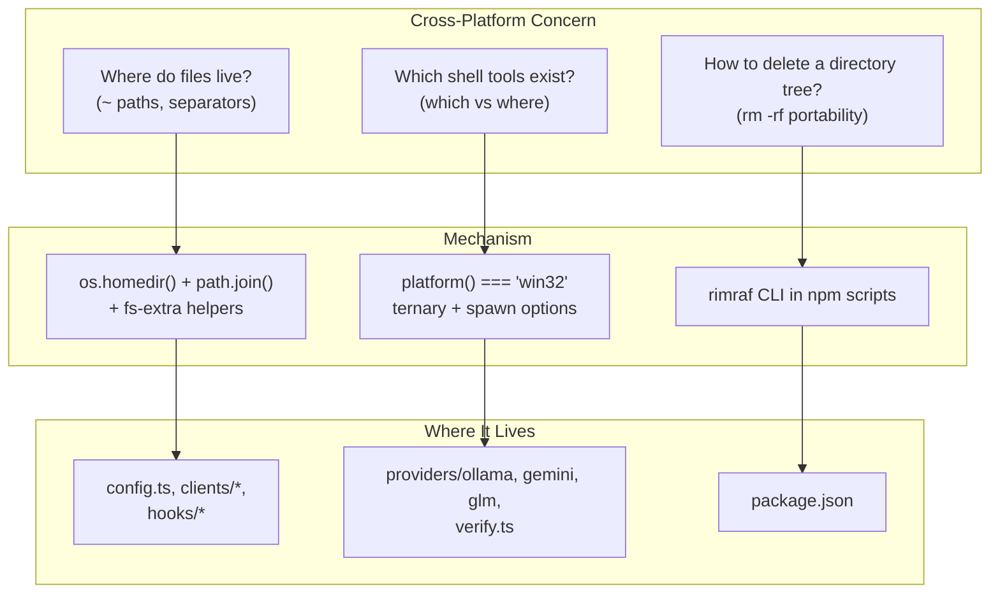

Claude AI Switcher runs as a CLI tool on any machine where Node.js ≥ 18 is installed, which means its code must behave identically on macOS, Linux, and Windows. This page explains the three concrete mechanisms the codebase uses to achieve that: a **path construction strategy** based on `os.homedir()` + `path.join()`, a **platform detection pattern** that branches on `platform() === "win32"` when shelling out to system tools, and **rimraf**, a dev-only dependency that makes the build's clean step portable. Understanding these patterns is essential before adding a new provider or touching the build pipeline, because every external interaction in this codebase falls into one of these three categories.

## The Three-Pillar Strategy

Before diving into implementation detail, it helps to see the overall shape of the compatibility strategy. Every cross-platform concern in this repository maps to exactly one of three pillars, and each pillar lives in a predictable layer of the architecture:



The separation is clean: **run-time file I/O never hardcodes a separator**, **process spawning never assumes a Unix shell**, and **build-time cleanup never assumes `rm -rf`**. The sections below examine each pillar with the exact call sites.

Sources: [package.json](package.json#L56-L58), [src/config.ts](src/config.ts#L7-L12), [src/providers/ollama.ts](src/providers/ollama.ts#L48-L60)

## Pillar 1: Path Handling with os.homedir() and path.join()

The foundational rule in this codebase is that **no module ever writes a literal `~` expansion or a hardcoded `/` separator into a filesystem path**. Instead, every user-scoped location is derived at module load time by combining `os.homedir()` — which resolves to `C:\Users\<name>` on Windows and `/home/<name>` or `/Users/<name>` elsewhere — with `path.join()`, which emits the platform-correct separator. The configuration manager demonstrates the canonical form: `CONFIG_DIR` is built once as `path.join(os.homedir(), ".claude-ai-switcher")` and every subsequent path (`CONFIG_FILE`) is composed from it. A repository-wide scan for `USERPROFILE`, `process.env.HOME`, or string-concatenated separators returns zero hits, confirming the pattern is enforced without exception.

Sources: [src/config.ts](src/config.ts#L7-L12)

Every layer of the [architecture](7-architecture-overview-cli-clients-providers-and-config-storage-layers) follows the same construction. The table below consolidates all derived filesystem anchors across the codebase:

| Module | Anchor Expression | Resolves To (Unix) | Purpose |
|---|---|---|---|
| `src/config.ts` | `path.join(os.homedir(), ".claude-ai-switcher")` | `~/.claude-ai-switcher/` | Switcher's own key/config store |
| `src/clients/claude-code.ts` | `path.join(os.homedir(), ".claude")` | `~/.claude/` | Claude Code settings + hooks |
| `src/clients/claude-code.ts` | `path.join(os.homedir(), ".claude.json")` | `~/.claude.json` | Onboarding flag |
| `src/clients/opencode.ts` | `path.join(os.homedir(), ".config", "opencode", "opencode.json")` | `~/.config/opencode/opencode.json` | OpenCode provider config |
| `src/hooks/index.ts` | `path.join(os.homedir(), ".claude")` | `~/.claude/` | Hook install destinations |
| `src/hooks/token-tracker.js` | `path.join(os.homedir(), '.claude', 'token-usage.json')` | `~/.claude/token-usage.json` | Session usage counters |
| `src/hooks/visual-enhancements.js` | `path.join(os.homedir(), '.claude', 'settings.json')` | `~/.claude/settings.json` | Hook reads of tier env vars |

Sources: [src/config.ts](src/config.ts#L11-L12), [src/clients/claude-code.ts](src/clients/claude-code.ts#L31-L33), [src/clients/opencode.ts](src/clients/opencode.ts#L23-L25), [src/hooks/index.ts](src/hooks/index.ts#L17-L22), [src/hooks/token-tracker.js](src/hooks/token-tracker.js#L14-L15), [src/hooks/visual-enhancements.js](src/hooks/visual-enhancements.js#L17-L18)

A second, subtler path rule applies to **code-relative paths**. The hook manager locates its source assets via `path.join(__dirname, "..", "hooks", "token-tracker.js")` rather than a literal string, which keeps resolution correct regardless of where the package is installed (`node_modules` on any OS, or an `npm link` symlink during development). The same technique appears in the build pipeline: `scripts/copy-hooks.js` computes both its source and destination from `path.join(__dirname, '..', ...)` before using `fs-extra`'s `ensureDirSync`/`copySync`. This matters because tsc does not copy `.js` assets — the topic explored in [Hook Asset Build Pipeline](26-hook-asset-build-pipeline-why-copy-hooks-js-exists-alongside-tsc) — and that copy must survive Windows path semantics.

Sources: [src/hooks/index.ts](src/hooks/index.ts#L18-L22), [scripts/copy-hooks.js](scripts/copy-hooks.js#L4-L13)

The final piece of the path pillar is the choice of **`fs-extra` over raw `fs` for directory operations**. Calls like `fs.ensureDir(CLAUDE_DIR)` (used by both clients before writing settings, and by the config manager) create intermediate directories recursively and idempotently — behavior that would otherwise require manual `mkdir` with `{ recursive: true }` and existence checks. `fs.pathExists` and `fs.copy` similarly replace platform-divergent manual sequences. The hook scripts themselves (`token-tracker.js`, `visual-enhancements.js`) use only Node-core `fs` for simple read/write, which is platform-neutral by itself, but the TypeScript layer consistently standardizes on `fs-extra` as a runtime dependency.

Sources: [src/config.ts](src/config.ts#L26-L28), [src/clients/claude-code.ts](src/clients/claude-code.ts#L100-L112), [src/clients/opencode.ts](src/clients/opencode.ts#L52-L67), [package.json](package.json#L43-L48)

## Pillar 2: Platform Detection with platform() === "win32"

File I/O is only half the compatibility story; the switcher also shells out to external CLIs — `litellm`, `ollama`, and `coding-helper` — and the way you ask *"is this tool installed?"* differs by operating system. Unix systems answer with `which <tool>`, while Windows cmd.exe provides `where <tool>`. The codebase resolves this with a single, deliberately repeated idiom:

```typescript
const cmd = platform() === "win32" ? "where litellm" : "which litellm";
await execAsync(cmd);
```

This ternary works because `child_process.exec` always invokes a shell (`/bin/sh` on Unix, `cmd.exe` on Windows), so the chosen command string is interpreted by the platform's native shell. The pattern appears at five call sites, each guarded by a try/catch that converts a nonzero exit code into a `false`/error result:

| Call Site | Tool Being Probed | win32 Branch | Unix Branch | Consumer |
|---|---|---|---|---|
| `src/providers/ollama.ts:54` | `litellm` | `where litellm` | `which litellm` | Proxy startup precheck |
| `src/providers/ollama.ts:71` | `ollama` | `where ollama` | `which ollama` | Local runtime precheck |
| `src/providers/gemini.ts:55` | `litellm` | `where litellm` | `which litellm` | Proxy startup precheck |
| `src/providers/glm.ts:35` | `coding-helper` | `where coding-helper` | `which coding-helper` | GLM switch precheck |
| `src/verify.ts:98` | `coding-helper` | `where coding-helper` | `which coding-helper` | GLM health verification |

Sources: [src/providers/ollama.ts](src/providers/ollama.ts#L48-L77), [src/providers/gemini.ts](src/providers/gemini.ts#L48-L61), [src/providers/glm.ts](src/providers/glm.ts#L29-L41), [src/verify.ts](src/verify.ts#L91-L104)

Two implementation details make this pattern safe and lightweight. First, the `os` and `child_process` modules are loaded through **dynamic `await import()`** inside the function body rather than a top-level static import — this defers native-module loading until a provider is actually used, so running `claude-switch list` never pays the cost of spawning machinery. Second, the check itself is intentionally minimal: exit status only, with stdout discarded, which is part of the lightweight verification philosophy described in [API Key Verification](21-api-key-verification-lightweight-health-checks-and-key-masking). Note that not everything needs this ternary: liveness checks for the Ollama runtime and LiteLLM proxies use plain `fetch("http://localhost:<port>/health")`, which is identical on every platform — a deliberate preference for HTTP probing over shell probing wherever possible.

Sources: [src/providers/ollama.ts](src/providers/ollama.ts#L82-L111), [src/providers/gemini.ts](src/providers/gemini.ts#L84-L96)

## The Spawn Divergence: shell: false vs shell: true

The most instructive cross-platform detail in the codebase is a small asymmetry between the two proxy spawners. Both start LiteLLM as a **detached background process** with `detached: true`, `stdio: "ignore"`, and an immediate `child.unref()` so the parent CLI can exit without killing the proxy — the lifecycle covered in [Ollama Provider](17-ollama-provider-local-models-with-detached-litellm-proxy-lifecycle-on-port-4000) and [Gemini Provider](18-gemini-provider-litellm-proxy-translation-on-port-4001). But they differ on the `shell` option:

| Spawn Option | Ollama proxy (`startLitellmProxy`) | Gemini proxy (`startGeminiLitellmProxy`) |
|---|---|---|
| `detached` | `true` | `true` |
| `stdio` | `"ignore"` | `"ignore"` |
| `shell` | **`false`** | **`true`** |
| Extra `env` | none | `{ ...process.env, GEMINI_API_KEY: apiKey }` |
| Post-spawn | `child.unref()` + 5s health polling | `child.unref()` + 5s health polling |

Sources: [src/providers/ollama.ts](src/providers/ollama.ts#L113-L137), [src/providers/gemini.ts](src/providers/gemini.ts#L98-L127)

This distinction matters because `spawn()` **without** a shell can only execute real binaries; on Windows, npm-installed CLIs like `litellm` are typically `.cmd` shim scripts, which a shell-less spawn cannot launch. Routing the spawn through a shell (`shell: true`) resolves those shims via `cmd.exe` on Windows and `/bin/sh` on Unix. The Gemini path additionally needs the shell-launched process to inherit an augmented environment carrying `GEMINI_API_KEY`. The observable consequence is that the two providers accept different levels of indirection for the same underlying tool — a detail worth preserving deliberately when refactoring, since flipping either flag changes which platforms can resolve `litellm` from `PATH`.

Sources: [src/providers/ollama.ts](src/providers/ollama.ts#L123-L129), [src/providers/gemini.ts](src/providers/gemini.ts#L112-L119)

A related pattern appears in the hook manager's `runHookScript()`, which uses `execFileSync("node", [scriptPath, ...args])` without a shell. Invoking `node` by bare name is safe here even on Windows because `node` resolves to a genuine `node.exe` executable rather than a batch shim — unlike `litellm` — and `execFileSync` itself checks `PATH`. The hook scripts it launches are plain `.js` files executed by Node itself, so no platform-specific interpreter logic is needed.

Sources: [src/hooks/index.ts](src/hooks/index.ts#L151-L159)

## Pillar 3: rimraf and Portable Build Cleanup

The third pillar lives entirely in the build tooling. The `clean` npm script is defined as `rimraf dist`, and rimraf is pinned as a devDependency (`^5.0.0`). The rationale is straightforward: the Unix-native equivalent `rm -rf dist` does not exist on Windows, where cmd.exe offers only the weaker `rmdir /s /q`. rimraf wraps recursive, forceful directory deletion behind a single cross-platform command, so `npm run clean` behaves identically everywhere.

| Approach | Works on Unix | Works on Windows | Usable directly in npm scripts |
|---|---|---|---|
| `rm -rf dist` | ✅ | ❌ (no `rm` in cmd) | ❌ |
| `rmdir /s /q dist` | ❌ | ✅ | ✅ (but Unix breaks) |
| `node -e "fs.rmSync('dist', {recursive:true, force:true})"` | ✅ | ✅ | ⚠️ (verbose, quoted-string hazards) |
| `rimraf dist` | ✅ | ✅ | ✅ |

Sources: [package.json](package.json#L19-L26), [package.json](package.json#L49-L55)

The `clean` script is not decorative — it is chained into publishing through `prepublishOnly`, which runs `npm run clean && npm run build` before every package publish. This guarantees the published `dist/` tree is regenerated from scratch with no stale files (such as leftover hook assets from `copy-hooks`) leaking into the tarball, and it does so on whatever OS the maintainer publishes from. Combined with the `engines` field requiring Node ≥ 18, the build pipeline is fully portable: `tsc` for compilation, `scripts/copy-hooks.js` (using `fs-extra` + `path.join`) for asset staging, and `rimraf` for teardown. The interplay of these scripts is covered from the release perspective in [Build and Release Workflow](27-build-and-release-workflow-version-resolution-and-lockfile-discipline).

Sources: [package.json](package.json#L19-L25), [package.json](package.json#L56-L58)

## Practical Rules for Contributors

If you are extending the switcher — for example, following [Step-by-Step Guide: Adding a New AI Provider](29-step-by-step-guide-adding-a-new-ai-provider-to-the-switcher) — these are the verifiable conventions your changes must uphold, distilled from the patterns above:

| Rule | Do | Don't |
|---|---|---|
| User paths | `path.join(os.homedir(), ".mydir", "file.json")` | `~/.mydir/file.json` or `os.homedir() + "/..."` |
| Code-relative paths | `path.join(__dirname, "..", "asset.js")` | Hardcoded `dist/` strings |
| Directory creation | `fs.ensureDir(dir)` (fs-extra) | Manual `existsSync` + `mkdir` pairs |
| Tool existence check | `platform() === "win32" ? "where X" : "which X"` via `exec` | Bare `which X` (breaks Windows) |
| Liveness check | `fetch("http://localhost:<port>/health")` with timeout | Shell-based `ps`/`tasklist` parsing |
| Spawning npm CLIs | `spawn(cmd, args, { shell: true, detached: true, stdio: "ignore" })` + `unref()` | Shell-less spawn of `.cmd` shims |
| Cleanup scripts | `rimraf <dir>` in npm scripts | `rm -rf <dir>` |

The unifying principle is that **every platform decision is made explicitly at the point of divergence** — one ternary for shell tools, one spawn option for shims, one dependency for deletion — while everything else (path joining, JSON I/O, HTTP checks) leans on APIs that are portable by construction. When your new code touches the filesystem or a subprocess, locate which pillar it belongs to and copy the established idiom verbatim.

Sources: [src/config.ts](src/config.ts#L11-L12), [src/providers/ollama.ts](src/providers/ollama.ts#L54-L55), [src/providers/gemini.ts](src/providers/gemini.ts#L113-L116), [package.json](package.json#L24-L25)

## Next Steps

With the compatibility layer understood, two directions deepen the picture. If you want to see the detached spawn mechanics in their full lifecycle context (health polling, port allocation, restart-on-switch), read [Ollama Provider: Local Models with Detached LiteLLM Proxy Lifecycle on Port 4000](17-ollama-provider-local-models-with-detached-litellm-proxy-lifecycle-on-port-4000) and [Gemini Provider: LiteLLM Proxy Translation on Port 4001](18-gemini-provider-litellm-proxy-translation-on-port-4001). If you are preparing to contribute code, proceed directly to [Step-by-Step Guide: Adding a New AI Provider to the Switcher](29-step-by-step-guide-adding-a-new-ai-provider-to-the-switcher), which applies every rule from the table above in a concrete walkthrough.