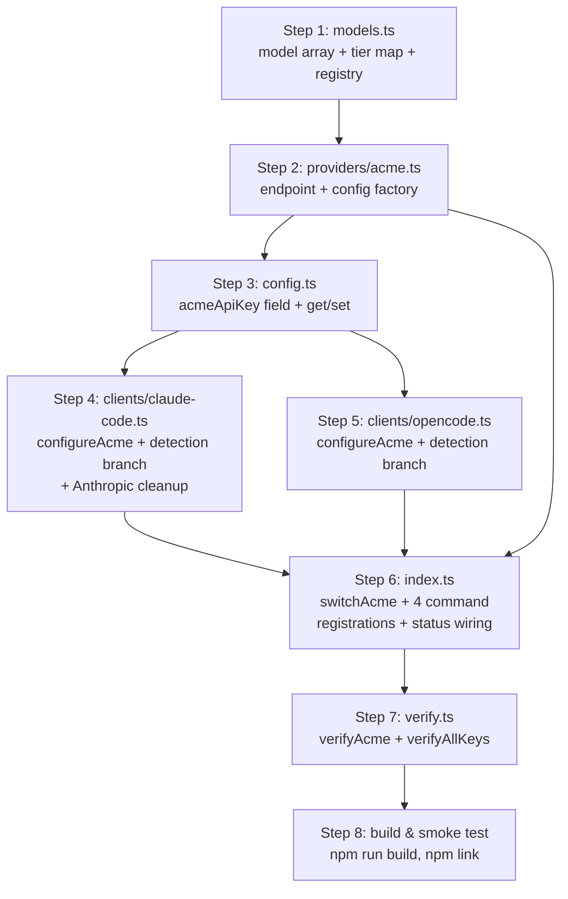
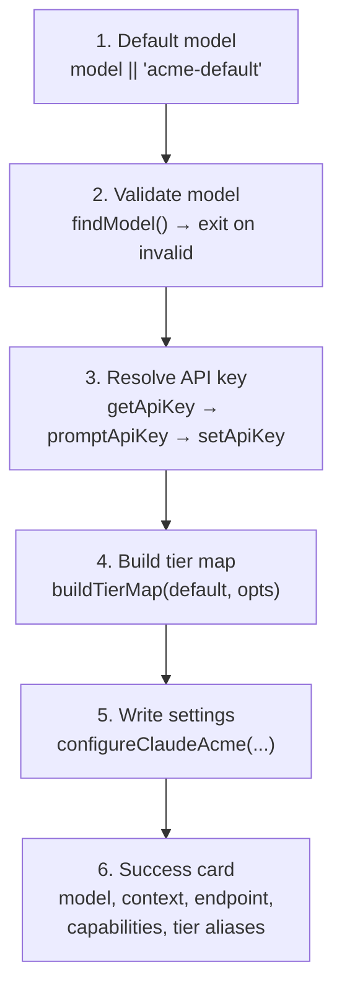

This guide walks an advanced contributor through every code touch-point required to add a new AI provider to `claude-switch`, using the **Muse (Meta)** integration — the most recently added direct Anthropic-compatible provider — as the canonical reference implementation. There is no plugin registry in this codebase: a provider becomes switchable only when seven files agree on its ID, its models, its credentials, its settings-writes, and its detection signature. Each step below states exactly what to add and where, with the working Muse code shown as the pattern to replicate for a hypothetical new provider we'll call `acme`.

Before starting, you should be familiar with the layered architecture ([Architecture Overview: CLI, Clients, Providers, and Config Storage Layers](7-architecture-overview-cli-clients-providers-and-config-storage-layers)) and the three connectivity archetypes the switcher supports ([Provider Connectivity Patterns: Direct API vs LiteLLM Proxy vs coding-helper MCP](8-provider-connectivity-patterns-direct-api-vs-litellm-proxy-vs-coding-helper-mcp)), because the archetype you choose determines how much of this guide applies.

## Step 0: Choose Your Integration Archetype

The switcher supports three provider shapes, and your choice determines the scope of work. A **direct Anthropic-compatible** provider (like Alibaba, OpenRouter, Muse) only needs the standard eight steps in this guide. A **proxy-based** provider (like Gemini, Ollama) additionally needs LiteLLM lifecycle management in its provider module. An **MCP-delegated** provider (like GLM) outsources most configuration to an external tool.

| Archetype | Reference provider | Extra work beyond this guide | Signature in `~/.claude/settings.json` |
|---|---|---|---|
| Direct Anthropic-compatible | Muse, Alibaba, OpenRouter | None — this guide covers everything | `ANTHROPIC_BASE_URL` → provider's real endpoint |
| LiteLLM proxy translation | Gemini (port 4001), Ollama (port 4000) | Proxy pre-flight checks, detached `spawn` of `litellm`, health polling | `ANTHROPIC_BASE_URL` → `http://localhost:<port>` |
| External MCP delegation | GLM via `@z_ai/coding-helper` | coding-helper install detection, config reload | Tier aliases only, or `.z.ai` URL written by external tool |

The direct archetype is strongly preferred when the vendor offers an Anthropic-compatible endpoint, because it is the least invasive: proxy providers must bundle prerequisite checks (`isLitellmInstalled()` shells out to `which litellm`), detached proxy startup with `child.unref()`, and 5-second health polling loops in their provider module. Compare Muse's 46-line provider file against Gemini's 137-line file that includes the whole proxy lifecycle — the proxy machinery roughly triples the module size.

Sources: [muse.ts](src/providers/muse.ts#L1-L46), [gemini.ts](src/providers/gemini.ts#L48-L61), [gemini.ts](src/providers/gemini.ts#L101-L136), [ARCHITECTURE.md](ARCHITECTURE.md#L1-L40)

## The Touch-Point Map

Adding a provider touches seven files. The diagram below shows how they collaborate during a switch command — this is the same flow documented from the runtime perspective in [The Provider Switch Flow: Key Validation, Tier Maps, Proxy Startup, and Settings Writes](9-the-provider-switch-flow-key-validation-tier-maps-proxy-startup-and-settings-writes); here we view it as the contributor's checklist.



| # | File | What you add | Consequence if skipped |
|---|---|---|---|
| 1 | `src/models.ts` | Model array, tier map, registry entry | Provider invisible to `list`, `models`, validation |
| 2 | `src/providers/acme.ts` | Endpoint constant, config factory, `findModel` | No single source of truth for endpoint/defaults |
| 3 | `src/config.ts` | `acmeApiKey` field, two switch cases | Key prompt loops forever; `key acme` silently no-ops |
| 4 | `src/clients/claude-code.ts` | `configureAcme()`, detection branch, cleanup in `configureAnthropic()` | Switch writes nothing, or stale env leaks after switching back |
| 5 | `src/clients/opencode.ts` | `configureAcme()`, detection branch, removal in `configureAnthropic()` | OpenCode integration missing |
| 6 | `src/index.ts` | `switchAcme()`, 4 command registrations, `status` wiring, `models` error string | No CLI surface at all |
| 7 | `src/verify.ts` | `verifyAcme()`, `verifyAllKeys` case | Provider absent from `status` verification output |

The seven touch-points are deliberately redundant rather than reflection-driven: each file holds a small explicit switch/case, which keeps the codebase dependency-light (Commander + fs-extra + chalk only, no DI container) at the cost of manual wiring. That trade-off is why this guide exists.

Sources: [index.ts](src/index.ts#L16-L77), [models.ts](src/models.ts#L334-L376), [config.ts](src/config.ts#L53-L92)

## Step 1: Register the Provider in the Model Catalog (`src/models.ts`)

Three additions land in `src/models.ts`. First, a **model array** following the `Model` interface — each entry carries `id`, display `name`, `contextWindow` in tokens, a `capabilities` list, and a marketing-friendly `description`; the description strings surface directly in `claude-switch models acme` output via `displayModels()`, so write them for end users, not for developers. Muse's two-model array is the minimal template:

```typescript
// Muse Models (Meta — via https://api.meta.ai, Anthropic-compatible)
export const museModels: Model[] = [
  {
    id: "muse-spark-1.2",
    name: "Muse Spark 1.2",
    contextWindow: 256000,
    capabilities: ["Text Generation", "Code", "Reasoning", "Tool Use"],
    description: "Meta's Muse Spark 1.2 — full-capability Anthropic-compatible model via api.meta.ai."
  }
  // ...
];
```

Second, a **default tier map** — a `ModelTierMap` binding the `opus`/`sonnet`/`haiku` aliases to concrete model IDs. This map is what gets written into the three `ANTHROPIC_DEFAULT_*_MODEL` environment variables; the alias system itself is covered in depth in [The Model Tier Alias System: Opus, Sonnet, and Haiku Environment Variables](12-the-model-tier-alias-system-opus-sonnet-and-haiku-environment-variables). Muse pins all three tiers to the discounted contributor model:

```typescript
export const MUSE_DEFAULT_TIER_MAP: ModelTierMap = {
  opus: "muse-spark-1.2-contributor",
  sonnet: "muse-spark-1.2-contributor",
  haiku: "muse-spark-1.2-contributor"
};
```

If your tier mapping depends on the selected model rather than being static, implement a **function** instead of a constant — Alibaba's `getAlibabaTierMap(model)` promotes the user-selected model to the opus slot while keeping fallbacks for the other tiers, and the CLI merges user `--opus/--sonnet/--haiku` overrides on top via `buildTierMap()` either way.

Third, add the **registry entry** in the `providers: Record<string, Provider>` object. The key you choose here is the provider ID used by every downstream file — `getApiKey("muse")`, `getModels("muse")`, `providers.muse` — so pick it once and use it everywhere. Include the `endpoint` field only when there is a real remote endpoint (local-proxy providers point at `http://localhost:<port>`; GLM omits it entirely).

```typescript
muse: {
  id: "muse",
  name: "Muse (Meta)",
  endpoint: "https://api.meta.ai",
  models: museModels
}
```

| Registry field | Type | Required | Consumed by |
|---|---|---|---|
| `id` | string | Yes | `status`, `current` display; consistency check |
| `name` | string | Yes | `list`, `models` headers |
| `endpoint` | string | No | `list` output; `displayProviders` |
| `models` | `Model[]` | Yes | `list`, `models`, switch-time validation |

Sources: [models.ts](src/models.ts#L1-L20), [models.ts](src/models.ts#L51-L56), [models.ts](src/models.ts#L61-L77), [models.ts](src/models.ts#L277-L293), [models.ts](src/models.ts#L334-L376), [display.ts](src/display.ts#L22-L71)

## Step 2: Create the Provider Module (`src/providers/acme.ts`)

Every provider gets a module under `src/providers/` that acts as the single source of truth for its endpoint and defaults. The file is intentionally thin — under 50 lines for direct providers — because all heavyweight behavior lives in the client handlers. The complete Muse module defines five exports, and your `acme.ts` should mirror them exactly:

| Export | Purpose | Used by |
|---|---|---|
| `ACME_PROVIDER = providers.acme` | Re-export of the registry entry | Future callers needing the full record |
| `AcmeConfig` interface | Typed shape: `{ provider, apiKey, model, endpoint }` | Type safety for config factory |
| `ACME_ENDPOINT` constant | The endpoint URL, defined once | Both clients, switch output |
| `getAcmeConfig(apiKey, model?)` | Factory applying the default model | Any code needing a config object |
| `findModel(modelId)` | Lookup against the Step 1 array | `switchAcme()` validation |

```typescript
export const MUSE_ENDPOINT = "https://api.meta.ai";

export function getMuseConfig(apiKey: string, model?: string): MuseConfig {
  return {
    provider: "muse",
    apiKey,
    model: model || "muse-spark-1.2-contributor",
    endpoint: MUSE_ENDPOINT
  };
}

export function findModel(modelId: string) {
  return museModels.find(m => m.id === modelId);
}
```

The doc comment at the top of the file is load-bearing documentation in this codebase — Muse's header enumerates every environment variable the integration writes (`ANTHROPIC_BASE_URL`, `ANTHROPIC_AUTH_TOKEN`, `ANTHROPIC_MODEL`, tier aliases, `CLAUDE_CODE_SUBAGENT_MODEL`, `ENABLE_TOOL_SEARCH`), which is exactly what a maintainer needs when debugging a settings file six months later. For proxy-archetype providers, this module additionally hosts the prerequisite checks and the detached `startAcmeLitellmProxy()` with its spawn-and-poll loop, following [gemini.ts](src/providers/gemini.ts); for MCP-archetype providers it hosts external-tool detection like `isCodingHelperInstalled()`.

Sources: [muse.ts](src/providers/muse.ts#L1-L46), [gemini.ts](src/providers/gemini.ts#L1-L12), [gemini.ts](src/providers/gemini.ts#L101-L136)

## Step 3: Wire Credential Storage (`src/config.ts`)

API keys live in `~/.claude-ai-switcher/config.json`, and `src/config.ts` is a hand-rolled switch statement over that file — there is no generic key-value path. You must make three coordinated edits, or the key prompt in your switch function will capture a key and then fail to persist it:

1. Add `acmeApiKey?: string` to the `UserConfig` interface.
2. Add `case "acme": return config.acmeApiKey;` to `getApiKey()`.
3. Add `case "acme": config.acmeApiKey = apiKey; break;` to `setApiKey()`.

The before/after for the interface shows the pattern — Muse's `museApiKey` sits alongside the three pre-existing keys:

| Before | After |
|---|---|
| `alibabaApiKey?: string;`<br>`openrouterApiKey?: string;`<br>`geminiApiKey?: string;` | `alibabaApiKey?: string;`<br>`openrouterApiKey?: string;`<br>`geminiApiKey?: string;`<br>`museApiKey?: string;` |

Once these three edits exist, the generic `key <provider> [apikey]` CLI command works for your provider for free — it delegates entirely to `hasApiKey()`/`setApiKey()` with no provider-specific cases. Note that `defaultProvider`/`defaultModel` exist on `UserConfig` but are not consumed by any current code path, so leave them alone. The security posture of this storage (plaintext local file, never synced) is discussed in [API Key Storage in ~/.claude-ai-switcher/config.json](20-api-key-storage-in-claude-ai-switcher-config-json).

Sources: [config.ts](src/config.ts#L14-L21), [config.ts](src/config.ts#L53-L92), [index.ts](src/index.ts#L1119-L1141)

## Step 4: Implement the Claude Code Client Handler (`src/clients/claude-code.ts`)

This is the heart of the integration. The handler writes provider environment variables into `~/.claude/settings.json`, and it must obey three contracts: the **write contract**, the **cleanup contract**, and the **detection contract**. The client's general behavior (timestamped backups, onboarding flag) is covered in [Claude Code Client: Managing ~/.claude/settings.json with Backups and Onboarding](14-claude-code-client-managing-claude-settings-json-with-backups-and-onboarding) — here we focus on what a *new* provider must add.

**The write contract.** Your `configureAcme(apiKey, model, tierMap)` function follows the Muse template: call `ensureOnboardingComplete()` first (this prevents Claude Code's "Unable to connect to Anthropic services" error), read current settings, set `ANTHROPIC_AUTH_TOKEN`, `ANTHROPIC_BASE_URL`, and `ANTHROPIC_MODEL`, then delegate the tier aliases to `applyTierMap()` and persist via `writeClaudeSettings()` — which automatically creates a `settings.json.backup.<timestamp>` copy before every write:

```typescript
export async function configureMuse(apiKey: string, model: string, tierMap: ModelTierMap): Promise<void> {
  await ensureOnboardingComplete();
  const settings = await readClaudeSettings();
  settings.env = settings.env || {};
  settings.env["ANTHROPIC_AUTH_TOKEN"] = apiKey;
  settings.env["ANTHROPIC_BASE_URL"] = "https://api.meta.ai";
  settings.env["ANTHROPIC_MODEL"] = model;
  settings.env["CLAUDE_CODE_SUBAGENT_MODEL"] = model;
  settings.env["ENABLE_TOOL_SEARCH"] = "true";
  applyTierMap(settings, tierMap);
  await writeClaudeSettings(settings);
}
```

**The cleanup contract.** Every provider sets a *different subset* of env vars, so every configure function must explicitly `delete` the vars it does not own. Alibaba, OpenRouter, Ollama, and Gemini all execute `delete settings.env["CLAUDE_CODE_SUBAGENT_MODEL"]` and `delete settings.env["ENABLE_TOOL_SEARCH"]` because those two vars are Muse-specific; Muse is the only provider that sets them. Your new provider must follow suit, **and** you must extend the shared cleanup in `configureAnthropic()` — the "switch back to native Claude" path — with any novel variable your provider introduces. Failure here produces the classic symptom of a stale `ANTHROPIC_BASE_URL` silently routing native Claude traffic to your provider after the user runs `claude-switch anthropic`:

| Var | Set by | Deleted by (when not owned) |
|---|---|---|
| `ANTHROPIC_AUTH_TOKEN` | Alibaba, OpenRouter, Ollama, Gemini, Muse | `configureAnthropic()`, `configureGLM()` |
| `ANTHROPIC_BASE_URL` | same five | `configureAnthropic()`, `configureGLM()` |
| `ANTHROPIC_MODEL` | same five | `configureAnthropic()`, `configureGLM()` |
| `CLAUDE_CODE_SUBAGENT_MODEL` | Muse only | everyone else + `configureAnthropic()` |
| `ENABLE_TOOL_SEARCH` | Muse only | everyone else + `configureAnthropic()` |
| `ANTHROPIC_DEFAULT_{OPUS,SONNET,HAIKU}_MODEL` | all providers via `applyTierMap()` | `configureAnthropic()` via `clearTierMap()` |

**The detection contract.** `getCurrentProvider()` reverse-engineers which provider is active by string-matching `ANTHROPIC_BASE_URL` — the heuristics are analyzed in [Provider Detection Heuristics in getCurrentProvider()](10-provider-detection-heuristics-in-getcurrentprovider). Add a branch matching a **distinctive substring of your endpoint**, and place it with the other URL checks. Muse matches `"api.meta.ai"`:

```typescript
if (settings.env?.["ANTHROPIC_BASE_URL"]?.includes("api.meta.ai")) {
  return { provider: "muse", model: settings.env["ANTHROPIC_MODEL"],
           endpoint: settings.env["ANTHROPIC_BASE_URL"], tierMap };
}
```

Ordering matters: your branch must sit **before** the two GLM fallbacks at the bottom of the function, because the last fallback treats *any* settings file with tier aliases but no `ANTHROPIC_BASE_URL` as GLM. A provider whose base URL contains `localhost` should also avoid colliding with the `:4000`/`:4001` port checks — pick a unique port substring or a hostname fragment.

Sources: [claude-code.ts](src/clients/claude-code.ts#L35-L57), [claude-code.ts](src/clients/claude-code.ts#L100-L136), [claude-code.ts](src/clients/claude-code.ts#L161-L182), [claude-code.ts](src/clients/claude-code.ts#L264-L282), [claude-code.ts](src/clients/claude-code.ts#L345-L353), [claude-code.ts](src/clients/claude-code.ts#L373-L379)

## Step 5: Implement the OpenCode Client Handler (`src/clients/opencode.ts`)

OpenCode stores providers structurally rather than via env vars: `~/.config/opencode/opencode.json` gets a nested `provider["acme"]` block containing the npm SDK package, base URL, API key, and a per-model map of modalities and context/output limits. Your `configureAcme(apiKey)` writes that block — Muse's is the cleanest template:

```typescript
settings.provider["muse"] = {
  npm: "@ai-sdk/anthropic",
  name: "Muse (Meta)",
  options: { baseURL: "https://api.meta.ai", apiKey: apiKey },
  models: {
    "muse-spark-1.2-contributor": {
      name: "Muse Spark 1.2 Contributor",
      modalities: { input: ["text", "image"], output: ["text"] },
      limit: { context: 256000, output: 65536 }
    }
  }
};
```

Two details distinguish this from the Claude Code handler. First, the `npm` field names the `@ai-sdk/*` package OpenCode should load — Anthropic-compatible providers use `"@ai-sdk/anthropic"`; proxy-based providers use `"@ai-sdk/openai-compatible"` pointing at the local proxy port. Second, there is no tier-map concept here; instead each model entry repeats the `context` limit that `src/models.ts` already declared, so keep the two numbers synchronized manually (there is no code-level link between them).

You also owe OpenCode two smaller edits. Add a detection branch to its `getCurrentProvider()` — here the matching key is the provider block name itself (`settings.provider?.["muse"]`), far simpler than the URL heuristics on the Claude side. And extend `configureAnthropic()` in this file with a `delete settings.provider?.["acme"]` cleanup so that switching OpenCode back to defaults removes your block. Removal by explicit command already works generically: `removeProvider(providerKey)` deletes the named key and prunes an emptied `provider` object, no per-provider code required.

| Aspect | Claude Code handler | OpenCode handler |
|---|---|---|
| Target file | `~/.claude/settings.json` | `~/.config/opencode/opencode.json` |
| Mechanism | env vars under `settings.env` | structured `provider["<id>"]` block |
| Tier aliases | `applyTierMap()` → 3 env vars | not applicable |
| Detection | URL substring matching | provider-key existence |
| Removal | env var deletes in `configureAnthropic()` | `delete settings.provider[key]` |

The mechanics of the OpenCode file overall are covered in [OpenCode Client: Adding and Removing Providers in opencode.json](15-opencode-client-adding-and-removing-providers-in-opencode-json).

Sources: [opencode.ts](src/clients/opencode.ts#L549-L593), [opencode.ts](src/clients/opencode.ts#L262-L265), [opencode.ts](src/clients/opencode.ts#L595-L612), [opencode.ts](src/clients/opencode.ts#L668-L674)

## Step 6: Wire the CLI (`src/index.ts`)

`src/index.ts` is a single 1,400-line Commander.js program, and each provider appears in it exactly five times: one switch function, and four command registrations. Begin with the imports — pull `configureAcme as configureClaudeAcme` from the Claude client, `configureAcme as configureOpenCodeAcme` from the OpenCode client (the aliasing avoids collisions between the two same-named functions), your tier map and `findModel` helper from their modules.

**6a. The switch function.** `switchAcme()` follows the `switchMuse()` skeleton, which is the guide's reference for good reason — it exercises every standard phase in order:



Validation against the catalog happens *before* the key prompt, so an invalid model fails fast without touching credentials. Proxy-archetype providers insert their pre-flight checks (LiteLLM installed, service running, proxy started) at the top of this sequence — see `switchGemini()` for the full ordering.

**6b–6e. Four command registrations.** The same action is exposed through four invocation paths, and all four should be registered for consistency with existing providers:

| Registration | Path | Notes |
|---|---|---|
| Top-level | `claude-switch acme [model]` | Wrap with `addTierOptions()` for `--opus/--sonnet/--haiku` |
| Explicit client | `claude-switch claude acme [model]` | Same `switchAcme` action |
| OpenCode add | `claude-switch opencode add acme` | Key prompt + `configureOpenCodeAcme` + success summary |
| OpenCode remove | `claude-switch opencode remove acme` | Dynamic-import `removeProvider("acme")` |

**6f. Status wiring.** The `status` command manually gathers each provider's key and passes it to `verifyAllKeys()`; add `const acmeKey = await getApiKey("acme");`, extend the `verifyAllKeys({...})` call with `acme: acmeKey`, and add an `else if (result.provider === "acme" && acmeKey)` branch for the masked-key display.

**6g. Cosmetic but required.** The `models` command carries a hard-coded provider list in its error message (`"anthropic, alibaba, openrouter, glm, ollama, gemini, or muse"`) — append yours or users who typo the ID get misleading guidance. Optionally add a key-capture block to the `setup` wizard following the Muse block, which prints the key's help URL and stores the answer.

Sources: [index.ts](src/index.ts#L28-L49), [index.ts](src/index.ts#L127-L150), [index.ts](src/index.ts#L387-L425), [index.ts](src/index.ts#L508-L519), [index.ts](src/index.ts#L606-L617), [index.ts](src/index.ts#L772-L797), [index.ts](src/index.ts#L888-L903), [index.ts](src/index.ts#L960-L1018), [index.ts](src/index.ts#L1099-L1117), [index.ts](src/index.ts#L1200-L1215)

## Step 7: Add Key Verification (`src/verify.ts`)

`claude-switch status` verifies every provider's key with a lightweight HTTP probe, and your provider should join it. Implement `verifyAcme(apiKey)` following the established shape: a `fetchWithTimeout()` GET against a cheap endpoint (typically `/v1/models`), mapping outcomes to the `VerifyResult` union — `ok` for 2xx, `invalid` for 401/403, `error` for other statuses or connection failures. Muse adds a useful refinement worth copying: because Anthropic-compatible endpoints accept either `Authorization: Bearer` or `x-api-key` headers, it tries the Bearer form first and only declares the key invalid after the `x-api-key` fallback also fails, avoiding false negatives from header-scheme mismatches:

```typescript
const res = await fetchWithTimeout("https://api.meta.ai/v1/models",
  { method: "GET", headers: { "Authorization": `Bearer ${apiKey}` } });
if (res.ok) return { provider: "muse", status: "ok", message: "Key valid" };
// fallback with "x-api-key" + "anthropic-version" headers before declaring invalid...
```

Then register it in `verifyAllKeys()`: extend the keys parameter type with `acme?: string`, push `verifyAcme(keys.acme)` when present, and push a resolved `{ provider: "acme", status: "missing" }` otherwise so the provider always appears in the status table. Providers without an HTTP probe (GLM checks a CLI binary, Ollama checks localhost ports) use the `skipped`/`error` statuses instead — pick the semantics that fit your provider. Verification design as a whole is covered in [API Key Verification: Lightweight Health Checks and Key Masking](21-api-key-verification-lightweight-health-checks-and-key-masking).

Sources: [verify.ts](src/verify.ts#L9-L30), [verify.ts](src/verify.ts#L236-L278), [verify.ts](src/verify.ts#L150-L204)

## Step 8: Build, Link, and Smoke-Test

Compile with the project's standard pipeline and test against a locally linked binary — the full developer workflow (`npm ci`, `npm run build`, `npm link`) is described in [Developer Environment Setup: npm ci, Build, and npm link Workflow](3-developer-environment-setup-npm-ci-build-and-npm-link-workflow). Then run this verification matrix; each row maps a user-visible behavior to the touch-point that implements it:

| Smoke test | Expected result | Verifies |
|---|---|---|
| `claude-switch list` | Acme appears with model count and endpoint | Step 1 registry |
| `claude-switch models acme` | Model table with context windows and descriptions | Step 1 array |
| `claude-switch key acme test-key` | "API key set for acme"; key appears in config.json | Step 3 |
| `claude-switch acme` | Key prompt (first run), success card, tier alias lines | Steps 4, 6 |
| `claude-switch acme bogus-model` | Error listing valid model IDs, exit before key prompt | Step 6a ordering |
| `cat ~/.claude/settings.json` | `ANTHROPIC_BASE_URL` → your endpoint; backup file created | Step 4 write + backup |
| `claude-switch anthropic` then re-inspect settings | All your env vars gone, native Claude restored | Step 4 cleanup contract |
| `claude-switch current` / `status` | Provider detected as `acme`; verification row shows ok/invalid | Steps 4, 7 detection |
| `claude-switch opencode add acme` / `remove acme` | Block appears in / disappears from opencode.json | Steps 5, 6 |
| `claude-switch acme --opus <model>` | Alias override reflected in settings.json | Tier options plumbing |

Sources: [index.ts](src/index.ts#L960-L1018), [claude-code.ts](src/clients/claude-code.ts#L100-L112)

## Troubleshooting: Common Integration Pitfalls

These failure modes recur because the architecture trades central registration for explicit per-file wiring. Each maps to a specific missed edit from the steps above.

| Symptom | Root cause | Fix |
|---|---|---|
| Switch prompts for the key on every run | `setApiKey` case missing in `config.ts` — key captured but never persisted | Add both switch cases (Step 3) |
| `status` shows provider as `missing` forever | Key not passed into `verifyAllKeys` or verify case not pushed | Complete both edits in Step 7 |
| Switching back to Anthropic still routes to your provider | Cleanup contract broken — `configureAnthropic()` doesn't delete your vars, or your configure leaves another provider's vars | Extend the delete list both ways (Step 4) |
| `claude-switch current` reports `glm` while on your provider | Detection branch missing or placed after the GLM tier-alias fallback | Add URL-substring branch before fallbacks (Step 4) |
| `models acme` works but switch says "Invalid model" | Model array registered but ID mismatch between catalog and default in switch function | Keep default model ID identical to a catalog `id` (Steps 1, 6) |
| Tier aliases show previous provider's models | Tier map constant not used — `buildTierMap` called with wrong default | Import your `_DEFAULT_TIER_MAP` (Step 1, 6a) |
| OpenCode `add acme` succeeds but `current` shows anthropic | Detection branch missing in opencode `getCurrentProvider` | Add provider-key check (Step 5) |

Sources: [config.ts](src/config.ts#L73-L92), [claude-code.ts](src/clients/claude-code.ts#L161-L182), [claude-code.ts](src/clients/claude-code.ts#L373-L379), [opencode.ts](src/clients/opencode.ts#L617-L677)

## Where to Go Next

Once your provider works end-to-end, three follow-ups keep the contribution complete. Update `README.md`'s provider tables and command examples — the README is the user-facing contract and lists every provider's commands and tier defaults explicitly. Review [Direct Anthropic-Compatible Providers: Anthropic, Alibaba, OpenRouter, and Muse](16-direct-anthropic-compatible-providers-anthropic-alibaba-openrouter-and-muse) to confirm your env-var choices are consistent with sibling providers, and [Custom Tier Overrides with --opus, --sonnet, and --haiku Flags](13-custom-tier-overrides-with-opus-sonnet-and-haiku-flags) if your tier semantics differ from a static map. Finally, when preparing the pull request, follow the build and lockfile discipline described in [Build and Release Workflow: Version Resolution and Lockfile Discipline](27-build-and-release-workflow-version-resolution-and-lockfile-discipline) so `npm ci` remains reproducible for other contributors.