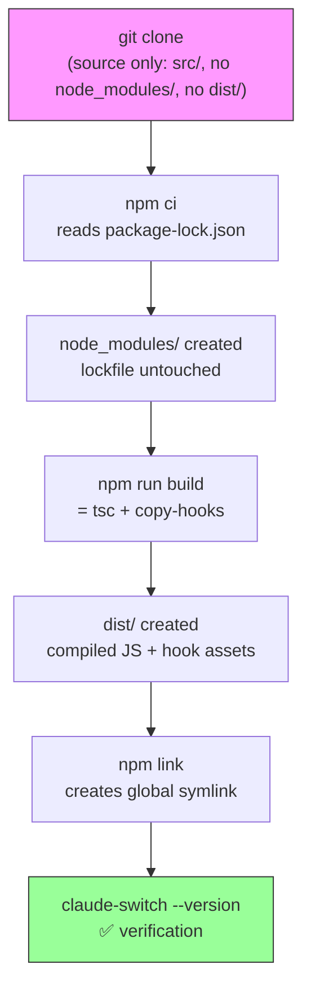
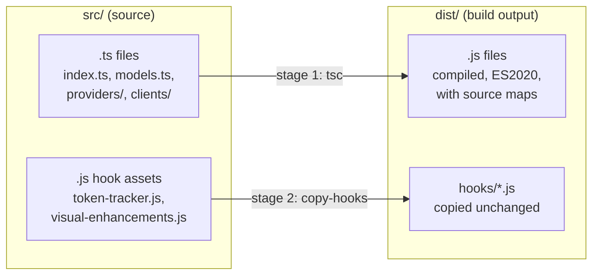
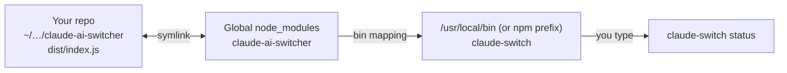

This page is the complete beginner's guide to going from a fresh `git clone` of the **claude-ai-switcher** repository to a fully working `claude-switch` command in your terminal. It covers the three canonical steps — `npm ci`, `npm run build`, and `npm link` — explains *why* each step exists, and shows you the daily development loop that follows. If you only want to *use* the tool rather than develop it, the simpler `npm install -g` / `npx` paths are covered on the [Quick Start](2-quick-start-installing-and-switching-your-first-provider-npm-npx-git) page.

## What You Need Before Starting

The project declares its runtime requirement explicitly: **Node.js 18.0.0 or newer**. This is enforced through the `engines` field in `package.json`, so any modern Node LTS release (18, 20, or 22) works. You also need `git` to clone the repository and a terminal. On Windows 11, the maintainers recommend running the setup commands in **Git Bash, WSL, or PowerShell** rather than `cmd.exe`; after installation, the CLI itself works in any terminal.

Sources: [package.json](package.json#L55-L57), [README.md](README.md#L81-L94)

| Requirement | Minimum Version | Where It's Used |
|---|---|---|
| Node.js | ≥ 18.0.0 | Running the CLI, `npm`, and the build |
| npm | Bundled with Node | `npm ci`, `npm run build`, `npm link` |
| git | Any recent version | Cloning and staying up to date |
| Terminal | — | macOS/Linux native; Windows: Git Bash, WSL, or PowerShell |

## Why a Fresh Clone Can't Run Yet

A freshly cloned repository is deliberately *incomplete* in two ways, and understanding this is the key to understanding the whole workflow. First, the `node_modules/` directory (the installed dependencies like `commander` and `chalk`) is listed in `.gitignore`, so it is never committed — you must install it yourself. Second, the `dist/` directory (the compiled JavaScript output) is also gitignored, because the repository stores its source as **TypeScript** in `src/`, and `dist/` is generated from it.

The reason `dist/` matters so much is that `package.json` points both its `main` entry and its `bin` command (`claude-switch`) at `dist/index.js`. Until that file exists, there is literally nothing for npm to execute. The build step produces it — and notably, the TypeScript entry file begins with the shebang line `#!/usr/bin/env node`, which `tsc` preserves into the compiled output so the file can be run as a standalone executable.

Sources: [.gitignore](.gitignore#L2), [.gitignore](.gitignore#L11), [package.json](package.json#L5-L8), [src/index.ts](src/index.ts#L1)

## The Setup Workflow at a Glance

The README documents this as "Option 3 — git (development / latest `main`)", the path for contributors. It is exactly three commands, and each one maps to one section of this page:

```bash
git clone https://github.com/tupacalypse187/claude-ai-switcher.git
cd claude-ai-switcher
npm ci          # reproducible install from package-lock.json (does NOT modify it)
npm run build   # tsc + copy-hooks
npm link        # installs `claude-switch` globally via symlink
claude-switch --version
```

Sources: [README.md](README.md#L58-L68)

The following flowchart shows how each step transforms the repository and what you can verify after it:



## Step 1: Install Dependencies with `npm ci`

`npm ci` ("clean install") reads `package-lock.json` — the committed lockfile, at **lockfileVersion 3** — and installs *exactly* the dependency versions recorded there. The critical property, called out explicitly in both the README and AGENTS.md, is that **it never modifies the lockfile**. This is the repo's documented discipline: run `npm ci` after every `git pull`, and reserve `npm install <package>` / `npm update` for the moments when you *intentionally* add or upgrade a dependency — at which point you commit the updated lockfile.

Sources: [README.md](README.md#L64-L79), [AGENTS.md](AGENTS.md#L58-L67), [package-lock.json](package-lock.json#L1-L5)

| Aspect | `npm ci` (daily use) | `npm install` (intentional changes) |
|---|---|---|
| Reads lockfile? | ✅ Yes, strictly | Yes, but may resolve new ranges |
| Modifies lockfile? | ❌ Never | ✅ Yes, if versions change |
| Deletes `node_modules/` first? | ✅ Yes (clean slate) | ❌ No |
| Fails on lockfile/package.json mismatch? | ✅ Yes | ❌ No, it self-heals |
| When to use | After clone or every `git pull` | Adding/upgrading a dependency |

This step installs two categories of packages, defined in `package.json`. Note that the **build toolchain itself (TypeScript, ts-node, rimraf) is a devDependency** — it's needed to compile the project, not to run the installed CLI later:

| Dependency | Type | Role |
|---|---|---|
| `commander` | dependency | CLI command routing |
| `fs-extra` | dependency | File system operations (copies, backups) |
| `chalk` | dependency | Colored terminal output |
| `ora` | dependency | Spinners during long operations |
| `typescript` | devDependency | The `tsc` compiler used by `npm run build` |
| `ts-node` | devDependency | Runs TypeScript directly for `npm run dev` |
| `rimraf` | devDependency | Cross-platform `dist/` deletion for `npm run clean` |
| `@types/node`, `@types/fs-extra` | devDependency | Type definitions |

Sources: [package.json](package.json#L42-L54)

## Step 2: Build the Project with `npm run build`

The `build` script is defined as `tsc && npm run copy-hooks` — two stages chained with `&&`, meaning the second runs only if the first succeeds. This two-stage design exists because the project contains **two kinds of source files**: TypeScript modules that must be *compiled*, and plain JavaScript hook assets that must be *copied verbatim*.

Sources: [package.json](package.json#L19-L24)



**Stage 1 — `tsc`:** The TypeScript compiler reads `tsconfig.json`, which compiles everything under `src/` into `dist/`, targeting ES2020 with CommonJS modules, `strict` mode enabled, and source maps plus declaration files emitted alongside the JavaScript. Because the config's `include` covers `src/**/*` and there is no `allowJs` option, `tsc` silently skips the plain `.js` hook files — it only transforms `.ts` sources.

Sources: [tsconfig.json](tsconfig.json#L1-L18), [package.json](package.json#L20)

**Stage 2 — `npm run copy-hooks`:** The small `scripts/copy-hooks.js` script fills the gap stage 1 leaves behind. It creates `dist/hooks/` and copies from `src/hooks/` every file whose extension is `.js` (directories always pass the filter). The result is a `dist/` directory that is fully self-contained.

Sources: [scripts/copy-hooks.js](scripts/copy-hooks.js#L4-L15)

The copy step is not cosmetic — it is a **runtime requirement**. When you later run `claude-switch hooks install`, the Hook Manager resolves the hook sources relative to its own compiled location: `path.join(__dirname, "..", "hooks", "token-tracker.js")`. At runtime `__dirname` is `dist/hooks`'s parent, so it expects to find `dist/hooks/token-tracker.js` and `dist/hooks/visual-enhancements.js`. If the copy step never ran, hook installation throws a clear error: *"Token tracker source not found. Please rebuild the project."*

Sources: [src/hooks/index.ts](src/hooks/index.ts#L17-L21), [src/hooks/index.ts](src/hooks/index.ts#L47-L50)

Here is what the repository looks like before and after `npm ci` + `npm run build`:

| Path | Before setup | After `npm ci` | After `npm run build` |
|---|---|---|---|
| `src/` | ✅ TypeScript sources | ✅ unchanged | ✅ unchanged |
| `node_modules/` | ❌ absent (gitignored) | ✅ installed from lockfile | ✅ unchanged |
| `dist/index.js` | ❌ absent (gitignored) | ❌ still absent | ✅ compiled from `src/index.ts`, shebang preserved |
| `dist/**/*.js` | ❌ absent | ❌ still absent | ✅ compiled from all `.ts` modules |
| `dist/hooks/*.js` | ❌ absent | ❌ still absent | ✅ copied verbatim by `copy-hooks` |

You can compare your `dist/` contents against this at any time, and `npm run clean` (which runs `rimraf dist`) removes the entire build output when you want a from-scratch rebuild. The project uses `rimraf` instead of a raw `rm -rf` specifically so `clean` works identically on macOS, Linux, and Windows.

Sources: [package.json](package.json#L22-L24), [README.md](README.md#L89-L94)

## Step 3: Expose the CLI Globally with `npm link`

After building, `dist/index.js` exists but is only reachable via long paths like `node dist/index.js`. The `npm link` command solves this by creating a **symlink chain**: npm links the package name `claude-ai-switcher` from the global `node_modules` directory to your repository folder, and creates a `claude-switch` executable in your global bin directory (already on your `PATH`) pointing at `dist/index.js`. The result is a globally available `claude-switch` command that always reflects your current build — the README confirms you do **not** need to re-link after rebuilding, only if the `bin` mapping itself changes.

Sources: [README.md](README.md#L64-L77), [package.json](package.json#L6-L8)



The chain works end-to-end because of three pieces cooperating: the `bin` field in `package.json` (`"claude-switch": "dist/index.js"`), the shebang `#!/usr/bin/env node` on the first line of the entry file (preserved by `tsc` into `dist/index.js`), and the executable permission npm sets on the linked script. Verify the setup exactly as the README shows:

```bash
claude-switch --version   # should print the version
claude-switch status      # full smoke test
```

When you're done developing, the standard npm counterpart `npm unlink -g claude-ai-switcher` removes the global symlink; alternatively, installing the published package with `npm install -g claude-ai-switcher` replaces the link with a real copy from the npm registry.

Sources: [README.md](README.md#L67-L77), [src/index.ts](src/index.ts#L1), [AGENTS.md](AGENTS.md#L89-L93)

## The Daily Development Loop

Once linked, the workflow settles into a small set of commands. The key mental model: **`npm run dev` executes TypeScript directly (no build needed), while `npm start` and the global `claude-switch` command execute the built `dist/` output (rebuild required after edits)**. AGENTS.md summarizes the update cycle for pulling teammates' changes as: `git pull` → `npm ci` → `npm run build`.

| Command | What it runs | Uses `dist/`? | Typical use |
|---|---|---|---|
| `npm run dev` | `ts-node src/index.ts` | ❌ No | Quick experiments on source, instant feedback |
| `npm start` | `node dist/index.js` | ✅ Yes | Testing the build the way users run it |
| `npm run build` | `tsc && node scripts/copy-hooks.js` | creates it | After any source edit, before testing via `claude-switch` |
| `npm run clean` | `rimraf dist` | deletes it | Forcing a full from-scratch rebuild |
| `npm ci` | reads `package-lock.json` | — | After every `git pull`; never touches the lockfile |

Sources: [package.json](package.json#L19-L25), [AGENTS.md](AGENTS.md#L69-L93)

A concrete iteration looks like this: edit a file in `src/`, run `npm run build`, then immediately run `claude-switch <command>` in the same terminal — the global symlink means you're testing the new code with zero extra steps. The hook-installation error message shown earlier (*"Please rebuild the project"*) is your signal that a hook source was changed but the build is stale.

Sources: [README.md](README.md#L70-L77), [src/hooks/index.ts](src/hooks/index.ts#L48-L50)

## Troubleshooting Guide

| Symptom | Likely Cause | Fix |
|---|---|---|
| `command not found: claude-switch` | `npm link` not run, or terminal started before linking | Run `npm link`, then open a new terminal or check your `PATH` |
| `npm ci` fails with lockfile sync error | `package.json` and `package-lock.json` disagree | Run `npm install` once to regenerate the lockfile, then commit it (see the lockfile discipline note in the README) |
| `Cannot find module .../dist/index.js` | Build not run after clone or clean | Run `npm run build` |
| "Token tracker source not found. Please rebuild the project." | `dist/hooks/` missing — build ran without `copy-hooks`, or is stale | Run `npm run build` (both stages), verify `dist/hooks/token-tracker.js` exists |
| `tsc: command not found` during build | `npm ci` skipped or devDependencies excluded | Run `npm ci`; avoid `--production`/`--omit=dev` installs while developing |
| TypeScript errors on `npm run build` | Node older than declared engine, or source/`@types` mismatch | Upgrade to Node ≥ 18, re-run `npm ci` |
| Windows: `clean` or build commands misbehave | Running in an unsupported shell | Use Git Bash, WSL, or PowerShell, per the README's Windows notes |

Sources: [README.md](README.md#L74-L94), [package.json](package.json#L55-L57), [src/hooks/index.ts](src/hooks/index.ts#L47-L50)

One version-related detail worth knowing before your first commit: the version string appears in multiple places (`package.json` says 1.3.0, while `package-lock.json` still records 1.1.4). How these diverge and get resolved is its own topic — covered in depth on the [Build and Release Workflow](27-build-and-release-workflow-version-resolution-and-lockfile-discipline) page.

Sources: [package.json](package.json#L2-L3), [package-lock.json](package-lock.json#L2-L4)

## Where to Go Next

With a linked development build in hand, the natural progression is to start using and then exploring it:

1. [Everyday CLI Commands: Switching Providers, Status, List, and Models](4-everyday-cli-commands-switching-providers-status-list-and-models) — exercise your build with the real command set
2. [Interactive Setup Wizard and API Key Entry](5-interactive-setup-wizard-and-api-key-entry) — what happens on first run of `claude-switch setup`
3. [Hook Asset Build Pipeline: Why copy-hooks.js Exists Alongside tsc](26-hook-asset-build-pipeline-why-copy-hooks-js-exists-alongside-tsc) — the deep dive into the two-stage build you just ran
4. [Build and Release Workflow: Version Resolution and Lockfile Discipline](27-build-and-release-workflow-version-resolution-and-lockfile-discipline) — publishing and versioning practices
5. [Step-by-Step Guide: Adding a New AI Provider to the Switcher](29-step-by-step-guide-adding-a-new-ai-provider-to-the-switcher) — your first real contribution