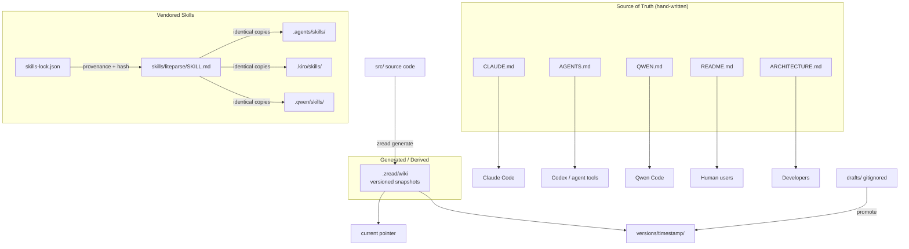
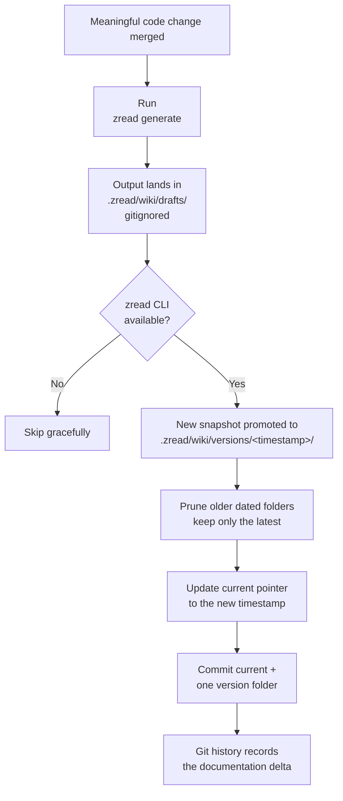

This page explains the "meta layer" of the claude-ai-switcher repository: the convention files that live at the root and in hidden directories, who reads them, and how they are maintained. While the `src/` tree contains the product itself, these files encode **how the project documents itself for both humans and AI coding assistants**. Understanding them matters for any contributor, because every meaningful change is expected to touch not just code, but this documentation layer as well — a rule you can see enforced in the repository's own change plans.

## The Documentation Landscape at a Glance

The repository maintains several documentation artifacts, each aimed at a different consumer. Some are hand-written and authoritative; one is machine-generated and versioned; others are vendored skill definitions shared across assistant tools. The table below maps every convention file to its audience and role:

| File / Directory | Audience | Role | How It's Maintained |
|---|---|---|---|
| `README.md` | Human users | Installation, features, command reference | Hand-written, updated per change |
| `CLAUDE.md` | Claude Code (AI assistant) | Working context for the assistant when editing this repo | Hand-written, updated per change |
| `AGENTS.md` | Codex and other agents | Mirrors CLAUDE.md for agent tools that read AGENTS.md | Hand-written, kept in parallel with CLAUDE.md |
| `QWEN.md` | Qwen Code (AI assistant) | "Project Context" file with conventions and details | Hand-written |
| `ARCHITECTURE.md` | Human developers + agents | Canonical system diagrams and config-file map | Hand-written |
| `.zread/wiki/` | Humans + AI (generated docs) | AI-generated, versioned project wiki | Generated via `zread generate` CLI |
| `skills/` + `.agents/`, `.kiro/`, `.qwen/` | AI assistants | Reusable "skills" (e.g., liteparse) | Vendored from GitHub, locked via `skills-lock.json` |
| `.zcode/plans/` | AI assistants / contributors | Saved execution plans for past changes | Generated during planning |

The relationship between these artifacts follows a clear pattern: **hand-written root files are the source of truth, the generated wiki is derived output, and the hidden directories serve tool-specific conventions**. This diagram shows how each piece connects to its consumer:

The npm package itself ships four of these convention files, which tells you they are treated as first-class project artifacts rather than internal notes: the `files` array in `package.json` explicitly includes `AGENTS.md`, `ARCHITECTURE.md`, `CLAUDE.md`, and `QWEN.md` alongside `dist/` and `src/`, so anyone who installs the package gets the assistant guidance files too.

Sources: [package.json](package.json#L13-L20)

## CLAUDE.md: Instructions for Claude Code

`CLAUDE.md` is the standard context file that **Claude Code automatically reads** when working in a repository. Its opening line states this purpose directly: "This file provides guidance to Claude Code (claude.ai/code) when working with code in this repository." The file then delivers everything an assistant needs to operate productively without re-deriving it from scratch: a project overview, an annotated source tree (one comment per file explaining its responsibility), installation options, build commands, architecture patterns, and a catalog of common CLI tasks.

Sources: [CLAUDE.md](CLAUDE.md#L1-L38)

The file's section layout reveals its role as a working manual rather than a tutorial. It covers Project Overview and Structure (lines 5–38), Installation (line 40), Build and Development Commands (line 69), Key Architecture Patterns including the tier-map tables (line 95), Common Tasks with ready-to-run command examples (line 146), Configuration Files (line 231), Safety Features (line 244), External Dependencies (line 254), the Zread Project Wiki workflow (line 263), and Cross-Platform Development rules (line 288). For a beginner contributor, the practical takeaway is simple: when you change behavior in `src/`, the sections most likely to need updates are the tier tables under Key Architecture Patterns and the command examples under Common Tasks.

Sources: [CLAUDE.md](CLAUDE.md#L95-L146)

## AGENTS.md and QWEN.md: One Convention, Many Assistants

`AGENTS.md` is the same idea as CLAUDE.md generalized: it is an **emerging cross-tool convention** where agent-based coding tools (Codex among them) look for an `AGENTS.md` file at the repository root for project context. This repository's AGENTS.md declares itself with "This file provides guidance to Codex (Codex.ai/code) when working with code in this repository" and then follows the exact same section skeleton as CLAUDE.md — Project Overview, Project Structure, Installation, Build Commands, Architecture Patterns, Common Tasks, and so on, ending with the same Zread wiki and Cross-Platform sections.

Sources: [AGENTS.md](AGENTS.md#L1-L38)

The two files are deliberately parallel, which creates a maintenance discipline: **a change that updates one must update the other**. You can see this rule applied in practice in the repository's saved plan for the GLM-5.3 integration, which lists "README.md — update the tier alias table" as step 5 and "AGENTS.md — update the GLM row in the default tier map table (line 119) and the example command (line 182)" as step 6 — documentation updates are numbered steps of the implementation plan, not afterthoughts. Note that AGENTS.md describes the tool using Codex-oriented naming (e.g., `Codex-switch` in its command examples), so treat CLAUDE.md as the reference when the two phrasings differ, while the structural content (tier tables, file paths, workflow rules) is kept equivalent.

Sources: [AGENTS.md](AGENTS.md#L1-L7), [AGENTS.md](AGENTS.md#L119-L119), [plan-sess_21e4d048-a56d-47f5-b93c-ac815bf6cd95.md](.zcode/plans/plan-sess_21e4d048-a56d-47f5-b93c-ac815bf6cd95.md#L19-L20)

`QWEN.md` serves the same purpose for Qwen Code but with its own structure — it opens as a "Project Context" document and is the only one of the three that includes a dedicated **Development Conventions** section, spelling out code style rules (TypeScript strict mode, CommonJS with ES2020 target, camelCase/PascalCase naming, `.js` extensions on relative imports, user-friendly error handling via `displayError()`), architecture patterns, key type definitions, command structure, and testing practices. The comparison below summarizes how the three assistant-context files divide the work:

| Aspect | CLAUDE.md | AGENTS.md | QWEN.md |
|---|---|---|---|
| Target assistant | Claude Code | Codex / AGENTS.md-reading tools | Qwen Code |
| Declared purpose | "guidance to Claude Code" (L3) | "guidance to Codex" (L3) | "Project Context" (L1) |
| Structure | Overview → Commands → Tasks | Mirrors CLAUDE.md section-for-section | Overview → Usage → Details → Conventions |
| Unique content | — | Codex-oriented command naming | Development Conventions (L366), Common Issues (L463) |
| Zread wiki workflow | Yes (L263) | Yes (L261) | Not included |

Sources: [QWEN.md](QWEN.md#L1-L17), [QWEN.md](QWEN.md#L366-L438)

## ARCHITECTURE.md: The Canonical System Map

Where the assistant files are working manuals, `ARCHITECTURE.md` is the **canonical architectural description** — the one document a new developer should read to understand how the system fits together. It is compact (163 lines) and built around ASCII diagrams rather than prose: a High-Level Overview showing the CLI → switch functions → clients/config-storage layering (lines 3–22), a Provider Architecture diagram separating direct Anthropic-compatible providers from the LiteLLM proxy layer and the GLM MCP path (lines 24–52), the Provider Switch Flow (line 53), the Model Tier Alias System (line 88), Provider Detection heuristics (line 113), the LiteLLM Proxy Layer (line 132), a Config File Locations table (line 148), and Cross-Platform Support notes (line 157).

Sources: [ARCHITECTURE.md](ARCHITECTURE.md#L1-L22), [ARCHITECTURE.md](ARCHITECTURE.md#L24-L52)

Its most reusable asset is the configuration map, which states exactly which module owns which file on disk — `~/.claude/settings.json` managed by `claude-code.ts`, `~/.config/opencode/opencode.json` by `opencode.ts`, and `~/.claude-ai-switcher/config.json` (API keys) by `config.ts`. When you need to answer "where does this setting live?", this table is the reference; deeper dives into each of these areas exist as dedicated wiki pages covering the [architecture layers](7-architecture-overview-cli-clients-providers-and-config-storage-layers), the [Claude Code client](14-claude-code-client-managing-claude-settings-json-with-backups-and-onboarding), and [API key storage](20-api-key-storage-in-claude-ai-switcher-config-json).

Sources: [ARCHITECTURE.md](ARCHITECTURE.md#L148-L163)

## The Zread Wiki: Generated, Versioned Documentation

The `.zread/` directory is the repository's most distinctive convention: an **AI-generated project wiki** maintained with the Zread CLI. CLAUDE.md documents this subsystem explicitly in its "Zread Project Wiki" section, defining both the structure and the workflow that contributors must follow. The layout is:

| Path | Role | Committed? |
|---|---|---|
| `.zread/wiki/current` | One-line pointer to the latest version (e.g., `versions/2026-06-13-090248`) | Yes |
| `.zread/wiki/versions/<timestamp>/` | The actual wiki: numbered markdown pages + `wiki.json` manifest | Yes — but only the latest snapshot |
| `.zread/wiki/drafts/` | In-progress generation output | No — excluded by `.gitignore` |

Sources: [CLAUDE.md](CLAUDE.md#L263-L286), [.gitignore](.gitignore#L7-L8)

Each versioned snapshot contains a `wiki.json` manifest with an `id` (the timestamp), `generated_at`, `language`, and a `pages` array where every page carries a `slug`, `title`, `file`, `section` (Get Started / Deep Dive), optional `group`, and difficulty `level` (Beginner / Intermediate / Advanced). The currently committed snapshot (`2026-06-13-090248`) contains 27 page entries, and its `current` pointer resolves to it with the single line `versions/2026-06-13-090248`. Because a `zread generate` run produces a fresh dated folder, the repository's rule is to **prune all but the latest snapshot before committing** — git history tracks what changed over time, so accumulating dated folders in the working tree is unnecessary.

Sources: [wiki.json](.zread/wiki/versions/2026-06-13-090248/wiki.json#L1-L14), [wiki.json](.zread/wiki/versions/2026-06-13-090248/wiki.json#L211-L218), [current](.zread/wiki/current#L1)

The documented workflow has four steps, and it ends with a commit of exactly two things — the `current` pointer and the single newest version folder. The flow looks like this:

Sources: [CLAUDE.md](CLAUDE.md#L276-L286)

Two pieces of on-disk evidence confirm this workflow is real and followed, not aspirational. First, `.gitignore` contains the dedicated rule `.zread/wiki/drafts/` with the comment "Zread CLI (skip in-progress drafts)" — the drafts currently sitting there hold a newer 30-page catalog (generation id `2026-08-14-071129`) that matches the wiki you are reading now, while the committed 27-page snapshot reflects the earlier state of the project; the drafts/newer-catalog gap is simply a generation run awaiting its prune-and-commit cycle. Second, the GLM-5.3 change plan encodes the rule as an explicit step: "Per the AGENTS.md wiki workflow: run `zread generate` if the CLI is available, prune older `.zread/wiki/versions/` snapshots keeping only the latest. Skip gracefully if zread isn't installed" — including the graceful-skip fallback that keeps the workflow friendly for contributors without the CLI.

Sources: [.gitignore](.gitignore#L7-L8), [plan-sess_21e4d048-a56d-47f5-b93c-ac815bf6cd95.md](.zcode/plans/plan-sess_21e4d048-a56d-47f5-b93c-ac815bf6cd95.md#L26-L26), [wiki.json](.zread/wiki/drafts/wiki.json#L1-L14)

## The Agent Skills Convention

The remaining hidden directories form a second convention family: **reusable AI skills**. A skill is a self-contained instruction package — here, `skills/liteparse/SKILL.md`, a LlamaIndex-authored recipe for parsing PDF/DOCX/PPTX/XLSX/image files locally with the `lit` CLI. It follows the standard skill format: YAML frontmatter declaring `name`, `description`, `compatibility` (Node 18+, globally installed `@llamaindex/liteparse`), `license`, and version `metadata`, followed by the step-by-step instructions the assistant should follow when the skill triggers.

Sources: [SKILL.md](.agents/skills/liteparse/SKILL.md#L1-L13)

Because different assistant tools look for skills in different directories, the repository fans this single skill out into **byte-identical copies** in three tool-specific locations — `.agents/skills/liteparse/`, `.kiro/skills/liteparse/`, and `.qwen/skills/liteparse/` — alongside the canonical top-level `skills/liteparse/`. A recursive `diff` confirms all four trees are identical. Provenance and integrity are tracked by `skills-lock.json`, which records the skill's upstream source (`run-llama/llamaparse-agent-skills` on GitHub, `sourceType: github`) and a `computedHash` so future updates can detect drift — the same philosophy as a lockfile, applied to agent skills.

| Location | Read by | Relationship |
|---|---|---|
| `skills/liteparse/` | Canonical copy | Source of record |
| `.agents/skills/liteparse/` | Agent tools using `.agents/` | Identical mirror |
| `.kiro/skills/liteparse/` | Kiro | Identical mirror |
| `.qwen/skills/liteparse/` | Qwen Code | Identical mirror |

Sources: [skills-lock.json](skills-lock.json#L1-L10)

## Putting It Together: The Update Workflow for Contributors

The conventions above converge into a single practical discipline, best learned from the repository's own GLM-5.3 plan, which walks a real feature change from code to documentation to wiki. The plan's numbered steps show the expected checklist every contributor should internalize:

| Plan Step | File(s) | What Changes |
|---|---|---|
| 1–4 | `src/models.ts`, `src/providers/glm.ts`, `src/clients/opencode.ts`, `src/index.ts` | The code change itself |
| 5 | `README.md` | Tier alias table, model table, usage examples |
| 6 | `AGENTS.md` | Default tier map table (line 119) and example command (line 182) |
| 7 | `package.json` | Version bump 1.2.3 → 1.3.0 |
| 8 | — | `npm run build` + `npm start -- models glm` verification |
| 9 | `.zread/wiki/` | `zread generate`, prune old snapshots, keep latest |

Sources: [plan-sess_21e4d048-a56d-47f5-b93c-ac815bf6cd95.md](.zcode/plans/plan-sess_21e4d048-a56d-47f5-b93c-ac815bf6cd95.md#L1-L27)

The overarching principle for beginners: **root-level convention files change with the code; the Zread wiki regenerates from the code; skills and plans are auxiliary artifacts with their own lock/ignore rules.** If your change alters commands, tier defaults, or file locations, update CLAUDE.md, AGENTS.md (and QWEN.md/README.md where relevant) in the same commit, then let `zread generate` refresh the wiki in a follow-up prune-and-commit. The plan file also demonstrates the repo's versioning habit — a per-change `package.json` bump (1.3.0 today) — which you can read more about on the [Build and Release Workflow](27-build-and-release-workflow-version-resolution-and-lockfile-discipline) page.

Sources: [package.json](package.json#L4-L4)

## Where to Go Next

These conventions document the same system you'll explore in the deep-dive sections, so natural next steps are: [Architecture Overview: CLI, Clients, Providers, and Config Storage Layers](7-architecture-overview-cli-clients-providers-and-config-storage-layers) to see the architecture that ARCHITECTURE.md summarizes, [Build and Release Workflow: Version Resolution and Lockfile Discipline](27-build-and-release-workflow-version-resolution-and-lockfile-discipline) for the npm publishing side of the conventions, and [Step-by-Step Guide: Adding a New AI Provider to the Switcher](29-step-by-step-guide-adding-a-new-ai-provider-to-the-switcher) for a full walkthrough where these documentation-update rules apply in practice.