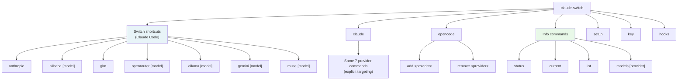
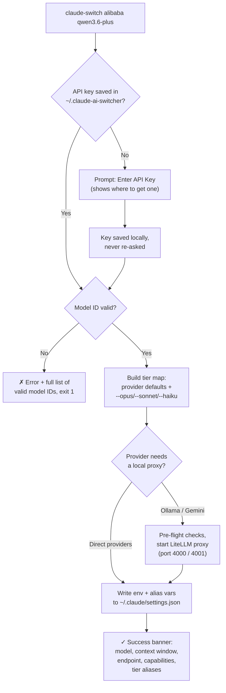

This page is your working reference for the commands you will use daily with Claude AI Switcher: switching Claude Code between providers, checking configuration status, and browsing the provider/model catalog. The CLI is a single binary named `claude-switch` (registered via the `bin` field in `package.json` and built from `src/index.ts` using Commander.js), and every command it exposes flows through this one entry point. After reading this page you will know the exact syntax, the expected output, and what to do when a command fails — without needing to understand the internals, which are covered in later Deep Dive pages.
Sources: [package.json](package.json#L6-L8), [index.ts](src/index.ts#L96-L101)

## The Command Surface at a Glance

Claude AI Switcher deliberately offers two ways to say the same thing. **Shortcuts** place the provider name directly at the top level (`claude-switch alibaba`), because switching is by far the most common action. **Explicit targeting** nests the same providers under the `claude` subcommand (`claude-switch claude alibaba`) for cases where you want zero ambiguity about which client is being configured. Both forms call the exact same implementation functions — for example, the top-level `alibaba [model]` command and `claude alibaba [model]` both invoke `switchAlibaba()` — so pick whichever reads better to you; the behavior is identical.
Sources: [index.ts](src/index.ts#L431-L519), [index.ts](src/index.ts#L525-L617)



The remaining top-level commands fall outside this page's scope: `setup` runs the interactive first-run wizard (see [Interactive Setup Wizard and API Key Entry](5-interactive-setup-wizard-and-api-key-entry)), `opencode add/remove` manages OpenCode's config file (see [OpenCode Client: Adding and Removing Providers in opencode.json](15-opencode-client-adding-and-removing-providers-in-opencode-json)), and `hooks` manages the optional token tracker (see [Hook Manager: Installing, Removing, and Tracking Hook State](23-hook-manager-installing-removing-and-tracking-hook-state)).
Sources: [index.ts](src/index.ts#L624-L905), [index.ts](src/index.ts#L1144-L1146), [index.ts](src/index.ts#L1259-L1265)

## Switching Providers

Every provider switch follows one template: `claude-switch <provider> [model]`. The optional `[model]` argument selects a specific model ID from the catalog; if you omit it, a sensible default is chosen for you. Each switch command also accepts the `--opus`, `--sonnet`, and `--haiku` flags to override how Claude Code's three model tiers map to the provider's models — this alias system has its own dedicated pages at [The Model Tier Alias System: Opus, Sonnet, and Haiku Environment Variables](12-the-model-tier-alias-system-opus-sonnet-and-haiku-environment-variables) and [Custom Tier Overrides with --opus, --sonnet, and --haiku Flags](13-custom-tier-overrides-with-opus-sonnet-and-haiku-flags).
Sources: [index.ts](src/index.ts#L145-L150)

The table below is your quick reference for all seven providers. The **Default model** column shows what you get when you omit `[model]`; the **Requirements** column flags external dependencies that the tool checks before switching.

| Command | Provider | Default model | Endpoint written | Requirements |
|---|---|---|---|---|
| `claude-switch anthropic` | Anthropic (native) | — (Claude defaults) | *(cleared)* | None — restores stock Claude Code |
| `claude-switch alibaba [model]` | Alibaba Coding Plan | `qwen3.7-plus` | `https://coding-intl.dashscope.aliyuncs.com/apps/anthropic` | Alibaba API key (prompted if missing) |
| `claude-switch glm` | GLM/Z.AI | — (tier map only) | *(via MCP)* | `@z_ai/coding-helper` npm package |
| `claude-switch openrouter [model]` | OpenRouter | `qwen/qwen3.6-plus:free` | `https://openrouter.ai/api/v1` | OpenRouter API key |
| `claude-switch ollama [model]` | Ollama (local) | `deepseek-r1:latest` | `http://localhost:4000` (LiteLLM proxy) | LiteLLM installed + Ollama installed and running |
| `claude-switch gemini [model]` | Gemini (Google) | `gemini-2.5-pro` | `http://localhost:4001` (LiteLLM proxy) | LiteLLM installed + Gemini API key |
| `claude-switch muse [model]` | Muse (Meta) | `muse-spark-1.2-contributor` | `https://api.meta.ai` | None — direct Anthropic-compatible |

Sources: [index.ts](src/index.ts#L165-L202), [index.ts](src/index.ts#L204-L269), [index.ts](src/index.ts#L271-L385), [index.ts](src/index.ts#L387-L425), [README.md](README.md#L99-L163)

A note on `anthropic`: switching back is intentionally the simplest command in the tool — it takes no model argument and no key. It simply rewrites `~/.claude/settings.json` so Claude Code uses its native Anthropic models again, clearing the provider env vars and aliases that other switches set. Think of it as the "reset to factory settings" switch.
Sources: [index.ts](src/index.ts#L156-L163)

### What Happens When You Run a Switch

All switch commands share one internal pattern, which explains the output you see and the errors you might hit. The flowchart below traces the journey of a command like `claude-switch alibaba qwen3.6-plus`:



Two behaviors in this flow deserve attention. First, the **API key prompt is one-time**: the `promptApiKey()` helper prints the provider's console URL, reads your key from stdin, and stores it via `setApiKey()` — on the next switch the key is found immediately and the prompt is skipped (key storage details live in [API Key Storage in ~/.claude-ai-switcher/config.json](20-api-key-storage-in-claude-ai-switcher-config-json)). Second, **model IDs are validated against a static catalog** before anything is written: a typo like `qwen3.6-pluss` fails fast with the complete list of valid IDs, so you can never half-configure your settings with a nonexistent model.
Sources: [index.ts](src/index.ts#L107-L125), [index.ts](src/index.ts#L180-L186), [index.ts](src/index.ts#L247-L253)

The proxy branch applies only to Ollama and Gemini, and their pre-flight checks are strict: Ollama refuses to proceed unless LiteLLM is installed, Ollama itself is installed, *and* the Ollama daemon is running (`ollama serve`), while Gemini requires LiteLLM and a Google API key. If any check fails, the tool exits with an error and an install hint rather than leaving your configuration in a broken state. The proxy lifecycle internals are covered in [Ollama Provider: Local Models with Detached LiteLLM Proxy Lifecycle on Port 4000](17-ollama-provider-local-models-with-detached-litellm-proxy-lifecycle-on-port-4000) and [Gemini Provider: LiteLLM Proxy Translation on Port 4001](18-gemini-provider-litellm-proxy-translation-on-port-4001).
Sources: [index.ts](src/index.ts#L275-L297), [index.ts](src/index.ts#L336-L369)

### Reading the Success Banner

A successful switch prints a consistent confirmation block so you can verify the result at a glance:

```text
✓ Switched to: Alibaba Coding Plan
────────────────────────────────────────────────────────────
  Model: Qwen3.7-Plus
  Context: 1M tokens
  Endpoint: https://coding-intl.dashscope.aliyuncs.com/apps/anthropic
  Capabilities: Text Generation, Deep Thinking, Visual Understanding
  Most capable Qwen model with balanced performance, speed, and cost...

  Claude model aliases:
    ANTHROPIC_DEFAULT_OPUS_MODEL   → qwen3.7-plus
    ANTHROPIC_DEFAULT_SONNET_MODEL → qwen3.6-plus
    ANTHROPIC_DEFAULT_HAIKU_MODEL  → kimi-k2.5
```

The `Model`, `Context`, `Endpoint`, and `Capabilities` lines come straight from the provider's entry in the static model catalog in `src/models.ts` — the context window is formatted into human-readable form by `formatContext()`, which renders 1,000,000 tokens as `1M tokens` and 200,000 as `200K tokens`. The `Claude model aliases` block, printed by `displayTierMap()`, shows the three environment variables being written so Claude Code routes its opus/sonnet/haiku tiers to your chosen provider's models. Each provider ships a hardcoded default tier map (e.g., `GLM_DEFAULT_TIER_MAP`, `OPENROUTER_DEFAULT_TIER_MAP`), and the README documents the full per-provider default table.
Sources: [index.ts](src/index.ts#L138-L143), [display.ts](src/display.ts#L123-L130), [models.ts](src/models.ts#L24-L57), [README.md](README.md#L674-L712)

## Checking Your Configuration: `status` and `current`

Once you've switched (or before you do), two read-only commands tell you where things stand, and they differ in one important way: **`current` reads configuration only and is instant; `status` reads configuration *and* performs live API key verification over the network.** Reach for `current` for a quick glance, and `status` when you suspect a key problem.

| Command | Network calls | Shows Claude Code config | Shows OpenCode config | Verifies API keys | Typical use |
|---|---|---|---|---|---|
| `claude-switch status` | Yes (all providers) | ✓ | ✓ | ✓ with spinner + icons | Diagnose key issues |
| `claude-switch current` | No | ✓ | ✓ | ✗ | Quick "what am I on?" |

Sources: [index.ts](src/index.ts#L909-L929), [index.ts](src/index.ts#L1031-L1074)

Both commands print the same configuration block for each client: the detected provider, the model in use, the endpoint (if any), and — for Claude Code — the current tier aliases. Detection works by reading `~/.claude/settings.json` (and OpenCode's config) through `getCurrentProvider()`; if the settings file doesn't exist you'll see `Not configured (using defaults)` instead of an error, which is normal for a fresh machine. The heuristics behind provider detection are explained in [Provider Detection Heuristics in getCurrentProvider()](10-provider-detection-heuristics-in-getcurrentprovider).
Sources: [index.ts](src/index.ts#L919-L936), [index.ts](src/index.ts#L1042-L1056)

The `status` command's verification section runs `verifyAllKeys()` while an `ora` spinner displays "Verifying API keys...", then prints one line per provider. Learning the icon legend makes the output self-explanatory:

| Icon | Status | Meaning |
|---|---|---|
| `✓` (green) | `ok` | Key verified successfully against the provider |
| `✗` (red) | `invalid` | Key exists but the provider rejected it |
| `○` (dim) | `missing` | No key configured |
| `⚠` (yellow) | `error` | Check failed (e.g., network/proxy unreachable) |
| `–` (dim) | skipped | Provider not applicable |

Verified keys are also shown masked (e.g., `sk-...abcd`) so you can confirm *which* key is stored without exposing it. The verification techniques themselves — lightweight health checks and key masking — are detailed in [API Key Verification: Lightweight Health Checks and Key Masking](21-api-key-verification-lightweight-health-checks-and-key-masking).
Sources: [index.ts](src/index.ts#L955-L1024), [README.md](README.md#L674-L694)

One adjacent command worth knowing here: `claude-switch key <provider> [apikey]` lets you pre-set or check a key without switching. Running it with just the provider name reports whether a key is set; adding the key as a second argument stores it. This pairs naturally with `status` when you need to rotate a key.
Sources: [index.ts](src/index.ts#L1119-L1141)

## Browsing the Catalog: `list` and `models`

Before switching, you'll often want to discover what's available. Both browsing commands are **fully offline** — they render the static `providers` registry compiled into `src/models.ts`, so they never touch the network and return instantly. The registry maps seven provider IDs (`anthropic`, `alibaba`, `glm`, `openrouter`, `ollama`, `gemini`, `muse`) to their display names, endpoints, and model arrays; the metadata fields each model carries (ID, context window, capabilities, description) are documented in [Model Catalog and Metadata: IDs, Context Windows, and Capabilities](11-model-catalog-and-metadata-ids-context-windows-and-capabilities).
Sources: [index.ts](src/index.ts#L1081-L1097), [models.ts](src/models.ts#L335-L391)

**`claude-switch list`** prints everything: first a summary of all seven providers via `displayProviders()` (name, ID, model count, endpoint), then the full model table for each provider one after another. **`claude-switch models <provider>`** prints the table for just one provider, which is what you'll use in practice — the full `list` output is long. Both use the same `displayModels()` renderer, which produces an aligned, three-column table (`Model | Context | Capabilities`) with each model's description on the line beneath:

```text
✓ Provider: Alibaba Coding Plan
────────────────────────────────────────────────────────────────────────────────

Model                 Context         Capabilities
────────────────────────────────────────────────────────────────────────────────
  qwen3.7-plus        1M tokens       Text Generation, Deep Thinking, Visual Un...
  Most capable Qwen model with balanced performance, speed, and cost...

  qwen3.6-plus        1M tokens       ...
```

The renderer computes column widths from the longest model ID at runtime (`Math.max(20, ...)` guarantees a minimum), and the model IDs it lists are exactly the strings the switch commands validate against — so `claude-switch models alibaba` is the authoritative source of valid arguments for `claude-switch alibaba <model>`. This closes the loop with the switch flow: copy an ID from the table, paste it into the switch command.
Sources: [display.ts](src/display.ts#L10-L17), [display.ts](src/display.ts#L22-L71), [display.ts](src/display.ts#L135-L151), [README.md](README.md#L248-L264)

Note that the `models` command is strictly one provider at a time: with no argument it errors with the full list of valid provider names, and an unknown name errors with the same list — a deliberate design that always tells you the correct next command to run.
Sources: [index.ts](src/index.ts#L1099-L1117)

## Troubleshooting Everyday Commands

Because the switch commands validate early and fail fast, most problems surface as a clear error with a remedy attached. The table below maps the errors you're most likely to encounter:

| Symptom | Cause | Fix |
|---|---|---|
| `✗ Error: Invalid model: <id>` + valid list | Model ID not in the static catalog | Run `claude-switch models <provider>` and copy an exact ID |
| `⚠ <Provider> API Key not found` prompt | No key stored yet | Enter key (stored locally) or pre-set with `claude-switch key <provider> <key>` |
| `✗ Error: LiteLLM is required for Ollama/Gemini support` | `litellm` pip package missing | `pip install 'litellm[proxy]'` |
| `✗ Error: Ollama is not running` | Daemon not started | `ollama serve` in another terminal |
| `⚠ coding-helper not found` (warning, not error) | GLM's MCP package not installed | `npm install -g @z_ai/coding-helper`, then `coding-helper auth` |
| `✗` next to a provider in `status` | Key rejected by provider | Re-enter key with `claude-switch key <provider> <new-key>` |
| `status` shows `⚠ error` for proxy providers | LiteLLM proxy not running | Re-run `claude-switch ollama` / `claude-switch gemini` to restart the proxy |

Sources: [index.ts](src/index.ts#L107-L125), [index.ts](src/index.ts#L182-L186), [index.ts](src/index.ts#L275-L297), [index.ts](src/index.ts#L204-L212)

One pattern worth internalizing: GLM is unique among the providers in that a missing dependency (`coding-helper`) produces a **warning and continues anyway**, updating local config even though the MCP integration won't be live — whereas Ollama and Gemini treat missing dependencies as **hard errors** and exit immediately. If a GLM switch prints the warning, the fix is the two commands shown in the table, after which re-running the switch performs the full integration.
Sources: [index.ts](src/index.ts#L204-L230)

## Where to Go Next

With the everyday commands under your belt, two natural progressions follow from this page. If you want the tool to handle your first setup interactively, read [Interactive Setup Wizard and API Key Entry](5-interactive-setup-wizard-and-api-key-entry) next; it walks through `claude-switch setup`, which sequences everything covered here into a guided flow. If you're curious about what the switch commands actually write to disk, continue to [The Provider Switch Flow: Key Validation, Tier Maps, Proxy Startup, and Settings Writes](9-the-provider-switch-flow-key-validation-tier-maps-proxy-startup-and-settings-writes) for the deep dive into the same flowchart shown above, and [Claude Code Client: Managing ~/.claude/settings.json with Backups and Onboarding](14-claude-code-client-managing-claude-settings-json-with-backups-and-onboarding) for the settings-file mechanics.