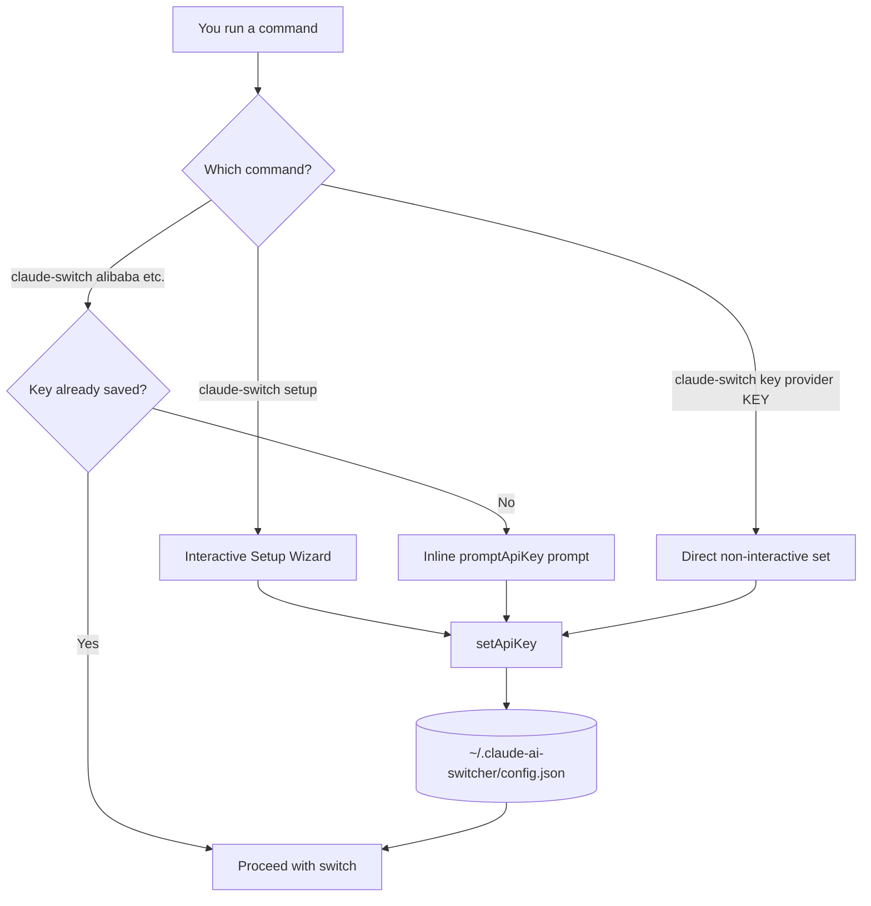
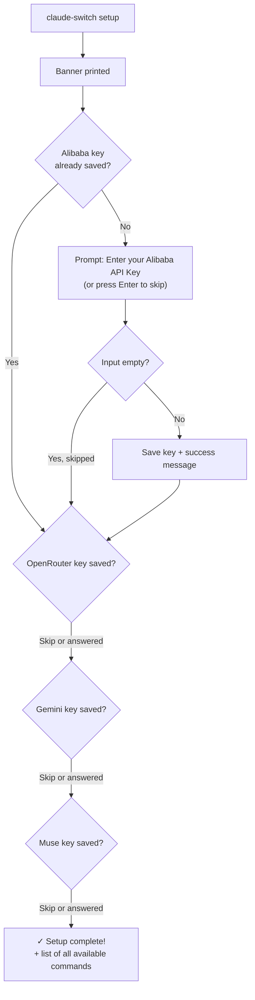

The first thing most people do with Claude AI Switcher is hand it an API key — and the project makes this deliberately painless. This page walks you through the **interactive setup wizard** (`claude-switch setup`), the **on-the-fly key prompts** that appear when you switch providers, and exactly where your keys end up on disk. By the end, you'll know all three ways to register an API key and which one to pick as a beginner.

## The Big Picture: Two Entry Points for Keys

Before typing anything, it helps to see the shape of the system. Claude AI Switcher offers one *planned* path (the wizard) and one *reactive* path (inline prompts during switching). Both converge on the same storage file, `~/.claude-ai-switcher/config.json`:



The wizard never launches on its own — it's always an explicit `claude-switch setup` invocation, which is why the README marks it as "recommended for first-time use" in its Quick Start section. If you skip it entirely and just run a switch command, the inline prompt catches you anyway. There is no way to accidentally lose your place.

Sources: [README.md](README.md#L96-L106)

## Running the Setup Wizard Step by Step

Open a terminal and run:

```bash
claude-switch setup
```

You'll see a green banner — `=== Claude AI Switcher Setup ===` — followed by up to four sequential prompts. The internal logic is simple and beginner-friendly: for each provider, the wizard **first checks whether you already have a key saved**; if you do, that prompt is silently skipped. Here is the exact decision flow the code executes:



Two behaviors matter as a beginner. First, **pressing Enter with no input skips that provider** — nothing is saved, no error occurs. This makes the wizard safe to run repeatedly; a second run only asks about providers you skipped the first time. Second, every answered prompt immediately writes to disk via `setApiKey`, so even if you force-quit mid-wizard, earlier keys are already persisted.

Sources: [index.ts](src/index.ts#L1143-L1166)

## What Each Prompt Asks For

The wizard covers exactly four providers — the ones that talk to cloud APIs through Anthropic-compatible endpoints or LiteLLM proxies. Each prompt shows a **help URL** so you can find your key in a browser tab while the terminal waits for you:

| # | Prompt Title | Question Shown | Where to Get the Key | Saved As (JSON field) |
|---|--------------|----------------|----------------------|------------------------|
| 1 | Alibaba Coding Plan Setup | "Enter your Alibaba API Key (or press Enter to skip):" | https://modelstudio.console.alibabacloud.com/ | `alibabaApiKey` |
| 2 | OpenRouter Setup | "Enter your OpenRouter API Key (or press Enter to skip):" | https://openrouter.ai/settings/keys | `openrouterApiKey` |
| 3 | Gemini Setup | "Enter your Gemini API Key (or press Enter to skip):" | https://aistudio.google.com/apikey | `geminiApiKey` |
| 4 | Muse (Meta) Setup | "Enter your Muse API Key (or press Enter to skip):" | https://api.meta.ai (`MODEL_API_KEY`, same key as `ANTHROPIC_AUTH_TOKEN`) | `museApiKey` |

Note the extra hint on the Muse prompt: it tells you upfront that this is the *same* key you'd otherwise export as `ANTHROPIC_AUTH_TOKEN`, which saves a confusing round-trip for Meta API users.

Sources: [index.ts](src/index.ts#L1152-L1215)

## The Wizard's Finish Screen

After the last prompt, the readline interface closes and the wizard prints `✓ Setup complete!` followed by a cheat-sheet of every major command — provider switches, OpenCode add/remove operations, tier alias overrides, `list`, `status`, `current`, and the hooks commands. Treat this output as your menu for the next hour of exploring: it's the same command surface documented across the [Everyday CLI Commands](4-everyday-cli-commands-switching-providers-status-list-and-models) page. Any unexpected error during the wizard (for example, a filesystem permission problem writing the config) is caught, printed in red, and exits with code 1 rather than crashing with a stack trace.

Sources: [index.ts](src/index.ts#L1217-L1252)

## Just-in-Time Entry: The Inline `promptApiKey` Prompt

The wizard is the planned path, but Claude AI Switcher also guards every switch command. Consider what happens when you run `claude-switch alibaba` with no key saved: the switch function calls `getApiKey("alibaba")`, gets back `undefined`, and hands control to a small helper named `promptApiKey`. That helper prints a yellow warning (`⚠ Alibaba API Key not found`), prints the help URL, and opens a question on a fresh readline interface.

The critical behavioral difference from the wizard: **the inline prompt is mandatory**. If you press Enter with nothing typed, you get `API Key is required` in red and the process exits with code 1 — because the switch cannot proceed without a key. Contrast this with the wizard's permissive skip:

| Behavior | Setup Wizard | Inline `promptApiKey` | `key` Command |
|----------|--------------|----------------------|---------------|
| Empty input allowed? | ✅ Yes — skips provider | ❌ No — exits with error | N/A (argument-based) |
| When it runs | Only when you ask | Automatically during a switch | Only when you type it |
| Saves key after input? | ✅ Immediately | ✅ Immediately | ✅ Immediately |
| Verifies key against provider API? | ❌ No | ❌ No | ❌ No |
| Good for | First-time bulk setup | Never blocking your workflow | Scripts / CI / quick replacement |

The same guard repeats identically in the switch flows for OpenRouter, Gemini, and Muse, and again in the `opencode add` flows — so whichever client you configure, a missing key degrades into a question, not a failure.

Sources: [index.ts](src/index.ts#L107-L125), [index.ts](src/index.ts#L165-L178)

## The Third Door: `claude-switch key <provider> [apikey]`

For non-interactive moments (scripts, dotfile restores, or simply preferring one-liners), the `key` command manages keys without any prompt. Called with just a provider name it *reports* state — `API key is set for alibaba` in green, or a warning with a copy-pasteable suggestion. Called with a key as the second argument it saves it and confirms. Nothing is ever echoed back to you in full; this command is about setting, not showing.

```bash
claude-switch key alibaba              # check: set or not?
claude-switch key gemini AIza...xyz    # set directly, no prompt
```

Sources: [index.ts](src/index.ts#L1119-L1141)

## Where Your Keys Actually Live

All three entry paths funnel through one module, `src/config.ts`, which defines the storage location once: a directory `~/.claude-ai-switcher` and a single `config.json` inside it. The file shape is intentionally boring — a flat JSON object with optional fields per provider, written with 2-space indentation so it's human-readable if you ever open it:

```json
{
  "alibabaApiKey": "sk-...",
  "openrouterApiKey": "sk-or-...",
  "geminiApiKey": "AIza...",
  "museApiKey": "..."
}
```

Reading is tolerant (a missing file yields an empty config, not an error), while writing creates the directory on demand before saving. The `getApiKey`/`setApiKey` pair maps each provider name to its JSON field, and `hasApiKey` is literally just "did `getApiKey` return something truthy" — which is exactly the check the wizard and switch flows rely on. When the `status` command later displays your configuration, keys are never printed raw; a `maskKey` helper reduces anything longer than 8 characters to `first4...last4` (shorter keys become `****`). For a deeper treatment of storage security, see [API Key Storage in ~/.claude-ai-switcher/config.json](20-api-key-storage-in-claude-ai-switcher-config-json).

Sources: [config.ts](src/config.ts#L11-L21), [config.ts](src/config.ts#L33-L48), [config.ts](src/config.ts#L53-L92), [config.ts](src/config.ts#L97-L100), [verify.ts](src/verify.ts#L15-L19)

## Why the Wizard Skips Anthropic, GLM, and Ollama

Beginners often expect the wizard to cover *all* providers listed by `claude-switch list`, so the omission deserves a plain answer. Anthropic isn't prompted because its key comes from the `ANTHROPIC_API_KEY` environment variable (the `status` command reads it straight from `process.env`), not from the switcher's config file. GLM/Z.AI authentication is delegated to Claude Code's own login and the `coding-helper` MCP tooling. Ollama runs locally on your machine and needs no API key at all. The wizard's scope — Alibaba, OpenRouter, Gemini, Muse — is precisely the set of cloud providers whose credentials the switcher itself must store and inject.

Sources: [index.ts](src/index.ts#L960-L964)

## Troubleshooting the Wizard

| Symptom | Cause | Fix |
|---------|-------|-----|
| Wizard finishes instantly, no prompts | Keys already saved for all four providers | Run `claude-switch status` to confirm, or delete the field from `~/.claude-ai-switcher/config.json` to re-prompt |
| "Setup failed" in red | Usually a filesystem error writing config.json | Check permissions on your home directory; the wizard exits with code 1 and can be safely re-run |
| Switch says "API Key is required" and exits | You pressed Enter on the *inline* prompt (not the wizard) | Re-run the switch and paste a real key, or set it via `claude-switch key <provider> <key>` |
| Key saved but provider rejects it | Wizard does no live validation — it only stores text | Run `claude-switch status`, which performs lightweight health checks per provider |
| Wrong key pasted, want to replace | `setApiKey` overwrites unconditionally | Re-enter it via the wizard's logic: delete from config.json, or simply run `claude-switch key <provider> <newkey>` |

The validation row is worth internalizing: none of the three entry paths ever contacts the provider — storage and verification are strictly separate concerns, covered on [API Key Verification: Lightweight Health Checks and Key Masking](21-api-key-verification-lightweight-health-checks-and-key-masking).

## Next Steps

With keys stored, the natural sequence from here is: learn the day-to-day commands on [Everyday CLI Commands: Switching Providers, Status, List, and Models](4-everyday-cli-commands-switching-providers-status-list-and-models), complete your first-run experience by installing the optional UI layer via [Installing Token Tracking and Visual Enhancement Hooks](6-installing-token-tracking-and-visual-enhancement-hooks), and when you're curious about what a switch actually does with your key, follow [The Provider Switch Flow: Key Validation, Tier Maps, Proxy Startup, and Settings Writes](9-the-provider-switch-flow-key-validation-tier-maps-proxy-startup-and-settings-writes).