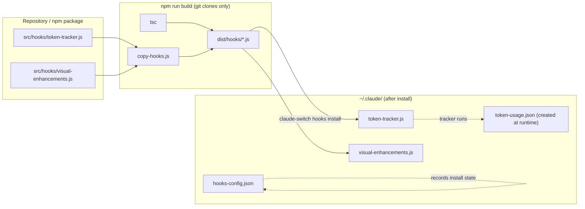
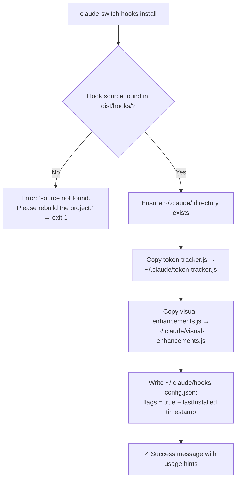

This page walks you through the **optional second step of the first-run experience**: installing the Token Tracker and Visual Enhancements hooks into your Claude Code environment. Important context for beginners: the interactive setup wizard (covered in [Interactive Setup Wizard and API Key Entry](5-interactive-setup-wizard-and-api-key-entry)) collects API keys but does **not** install hooks — instead, its completion screen advertises `claude-switch hooks install` as the command to run next. This page explains exactly what that command does, where files land, how to verify success, and how to undo everything cleanly.
Sources: [index.ts](src/index.ts#L1143-L1252)

## What You're Installing

The switcher ships two **standalone Node.js scripts** (called "hooks") that add visibility into your Claude Code sessions. The **Token Tracker** counts input/output tokens per session and renders a percentage bar showing how much of your model's context window you've consumed, persisting its counters in a local JSON file. The **Visual Enhancements** script renders a model card showing your active model, its provider, endpoint, and context usage. Neither hook is required — the switcher's core provider-switching functionality works perfectly without them, and they can be removed at any time without side effects.
Sources: [token-tracker.js](src/hooks/token-tracker.js#L1-L15), [visual-enhancements.js](src/hooks/visual-enhancements.js#L1-L18), [CLAUDE.md](CLAUDE.md#L251)

Here is what the README promises each hook delivers once installed:

| Feature | Delivered By | Description |
|---------|--------------|-------------|
| **Token Tracker** | `token-tracker.js` | Tracks input/output tokens across your session with a visual percentage bar |
| **Model Card** | `visual-enhancements.js` | Shows active model, provider, context window, and capabilities |
| **Context Bar** | Both | Color-coded progress bar of context usage (🟢 0–50%, 🟡 50–75%, 🔴 75–90%, 🟣 90–100%) |
| **Auto Display** | Both | Shows model info and token usage when you start a Claude Code session |

Sources: [README.md](README.md#L343-L359)

## Prerequisites

Two conditions must hold before `hooks install` can succeed. First, Node.js **18 or newer** must be installed — the hooks run under `node`, and the package's `engines` field enforces this. Second, the **hook source files must exist in your installation's `dist/hooks/` directory**. This is automatic if you installed the switcher via npm, because the published package bundles the pre-built `dist/` folder. If you cloned the repository from git instead, you must run `npm run build` first — that script chains `tsc` (TypeScript compilation) with `copy-hooks`, which copies the plain `.js` hook files from `src/hooks/` into `dist/hooks/` since TypeScript's compiler ignores them. You also need a `~/.claude` directory, but don't worry about creating it — the installer creates it automatically if missing.
Sources: [package.json](package.json#L9-L25), [package.json](package.json#L55-L57), [copy-hooks.js](scripts/copy-hooks.js#L1-L16)

The following diagram shows the full journey of a hook file, from repository source to its final home in your home directory:



## Installing Both Hooks

Run the single command below:

```bash
claude-switch hooks install
```

You'll see a spinner (`Installing hooks...`) followed by this success output:

```
✓ Hooks installed successfully!

  Installed:
    • Token Tracker (~/.claude/token-tracker.js)
    • Visual Enhancements (~/.claude/visual-enhancements.js)

  Usage:
    • Token usage is tracked automatically
    • Run 'claude-switch hooks status' to see current usage
    • Run 'claude-switch hooks reset' to reset counters
```

Under the hood, this command invokes `installAllHooks()`, which simply calls the two individual installers in sequence. If either hook's source file is missing from `dist/hooks/`, the command prints an error and exits with code 1 rather than leaving a half-installed state.
Sources: [index.ts](src/index.ts#L1262-L1288), [hooks/index.ts](src/hooks/index.ts#L81-L84)

### What the Command Actually Does

Installation is a **pure file-copy operation plus a state record** — it does not modify your Claude Code `settings.json`. The steps, in order, are illustrated below:



For each hook, the installer first verifies the source exists (throwing the "rebuild" error otherwise), ensures the `~/.claude` directory exists, copies the script with **overwrite enabled** (so re-running install safely upgrades to newer script versions), and finally updates `~/.claude/hooks-config.json` — setting that hook's flag to `true` and stamping a `lastInstalled` ISO timestamp.
Sources: [hooks/index.ts](src/hooks/index.ts#L47-L59), [hooks/index.ts](src/hooks/index.ts#L64-L76)

## Where Files Land: Before and After

The installation writes exactly two scripts and one state file into `~/.claude/`. The table below shows your directory's delta:

| Path | Before Install | After Install | Purpose |
|------|----------------|---------------|---------|
| `~/.claude/token-tracker.js` | Absent | Copied script | Token counting + context bar display |
| `~/.claude/visual-enhancements.js` | Absent | Copied script | Model card + provider info display |
| `~/.claude/hooks-config.json` | Absent (or existing) | Updated | Install-state record: `tokenTracking`, `visualEnhancements`, `customPrompts` flags, `lastInstalled` timestamp |
| `~/.claude/token-usage.json` | Absent | Absent until tracker runs | Runtime counter storage created by the tracker itself |
| `~/.claude/settings.json` | Unchanged | **Unchanged** | Hook installation never touches Claude Code settings |

Sources: [hooks/index.ts](src/hooks/index.ts#L17-L29), [token-tracker.js](src/hooks/token-tracker.js#L14-L15), [CLAUDE.md](CLAUDE.md#L239-L241)

A subtle but useful detail for beginners: the hooks-config file defaults all flags to `false` when first read, and if the file is ever corrupted (unparseable JSON), the reader silently falls back to those safe defaults rather than crashing — so a broken config never blocks a re-install.
Sources: [hooks/index.ts](src/hooks/index.ts#L123-L142)

## Verifying the Installation

Run the status command:

```bash
claude-switch hooks status
```

Expected output when both hooks are installed:

```
=== Hooks Status ===

  Token Tracker: ✓ Installed
  Visual Enhancements: ✓ Installed
```

The status check works by testing **file existence** — it calls `areHooksInstalled()`, which uses `pathExists` against the two destination scripts, then prints a green ✓ or red "Not installed" for each. If either hook is installed, status additionally executes that script in a child process (using `execFileSync` with a 10-second timeout for isolation) so you immediately see its live display. When nothing is installed, it helpfully suggests the install command instead. If you're ever unsure of the current state on a new machine, `hooks status` is the one command that tells you everything.
Sources: [index.ts](src/index.ts#L1320-L1348), [hooks/index.ts](src/hooks/index.ts#L34-L42), [hooks/index.ts](src/hooks/index.ts#L154-L191)

With the tracker installed, status output includes the live usage box:

```
╔══════════════════════════════════════════════════════════════╗
║  🤖 Active Model: Qwen3 6 Plus                                ║
╠══════════════════════════════════════════════════════════════╣
║  📊 Token Usage:                                              ║
║    Input:  12,450      tokens                                 ║
║    Output: 8,320       tokens                                 ║
║    Total:  20,770      tokens                                 ║
╠══════════════════════════════════════════════════════════════╣
║  📈 Context Window:                                           ║
║    Used:   20,770      tokens                                 ║
║    Total:  1,000,000   tokens                                 ║
║    ████░░░░░░░░░░░░░░░░   2.1%                                ║
╚══════════════════════════════════════════════════════════════╝
```

Sources: [README.md](README.md#L305-L327)

## Granular Install, Reset, and Removal

If you want only one hook, prefer individual removal, or need to reset counters, the CLI exposes the complete `hooks` subcommand family:

| Command | Effect | Resulting State |
|---------|--------|-----------------|
| `claude-switch hooks install` | Install both hooks | Both scripts copied, both flags `true` |
| `claude-switch hooks install-token` | Install only the token tracker | `~/.claude/token-tracker.js` copied |
| `claude-switch hooks install-visual` | Install only the visual enhancements | `~/.claude/visual-enhancements.js` copied |
| `claude-switch hooks status` | Show install state + live displays | No changes |
| `claude-switch hooks reset` | Reset token usage counters | Runs `node ~/.claude/token-tracker.js --reset` in a subprocess |
| `claude-switch hooks remove` | Remove both hooks | Both scripts deleted, both flags `false` |
| `claude-switch hooks remove-token` | Remove only the token tracker | Script deleted, flag `false` |
| `claude-switch hooks remove-visual` | Remove only the visual enhancements | Script deleted, flag `false` |

Sources: [CLAUDE.md](CLAUDE.md#L206-L228), [index.ts](src/index.ts#L1262-L1402)

Removal is deliberately conservative: each remove function first checks whether the destination script exists, deletes it only if present, and then flips the corresponding flag in `hooks-config.json` to `false` — so removing an already-removed hook is a safe no-op. The `reset` command doesn't reinstall or delete anything; it simply spawns the already-installed tracker script with the `--reset` argument and prints `Token usage reset complete.` when the subprocess finishes.
Sources: [hooks/index.ts](src/hooks/index.ts#L89-L118), [hooks/index.ts](src/hooks/index.ts#L196-L208)

## Troubleshooting Installation

| Symptom | Cause | Fix |
|---------|-------|-----|
| `Token tracker source not found. Please rebuild the project.` | `dist/hooks/token-tracker.js` missing — typical on git clones that skipped the build step | Run `npm run build`, then retry `claude-switch hooks install` |
| `Visual enhancements source not found. Please rebuild the project.` | Same cause for the second hook | Same fix — `npm run build` |
| `hooks status` shows "Not installed" after installing | Destination files absent — install may have run against a different Node/home environment | Re-run `claude-switch hooks install`; verify with `ls ~/.claude` |
| `Token tracker not installed. Run: claude-switch hooks install` | A status/reset action was requested while the tracker is absent | Install the token tracker first |
| Hooks stopped matching your switcher version | Old script copies from a previous install | Re-run `claude-switch hooks install` — the copier overwrites existing files |
| Command exits with an error and non-zero code | Any thrown error in the install path | Read the message; the CLI prints it via `displayError` and exits with code 1 |

Sources: [hooks/index.ts](src/hooks/index.ts#L47-L50), [hooks/index.ts](src/hooks/index.ts#L64-L67), [hooks/index.ts](src/hooks/index.ts#L164-L168), [index.ts](src/index.ts#L1284-L1287), [hooks/index.ts](src/hooks/index.ts#L53)

## Where to Go Next

You've now completed the **First-Run Experience** — provider keys are saved and your visibility hooks are installed. From here, the natural continuation is the Deep Dive section: start with [Architecture Overview: CLI, Clients, Providers, and Config Storage Layers](7-architecture-overview-cli-clients-providers-and-config-storage-layers) for the big picture. If the hooks caught your interest, three dedicated pages dissect them in depth: [Hook Manager: Installing, Removing, and Tracking Hook State](23-hook-manager-installing-removing-and-tracking-hook-state) covers the manager you just exercised, [Token Tracker: Session Usage Counters and the Color-Coded Context Bar](24-token-tracker-session-usage-counters-and-the-color-coded-context-bar) explains the counting logic, and [Visual Enhancements: Model Cards, Provider Info, and Context Display](25-visual-enhancements-model-cards-provider-info-and-context-display) covers the rendering. Finally, [Hook Asset Build Pipeline: Why copy-hooks.js Exists Alongside tsc](26-hook-asset-build-pipeline-why-copy-hooks-js-exists-alongside-tsc) explains the build prerequisite you encountered in this tutorial.