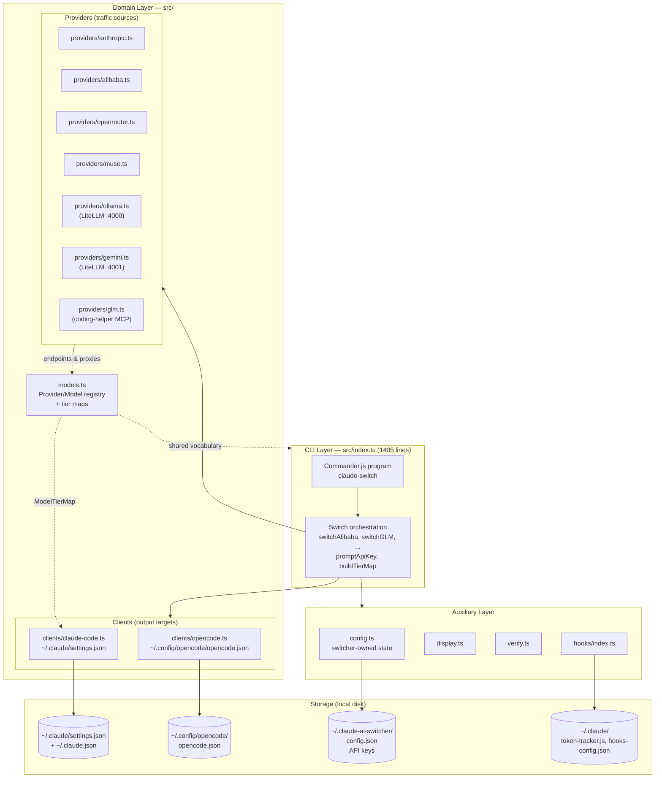
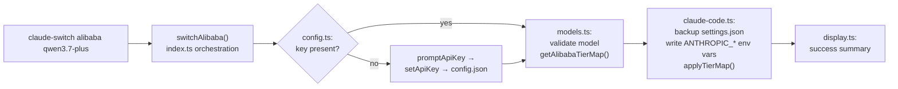

This page maps the complete anatomy of Claude AI Switcher: how a single Commander.js entry point routes commands, how **providers** (where AI traffic goes) and **clients** (whose config files get rewritten) form two symmetric module families, and how four distinct storage locations cooperate during every operation. Understanding these layers is the prerequisite for every deep-dive that follows — the switch flow, connectivity patterns, and client-specific pages all build on the vocabulary established here.

## The Big Picture: Four Layers, One Binary

The project compiles to a single Node.js binary (`claude-switch` → `dist/index.js`) organized into four conceptual layers. The CLI layer parses commands; orchestration functions inside the entry point assemble the data each switch needs; provider and client modules are pure domain logic in `src/`; and a small set of auxiliary modules (display, verification, hooks) handle cross-cutting concerns. Nothing in `src/` imports `src/index.ts` — dependencies flow strictly downward.



The key insight this diagram encodes: **providers and clients are orthogonal axes**. A provider module knows *where requests should be routed and what credentials are needed*; a client module knows *how to encode that routing into a specific tool's config format*. Every switch command is a pairing of one provider with one client. Anthropic needs no API key from the switcher, which is why the provider registry contains seven entries but only four key fields exist in persistent storage.

Sources: [index.ts](src/index.ts#L1-L101), [package.json](package.json#L1-L20)

## Layer 1: The CLI Command Surface

`src/index.ts` is both the process entry point (note the `#!/usr/bin/env node` shebang) and the entire command router. It builds a Commander.js program whose version is read from `package.json` at runtime to prevent drift. The command surface is organized into three tiers with deliberately overlapping capabilities.

| Command tier | Examples | Target client | Defined at |
|---|---|---|---|
| Top-level switch commands | `claude-switch alibaba [model]`, `anthropic`, `glm`, `openrouter [model]`, `ollama [model]`, `gemini [model]`, `muse [model]` | Claude Code (implicit) | [index.ts](src/index.ts#L428-L523) |
| `claude` group | `claude-switch claude anthropic`, `claude alibaba`, `claude glm`, ... | Claude Code (explicit) | [index.ts](src/index.ts#L524-L527) |
| `opencode` group | `claude-switch opencode add alibaba`, `opencode remove glm`, ... | OpenCode (add/remove model) | [index.ts](src/index.ts#L620-L625) |
| Introspection | `status`, `current`, `list`, `models [provider]` | Read-only, both clients | [index.ts](src/index.ts#L910-L1100) |
| Credential & lifecycle | `key <provider> [apikey]`, `setup` | Switcher's own config | [index.ts](src/index.ts#L1120-L1144) |
| `hooks` group | `hooks install`, `hooks status`, `hooks remove-token`, ... | Claude Code hooks | [index.ts](src/index.ts#L1259-L1391) |

Two design decisions are worth internalizing. First, the top-level commands exist as **convenience aliases** for the most common operation — switching Claude Code — while the `claude` group makes the target explicit; both tiers dispatch to the same `switch*` orchestration functions. Second, OpenCode is managed under an `add`/`remove` model rather than a switch model, because OpenCode's config supports multiple providers coexisting as keyed records, whereas Claude Code holds exactly one active provider in its environment variables. The `status` and `current` commands read back state using each client's `getCurrentProvider()` — a heuristic process covered in depth on [Provider Detection Heuristics in getCurrentProvider()](10-provider-detection-heuristics-in-getcurrentprovider).

Sources: [index.ts](src/index.ts#L92-L101), [index.ts](src/index.ts#L428-L527), [index.ts](src/index.ts#L620-L625), [index.ts](src/index.ts#L910-L1100)

## Layer 2: Provider Modules — The Source Side

Provider knowledge is split across two files: a **registry** in `src/models.ts` that defines the catalog, and one **module per provider** in `src/providers/` that adds behavior where behavior is needed. The registry shape is deliberately minimal — `id`, `name`, optional `endpoint`, and a `models` array — and every entry is a plain object, not a class:

```typescript
export interface Provider {
  id: string;
  name: string;
  endpoint?: string;
  models: Model[];
}
```

Seven providers are registered: anthropic (no endpoint — native default), alibaba, glm, openrouter, ollama, gemini, and muse. The same file defines the `ModelTierMap` type (`{opus, sonnet, haiku}`) and per-provider default tier maps, which form the shared vocabulary between the CLI layer and the Claude Code client.

| Provider module | Registry endpoint | Key handled by config.ts? | Extra responsibilities beyond config |
|---|---|---|---|
| `anthropic.ts` | *(none — native)* | No | None; removes overrides by restoring defaults |
| `alibaba.ts` | `coding-intl.dashscope.aliyuncs.com` | Yes | `getXConfig` + `findModel` only |
| `openrouter.ts` | `openrouter.ai/api/v1` | Yes | `getXConfig` + `findModel` only |
| `muse.ts` | `api.meta.ai` | Yes | `getXConfig` + `findModel` only |
| `ollama.ts` | `localhost:4000` | No (local) | Environment probes (`isLitellmInstalled`, `isOllamaInstalled`, `isOllamaRunning`), detached LiteLLM proxy spawn on port 4000 |
| `gemini.ts` | `localhost:4001` | Yes | LiteLLM probe, `isGeminiKeyValid`, detached proxy spawn on port 4001 |
| `glm.ts` | *(via MCP)* | No | `isCodingHelperInstalled`, `reloadGLMConfig` — delegates to the `@z_ai/coding-helper` MCP server |

The spectrum from `anthropic.ts` (24 lines, a pure config accessor) to `ollama.ts` (proxy lifecycle management with `spawn("litellm", ..., {detached: true})`) reveals the pattern: **simple providers are data; complex providers are data plus a runtime process manager**. The three connectivity strategies — direct Anthropic-compatible API, LiteLLM protocol translation, and MCP delegation — each get a dedicated page under [Provider Connectivity Patterns](8-provider-connectivity-patterns-direct-api-vs-litellm-proxy-vs-coding-helper-mcp).

Sources: [models.ts](src/models.ts#L1-L20), [models.ts](src/models.ts#L335-L391), [anthropic.ts](src/providers/anthropic.ts#L1-L24), [ollama.ts](src/providers/ollama.ts#L17-L48), [ollama.ts](src/providers/ollama.ts#L114-L130), [glm.ts](src/providers/glm.ts#L29-L46)

## Layer 3: Client Modules — The Target Side

Clients are the inverse of providers: they don't know which AI service is being used, only how to persist routing decisions into a specific tool's configuration format. Both clients follow an identical structural template — path constants at the top, typed settings interfaces, read/write functions with timestamped backups, one `configure*` function per provider, and a `getCurrentProvider()` for state introspection.

| Aspect | `clients/claude-code.ts` | `clients/opencode.ts` |
|---|---|---|
| Managed files | `~/.claude/settings.json`, `~/.claude.json` | `~/.config/opencode/opencode.json` |
| Config shape | `env` map with `ANTHROPIC_AUTH_TOKEN`, `ANTHROPIC_BASE_URL`, `ANTHROPIC_MODEL` + tier env vars | `provider` record keyed by provider id (e.g. `bailian-coding-plan`) with `npm`, `options.baseURL`, `options.apiKey`, `models` |
| Mutation model | Overwrite in place (one active provider) | Add/remove keyed records (providers coexist) |
| Backup strategy | `settings.json.backup.<timestamp>` before every write | `opencode.json.backup.<timestamp>` before every write |
| Special handling | `ensureOnboardingComplete()`, tier env key application/cleanup | `$schema` injection, `removeProvider()` cleanup |
| Introspection | `getCurrentProvider()` — endpoint heuristics | `getCurrentProvider()` — provider record inspection |

A subtle but important consequence of this symmetry: both files export functions with **identical names** (`configureAlibaba`, `configureOllama`, `getCurrentProvider`, ...). The entry point disambiguates them with import aliases — `configureAlibaba as configureClaudeAlibaba` from the Claude client versus `configureAlibaba as configureOpenCodeAlibaba` from the OpenCode client. This is why a provider switch function in `index.ts` can compose both clients without name collisions.

The Claude Code client is the primary target and accordingly the more intricate of the two. Its `applyTierMap`/`clearTierMap` pair writes and removes the three `ANTHROPIC_DEFAULT_*_MODEL` environment variables, and every `configure*` function begins with `ensureOnboardingComplete()` to guarantee `~/.claude.json` contains `hasCompletedOnboarding: true` — a pragmatic guard that prevents Claude Code from launching its interactive wizard on a fresh machine. File formats, backup mechanics, and the OpenCode add/remove flow are covered on their dedicated pages: [Claude Code Client](14-claude-code-client-managing-claude-settings-json-with-backups-and-onboarding) and [OpenCode Client](15-opencode-client-adding-and-removing-providers-in-opencode-json).

Sources: [claude-code.ts](src/clients/claude-code.ts#L31-L57), [claude-code.ts](src/clients/claude-code.ts#L76-L110), [claude-code.ts](src/clients/claude-code.ts#L132-L162), [claude-code.ts](src/clients/claude-code.ts#L285-L320), [opencode.ts](src/clients/opencode.ts#L23-L67), [opencode.ts](src/clients/opencode.ts#L73-L90), [opencode.ts](src/clients/opencode.ts#L599-L617), [index.ts](src/index.ts#L28-L49)

## Layer 4: Config Storage — Four Homes on Disk

State is deliberately partitioned across four locations, each with a single owning module. This separation means uninstalling the switcher never destroys client configurations, and switching providers never requires re-entering API keys.

| Path | Owning module | Contents | Lifetime |
|---|---|---|---|
| `~/.claude-ai-switcher/config.json` | `src/config.ts` | API keys (alibaba, openrouter, gemini, muse), `defaultProvider`, `defaultModel` | Persistent across switches |
| `~/.claude/settings.json` + `~/.claude.json` | `src/clients/claude-code.ts` | Active provider env vars, tier map, MCP servers, onboarding flag | Rewritten on every Claude switch |
| `~/.config/opencode/opencode.json` | `src/clients/opencode.ts` | Added/removed provider records with embedded keys and models | Mutated on add/remove |
| `~/.claude/` (hooks assets, `hooks-config.json`) | `src/hooks/index.ts` | Copied `token-tracker.js`, `visual-enhancements.js`, installation state | Managed by `hooks` commands |

The switcher's own store is intentionally minimal — a `UserConfig` interface with four optional key fields plus two defaults, read and written through whole-file JSON serialization. Note the asymmetry with client stores: provider credentials live in *both* the switcher's config (source of truth for reuse) and the client's config (required by the target tool at runtime). The Anthropic key is the exception — it's never stored because Claude Code manages native Anthropic auth itself. Security implications of this storage model are examined on [API Key Storage in ~/.claude-ai-switcher/config.json](20-api-key-storage-in-claude-ai-switcher-config-json) and [Safety Features](22-safety-features-timestamped-backups-env-var-cleanup-and-local-only-storage).

Sources: [config.ts](src/config.ts#L11-L21), [config.ts](src/config.ts#L33-L48), [config.ts](src/config.ts#L53-L100), [hooks/index.ts](src/hooks/index.ts#L17-L42), [claude-code.ts](src/clients/claude-code.ts#L31-L33), [opencode.ts](src/clients/opencode.ts#L23-L25)

## The Auxiliary Layer: Display, Verification, Hooks

Three modules serve all commands without belonging to any single flow. `display.ts` is pure presentation — chalk-based table formatting and model listing with no I/O side effects beyond stdout. `verify.ts` performs lightweight HTTP health checks against each provider's API with a 5-second `AbortController` timeout, returning a normalized `VerifyResult` (`ok | invalid | missing | error | skipped`) and masking keys for safe display. `hooks/index.ts` is a small installer: it copies prebuilt JavaScript hook assets from the package into `~/.claude/` and tracks installation state in `hooks-config.json`. The hooks themselves (`token-tracker.js`, `visual-enhancements.js`) execute inside Claude Code sessions, not inside this CLI — the switcher only provisions them. Details live in the [Hooks System](23-hook-manager-installing-removing-and-tracking-hook-state) section.

Sources: [display.ts](src/display.ts#L10-L32), [verify.ts](src/verify.ts#L7-L30), [hooks/index.ts](src/hooks/index.ts#L17-L42)

## How One Command Traverses All Layers

To make the layers concrete, trace `claude-switch alibaba qwen3.7-plus` end to end. The command handler calls `switchAlibaba`, which (1) asks `config.ts` for the stored Alibaba key, falling back to an interactive `promptApiKey` if absent and persisting the answer; (2) validates the model against the `models.ts` registry and builds an `Alibaba` tier map; (3) invokes the Claude Code client's `configureClaudeAlibaba`, which backs up `settings.json`, applies the auth/base-URL/model env vars and tier map, and ensures onboarding is complete; and (4) prints the result through `display.ts`. No proxy processes and no MCP servers are involved for direct providers — but the same shape with `switchOllama` would additionally probe the environment and spawn a detached LiteLLM process before writing settings.



The full switch flow — including verification calls, tier override flags, and proxy startup sequencing — is the subject of [The Provider Switch Flow](9-the-provider-switch-flow-key-validation-tier-maps-proxy-startup-and-settings-writes).

Sources: [index.ts](src/index.ts#L107-L127), [index.ts](src/index.ts#L433-L444), [config.ts](src/config.ts#L73-L100), [claude-code.ts](src/clients/claude-code.ts#L100-L110)

## Source Tree Reference

The directory layout mirrors the layer diagram exactly — one directory per module family, flat files within each:

```
src/
├── index.ts              # CLI entry: Commander program + switch orchestration (1405 lines)
├── models.ts             # Provider/Model registry, tier maps, formatContext (391 lines)
├── config.ts             # ~/.claude-ai-switcher/config.json manager (108 lines)
├── display.ts            # Chalk output formatting (152 lines)
├── verify.ts             # API key health checks + masking (310 lines)
├── clients/              # Output targets — write consumer config files
│   ├── claude-code.ts    #   ~/.claude/settings.json + ~/.claude.json (383 lines)
│   └── opencode.ts       #   ~/.config/opencode/opencode.json (678 lines)
├── providers/            # Traffic sources — endpoints, credentials, runtimes
│   ├── anthropic.ts      #   Native default (24 lines)
│   ├── alibaba.ts        #   Direct Anthropic-compatible
│   ├── openrouter.ts     #   Direct Anthropic-compatible
│   ├── muse.ts           #   Direct Anthropic-compatible
│   ├── ollama.ts         #   LiteLLM proxy lifecycle (port 4000)
│   ├── gemini.ts         #   LiteLLM proxy lifecycle (port 4001)
│   └── glm.ts            #   coding-helper MCP delegation
└── hooks/                # Hook manager + hook assets (installed into ~/.claude/)
    ├── index.ts          #   Install/remove/status manager (209 lines)
    ├── token-tracker.js
    └── visual-enhancements.js
```

Runtime dependencies are minimal and stable: `commander` (CLI parsing), `fs-extra` (file I/O with backup-friendly primitives), `chalk` (terminal color), and `ora` (spinners). Node.js ≥ 18 is required, and the build pipeline is `tsc` followed by `scripts/copy-hooks.js` — the extra step exists because the hooks are plain JavaScript assets that must survive alongside the compiled TypeScript output, a quirk explained on [Hook Asset Build Pipeline](26-hook-asset-build-pipeline-why-copy-hooks-js-exists-alongside-tsc).

Sources: [package.json](package.json#L1-L20), [ARCHITECTURE.md](ARCHITECTURE.md#L1-L24)

## Where to Go Next

With the layer model in place, the natural progression descends from structure to behavior. Start with the three connectivity strategies that explain *why* provider modules differ so much in weight, then follow a single switch command through its complete write path, and finish the architecture track with how state is read back.

1. [Provider Connectivity Patterns: Direct API vs LiteLLM Proxy vs coding-helper MCP](8-provider-connectivity-patterns-direct-api-vs-litellm-proxy-vs-coding-helper-mcp) — the three integration strategies behind the provider table above
2. [The Provider Switch Flow: Key Validation, Tier Maps, Proxy Startup, and Settings Writes](9-the-provider-switch-flow-key-validation-tier-maps-proxy-startup-and-settings-writes) — the complete write path with all sequencing
3. [Provider Detection Heuristics in getCurrentProvider()](10-provider-detection-heuristics-in-getcurrentprovider) — how `status` and `current` reverse-engineer state from client files
4. [Model Catalog and Metadata: IDs, Context Windows, and Capabilities](11-model-catalog-and-metadata-ids-context-windows-and-capabilities) — the `models.ts` registry in full detail