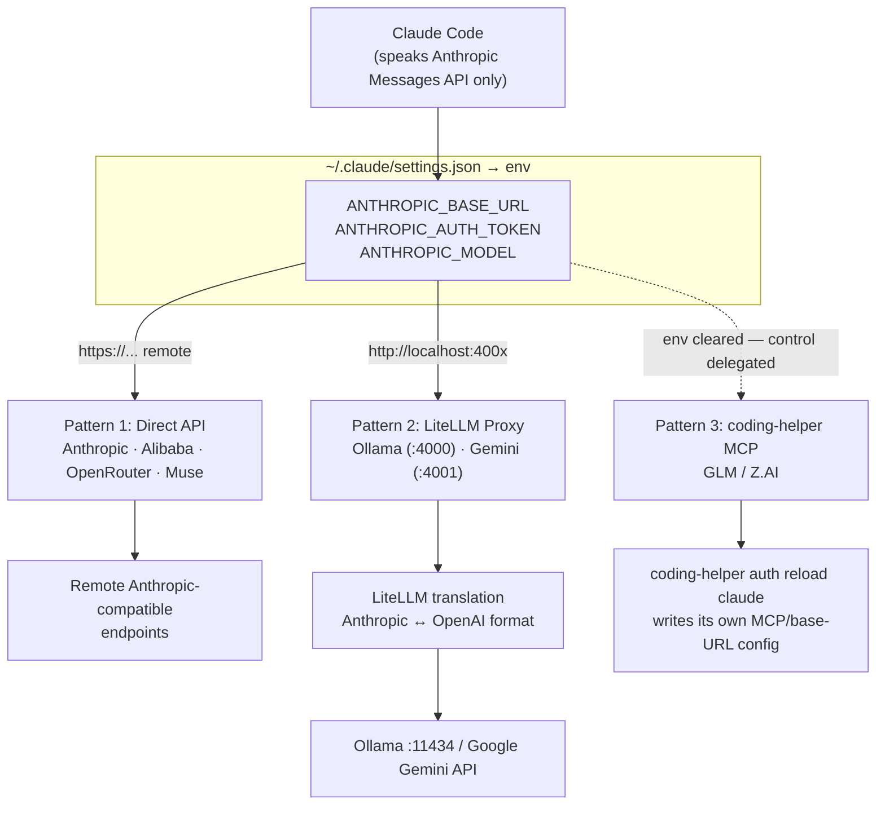
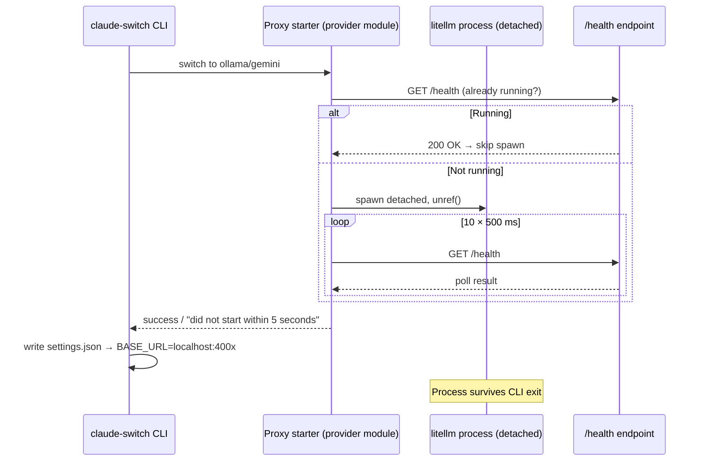

Claude AI Switcher manages seven providers, but at the connectivity level there are only **three distinct integration strategies**: pointing Claude Code at a remote Anthropic-compatible endpoint (Direct API), standing up a local translation proxy (LiteLLM), or delegating configuration entirely to an external tool (coding-helper MCP). This page explains why those three patterns exist, how each one materializes in `~/.claude/settings.json`, and what the architectural trade-offs are. The switch *flow* (validation ordering, tier maps, backups) is covered separately in [The Provider Switch Flow](9-the-provider-switch-flow-key-validation-tier-maps-proxy-startup-and-settings-writes); here we focus on the connectivity topology itself.

## The Routing Pivot: `ANTHROPIC_BASE_URL`

Every pattern converges on a single control point. Claude Code reads `ANTHROPIC_BASE_URL` and `ANTHROPIC_AUTH_TOKEN` from the `env` block of `~/.claude/settings.json` and routes every Messages API request there. The switcher never patches Claude Code's binary or intercepts traffic — it only rewrites these environment variables (plus the `ANTHROPIC_MODEL` and tier-alias variables), which makes the integration maximally non-invasive. From that one pivot, requests fan out to remote HTTPS endpoints, localhost proxy ports, or nowhere at all — the third pattern deliberately *removes* the pivot and lets an external agent own it. This taxonomy is documented explicitly in the repository's own architecture notes, which classify providers into "Direct Providers (Anthropic API)", "LiteLLM Proxy Layer (OpenAI → Anthropic)", and "No Config (coding-helper)".

Sources: [ARCHITECTURE.md](ARCHITECTURE.md#L25-L51), [claude-code.ts](src/clients/claude-code.ts#L31-L46)

Prerequisite for reading this diagram: the solid arrows represent the request path Claude Code actually takes at runtime; the dotted arrow for GLM indicates that the switcher *withdraws* from the routing decision rather than redirecting it.

## Pattern 1: Direct API — Native Anthropic-Compatible Endpoints

The Direct API pattern is the simplest and most common: the target provider already implements the Anthropic Messages API, so the switcher's only job is to write credentials and a base URL. `configureAlibaba`, `configureOpenRouter`, and `configureMuse` each read the current settings, set `ANTHROPIC_AUTH_TOKEN` to the provider's API key, set `ANTHROPIC_BASE_URL` to the provider's remote endpoint (`https://coding-intl.dashscope.aliyuncs.com/apps/anthropic`, `https://openrouter.ai/api/v1`, and `https://api.meta.ai` respectively), and set `ANTHROPIC_MODEL` to the selected model. The endpoints live in the provider registry in `models.ts`, so CLI display, detection, and configuration all resolve from one source of truth.

Sources: [claude-code.ts](src/clients/claude-code.ts#L141-L155), [claude-code.ts](src/clients/claude-code.ts#L210-L224), [claude-code.ts](src/clients/claude-code.ts#L268-L282), [models.ts](src/models.ts#L335-L376)

The native Anthropic provider is the degenerate case of this pattern: `configureAnthropic()` writes *nothing* and instead **deletes** every routing variable — `ANTHROPIC_AUTH_TOKEN`, `ANTHROPIC_BASE_URL`, `ANTHROPIC_MODEL`, plus the tier aliases and stale MCP entries (`alibaba-coding-plan`, `glm-coding-plan`). With no base URL present, Claude Code falls back to its built-in default Anthropic endpoint. This "cleanse on switch to default" behavior is also why every non-Anthropic configuration proactively deletes `CLAUDE_CODE_SUBAGENT_MODEL` and `ENABLE_TOOL_SEARCH` — variables that only Muse requires — demonstrating that env hygiene is part of the pattern contract, not an afterthought.

Sources: [claude-code.ts](src/clients/claude-code.ts#L161-L182), [claude-code.ts](src/clients/claude-code.ts#L150-L151), [claude-code.ts](src/clients/claude-code.ts#L219-L220)

**Muse is the one Direct API provider with extra requirements**: beyond the standard trio it also writes `CLAUDE_CODE_SUBAGENT_MODEL` (mirroring the main model) and `ENABLE_TOOL_SEARCH=true`. This shows the pattern's extensibility mechanism — providers within the same family can layer provider-specific env vars on top of the common base, while other family members explicitly scrub those keys to prevent leakage across switches. The Anthropic provider module itself (`src/providers/anthropic.ts`) is correspondingly minimal: it carries no endpoint, no key handling, and only a default model constant, because "default" means "no override at all".

Sources: [claude-code.ts](src/clients/claude-code.ts#L268-L282), [anthropic.ts](src/providers/anthropic.ts#L1-L24)

The full per-provider env-write matrix for this pattern:

| Provider | `ANTHROPIC_BASE_URL` | `ANTHROPIC_AUTH_TOKEN` | Extra env vars | Key stored locally |
|---|---|---|---|---|
| Anthropic | *(deleted)* | *(deleted)* | *(all cleared, incl. MCP entries)* | No |
| Alibaba | `coding-intl.dashscope.aliyuncs.com/apps/anthropic` | Alibaba key | — | Yes (`~/.claude-ai-switcher/config.json`) |
| OpenRouter | `openrouter.ai/api/v1` | OpenRouter key | — | Yes |
| Muse | `api.meta.ai` | Muse key | `CLAUDE_CODE_SUBAGENT_MODEL`, `ENABLE_TOOL_SEARCH=true` | Yes |

Sources: [claude-code.ts](src/clients/claude-code.ts#L141-L282), [index.ts](src/index.ts#L156-L269), [index.ts](src/index.ts#L387-L420)

Deep dives into each provider's model catalog and quirks live on [Direct Anthropic-Compatible Providers](16-direct-anthropic-compatible-providers-anthropic-alibaba-openrouter-and-muse).

## Pattern 2: LiteLLM Proxy — Protocol Translation on Localhost

Ollama and Gemini share a fundamental constraint: neither speaks the Anthropic Messages API natively. Ollama exposes an OpenAI-compatible API on port 11434, and Gemini speaks its own Google protocol. Rather than reimplement translation, the switcher spawns a **LiteLLM proxy** as a local sidecar that accepts Anthropic-format requests from Claude Code and forwards them in the backend's native format. The provider modules state this rationale verbatim in their headers: "Ollama only speaks OpenAI format, so LiteLLM translates Anthropic Messages API requests into OpenAI Chat Completions format."

Sources: [ollama.ts](src/providers/ollama.ts#L1-L12), [gemini.ts](src/providers/gemini.ts#L1-L12), [ARCHITECTURE.md](ARCHITECTURE.md#L132-L146)

Port allocation is deliberate and conflict-free: Ollama's proxy claims **port 4000** while Gemini's claims **port 4001**, declared as module constants (`OLLAMA_ENDPOINT`/`OLLAMA_LITELLM_PORT`, `GEMINI_ENDPOINT`/`GEMINI_LITELLM_PORT`). These port numbers are load-bearing — they aren't just spawn parameters but also the *detection fingerprints* used later by `getCurrentProvider()` to identify which proxy-backed provider is active. The settings writes then mirror Pattern 1's shape exactly, except the base URL points at `http://localhost:4000` or `http://localhost:4001`.

Sources: [ollama.ts](src/providers/ollama.ts#L25-L35), [gemini.ts](src/providers/gemini.ts#L25-L35), [claude-code.ts](src/clients/claude-code.ts#L226-L262), [claude-code.ts](src/clients/claude-code.ts#L325-L343)

### Proxy Lifecycle: Detached Spawn and Health Polling

The proxy is started *before* settings are written, and its lifecycle is deliberately decoupled from the CLI process. Both `startLitellmProxy()` and `startGeminiLitellmProxy()` spawn `litellm --model <provider>/<model> --port <port>` with `detached: true`, `stdio: "ignore"`, followed by `child.unref()` — meaning the proxy **outlives the switcher process** and keeps running after the CLI exits. Readiness is determined empirically: the code polls `http://localhost:<port>/health` ten times at 500 ms intervals (a 5-second budget), and only reports success when the endpoint answers. If a proxy is already running on the port, the function short-circuits immediately — idempotent startup, no duplicate processes.

Sources: [ollama.ts](src/providers/ollama.ts#L113-L146), [gemini.ts](src/providers/gemini.ts#L98-L136), [ARCHITECTURE.md](ARCHITECTURE.md#L146)

The two implementations differ in three subtle but meaningful ways, summarized below. Ollama spawns with `shell: false` and no injected environment, because local Ollama requires no credentials; correspondingly, `configureOllama` writes a **dummy token** (`"ollama"`) into `ANTHROPIC_AUTH_TOKEN` — LiteLLM accepts it, and no secret ever touches disk. Gemini instead spawns with `shell: true` and injects `GEMINI_API_KEY` into the proxy's environment via the spawn `env` option, while `configureGemini` writes the real Gemini key as the auth token. The net effect: for Ollama, *no credential exists anywhere*; for Gemini, the credential is held by the proxy process and forwarded to Google, keeping Claude Code's view uniformly "Anthropic API with a bearer token".

| Dimension | Ollama proxy | Gemini proxy |
|---|---|---|
| Port | 4000 | 4001 |
| Spawn args | `--model ollama/<model> --port 4000` | `--model gemini/<model> --port 4001` |
| Shell mode | `shell: false` | `shell: true` |
| Injected env | none | `GEMINI_API_KEY` |
| `ANTHROPIC_AUTH_TOKEN` written | `"ollama"` (dummy) | real Gemini API key |
| Backend target | `localhost:11434` (local) | `generativelanguage.googleapis.com` (remote) |
| Pre-flight checks in CLI | litellm installed, ollama installed, ollama running | litellm installed |

Sources: [ollama.ts](src/providers/ollama.ts#L96-L146), [gemini.ts](src/providers/gemini.ts#L84-L136), [claude-code.ts](src/clients/claude-code.ts#L229-L262), [index.ts](src/index.ts#L271-L330), [index.ts](src/index.ts#L332-L385)

The pre-flight checks also diverge by pattern reality: switching to Ollama hard-exits if LiteLLM, the `ollama` binary, or a running Ollama daemon (verified via `GET localhost:11434/api/tags`) is missing, because without them the proxy has nothing to talk to. Gemini only requires the LiteLLM binary — its backend is remote and authenticated by key. These verification probes are reused by the key-validation layer (the `/health` checks on ports 4000/4001 appear again in `verify.ts`), so the same connectivity facts drive both switching and status reporting.

Sources: [index.ts](src/index.ts#L275-L297), [ollama.ts](src/providers/ollama.ts#L80-L94), [verify.ts](src/verify.ts#L213-L223), [verify.ts](src/verify.ts#L286-L295)

Provider-specific lifecycle details continue in [Ollama Provider](17-ollama-provider-local-models-with-detached-litellm-proxy-lifecycle-on-port-4000) and [Gemini Provider](18-gemini-provider-litellm-proxy-translation-on-port-4001); key validation mechanics are covered in [API Key Verification](21-api-key-verification-lightweight-health-checks-and-key-masking).

## Pattern 3: coding-helper MCP — Delegated Configuration

GLM/Z.AI inverts the entire model. Its provider module contains **no endpoint, no key handling, and no proxy logic** — the registry entry in `models.ts` is the only one without an `endpoint` field. Instead of the switcher writing routing config, `configureGLM()` *clears* every provider env var (`ANTHROPIC_AUTH_TOKEN`, `ANTHROPIC_BASE_URL`, `ANTHROPIC_MODEL`, the Muse extras) and writes only the GLM tier map. Then the switch flow shells out to an external CLI: `coding-helper auth reload claude`, executed via `execAsync`. That external tool — installed separately as `npm install -g @z_ai/coding-helper` — owns the actual GLM connectivity: it writes its own configuration into Claude's settings (evidenced by detection logic that recognizes both an `mcpServers["glm-coding-plan"]` entry and a `.z.ai` base URL that the switcher itself never writes).

Sources: [glm.ts](src/providers/glm.ts#L1-L24), [models.ts](src/models.ts#L347-L351), [claude-code.ts](src/clients/claude-code.ts#L184-L204), [glm.ts](src/providers/glm.ts#L43-L60), [index.ts](src/index.ts#L204-L230), [claude-code.ts](src/clients/claude-code.ts#L355-L371)

This is a deliberate **inversion of control** with three observable consequences. First, failure semantics are soft: unlike Ollama/Gemini pre-flights that `process.exit(1)`, a missing `coding-helper` binary produces only a warning with install instructions, and the switch proceeds anyway — the switcher degrades to writing just the tier aliases, and `coding-helper reload` failures are likewise non-fatal ("reload failed, but local config updated"). Second, the switcher's cleanup duties expand: `configureAnthropic` must delete `mcpServers["glm-coding-plan"]` because that entry was created by an external agent the switcher doesn't control. Third, the pattern creates a *dependency direction reversal* for OpenCode: the `opencode add glm` command doesn't configure GLM from scratch but **reads back** the `ANTHROPIC_BASE_URL`/`ANTHROPIC_AUTH_TOKEN` that coding-helper previously deposited into Claude settings (requiring the URL to contain `.z.ai`), then feeds them into OpenCode's config — the switcher consumes coding-helper's output as its input.

Sources: [index.ts](src/index.ts#L204-L230), [claude-code.ts](src/clients/claude-code.ts#L166-L169), [index.ts](src/index.ts#L732-L770)

The trade-off matrix makes the strategic difference clear: this pattern buys zero protocol-translation work and stays compatible with the vendor's own tooling updates, at the cost of an external runtime dependency, reduced determinism (the switcher can't guarantee what coding-helper wrote), and the most fragile detection story of the three patterns. The full provider deep-dive is on [GLM/Z.AI Provider](19-glm-z-ai-provider-integration-via-the-coding-helper-mcp-server).

## Comparative Analysis: Choosing a Pattern

The three patterns form a spectrum of **where translation responsibility lives**: nowhere (backend is already Anthropic-native), in a locally-managed sidecar, or in a third-party tool. Every dimension below is traceable to code:

| Dimension | Direct API | LiteLLM Proxy | coding-helper MCP |
|---|---|---|---|
| Providers | Anthropic, Alibaba, OpenRouter, Muse | Ollama (:4000), Gemini (:4001) | GLM/Z.AI |
| Wire translation | None needed | LiteLLM: Anthropic ↔ OpenAI/Google | External tool's concern |
| Processes spawned | None | Detached `litellm`, survives CLI exit | External `coding-helper` (exec, blocking) |
| Settings written | `BASE_URL` + `AUTH_TOKEN` + `MODEL` (+ Muse extras) | Same trio, URL = `localhost:400x` | Tier map only; routing written by coding-helper |
| Credential location | `settings.json` env (key from local config store) | Ollama: dummy token; Gemini: proxy env + token | Entirely inside coding-helper's domain |
| Missing dependency | N/A (hard-fail only on invalid key/model) | `process.exit(1)` on pre-flight failure | Warning only, switch proceeds |
| Prerequisites | Provider API key | `pip install 'litellm[proxy]'` (+ Ollama binary/daemon for Ollama) | `npm install -g @z_ai/coding-helper` + `coding-helper auth` |
| Detection fingerprint | URL substring (domain) | URL substring (`localhost:4000/4001`) | MCP key, `.z.ai` URL, or tier-map-only fallback |

Sources: [claude-code.ts](src/clients/claude-code.ts#L141-L382), [ollama.ts](src/providers/ollama.ts#L1-L146), [gemini.ts](src/providers/gemini.ts#L1-L136), [glm.ts](src/providers/glm.ts#L1-L60), [index.ts](src/index.ts#L204-L420), [ARCHITECTURE.md](ARCHITECTURE.md#L36-L51)

## Consequence: Pattern Determins Detection Strategy

Because each pattern leaves a different fingerprint in `settings.json`, `getCurrentProvider()` had to evolve a three-tier detection heuristic. Direct and proxy providers are identified by **substring matching on `ANTHROPIC_BASE_URL`** (domain for remote providers, port number for proxies — which is why ports 4000/4001 are architectural constants, not configuration). GLM detection is necessarily messier: it checks for the `glm-coding-plan` MCP server entry first, then a `.z.ai` URL (both written by the external tool), then falls back to a heuristic — "tier aliases present but no base URL" — because after a clean `configureGLM` *with* coding-helper absent, that tier-map-only state is all the switcher itself ever wrote. The detection layer is analyzed in full on [Provider Detection Heuristics](10-provider-detection-heuristics-in-getcurrentprovider).

Sources: [claude-code.ts](src/clients/claude-code.ts#L287-L382), [ARCHITECTURE.md](ARCHITECTURE.md#L113-L130)

## Operational Summary

From first principles, the three patterns answer one question — *who is responsible for making a non-Anthropic backend look like Anthropic?* — with three answers: the backend itself (Direct API), a sidecar the switcher manages (LiteLLM), or a vendor tool the switcher coordinates with (coding-helper). Each choice propagates through the codebase in predictable ways: spawn logic and health polling exist only in `ollama.ts`/`gemini.ts`; external-process delegation exists only in `glm.ts`; env-var hygiene (`delete` of the previous pattern's variables) is the cross-cutting concern that makes switching between patterns safe. When adding a new provider, the first architectural decision is therefore not which models to list but **which of these three connectivity patterns the backend demands** — the step-by-step guide encodes this decision explicitly.

Sources: [ARCHITECTURE.md](ARCHITECTURE.md#L25-L51), [claude-code.ts](src/clients/claude-code.ts#L141-L282)

**Continue reading**: the mechanical sequence of a switch (key validation → model validation → tier map → proxy startup → settings write) is dissected in [The Provider Switch Flow](9-the-provider-switch-flow-key-validation-tier-maps-proxy-startup-and-settings-writes); per-provider implementation details continue with [Direct Anthropic-Compatible Providers](16-direct-anthropic-compatible-providers-anthropic-alibaba-openrouter-and-muse), [Ollama Provider](17-ollama-provider-local-models-with-detached-litellm-proxy-lifecycle-on-port-4000), [Gemini Provider](18-gemini-provider-litellm-proxy-translation-on-port-4001), and [GLM/Z.AI Provider](19-glm-z-ai-provider-integration-via-the-coding-helper-mcp-server). If you're planning to contribute a provider, see [Step-by-Step Guide: Adding a New AI Provider](29-step-by-step-guide-adding-a-new-ai-provider-to-the-switcher).