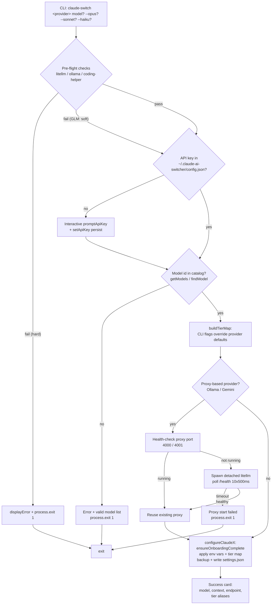

When you type `claude-switch alibaba` (or `openrouter`, `gemini`, `ollama`, `glm`, `muse`, `anthropic`) and press Enter, a four-stage pipeline executes in sequence: **key resolution** → **model validation** → **tier map assembly** → **(optional) proxy startup** → **settings write**. This page dissects that pipeline as it is orchestrated in the CLI entry point, showing exactly where each decision is made, where the process can fail fast, and what bytes land in `~/.claude/settings.json` when everything succeeds. The switch flow is the compositional heart of the tool — it stitches together the key store, the model catalog, the provider modules, and the Claude Code client handler into a single transactional-feeling operation. Per-provider implementation details (proxy lifecycle internals, coding-helper integration) are covered on their dedicated pages; here we focus on the orchestration itself.

Sources: [index.ts](src/index.ts#L156-L425)

## The Pipeline at a Glance

Every switch command — whether invoked as a top-level command (`claude-switch gemini`) or via the explicit namespaced group (`claude-switch claude gemini`) — routes to a single `switchX()` function in `src/index.ts`. These functions share an identical skeleton with provider-specific variations in the pre-flight and write stages. Before diving into each stage, it helps to hold the whole shape in mind: the diagram below traces the canonical happy path and every fail-fast exit along the way.

The critical structural insight: **all validation happens before any write**. The proxy is started before the settings write, but after both key and model validation — so a typo in a model name never leaves a half-configured state, and a missing LiteLLM install never points `ANTHROPIC_BASE_URL` at a dead port. Only once every precondition holds does the flow mutate any file on disk.

Sources: [index.ts](src/index.ts#L271-L330), [index.ts](src/index.ts#L525-L545)

## Stage 1: Key Resolution — Presence Check, Not Live Verification

The first data-gathering step asks a deliberately narrow question: *is there a stored key for this provider?* Each `switchX()` function calls `getApiKey(provider)`, which reads `~/.claude-ai-switcher/config.json` (created on demand by `writeConfig` via `fs.ensureDir`) and maps the provider name to a dedicated field. If the field is empty, the flow drops into an interactive `promptApiKey()` session: it prints a warning with the provider's console URL (e.g., `https://aistudio.google.com/apikey` for Gemini), reads the key from stdin via `readline`, and **refuses to proceed on an empty answer** — `displayError` followed by `process.exit(1)`. A non-empty answer is immediately persisted through `setApiKey` before the flow continues, so the key is never required twice.

Two properties of this stage are worth internalizing. First, **no network call is made during the switch itself** — the check is purely `string | undefined`. Live HTTP verification (hitting each provider's `/models` endpoint with a 5-second timeout) belongs exclusively to the `claude-switch status` command via `verifyAllKeys`, which runs all checks in parallel with `Promise.all` and renders results with masked keys (`maskKey` shows the first and last four characters). This separation keeps switches instant and offline-tolerant; a stale key will only surface as a runtime error from Claude Code itself. Second, two providers bypass this stage entirely: **Anthropic** needs no key (native default), and **GLM** delegates authentication to the external `coding-helper` CLI — its pre-flight merely checks whether `coding-helper` is on the PATH with `which`/`where`, and a missing install is a *soft* warning rather than an exit.

| Provider | Key field in config.json | Missing-key behavior | Fallback prompt URL |
|---|---|---|---|
| Alibaba | `alibabaApiKey` | Interactive prompt → persist | `modelstudio.console.alibabacloud.com` |
| OpenRouter | `openrouterApiKey` | Interactive prompt → persist | `openrouter.ai/settings/keys` |
| Gemini | `geminiApiKey` | Interactive prompt → persist | `aistudio.google.com/apikey` |
| Muse | `museApiKey` | Interactive prompt → persist | `api.meta.ai` |
| Anthropic | *(none)* | No key needed — native | — |
| GLM | *(none)* | Auth owned by `coding-helper` | — |

Sources: [config.ts](src/config.ts#L53-L92), [index.ts](src/index.ts#L107-L125), [index.ts](src/index.ts#L165-L202), [glm.ts](src/providers/glm.ts#L29-L41), [verify.ts](src/verify.ts#L15-L20), [verify.ts](src/verify.ts#L150-L204)

## Stage 2: Model Validation and Default Resolution

After keys, the flow validates the optional positional `[model]` argument against the static model catalog. The pattern is identical across providers: resolve a default if no argument was given, then look the ID up via `getModels(provider).find(...)` (Alibaba, OpenRouter) or the provider's own `findModel()` helper (Ollama, Gemini, Muse). A miss triggers `displayError` with the full list of valid IDs printed as a convenience hint, then `process.exit(1)` — again, before any side effect. Note the ordering nuance: **Ollama and Gemini run pre-flight environment checks *before* model validation**, while key prompting happens after model validation for Gemini and Muse but before it for Alibaba and OpenRouter. The ordering differences don't affect outcomes (all validation precedes writes) but explain the console output sequence you observe.

| Provider command | Default model | Catalog source |
|---|---|---|
| `alibaba` | `qwen3.7-plus` | `getModels("alibaba")` |
| `openrouter` | `qwen/qwen3.6-plus:free` | `getModels("openrouter")` |
| `ollama` | `deepseek-r1:latest` | `findOllamaModel` |
| `gemini` | `gemini-2.5-pro` | `findGeminiModel` |
| `muse` | `muse-spark-1.2-contributor` | `findMuseModel` |
| `glm` / `anthropic` | *(no model arg)* | — |

Sources: [index.ts](src/index.ts#L169-L186), [index.ts](src/index.ts#L236-L253), [index.ts](src/index.ts#L299-L307), [index.ts](src/index.ts#L344-L352), [index.ts](src/index.ts#L391-L399), [ollama.ts](src/providers/ollama.ts#L41-L43)

## Stage 3: Tier Map Assembly — `buildTierMap` and the Alibaba Special Case

Claude Code addresses models through three tier aliases — `ANTHROPIC_DEFAULT_OPUS_MODEL`, `ANTHROPIC_DEFAULT_SONNET_MODEL`, `ANTHROPIC_DEFAULT_HAIKU_MODEL` — and the switch flow's job is to compute a `ModelTierMap` (`{ opus, sonnet, haiku }`) for the target provider. The one-liner that does it is `buildTierMap(defaultMap, tierOpts)`: each tier takes the CLI flag value (`--opus`, `--sonnet`, `--haiku`) if provided, otherwise the provider's hardcoded default. Every provider has a default map exported from `src/models.ts`, except **Alibaba**, whose map is computed at runtime by `getAlibabaTierMap(selectedModel)`: with the default `qwen3.7-plus` selected, tiers are `qwen3.7-plus / qwen3.6-plus / kimi-k2.5`; with any other model, *the selected model is promoted to opus* and the Qwen models fill sonnet/haiku. This makes Alibaba the only provider whose tier map depends on the positional argument, not just the flags.

| Provider default map | opus | sonnet | haiku |
|---|---|---|---|
| GLM | `glm-5.3[1m]` | `glm-5-turbo` | `glm-5v-turbo` |
| OpenRouter | `qwen/qwen3.6-plus:free` | `openrouter/free` | `openrouter/free` |
| Ollama | `deepseek-r1:latest` | `qwen2.5-coder:latest` | `llama3.1:latest` |
| Gemini | `gemini-2.5-pro` | `gemini-2.5-flash` | `gemini-2.5-flash-lite` |
| Muse | `muse-spark-1.2-contributor` | same | same |
| Alibaba (default model) | `qwen3.7-plus` | `qwen3.6-plus` | `kimi-k2.5` |
| Alibaba (any other model) | *selected model* | `qwen3.7-plus` | `qwen3.6-plus` |

The computed map is used twice: written into settings in Stage 4, and echoed back to the user via `displayTierMap`, which prints the exact env-var → model assignments so the terminal output is a faithful mirror of what landed on disk. Deep-dive on the alias semantics lives on [The Model Tier Alias System](12-the-model-tier-alias-system-opus-sonnet-and-haiku-environment-variables) and [Custom Tier Overrides with --opus, --sonnet, and --haiku Flags](13-custom-tier-overrides-with-opus-sonnet-and-haiku-flags).

Sources: [index.ts](src/index.ts#L127-L150), [models.ts](src/models.ts#L16-L77)

## Stage 4a: Proxy Startup — Detached Spawn with Health-Poll Idempotency

Only Ollama and Gemini reach this stage. Both share the same startup algorithm with one port apart, implemented in their respective provider modules: first, probe `http://localhost:<port>/health` with a 3-second abortable fetch — **if a proxy already answers, return success immediately without spawning anything** (this is what makes re-switching to the same provider instant and non-destructive). Otherwise, spawn `litellm --model <prefix>/<model> --port <port>` as a **detached child** (`detached: true`, `stdio: "ignore"`, then `child.unref()`), so the proxy process is orphaned from the CLI and survives the switcher's exit — the switcher never owns or reaps the proxy lifecycle. After spawning, the flow polls the health endpoint ten times at 500 ms intervals; if the proxy never reports healthy within that 5-second window, the switch aborts with an error before touching settings.

| | Ollama | Gemini |
|---|---|---|
| Port | 4000 (`OLLAMA_LITELLM_PORT`) | 4001 (`GEMINI_LITELLM_PORT`) |
| Model prefix | `ollama/<model>` | `gemini/<model>` |
| Extra env for child | — | `GEMINI_API_KEY=<apiKey>` |
| `shell` option | `false` | `true` |
| Pre-flights before spawn | litellm installed, ollama installed, ollama running (`:11434/api/tags`) | litellm installed |
| Already-running check | `GET :4000/health` | `GET :4001/health` |

The Gemini flow passes the API key into the child process environment rather than a config file — LiteLLM reads `GEMINI_API_KEY` at startup — which is also why the key prompt for Gemini happens *before* proxy start in the sequence, while model validation can happen before or after. Note that `isGeminiKeyValid` (a 5-second live check against `generativelanguage.googleapis.com`) is defined in the Gemini module but **is not called from `switchGemini`** — the switch-time key treatment is presence-only everywhere; the live check surfaces through `verifyAllKeys` during `status`. Full lifecycle semantics (restart, port reuse, stop behavior) are covered on [Ollama Provider: Local Models with Detached LiteLLM Proxy Lifecycle on Port 4000](17-ollama-provider-local-models-with-detached-litellm-proxy-lifecycle-on-port-4000) and [Gemini Provider: LiteLLM Proxy Translation on Port 4001](18-gemini-provider-litellm-proxy-translation-on-port-4001).

Sources: [ollama.ts](src/providers/ollama.ts#L82-L146), [gemini.ts](src/providers/gemini.ts#L63-L136), [index.ts](src/index.ts#L275-L318), [index.ts](src/index.ts#L336-L373)

## Stage 4b: The Settings Write — One Canonical Pattern, Seven Variations

The final stage hands off to `configureX()` in `src/clients/claude-code.ts`, and every one of them follows the same five-step recipe. **(1)** `ensureOnboardingComplete()` reads `~/.claude.json`, forces `hasCompletedOnboarding = true`, and writes it back (with backup) — this preemptively kills the "Unable to connect to Anthropic services" onboarding error Claude Code would otherwise raise when it sees a non-Anthropic base URL. **(2)** Read the current `~/.claude/settings.json` into memory (or `{}` if absent). **(3)** Mutate `settings.env`: write `ANTHROPIC_AUTH_TOKEN`, `ANTHROPIC_BASE_URL`, and `ANTHROPIC_MODEL`, and `delete` the two Muse-only variables (`CLAUDE_CODE_SUBAGENT_MODEL`, `ENABLE_TOOL_SEARCH`) to clean up residue from a previous Muse switch. **(4)** `applyTierMap` writes the three tier alias env vars from the `TIER_ENV_KEYS` table. **(5)** `writeClaudeSettings` copies the existing file to `settings.json.backup.<Date.now()>` *before* writing the new JSON with 2-space indentation — the timestamped backup is the safety net that makes the whole flow reversible.

The per-provider variation is entirely in step 3's values, summarized below. Three cases deserve attention. **Ollama** writes the literal string `"ollama"` as the auth token — the local proxy accepts anything, so a placeholder satisfies Claude Code's token requirement without embedding a secret. **Muse** is the only provider that *sets* the subagent model and tool-search flags (both to the selected model and `"true"` respectively) instead of deleting them — that's why every other provider's configure function defensively deletes them. **GLM** writes *no auth or base URL at all*: it first deletes all provider env vars (so no stale Alibaba/OpenRouter credentials leak), applies only the tier map, then — back in `switchGLM` — shells out to `coding-helper auth reload claude` to let the external tool install its own MCP-managed configuration; if that reload fails, the flow still succeeds with a warning because the local tier-map write already happened. And **Anthropic** is the pure inverse of everything: it deletes the auth token, base URL, and model vars, removes the `alibaba-coding-plan`/`glm-coding-plan` MCP server entries, and calls `clearTierMap` (which also removes the now-empty `env` object entirely).

| Provider | `ANTHROPIC_AUTH_TOKEN` | `ANTHROPIC_BASE_URL` | Extra env vars |
|---|---|---|---|
| Alibaba | API key | `https://coding-intl.dashscope.aliyuncs.com/apps/anthropic` | — |
| OpenRouter | API key | `https://openrouter.ai/api/v1` | — |
| Ollama | `"ollama"` (placeholder) | `http://localhost:4000` | — |
| Gemini | API key | `http://localhost:4001` | — |
| Muse | API key | `https://api.meta.ai` | `CLAUDE_CODE_SUBAGENT_MODEL`, `ENABLE_TOOL_SEARCH="true"` |
| GLM | *(deleted)* | *(deleted)* | none — auth via coding-helper reload |
| Anthropic | *(deleted)* | *(deleted)* | tier map cleared, MCP servers removed |

Because these env vars are the same fingerprints that `getCurrentProvider()` later matches on (base-URL substring checks like `localhost:4000` → ollama), a successful switch simultaneously defines what the next `claude-switch status` will report — the write stage and the detection heuristics documented on [Provider Detection Heuristics in getCurrentProvider()](10-provider-detection-heuristics-in-getcurrentprovider) are two sides of the same data.

Sources: [claude-code.ts](src/clients/claude-code.ts#L35-L57), [claude-code.ts](src/clients/claude-code.ts#L100-L136), [claude-code.ts](src/clients/claude-code.ts#L141-L282), [index.ts](src/index.ts#L204-L230)

## Failure Modes: Where the Flow Exits

Every guard in the pipeline uses the same termination idiom — `displayError(...)` followed immediately by `process.exit(1)` — and because all guards precede the settings write (the proxy spawn being the sole side-effect that can precede a later failure), a failed switch leaves prior configuration intact. The one asymmetry is GLM's missing-`coding-helper` check, which warns but proceeds; and its post-write reload failure, which also warns but reports success. The table below enumerates every exit path for quick troubleshooting.

| Failure | Trigger | Exit point | Prior state affected? |
|---|---|---|---|
| LiteLLM not installed | `which/where litellm` fails (ollama/gemini) | Before model validation | No |
| Ollama not installed | `which/where ollama` fails | Pre-flight | No |
| Ollama not running | `:11434/api/tags` not OK | Pre-flight | No |
| Empty key entered at prompt | `promptApiKey` blank answer | Stage 1 | No (key not persisted) |
| Unknown model ID | catalog lookup miss | Stage 2 | No |
| Proxy never healthy | 5s poll timeout after spawn | Stage 4a | Orphaned litellm process may linger |
| coding-helper missing (GLM) | `which coding-helper` fails | **Warning only** | No |
| coding-helper reload fails (GLM) | `auth reload claude` non-zero | **Warning only** | Local tier map already written |

Sources: [index.ts](src/index.ts#L275-L314), [index.ts](src/index.ts#L182-L186), [index.ts](src/index.ts#L207-L222)

## What the Switch Does Not Do

Two deliberate omissions define the flow's contract. **It never verifies keys over the network** — a wrong-but-present key switches "successfully" and fails later inside Claude Code; `claude-switch status` is the command that performs live checks (`verifyAllKeys`, parallel, 5 s timeout, masked display). **It never stops proxies** — the detached litellm processes on ports 4000/4001 keep running after the switcher exits and after you switch *away*; the already-running health probe means your next switch to the same provider reuses the survivor rather than double-spawning. Both behaviors are consequences of the same design choice: the switch operation is fast, local, and side-effect-minimal, with verification and lifecycle management pushed into separate, explicitly-invoked commands.

Sources: [index.ts](src/index.ts#L955-L1024), [ollama.ts](src/providers/ollama.ts#L116-L129)

## Where to Go Next

Having seen how a switch composes the layers, the natural continuations are the layers themselves: [Claude Code Client: Managing ~/.claude/settings.json with Backups and Onboarding](14-claude-code-client-managing-claude-settings-json-with-backups-and-onboarding) expands the write stage, [Provider Detection Heuristics in getCurrentProvider()](10-provider-detection-heuristics-in-getcurrentprovider) shows how the written state is read back, and [API Key Verification: Lightweight Health Checks and Key Masking](21-api-key-verification-lightweight-health-checks-and-key-masking) details the live-check counterpart to Stage 1. For the OpenCode variant of switching (a different write target with the same key-resolution ideas), see [OpenCode Client: Adding and Removing Providers in opencode.json](15-opencode-client-adding-and-removing-providers-in-opencode-json).